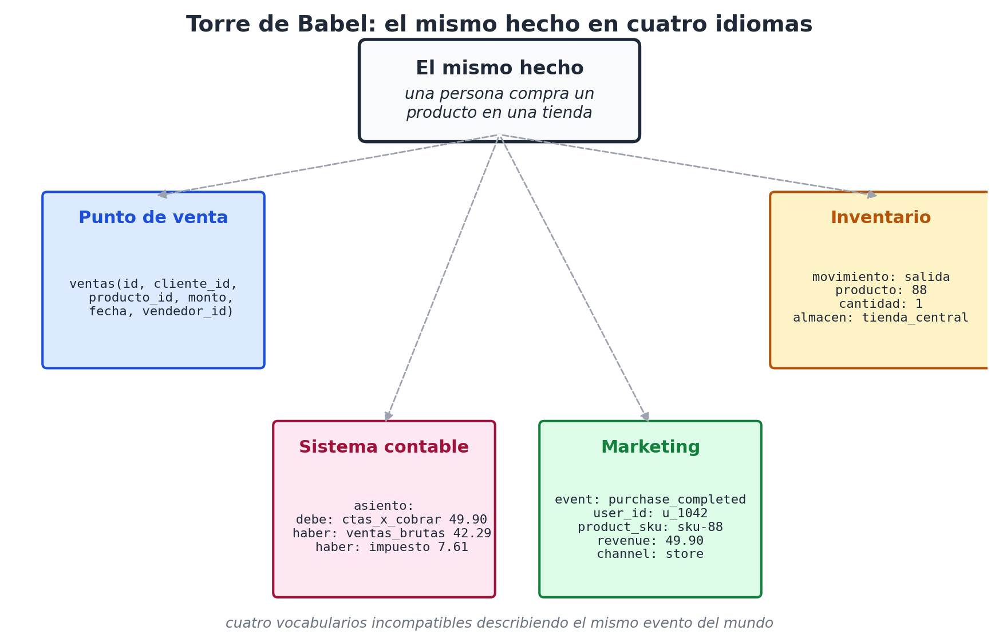
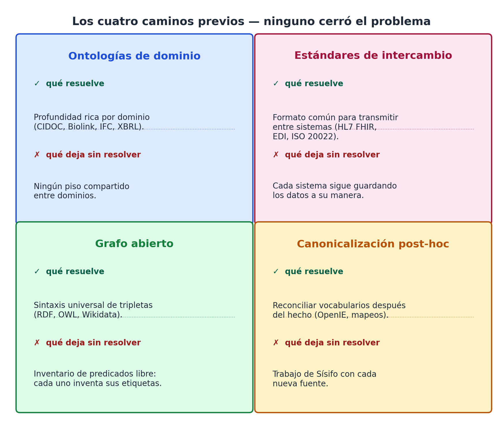

# Capítulo 1 — La torre de Babel de las ontologías

## Una sala de emergencias a las dos de la mañana

Son las dos de la mañana. Un médico de guardia recibe a una mujer de cuarenta y dos años con dolor torácico. La paciente está consciente, asustada, sudorosa. El médico necesita saber tres cosas, rápido: qué medicamentos toma, qué alergias tiene, si ha tenido antes algo parecido. Saca la tableta del consultorio, busca su nombre y encuentra una ficha de tres líneas: la atendieron una vez por una bronquitis hace cuatro años. Nada más.

Pero la paciente sí tiene historia. Tiene una endocrinóloga privada que la sigue desde hace siete años; tiene un cardiólogo al que vio dos veces el año pasado en otra ciudad; en algún punto pasó por una emergencia parecida y le hicieron un electrocardiograma. Hay datos. Lo que no hay es una manera de traerlos a esa pantalla, en esa sala, a esa hora.

¿Por qué? No por mala voluntad. Cada uno de esos sistemas guarda la información, la guarda con cuidado, y técnicamente está dispuesto a compartirla. El problema es que cada uno la guarda *a su manera*. Lo que la endocrinóloga llama `diagnostico_principal` el sistema del cardiólogo lo llama `dx_p`; lo que en una clínica es `medicacion_actual` con campos `nombre`, `dosis`, `frecuencia` en otra es una tabla `prescripciones` con `farmaco_id`, `mg_por_toma`, `tomas_dia`. Conectar las dos bases no es difícil: es laborioso. Hay que escribir un puente, traducir campo por campo, manejar las excepciones. Y cuando alguna de las dos cambie de versión, el puente se rompe.

Multiplica eso por cuatro proveedores, treinta versiones de software, una década de historia clínica, y la situación deja de ser un problema técnico para volverse un problema estructural. La información existe. Nadie puede usarla.

## El mismo hecho, cuatro idiomas distintos

Veamos algo más concreto. Un mismo hecho del mundo — *una persona compra un producto en una tienda* — puede aparecer en cuatro sistemas distintos descrito de cuatro maneras diferentes.

En un sistema de punto de venta, ese hecho vive así:

```
INSERT INTO ventas
  (id, cliente_id, producto_id, monto, fecha, vendedor_id)
VALUES (74921, 1042, 88, 49.90, '2026-05-14', 17);
```

En un sistema contable, el mismo hecho aparece descompuesto en otra forma:

```
asiento: 2026-05-14
  debe:  cuentas_por_cobrar       49.90
  haber: ventas_brutas            42.29
  haber: impuesto_al_consumo       7.61
```

En un sistema de marketing, lo mismo se ve como:

```
event: purchase_completed
user_id: u_1042
product_sku: sku-88
revenue: 49.90
channel: store_walk_in
session_id: s_abcdef
```

Y en un sistema de inventario, el mismo evento se reduce a:

```
movimiento: salida
producto: 88
cantidad: 1
almacen: tienda_central
ref: vta-74921
```

Cuatro vistas, cuatro vocabularios, cuatro estructuras. Cada uno tiene su lógica interna, cada uno es razonable dentro de su dominio. El problema es que no hay manera trivial de decir, mirando las cuatro filas, "esto es el mismo hecho". El sistema contable no sabe quién es el vendedor; el sistema de marketing no sabe que hubo un descuento de inventario; el punto de venta no sabe cómo se asienta el impuesto. Cada sistema vio una sombra del mismo evento y la registró en su propio idioma.



Esa fragmentación es lo que llamamos, con un poco de drama bíblico pero con justicia, **la torre de Babel de las ontologías**. Cada dominio construye su propio idioma para hablar del mundo, y al hacerlo se aísla del resto.

## ¿Por qué nos cuesta tanto evitarlo?

Hay una pregunta obvia: si el problema es tan claro, ¿por qué no se ha resuelto en cincuenta años de informática profesional?

La respuesta corta es que sí se ha intentado, muchas veces, y siempre con éxito parcial. La respuesta larga vale el resto del capítulo.

Las tentativas han ido por cuatro caminos.

**El primero es la ontología de dominio.** Cada profesión define exhaustivamente su vocabulario. Para patrimonio cultural existe CIDOC CRM [4]; para biomedicina existe Biolink Model [5]; para arquitectura está IFC [19]; para finanzas, XBRL [7]. Estas ontologías son obras serias, fruto de años de discusión entre expertos, y dentro de su dominio funcionan. Pero entre dominios no se hablan. Una ontología de patrimonio no sabe nada de moléculas; una ontología biomédica no sabe nada de cuadros del siglo XVII. Y cuando dos dominios se tocan — un museo que estudia los pigmentos químicos de una pintura, un hospital que necesita registrar el contexto legal de un consentimiento — toca construir puentes a mano.

**El segundo camino es el estándar de intercambio.** No definir cada cosa, sino acordar un formato común para mover información entre sistemas. HL7 FHIR en salud [6], EDI en comercio [20], ISO 20022 en finanzas [21]. Estos estándares hacen que dos sistemas distintos puedan al menos *transmitirse* información sin perderla. Pero no resuelven la pregunta de fondo: cada sistema interno sigue guardando los datos a su manera, y el estándar de intercambio funciona como un esperanto técnico que todos hablan apenas lo suficiente para no chocar. Cuando hace falta razonar sobre la información — combinarla, consultarla, agregarla — cada sistema vuelve a su idioma materno.

**El tercer camino es el grafo abierto.** RDF [8], OWL [22], los knowledge graphs. La idea es elegante: dejar que cualquiera describa cualquier cosa con tripletas `sujeto–predicado–objeto`, y conectar todo en una red gigantesca. El problema es que el grafo abierto no resuelve la diversidad, la *absorbe*. Cualquiera puede inventar un predicado nuevo; cualquiera puede llamar `worksFor` a lo que otro llama `empleado_de`. La libertad de invención es total. La consecuencia es que, en la práctica, los grafos abiertos terminan necesitando — adivinaste — *ontologías* que digan qué predicados usar y cómo. Volvemos al primer camino, con una capa de indirección.

**El cuarto camino es la canonicalización post-hoc.** Aceptar que la información va a venir desordenada y construir herramientas que, después del hecho, reconcilien vocabularios. Es lo que hacen los modelos de extracción abierta (OpenIE) [23], los sistemas de fusión de entidades, las técnicas de mapping semántico. Funciona razonablemente cuando hay dos o tres fuentes; se vuelve un trabajo de Sísifo cuando hay cincuenta.



Cada uno de estos caminos atacó *un síntoma*. Ninguno atacó la causa.

## La causa, sospecho, es esta

La causa, sospecha este libro, es que en todos los caminos anteriores **cada dominio se permite inventar su vocabulario desde cero**. La biomedicina no hereda nada de la cultura material; el comercio no hereda nada del derecho; la educación no hereda nada del urbanismo. Cada uno construye su pirámide, cada uno desde su base, y luego pagamos integradores para construir puentes entre las pirámides.

¿Y si la causa fuera más antigua que cualquier dominio? ¿Y si, antes de que existieran la medicina o el comercio, hubiera un vocabulario común — uno tan básico que ningún dominio puede no usarlo?

La sospecha de este libro es que ese vocabulario existe, y que está delante de nuestros ojos desde siempre.

## La pista que estaba a la vista

Volvamos al hecho de la compra. Si pidiera a cualquier persona, sin haberle mostrado los cuatro sistemas, que describiera ese hecho con sus palabras, lo más probable es que diga algo así:

> "*Una clienta* (**quién**) *compró* (**qué**) *una camiseta* (**qué**) *en la tienda del centro* (**dónde**) *esta tarde* (**cuándo**) *por casi cincuenta dólares* (**cuánto**)."

Sin esfuerzo, sin saber ni una línea de modelado de datos, sin haber estudiado nunca semántica formal, la persona produce una descripción **completa, estructurada y combinable**. La produce porque el lenguaje natural ya tiene incorporada esa estructura — y la tiene porque la mente humana parece descomponer los hechos del mundo por ese mismo conjunto de preguntas.

No es una coincidencia. Cuatro tradiciones independientes han llegado a la misma conclusión.

Los romanos del siglo I, al pensar la ética, listaban las *circumstantiae* del acto: *quis, quid, ubi, quando, cur, quomodo* — quién, qué, dónde, cuándo, por qué, cómo [2]. La pregunta era moral: para juzgar un acto hay que reconstruirlo en sus circunstancias. La estructura, sin proponérselo, era universal.

Doce siglos antes, Aristóteles, en la *Ética a Nicómaco*, usaba la misma descomposición — aunque en griego — para diferenciar la responsabilidad voluntaria de la involuntaria [1]. Quien quiera entender por qué alguien hizo algo necesita preguntarse las mismas siete u ocho cosas, en cualquier orden, sin que ninguna pueda sustituir a las otras.

A finales del siglo XIX y comienzos del XX, las escuelas de periodismo norteamericanas formalizaron los **5W1H**: *who, what, where, when, why, how* [3]. Cualquier noticia publicable debía responder esas seis preguntas en sus primeras líneas. Un periodista que olvidaba una de ellas dejaba la nota incompleta, no por convención académica sino porque el lector lo notaba.

Y a mediados del siglo XX, la lingüística formal redescubrió las mismas categorías como **roles temáticos**: agente, paciente, instrumento, locativo, temporal, beneficiario [24]. Cada verbo del lenguaje natural distribuye sus argumentos por esos roles, en cualquier idioma humano estudiado hasta hoy.

Cuatro tradiciones — filosofía moral, retórica, periodismo, lingüística formal — convergieron, sin coordinarse, en el mismo conjunto reducido de preguntas. Esa convergencia es la pista que persigue este libro.

## La apuesta arquitectónica

Si las preguntas son tan estables, tan repetidas, tan profundamente ligadas a cómo hablamos y a cómo pensamos los hechos, ¿no sería razonable usarlas como esqueleto de cualquier sistema que pretenda almacenar y consultar información del mundo?

Reformulemos la apuesta en términos arquitectónicos. La propuesta de este libro es:

> **Existe un conjunto pequeño y fijo de preguntas — del orden de ocho — que basta para indexar cualquier hecho del mundo, en cualquier dominio, en cualquier idioma. Si construimos nuestros sistemas alrededor de esas preguntas en lugar de alrededor del vocabulario de cada dominio, la torre de Babel deja de levantarse.**

La afirmación es fuerte. Tres palabras concentran la apuesta:

- **Pequeño**: no es una taxonomía de mil categorías. Es un esqueleto reducido.
- **Fijo**: no se expande con cada dominio nuevo. Los dominios se acomodan al esqueleto, no al revés.
- **Universal**: no es para un dominio específico. Es anterior a cualquiera.

Si la apuesta funciona, dos cosas cambian de raíz. Primero, los integradores ya no traducen entre vocabularios incompatibles: traducen entre dialectos del mismo idioma. Segundo, cualquier sistema de inteligencia artificial — un modelo de lenguaje, un agente automatizado, un buscador — puede operar sobre información de cualquier dominio sin reentrenamiento específico, porque la información viene marcada en un esqueleto que el modelo ya entiende, casi por construcción, desde su entrenamiento sobre lenguaje natural.

Y si no funciona, al menos habremos entendido por qué no se puede, lo cual también es un avance.

## Lo que viene en los próximos capítulos

El resto de la Parte I trabaja la idea desde dos lados. El capítulo 2 retrocede en el tiempo: recorre las cuatro tradiciones — Aristóteles, los romanos, el periodismo y la lingüística formal — para mostrar que la convergencia es real y no una proyección romántica del autor. El capítulo 3 hace lo opuesto, mira hacia los lados: revisa con detalle qué hicieron las tentativas existentes — 5W1H operativo, RDF, ontologías de dominio, schemas universales — y dónde encaja la propuesta de este libro entre ellas.

A partir de la Parte II, dejamos la motivación atrás y construimos. Una a una, las ocho coordenadas: **quién, qué, dónde, cuándo, cuánto, cuál, cómo y clase**. Cada una con sus particularidades, sus trampas, sus convenciones. Cada una sometida a la pregunta dura: *¿esto es realmente un eje, o se reduce a otro?*

Pero antes de construir, conviene haber entendido bien lo que se intenta reemplazar. Por eso, el capítulo siguiente vuelve atrás veinte siglos, a un filósofo griego que ya hacía estas preguntas cuando todavía no había bases de datos, ni siquiera escritura cómoda — solo la convicción, ya formada, de que para entender un hecho hay que saber descomponerlo en sus dimensiones.
