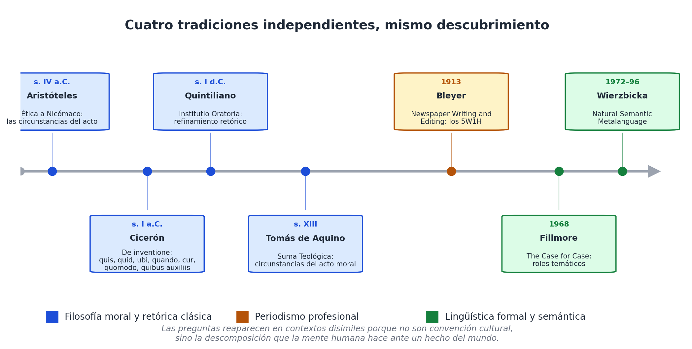
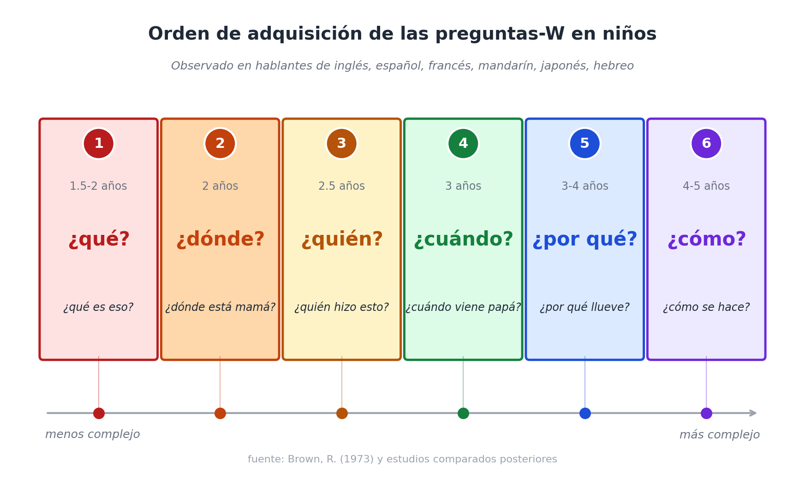

# Capítulo 2 — Aristóteles, el periodismo y la cognición: las preguntas como invariantes

## Un aula de 1917

Imagina un aula de periodismo en alguna universidad del norte, en 1917. El profesor escribe seis letras en la pizarra: *W, W, W, W, W, H.* Y abajo, una palabra inglesa para cada una: *who, what, where, when, why, how*. Esa noche, el alumno que pretenda salir aprobado tendrá que leer una nota del diario y subrayar, en colores distintos, las seis respuestas. Si alguna está ausente, la nota se descarta como incompleta.

El ejercicio no era una ocurrencia. El manual de Willard Bleyer *Newspaper Writing and Editing*, publicado cuatro años antes [3], lo había codificado como obligación profesional: toda nota informativa debe responder, idealmente en el primer párrafo, las cinco *W* y la *H*. Esa regla — los **5W1H** — sobrevivió todo el siglo XX, atravesó la transición al periodismo digital, y sigue enseñándose hoy en cualquier escuela de comunicación del mundo.

La pregunta interesante no es por qué Bleyer la propuso, sino por qué prendió. Una regla didáctica se olvida en una generación; una regla que captura algo verdadero del oficio sobrevive. Y los 5W1H sobrevivieron porque no son una invención periodística: son el redescubrimiento de un patrón que aparece, una y otra vez, en sitios muy distintos de la historia del pensamiento.

## Veinte siglos antes de Bleyer

Bleyer no era ningún erudito clásico, pero la idea que codificó tenía dos mil años. La pista directa pasa por Cicerón.

A mediados del siglo I antes de Cristo, Cicerón escribió *De inventione*, uno de los manuales de retórica fundacionales [2]. En él, recogiendo trabajos previos del griego Hermágoras de Temnos, propuso que cualquier discusión sobre un acto humano debía considerar siete *circumstantiae*:

> *quis, quid, ubi, quibus auxiliis, cur, quomodo, quando.*
> Quién, qué, dónde, con qué medios, por qué, cómo, cuándo.

La lista no era un dispositivo retórico decorativo. Era una herramienta de análisis. Si un orador quería sostener que un acusado actuó por necesidad, o por error, o por dolo, tenía que reconstruir esas siete dimensiones para que la argumentación cerrara. Si alguna se quedaba sin responder, la argumentación tenía un hueco por donde el rival podía entrar.

Quintiliano, un siglo después, refinó la lista en su *Institutio Oratoria* [25], y desde ahí la fórmula viajó por la escolástica medieval. En la *Suma Teológica* (I-II, q. 7), Tomás de Aquino retoma las circunstancias como categorías para evaluar la moralidad de un acto [26]: *quis, quid, ubi, quando, cur, quomodo, quibus auxiliis*. La continuidad es directa: los romanos pasaron la antorcha a los medievales, los medievales la pasaron a los modernos, y para fines del siglo XIX el conjunto reaparece — sin atribución, sin citas, casi olvidada su fuente — como herramienta pragmática del periodismo norteamericano.

La historia tiene un sabor cómico: Bleyer no estaba inventando, estaba reinventando. Pero la cuestión filosóficamente interesante es otra. Si la lista resurge en contextos tan disímiles — tribunales romanos, manuales escolásticos, redacciones de diarios — algo tiene que estar haciendo que la lista vuelva. Y ese algo no puede ser un linaje cultural, porque los linajes se cortan, se mezclan, se olvidan. Tiene que ser un rasgo del problema que la lista intenta resolver: cómo describir, sin omisiones, un hecho del mundo.

## Aristóteles, todavía más atrás

La pista no termina con Cicerón. Tres siglos antes, Aristóteles ya había hecho el ejercicio sin la nomenclatura de las *circumstantiae*.

En el libro III de la *Ética a Nicómaco* [1], discutiendo la diferencia entre el acto voluntario y el involuntario, Aristóteles enumera lo que él llama las cosas que el agente, para ser plenamente responsable, debe conocer al actuar. La lista, en una traducción literal, es algo así:

> El agente ignorante respecto de su acto puede ignorar (a) quién es, (b) qué hace, (c) acerca de qué o a quién lo hace, (d) con qué — por ejemplo, con qué instrumento, (e) por qué — por ejemplo, por la propia salud, (f) cómo lo hace — por ejemplo, con suavidad o con violencia.

La estructura es la misma: agente, acción, paciente, instrumento, finalidad, modo. Falta el "cuándo" — Aristóteles no lo lista explícitamente en este pasaje porque el contexto es la responsabilidad moral y el "cuándo" rara vez modifica la imputación —, pero el "cuándo" aparece en otros lugares del corpus aristotélico cuando discute el cambio y el devenir.

Lo que Aristóteles llama *aitia* — causas — incluye, además, una clasificación cuádruple (material, formal, eficiente, final) que se mapea sin esfuerzo a varias de las preguntas-W: la causa material es el "de qué"; la formal, el "qué" o "según qué"; la eficiente, el "quién" o el "por qué (agente)"; la final, el "para qué". La filosofía aristotélica está atravesada por la idea de que para entender algo hay que descomponerlo en sus dimensiones, y las dimensiones, una y otra vez, son las preguntas-W.

## El testimonio de la gramática

Hasta aquí la historia parece un asunto de filósofos europeos. Pero la pista más fuerte para sostener que las preguntas son universales, no convenciones culturales, viene de un lado completamente distinto: la lingüística comparada.

Si uno toma un idioma cualquiera del mundo — quechua, mandarín, swahili, vasco, hindi, japonés, árabe — y busca cómo se hacen preguntas en ese idioma, encuentra siempre el mismo elenco reducido: quién, qué, dónde, cuándo, cómo, por qué, cuál, cuánto. Los idiomas tienen sus particularidades — algunos distinguen "quién singular" de "quiénes plural" morfológicamente, otros no; algunos tienen una palabra para "cuál" y otra para "cuáles", otros no; algunos diferencian "dónde estás" de "dónde vas" con partículas distintas —, pero el inventario semántico de las preguntas básicas es asombrosamente estable.

Joseph Greenberg, en su trabajo seminal sobre universales lingüísticos [29], no se ocupó específicamente de las preguntas-W, pero su programa — buscar regularidades transversales a todas las lenguas humanas — abrió la puerta a estudios posteriores que sí lo hicieron. Una de las líneas más fructíferas es la de Anna Wierzbicka, quien postuló la existencia de un **Natural Semantic Metalanguage**: un conjunto reducido de primitivos semánticos que aparecen, con la misma denotación, en todos los idiomas humanos estudiados [28]. En su lista canónica de primitivos figuran, explícitamente: *somebody* (quién), *something* (qué), *where* (dónde), *when* (cuándo), *because* (por qué). No están porque Wierzbicka los haya elegido por gusto: están porque resistieron pruebas de traducción exhaustiva contra docenas de lenguas no indoeuropeas.

A mediados del siglo XX, la lingüística formal le dio a este conjunto un nombre técnico: **roles temáticos** [24]. Charles Fillmore, en *The Case for Case* (1968), propuso que la sintaxis de cualquier verbo del lenguaje natural se entiende mejor como una asignación de roles a sus argumentos: hay un *agente* (quién), un *paciente* o tema (qué), un *locativo* (dónde), un *temporal* (cuándo), un *instrumento* (con qué), un *beneficiario* (para quién). La lista exacta varía entre autores — algunos cuentan ocho roles, otros doce —, pero el núcleo coincide casi punto por punto con las circunstancias de Aristóteles.

Cuatro tradiciones, cuatro vocabularios distintos. Aristóteles habla de *circunstancias del acto*. Cicerón habla de *circumstantiae*. Bleyer habla de *5W1H*. Fillmore habla de *roles temáticos*. Pero si uno se sienta a hacer la tabla de equivalencias, descubre que los cuatro están hablando de lo mismo.

## El niño que pregunta

Hay una cuarta pista, todavía más íntima. Las preguntas-W aparecen también en el desarrollo lingüístico infantil, y aparecen en un orden notablemente estable entre niños de idiomas distintos.

Roger Brown, en su estudio longitudinal *A First Language: The Early Stages* (1973), documentó las etapas por las que pasan los niños de habla inglesa al adquirir su lengua materna [27]. Una de las observaciones recurrentes — confirmada después en estudios con niños hispanohablantes, francófonos, hablantes de japonés, mandarín y hebreo — es que las preguntas-W no se adquieren todas al mismo tiempo. Aparecen en un orden:

1. Primero, **qué** ("¿Qué es eso?"). Es la pregunta más temprana, la que el niño usa para construir vocabulario.
2. Luego, **dónde** ("¿Dónde está mamá?"). Sigue cuando el niño descubre que las cosas pueden estar presentes o ausentes, aquí o allá.
3. Después, **quién** ("¿Quién hizo esto?"). Aparece cuando el niño empieza a distinguir agentes de objetos pasivos.
4. **Cuándo** llega más tarde, cuando el niño domina cierta noción de pasado, presente y futuro — alrededor de los tres años en promedio.
5. **Por qué** aparece al mismo tiempo o poco después, y suele explotar en frecuencia ("etapa de los porqués").
6. **Cómo** suele ser la última en consolidarse, porque exige una representación de procesos, no solo de hechos.

Lo notable es que este orden no es cultural. Es bastante uniforme entre idiomas, incluso entre lenguas que estructuran las preguntas de maneras gramaticalmente muy distintas. Eso sugiere — sin probarlo, pero sugiriéndolo con fuerza — que el orden refleja la complejidad cognitiva del concepto, no del idioma. Identificar un objeto (*qué*) es cognitivamente más simple que identificar un agente (*quién*); identificar un agente es más simple que ubicar un evento en el tiempo (*cuándo*); ubicar en el tiempo es más simple que dar cuenta de un proceso (*cómo*).

Si las preguntas-W reflejan etapas de complejidad cognitiva, entonces no son arbitrarias: son la descomposición que cualquier mente — humana, en cualquier cultura, hablando cualquier idioma — encuentra al intentar dar sentido al mundo.

## La hipótesis fuerte

Pongámoslo entonces como hipótesis explícita, la que va a estructurar el resto del libro:

> **Las preguntas-W no son una convención cultural ni una invención disciplinar. Son invariantes cognitivos: el conjunto reducido de dimensiones por las cuales la mente humana descompone hechos del mundo, antes de que existan disciplinas, antes de que existan ontologías formales, antes incluso de que el niño aprenda a hablar con fluidez.**

La hipótesis es fuerte porque hace predicciones verificables. Si es cierta:

- Las preguntas deberían reaparecer en cualquier tradición humana que haya tenido que describir hechos sistemáticamente. **Predicción cumplida**: aparecen en Aristóteles, Cicerón, Quintiliano, Tomás de Aquino, Bleyer, Fillmore, Wierzbicka.
- Deberían encontrar correlato gramatical en todos los idiomas humanos. **Predicción cumplida**: los pronombres interrogativos son una clase léxica universal, y su inventario semántico converge en el mismo núcleo en lenguas no relacionadas.
- Deberían aparecer en el desarrollo infantil de manera independiente de la cultura. **Predicción cumplida**: el orden de adquisición es notablemente estable entre lenguas distintas.
- Deberían ser cognitivamente más básicas que cualquier ontología de dominio. **Predicción cumplida**: cualquier ontología disciplinar es enseñable solo a un niño que ya domina las preguntas-W; ningún niño aprende biología clasificatoria antes de aprender a preguntar *qué*.

Cuatro predicciones, cuatro confirmaciones. No es una demostración cerrada — la lingüística y la psicología del desarrollo todavía debaten los detalles —, pero el cúmulo de evidencias apunta en una sola dirección.

## ¿Y qué con todo esto?

Hasta aquí, podría parecer que este capítulo solo construye un argumento histórico y antropológico. ¿Para qué importa, en un libro que pretende ser práctico, demostrar que las preguntas-W son invariantes cognitivos?

Importa por una razón arquitectónica. Si las preguntas son invariantes — si son la forma en que la mente humana naturalmente descompone hechos — entonces son **la base más estable posible para una arquitectura de información**. Más estable que cualquier ontología de dominio, porque las ontologías cambian (en cincuenta años hemos visto nacer y morir varias). Más estable que cualquier estándar de intercambio, porque los estándares se reemplazan generacionalmente. Más estable, incluso, que las lenguas particulares: el inventario de preguntas-W del latín, del castellano, del inglés y del japonés coinciden en lo esencial, mientras que las palabras concretas para nombrar conceptos divergen radicalmente.

Construir un sistema de información sobre las preguntas-W es, literalmente, construirlo sobre el zócalo cognitivo más antiguo y más universal que poseemos como especie. Si hay alguna intuición que un sistema así puede aprovechar a su favor, es esta: cualquier humano — y, como veremos en los últimos capítulos, cualquier modelo de lenguaje entrenado sobre texto humano — ya entiende las preguntas-W de manera nativa. No hay que enseñárselas. Solo hay que escribirlas en la arquitectura.

En el próximo capítulo veremos qué intentaron hacer otros con esta misma intuición, qué les funcionó y qué les faltó. Habrá que entender bien dónde estuvo el bloqueo para no repetirlo.
