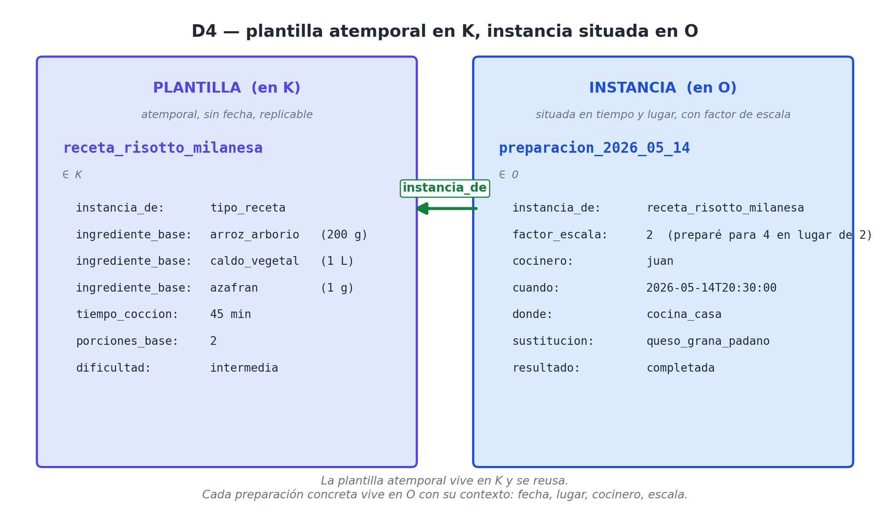

# Capítulo 3 — Cuál: el zócalo categórico (K)

## Lo que los pilares dejan sin decir

Para entender por qué necesitamos un eje nuevo, lo mejor es volver por un momento a la oración con la que abrimos el capítulo anterior. Habíamos desarmado el hecho *"Marta le regaló un libro a su sobrino ayer en su casa"* utilizando nuestros cuatro pilares fundamentales: Q, O, L y T. Y, a primera vista, la descripción cerró perfectamente. Marta encontró su lugar en el "quién", el libro en el "qué", la casa en el "dónde" y el ayer en el "cuándo". 

Pero si miramos esa estructura con ojos de ingeniero de datos o de arquitecto de software, nos topamos con un punto ciego masivo. Hay información crítica que esos cuatro pilares, por diseño, **no nos dejan decir**.

Sabemos que Marta está en el eje Q. Sabemos que el sobrino también está en el eje Q. Hasta ahí, todo bien. Sin embargo, un sistema informático que pretenda ser útil necesita saber algo mucho más profundo que simplemente dónde guardar los nombres: necesita saber *que ambos son personas*. Necesita la capacidad lógica de reconocer que `marta_001` y `sobrino_045` comparten una naturaleza; ambos pertenecen exactamente a la misma **categoría**.

El mismo problema ocurre con el libro. Ese objeto físico, con sus tapas de cartón y sus hojas impresas, vive correctamente en el eje O. Pero la palabra "libro" representa algo mucho más amplio que ese ejemplar específico que Marta compró en la tienda. "Libro" es **el tipo** de cosa a la que pertenece ese objeto. Cualquier sistema inteligente tiene que ser capaz de distinguir sin esfuerzo entre el ejemplar concreto (este libro puntual, con una mancha de café en la página tres) y la categoría universal a la que pertenece (el libro como concepto general).

La limitación estructural es clara: los pilares que hemos visto hasta ahora funcionan como un inventario de individuos del mundo. Sirven para catalogar a esta persona en particular, a este objeto, a este lugar exacto y a este momento en el reloj. Lo que nos falta es un inventario que defina **lo que esos individuos son**. Y esa definición de identidad no cabe en Q ni en O. Necesita y exige su propio eje: **K**, el eje de las clases.

## Qué es K, exactamente

La letra K se eligió por convergencia lingüística (*Kind* en inglés, *Klasse* en alemán, *Kategoria* en lenguas latinas o griego). Es el eje que responde a la pregunta **¿cuál?**: cuál, de entre un conjunto acotado de tipos, estados o categorías, le corresponde a algo. Está diseñado exclusivamente para alojar **tipos, categorías y conceptos abstractos**. Es el territorio lógico donde viven ideas genéricas como *libro*, *persona*, *gol*, *receta*, *modelo de lenguaje*, *infarto agudo de miocardio*, *cliente*, *kilogramo*, *dólar*, *arquitectura transformer* o *receta vegetariana*.

Para visualizarlo mejor, podemos pensar en el modelo como un edificio sostenido por dos grandes fundaciones. Los pilares Q, O, L y T conforman el **primer zócalo**, el de lo concreto. Allí viven las cosas que existen materialmente en el mundo, entidades que tienen una identidad propia y, casi siempre, una ubicación en el espacio y en el tiempo. 

K, por el contrario, es el **segundo zócalo**, el de lo categórico. Allí no hay cosas que puedas tocar. Hay nombres genéricos, patrones y moldes bajo los cuales agrupamos a los ejemplares del primer zócalo.

Esta distinción entre el individuo y su categoría es sutil, pero es la herramienta tecnológica más potente que tenemos. Un *cocinero* de carne y hueso vive en el eje Q (es un individuo llamado Juan, que tiene un número de identificación fiscal, una edad y un sueldo). Pero el concepto de *cocinero* —la profesión, el rol laboral, la categoría académica— vive en K. Una *llamada específica al modelo GPT* vive en O (ocurrió a las 14:00, consumió 500 tokens y tuvo una latencia de 2 segundos). Pero el concepto técnico de *llamada a un modelo de lenguaje* vive en K. La ciudad donde ocurrió un evento vive en L. La categoría abstracta de *ciudad capital* vive en K.

Separar las instancias (los individuos) de sus categorías es precisamente lo que le permite a un sistema **razonar con generalidad**. Es lo que hace posible que un motor de búsqueda hospitalario entienda la instrucción "busca a todos los pacientes con hipertensión", en lugar de obligar al operador a escribir el nombre de cada persona que sufre esa enfermedad.

## Cuatro familias dentro de K

El eje K no es simplemente una bolsa plana donde arrojamos etiquetas al azar. Es un entorno sumamente estructurado que aloja al menos cuatro familias distintas de entidades categóricas. Vale la pena detenerse a analizar cada una para entender su alcance.

**1. Tipos de objetos y eventos.** 
Cuando hablamos de conceptos como *coche*, *cliente*, *gol*, *receta*, *llamada_API* o *infarto*, estamos hablando estrictamente de tipos. Como dijimos, la taza física está en O; pero el molde teórico *taza* está en K. Para unir ambos ejes, utilizamos una relación matemática fundamental a la que llamaremos `instancia_de`:

```text
(taza_007,    instancia_de, taza)                 ∈ M(O, K)
(messi,       instancia_de, jugador_de_futbol)    ∈ M(Q, K)
(lima,        instancia_de, ciudad_capital)       ∈ M(L, K)
(gpt_x,       instancia_de, modelo_de_lenguaje)   ∈ M(O, K)
```

Cualquier individuo registrado en Q, O, L (y a veces en T) debe tener al menos una respuesta a la pregunta "¿de qué concepto eres instancia?". Ese hilo conector es lo que ata el grafo de hechos concretos con el diccionario abstracto del sistema.

**2. Unidades de medida.** 
Términos como *kilogramo*, *segundo*, *token*, *dólar*, *milisegundo* o *grado_Celsius* son categorías puras; no son entidades materiales. Nunca te vas a cruzar por la calle con "un kilogramo físico" flotando en el aire como si fuera una botella; lo que experimentas es el patrón o estándar de "ser un kilogramo" aplicado a la masa de una botella. Dado que son conceptos teóricos utilizados para medir, todas las unidades habitan en K. Afortunadamente, no tenemos que inventarlas. Existe un catálogo canónico universal llamado **QUDT** `[18]` (*Quantities, Units, Dimensions and Types Ontology*), que clasifica miles de unidades, define sus dimensiones físicas, permite conversiones matemáticas y les asigna identificadores estables. Estudiaremos esto en profundidad cuando abordemos el eje N (Números).

**3. Estados y valores enumerativos.** 
En el diseño de software, es muy común encontrarnos con atributos que solo pueden tomar un valor de una lista estricta y cerrada. Por ejemplo: *casado / soltero / viudo*, *aprobado / pendiente / rechazado*, *zurdo / diestro*, *encendido / apagado*. Esos valores predefinidos no son números, ni deberían tratarse como texto libre; son categorías de estado. Y como son conceptos genéricos aplicables a múltiples casos, viven en K.

```text
(paciente_042, estado_civil, casado)      ∈ M(Q, K)
(prestamo_017, estado,       aprobado)    ∈ M(O, K)
(llamada_042,  modo,         streaming)   ∈ M(O, K)
```

**4. Conceptos abstractos y nomenclaturas.** 
Todo dominio profesional serio cuenta con diccionarios controlados. Aquí entran los diagnósticos médicos oficiales (CIE-10, SNOMED), las categorías comerciales y códigos de producto (SKUs), los géneros musicales, los partidos políticos, las clasificaciones biológicas o las arquitecturas de inteligencia artificial. Cualquier nomenclatura controlada, sin excepción, aterriza en el eje K.

```text
(diagnostico_017,   codigo_cie10, "I21.9")         ∈ M(O, K)
(producto_088,      sku,          "coca_500ml")    ∈ M(O, K)
(cancion_yesterday, genero,       pop_rock)        ∈ M(O, K)
(modelo_gpt_x,      arquitectura, transformer)     ∈ M(O, K)
```

Si hay una línea en común que atraviesa a estas cuatro familias es esta: **todo lo que vive en K no es un ejemplar único en el mundo, sino un patrón conceptual que puede aplicarse a decenas, miles o millones de casos**.

## La frontera resbaladiza: ¿instancia (O) o clase (K)?

El lector técnico choca tarde o temprano con un caso incómodo: ciertos objetos híbridos —un **VAR**, un **algoritmo de recomendación**, un **modelo de lenguaje**— parecen vivir en varios ejes a la vez. La confusión se disuelve apenas se entiende que **no es la cosa la que tiene un eje, sino cada uno de sus papeles**. Una misma palabra nombra cosas distintas según qué le estemos preguntando:

| Si te referís a… | Eje | VAR | Algoritmo de recomendación |
|---|---|---|---|
| El **tipo o concepto** (la tecnología, la categoría) | **K** | `var` como clase de sistema arbitral | `filtrado_colaborativo` como técnica |
| El **ejemplar concreto** (un despliegue, una unidad) | **O** | el VAR instalado en el estadio Monumental | el motor de recomendación de Netflix |
| Una **acción suya, reificada** (un evento que ejecutó) | **O** | *"el VAR revisó la jugada del minuto 34"* | *"el motor recomendó la serie a Ana"* |
| Cuando **actúa** (ocupa el rol `agente`) | **Q** | el VAR como agente de *anular_gol* | el motor como agente de *recomendar* |

Acá se ve la **reificación** en movimiento, y su parentesco con la agencia contextual (la regla D5 que formalizaremos en el Capítulo 9). El mismo VAR es un objeto pasivo en O cuando describimos su instalación; es el `agente` en Q cuando *anula* un gol; y ese "anular el gol" es, a su vez, una situación reificada que vive en O. La entidad **no se duplica** al cambiar de eje: es un solo individuo referido desde situaciones distintas. Y un evento activo en un nivel —la revisión del VAR— puede volverse el objeto pasivo de otro —"la revisión del minuto 34 fue impugnada por el club"—: eso es, exactamente, reificar.

La regla práctica para no perderse es preguntar, ante cada mención, *qué* se está nombrando:

- **¿De qué tipo es?** → K (la categoría).
- **¿Qué ejemplar, o qué evento, es?** → O (la instancia concreta o la acción reificada).
- **¿Quién actúa en esta situación?** → Q (el agente, por contexto, no por naturaleza).

La misma disciplina ordena a los demás híbridos del libro: *transformer* la arquitectura (K), *gpt_x* el modelo desplegado (O), *"gpt_x resumió la consulta"* el evento (O), y *gpt_x como redactor del informe* el agente (Q).

## Por qué K necesita un eje propio

Existe una objeción sumamente válida que cualquier ingeniero de bases de datos plantearía al llegar a este punto: *¿Para qué molestarnos en crear todo un eje nuevo? ¿Por qué no tratar las categorías como simples cadenas de texto (strings) guardadas dentro de una columna? Que el atributo sea "estado_civil" y el valor sea la palabra `"casado"`, y problema resuelto.*

A corto plazo, parece una solución pragmática. A nivel de arquitectura empresarial, es la receta perfecta para la fragmentación de datos. La objeción del texto plano no se sostiene por tres razones técnicas que se acumulan y terminan colapsando los sistemas tradicionales.

**Razón 1: Las categorías tienen estructura interna.** 
La palabra *casado* no es solo una secuencia de seis letras. Es un nodo semántico que posee una inmensa riqueza de propiedades. Tiene sinónimos en otros idiomas (*married*, *marié*, *verheiratet*). Tiene dependencias lógicas con otras categorías (el *matrimonio* es un tipo de *vínculo legal*). Tiene contextos de aplicabilidad (un estado civil no aplica a un objeto inanimado). Si guardamos "casado" como un simple string en una tabla SQL, toda esa estructura es inaccesible para el motor de la base de datos; la palabra queda "ciega". En cambio, si la tratamos como un individuo con derechos propios dentro del eje K, esa categoría puede tener sus propios hechos conectados:

```text
(casado, sinonimo_en_ingles, "married")           ∈ M(K, K)
(casado, requiere,           matrimonio_legal)    ∈ M(K, K)
(casado, opuesto_de,         soltero)             ∈ M(K, K)
(casado, codigo_iso,         "M")                 ∈ M(K, K)
```

Visto así, K no es un archivo plano; es una **red de conceptos interconectados**. Los individuos de K son ciudadanos de primera clase en nuestro modelo. Esta capacidad de vincular conceptos entre sí será la clave técnica cuando analicemos cómo WQuestions se integra con diccionarios de otras industrias.


**Razón 2: El vocabulario serio exige autoridad externa.** 
Las categorías de alto nivel que utilizan los hospitales, los bancos o los gobiernos no se inventan en una lluvia de ideas de programadores; provienen de autoridades internacionales que las publican con identificadores únicos, conocidos como URIs. **QUDT** `[18]` regula las unidades de medida; **Schema.org** `[30]` provee los estándares para el comercio web; **SNOMED** dicta los códigos médicos; la **ICAO** define las siglas de los aeropuertos. Tratar una de estas categorías como un mero texto ignora por completo su peso legal e internacional. Al registrarla como un individuo formal en el eje K, podemos asignarle su URI canónica como un atributo permanente:

```text
(qudt_milliseg,  uri_canonica, "[http://qudt.org/vocab/unit/MilliSEC](http://qudt.org/vocab/unit/MilliSEC)")  ∈ M(K, K)
(snomed_infarto, uri_canonica, "[http://snomed.info/id/22298006](http://snomed.info/id/22298006)")        ∈ M(K, K)
(cie10_I21,      uri_canonica, "[http://id.who.int/icd/release/10/2019/I21](http://id.who.int/icd/release/10/2019/I21)")  ∈ M(K, K)
```

Mira el caso del **CIE-10**, la *Clasificación Internacional de Enfermedades* en su décima edición, publicada por la Organización Mundial de la Salud. Es el ejemplo más nítido de por qué esto importa. Cuando un médico anota en una historia clínica el código `I21`, no está escribiendo una palabra cualquiera: está apuntando a una entrada formal, internacional y traducida a decenas de idiomas, que significa *"infarto agudo de miocardio"*. Si tu sistema guarda el diagnóstico como el texto libre "infarto", pierdes esa conexión: un hospital en Alemania escribirá "Herzinfarkt", uno en Brasil "infarto do miocárdio", y nadie podrá cruzar datos. En cambio, si el sistema guarda la categoría como un individuo de K con su URI del CIE-10 anexada, todos los hospitales del mundo hablan el mismo idioma sin esfuerzo. La estadística global de salud, los estudios epidemiológicos, las alertas sanitarias internacionales — todo eso descansa sobre este mecanismo.

Y lo mismo aplica para los demás dominios. Si dos sistemas hospitalarios hablan dialectos distintos (uno anota "milisegundo" y el otro "ms"), pero ambos apuntan internamente a la misma URI oficial, los sistemas se entienden de forma automática sin necesidad de que un programador escriba un traductor a mano.

**Razón 3: Las consultas sobre categorías son el corazón del sistema.** 
Las preguntas de negocio más valiosas y complejas siempre cruzan información categórica. Un analista no pide buscar un ID específico; pide *"todas las recetas vegetarianas que se preparen en menos de 30 minutos"*, o *"todos los modelos de lenguaje de arquitectura transformer entrenados después de 2024"*. 
Si las categorías estuvieran guardadas como texto libre, estas búsquedas serían un campo minado (un usuario pudo escribir "Vegetariana", otro "vegetariana" y otro "Veg"). Al convertir las categorías en nodos estructurados dentro de K, las consultas dejan de depender de la ortografía y pasan a depender de la matemática relacional. Se vuelven exactas, predecibles y combinables.

## Dos relaciones canónicas: `instancia_de` y `subtipo_de`

Para que esta inmensa red de conceptos funcione y sea navegable, existen dos relaciones fundacionales que organizan la estructura interna de K, y es vital entender cómo operan.

La primera es **`instancia_de`**. Como adelantamos antes, es la relación de uso más intensivo en todo el modelo. Su trabajo exclusivo es actuar como puente, amarrando a los individuos del mundo físico (los pilares) con sus definiciones conceptuales (el eje K). Y un punto crucial aquí es que un individuo puede ser instancia de múltiples conceptos simultáneamente:

```text
(messi, instancia_de, jugador_de_futbol)       ∈ M(Q, K)
(messi, instancia_de, capitan_de_seleccion)    ∈ M(Q, K)
(messi, instancia_de, persona_humana)          ∈ M(Q, K)
(messi, instancia_de, ganador_balon_de_oro)    ∈ M(Q, K)
```

Estas cuatro asignaciones no compiten entre sí ni generan errores lógicos. Coexisten en paralelo. Si el motor de la base de datos recibe una consulta filtrando por cualquiera de esas cuatro categorías, devolverá a Messi como resultado válido.

La segunda relación es **`subtipo_de`**. A diferencia de la anterior, este conector nunca sale de las fronteras de K. Se utiliza de forma exclusiva para enlazar categorías entre sí, creando jerarquías organizadas y árboles de conocimiento (taxonomías):

```text
(jugador_de_futbol,   subtipo_de, atleta_profesional)               ∈ M(K, K)
(atleta_profesional,  subtipo_de, persona_humana)                   ∈ M(K, K)
(modelo_de_lenguaje,  subtipo_de, modelo_de_aprendizaje_automatico) ∈ M(K, K)
(modelo_transformer,  subtipo_de, modelo_de_lenguaje)               ∈ M(K, K)
```

¿Por qué es esto tan importante a nivel tecnológico? Porque cuando declaras correctamente las reglas `instancia_de` y `subtipo_de`, le otorgas al sistema la capacidad de realizar **inferencias transitivas básicas**. Si la máquina sabe que Messi es un `jugador_de_futbol`, y por otro lado sabe que todo jugador es un `atleta_profesional`, el motor deduce de forma automática que Messi es un atleta profesional. En el mundo de la arquitectura de datos, a esta habilidad se le conoce como *cierre transitivo* (transitive closure). Es el mecanismo de razonamiento más simple, pero es el superpoder que evita que los programadores tengan que codificar miles de reglas lógicas a mano.

## Lo que ya se intentó: tres puertas, ningún piso

Antes de ver cómo K aloja las ontologías del mundo, conviene entender por qué nadie lo había resuelto antes. No fue por falta de intentos: la industria abrió tres grandes puertas, y cada una se quedó a un paso.

**La primera puerta: las 5W1H como extracción.** A fines del siglo XX, varios investigadores `[9]` `[10]` vieron las seis preguntas periodísticas como una herramienta para extraer datos de texto: un programa lee una noticia y acomoda las respuestas en casilleros (*quién: el ministro de Salud; qué: anunció una campaña; cuándo: ayer*). El resultado luce ordenado, pero estalla apenas se intenta **almacenarlo y cruzarlo**: para la máquina, "el ministro de Salud" y "el titular de la cartera de salud" son dos cadenas de texto distintas. Sin una capa de tipos ni un vocabulario canónico, las 5W1H funcionan como un buen *checklist* para no olvidar nada, pero no como una arquitectura: les faltan justamente las dos piezas que este capítulo introduce —una estructura de tipos (K) y un vocabulario oficial.

**La segunda puerta: la web semántica.** En 2001, Tim Berners-Lee propuso la **Web Semántica** `[31]`, con **RDF** `[8]` como pieza maestra: toda la información reducida a tripletas *sujeto–predicado–objeto*. La idea es de una elegancia impecable y sostiene proyectos titánicos como Wikidata `[32]` y DBpedia `[33]`. Pero RDF resolvió la *sintaxis* y dejó libre la *semántica*: un sistema escribe `(McCartney, compuso, "Yesterday")`, otro `(McCartney, autor_de, "Yesterday")`, un tercero `(McCartney, escribió, "Yesterday")` — las tres correctas, las tres incompatibles. Sin un diccionario mínimo común, la diversidad de lenguajes simplemente se mudó a otra capa.

**La tercera puerta: las ontologías de dominio.** Ante ese caos, el tercer enfoque eligió el control estricto: reunir a los expertos de cada industria y publicar un vocabulario oficial y obligatorio. Así nacieron obras de arte de la ingeniería como **CIDOC CRM** `[4]` (patrimonio), **Biolink** `[5]` (biomedicina), **HL7 FHIR** `[6]` (historias clínicas) y **Schema.org** `[30]` (web comercial). Cada una es excelente dentro de su perímetro: Schema.org/`Recipe` modela una receta a la perfección. El problema asoma apenas hay que **vincular profundamente** ramas distintas —la receta con la biografía del chef (`Person`) y el contexto histórico (`Event`)—: las ontologías crean los nodos, pero no estandarizan los cables entre ellos, y atarlos vuelve a recaer en código manual. Peor aún: como cada una se construyó aislada, todas tuvieron que modelar desde cero lo universal. Para decir "una persona", los museos usan `E21_Person`, la genética `biolink:Agent`, el comercio `Person` y las clínicas `Patient`: cuatro etiquetas incompatibles para un mismo ser humano físico.

A estas tres puertas se sumaron dos variantes que chocaron con el mismo muro: los **estándares de intercambio** (FHIR `[6]`, EDI `[20]`, ISO 20022 `[21]`), que funcionan como un servicio de mensajería —traducen para el transporte, no unifican—; y la **canonicalización a posteriori** (OpenIE `[23]`, sistemas de limpieza de datos), que intenta reconciliar el caos *después* de que ocurrió, con un costo computacional que se vuelve inmanejable al cruzar decenas de sistemas.

El balance, llevado a los cuatro ejemplos que recorren este libro, es elocuente:

|                         | 1. 5W1H (heurística)                                                  | 2. RDF / Web Semántica (libre conexión)                                                             | 3. Ontología de dominio (diccionario estricto)                                                                 |
| ----------------------- | ------------------------------------------------------------------------------------------ | ----------------------------------------------------------------------------------------------------------------- | ----------------------------------------------------------------------------------------------------------------- |
| **La Receta**           | Insuficiente: no entiende medidas exactas, listas ordenadas de pasos ni tiempos de horno.  | Factible, siempre que los programadores no usen verbos distintos para "mezclar" o "hervir".             | Schema.org/Recipe la modela a la perfección, pero dificulta cruzarla con datos históricos o geográficos.          |
| **El Gol de fútbol**    | Útil para leer la noticia deportiva, inútil para armar estadísticas del partido.  | Posible vía Wikidata, aunque los términos para describir una jugada varían drásticamente entre bases.             | Existe `SportsEvent`, pero no llega al detalle de con qué pierna se ejecutó el remate.        |
| **La Canción**          | Sirve para una noticia *sobre* la canción, no para modelar la obra musical. | MusicBrainz lo soporta bien, pero sus vocabularios chocan con otras fuentes.       | Modelos robustos en la industria musical, pero operan como burbujas cerradas difíciles de integrar.       |
| **La Noticia política** | Excelente: el dominio exacto para el que nació el modelo.                     | Funcional, pero la falta de acuerdo sobre cómo nombrar "promulgar" o "debatir" arruina las búsquedas. | Schema.org/NewsArticle estructura el "contenedor", pero no entiende qué dice adentro. |

El patrón de las fallas es nítido: las 5W1H identificaron las dimensiones pero no construyeron arquitectura; RDF construyó la conexión pero sin vocabulario base; las ontologías construyeron vocabularios de lujo pero sin un piso común. Todas levantaron **techos** espléndidos; ninguna construyó el **piso**. Y un piso es justamente lo que el eje K aporta: una capa fundacional, por debajo de todos los vocabularios, lo bastante sutil para no estorbar la jerga de médicos o arquitectos y lo bastante firme como para que la información fluya sin traductores. Las preguntas cognitivas —que el Capítulo 1 postuló como universales y que el Capítulo 6 fundamentará en detalle— son ese piso. Veamos, entonces, cómo K abraza las ontologías existentes en lugar de competir con ellas.


## K como zócalo para las ontologías existentes

Quizá la promesa de mayor impacto industrial que ofrece el eje K es que **no obliga a ninguna empresa a reinventar su terminología**. Los diccionarios masivos y sofisticados que ya rigen en el mundo (Schema.org, QUDT, SNOMED, CIDOC CRM, Biolink) se mapean dentro de K como subconjuntos de datos, manteniendo intactas todas sus relaciones internas. WQuestions no llega para competir o reemplazar a estas herramientas: su objetivo explícito es **abrazarlas**.

Esta integración pacífica ocurre a través de una estrategia de tres niveles técnicos:

**Nivel 1: Importar URIs canónicas.** 
En lugar de transcribir todo un diccionario, el sistema simplemente aloja los conceptos esenciales y ancla a cada uno su URI internacional como validador de identidad:

```text
(infarto_miocardio_agudo) ∈ K
  uri_snomed  : [http://snomed.info/id/22298006](http://snomed.info/id/22298006)
  uri_icd10   : I21
  etiqueta_es : "infarto agudo de miocardio"
  etiqueta_en : "acute myocardial infarction"
```

El beneficio es inmediato: cuando el software de un laboratorio y el software de un hospital referencian la misma URI, la sincronización de los historiales clínicos es perfecta, por más que la base de datos esté en español y el otro sistema en inglés.

**Nivel 2: Mapear el vocabulario de dominio (dialectos locales).** 
En la práctica, las empresas se resisten a usar términos canónicos excesivamente largos o formales; prefieren su jerga interna. K resuelve esto permitiendo que cada organización defina alias (dialectos) que apunten al término oficial. Si en una clínica específica los médicos registran la enfermedad bajo las siglas "IAM", el sistema lo mapea así:

```text
(IAM_clinica_norte, alias_de, infarto_miocardio_agudo)   ∈ M(K, K)
```

Con esta instrucción, todas las búsquedas que el médico realice introduciendo "IAM" apuntarán limpiamente al concepto global de SNOMED. Es pertinente adelantar que este principio sentará las bases de una decisión de diseño fundamental (D9) que abordaremos en los capítulos sobre lingüística computacional: la idea rectora de que **el usuario final nunca debe verse obligado a tocar etiquetas canónicas**. El usuario utiliza su vocabulario natural, y la capa estructural del sistema se encarga de la traducción matemática. K es la maquinaria que hace esto posible.

**Nivel 3: Federar conceptos equivalentes.** 
El caos semántico alcanza su punto máximo cuando dos entidades internacionales describen exactamente la misma enfermedad pero publican URIs distintas. K soluciona este conflicto permitiendo declarar una equivalencia explícita:

```text
(snomed_infarto, equivalente_a, icd10_I21)               ∈ M(K, K)
```

A lo largo del tiempo y a medida que el sistema se alimenta, K se transforma orgánicamente en una **red maestra de equivalencias** entre normas heterogéneas. Actúa como el puente de traducción universal que las ontologías de dominio nunca lograron (o no quisieron) construir entre ellas.

### El enchufe: las ontologías ponen los nodos; WQuestions, los cables

El mecanismo no se limita a K. Una entidad de cualquier ontología externa se *enchufa* en el eje que le corresponde por naturaleza —una persona de CIDOC CRM (`E21_Person`) en Q, un evento de Schema.org en O, un lugar de GeoNames en L— conservando su URI canónica como ancla de identidad. Lo que ninguna de esas ontologías sabe hacer por sí sola —el problema que diseccionamos unas páginas atrás, en "Tres puertas, ningún piso"— es **vincular profundamente nodos de catálogos distintos**. Ahí entra WQuestions: las ontologías aportan los **nodos**; el eje M aporta los **cables** que cruzan de una a otra.

```text
   CIDOC «E21_Person»     Schema.org «Event»      GeoNames «Place»
        rembrandt          pintar_ronda_001          amsterdam
          │ (URI→Q)            │ (URI→O)              │ (URI→L)
          ▼                    ▼                      ▼
       ┌─────┐             ┌─────┐                ┌─────┐
       │  Q  │◄── agente ──│  O  │── lugar_de ───►│  L  │
       └─────┘             └──┬──┘                └─────┘
                              │ momento → [ T ] 1642
```

El hecho *"La ronda de noche fue pintada por Rembrandt (CIDOC) en Ámsterdam (GeoNames) en 1642"* queda como **un solo grafo**, sin el código-pegamento que cada ontología exigía para saltar de su perímetro al del vecino. Cada catálogo sigue siendo dueño de sus nodos y sus URIs; WQuestions solo añade la capa de predicados que los estándares dejaron sin estandarizar — y con eso neutraliza la fragmentación.

## Cinco dominios, cinco vistas de K

Para terminar de materializar la función del eje categórico, resulta muy ilustrativo ver qué tipo de información específica almacena K cuando lo aplicamos a distintos sectores. Repasemos nuestros cuatro ejemplos recurrentes, sumando el entorno de la inteligencia artificial como caso de estudio adicional:

- **La Receta**: En K guardaríamos los tipos de plato (*entrada*, *plato_principal*, *postre*), las técnicas de cocción requeridas (*saltear*, *hervir*, *hornear*), las etiquetas de origen cultural (*siciliano*, *yucateco*, *japonés*) y los regímenes dietéticos (*vegetariano*, *vegano*, *sin_gluten*). Una buena parte de estos identificadores ya existe en el estándar Schema.org/Recipe, mientras que el léxico sobre técnicas o culturas suele importarse de Wikidata `[32]`.
- **El Gol de fútbol**: El eje alojaría las taxonomías de los tipos de gol (*de cabeza*, *de tiro libre*, *de penal*, *en contra*), las clasificaciones de las partes del cuerpo utilizadas (*derecha*, *izquierda*) y las zonificaciones del campo de juego (*área grande*, *fuera_del_área*). Parte de este vocabulario emana directamente de la FIFA; el resto es jerga analítica desarrollada por empresas de estadística deportiva.
- **La Canción**: Aquí vivirían los grandes géneros musicales (*rock*, *pop*, *bossa_nova*), las escalas y tonalidades armónicas (*sol_mayor*, *re_menor*) y la clasificación de instrumentos (*guitarra_acústica*, *piano*). En este escenario, la base de datos abierta MusicBrainz proporciona catálogos excepcionalmente maduros, fácilmente consumibles vía API.
- **La Noticia política**: K se encargaría de clasificar la jerarquía de las instituciones (*ministerio*, *partido_político*, *congreso*), la tipología formal de los actos administrativos (*decreto*, *ley*, *resolución*) y la escala de las jurisdicciones de gobierno (*nacional*, *regional*, *municipal*).
- **La Llamada a un modelo de lenguaje (IA)**: K tendría la responsabilidad de ordenar las arquitecturas tecnológicas subyacentes (*transformer*, *mamba*, *mixture_of_experts*), las familias comerciales (*GPT*, *Claude*, *Gemini*, *Llama*), los propósitos o tipos de tarea que el usuario solicita (*resumir*, *clasificar*, *traducir*, *generar_código*) y la modalidad de entrega de la respuesta (*síncrono*, *streaming*, *batch*). Este dominio es particularmente fascinante porque su vocabulario se encuentra en plena fase de expansión. Cada laboratorio de investigación inventa sus propios términos comerciales. K ofrece precisamente el sustrato organizativo donde todas esas convenciones dispares podrán converger a medida que la industria madure.

## D1: La plantilla y la instancia

Para blindar la consistencia de la base de datos, existe una regla de diseño estricta que regula la frontera entre el eje abstracto K y los ejes del mundo físico (particularmente el eje O). Es un principio que debe respetarse sin excepciones — y, además, es la **primera decisión de diseño** que el libro registra formalmente:

> **D1 — En el eje K habitan exclusivamente los conceptos atemporales y categóricos (las plantillas); en el eje O (y en el resto de los pilares) habitan las entidades creadas, situadas geográficamente e instanciadas (los objetos derivados).**

A lo largo del libro, las decisiones de diseño se numeran con la letra **D** seguida de un número (D1, D2, D3…). Cada una se enuncia formalmente cuando aparece por primera vez y luego se referencia por su número. Vas a ir encontrándolas en orden a medida que el modelo se construye.

La pregunta operativa que un desarrollador debe hacerse ante cualquier dato nuevo es directa: *¿Este individuo posee una fecha de creación concreta, una historia propia, o una ubicación geográfica comprobable?* Si la respuesta es afirmativa, su lugar ineludible es el eje O. Si carece de estas coordenadas, pertenece a K.

Observemos la diferencia en la práctica:
- *La receta tradicional del risotto a la milanesa*: Es una fórmula, un patrón de conocimiento replicable. No caduca ni tiene una ubicación física. Su lugar es **K**.
- *La preparación de ese risotto el domingo pasado en mi cocina*: Ocurrió un día puntual, se quemó ligeramente y dejó una sartén sucia. Es una instancia material basada en la fórmula. Su lugar es **O**.
- *El concepto general de "modelo de lenguaje de arquitectura transformer"*: Es teoría informática. Su lugar es **K**.
- *La versión ejecutable GPT-X-2026-05, lanzada públicamente el 14 de mayo*: Tiene una fecha histórica inamovible, consume energía y corre en servidores físicos. Es una instancia. Su lugar es **O**.

Esta dualidad produce un patrón arquitectónico extraordinariamente robusto: existe siempre una **plantilla teórica anclada en K**, a partir de la cual se genera una **instancia concreta en O**, unidas ambas por el cordón umbilical de la relación `instancia_de`. 

La receta que escribe un chef vive abstractamente como un tipo. Pero cada vez que un cocinero prende los fuegos y ejecuta esa receta, el sistema crea un nuevo evento-instancia, al que se le añade un factor de escala (qué sustituciones se hicieron, si se duplicaron las porciones o el horario exacto del servicio).

Codificado bajo la lógica del modelo, se leería de este modo:

```text
(receta_risotto_milanesa) ∈ K            // La plantilla teórica
  ingrediente_base : arroz_arborio (porción base 200 g)
  paso             : ...

(preparacion_2026_05_14)  ∈ O            // El evento instanciado
  instancia_de  : receta_risotto_milanesa
  factor_escala : 2 (se cocinó para 4 personas en lugar de 2)
  cocinero      : juan
  cuando        : 2026-05-14T20:30:00
```

Esa danza constante entre la plantilla atemporal de K y la ocurrencia situada de O es uno de los patrones de modelado de datos más poderosos en aplicaciones comerciales a gran escala. Lo veremos reaparecer continuamente cuando lleguemos a los casos prácticos de la Parte V.



## Trampa de programación: la categoría guardada como texto

El atajo de todos los días: `estado_civil = "casado"`, `estado = "aprobado"`, guardados como texto libre en una columna. Parece inofensivo hasta que el sistema crece: un operario escribe `"Casado"`, otro `"casado "` con un espacio, un tercero `"married"`, y la consulta *"dame todos los casados"* devuelve la mitad. No hay validación, no hay traducción, y no hay forma de saber que `"IAM"` y `"infarto agudo de miocardio"` son lo mismo. La categoría, tratada como string, **pierde su identidad**.

El eje K lo corrige tratando cada categoría como un **individuo formal** con su URI canónica: `casado` es un nodo único, no una cadena de caracteres. Las búsquedas son exactas, los alias (`"IAM"`) apuntan al mismo concepto, los idiomas conviven, y los diccionarios internacionales (SNOMED, Schema.org) se enchufan sin reescribir nada. Un valor de una lista cerrada nunca debería ser texto libre — debería ser un punto en K.

## Resumen del capítulo

El eje K opera como el segundo gran zócalo fundacional de nuestra arquitectura, actuando como el complemento intelectual y abstracto de los pilares físicos (Q, O, L, T). Hemos establecido que:

   Se encarga de alojar **tipos conceptuales, unidades de medida, estados enumerativos y nomenclaturas oficiales**.
   Posee una rica **estructura interna**, lo que significa que los conceptos pueden vincularse entre sí generando redes semánticas complejas.
   Proporciona el terreno para que aterricen las **ontologías industriales existentes** (Schema.org, QUDT, SNOMED, CIDOC CRM, Biolink) importando su rigor, pero sin exigir que el usuario final hable en código.
   Dota al sistema de inteligencia habilitando la inferencia transitiva básica mediante el uso cruzado de las relaciones `instancia_de` y `subtipo_de`.
   Garantiza el ordenamiento arquitectónico mediante la regla de diseño fronteriza D1, que separa meticulosamente la **plantilla atemporal** de la **instancia situada**.

Con la formalización del eje K, el universo de individuos capaces de ser modelados por el sistema está prácticamente mapeado. Las cajas de Q, O, L, T y K conforman el grupo de cinco ejes primarios encargados de dar hogar a **todas las cosas materiales del mundo y a todas sus categorías teóricas**. 

Sin embargo, para poder cuantificar la realidad de forma matemática, nos queda desvelar un último eje fundamental en este primer bloque: **N**, el eje de las magnitudes y los números.

Ese eje N esconde más complejidad de la que aparenta. La pregunta metodológica ya asomó de reojo cuando expandimos la oración original y dijimos *"un libro de cuentos que costó treinta dólares"*: ¿cómo diseñamos un modelo que procese correctamente la cantidad? La respuesta está muy lejos de ser una simple discusión sobre tipos de datos numéricos, porque rige una regla física inviolable en el diseño de datos serios: **en el mundo real, un número desnudo no significa nada; todo número válido viene acoplado a una unidad de medida**. Y el único lugar donde pueden habitar las unidades es en el zócalo categórico de K. Es exactamente por esa interdependencia arquitectónica que el eje K tenía que presentarse con todo detalle antes de que nos atreviéramos a hablar de números.