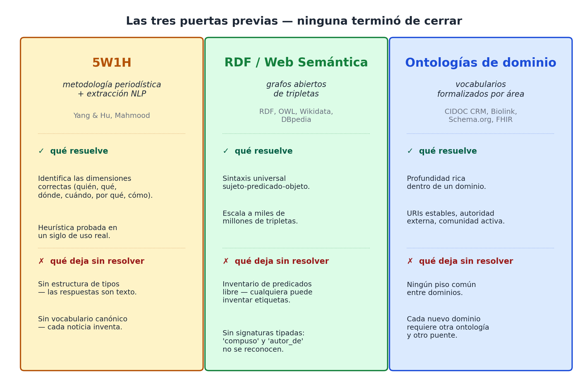

# Capítulo 3 — Lo que ya intentamos: 5W1H, web semántica y ontologías de dominio

## Tres puertas, ninguna cerrada

Si la idea de organizar la información del mundo por preguntas-W es tan natural como sostuvimos en el capítulo anterior, alguien tuvo que haberla intentado antes. Y la verdad es que sí: la intentaron varias veces, con éxito parcial cada vez. Tres tradiciones, sobre todo, se acercaron al problema desde ángulos distintos y dejaron tres puertas a medio abrir. Este capítulo recorre las tres, mira con honestidad qué consiguieron y por qué ninguna terminó de pasar al otro lado. Entender bien sus límites es la mejor manera de no repetirlos.

Para que los ejemplos sean reconocibles, voy a apoyarme en cuatro dominios cotidianos a los que volveremos a lo largo del libro: **una receta de cocina**, **un gol de fútbol**, **una canción** y **una noticia política**. Cuatro mundos muy distintos, cuatro vocabularios muy distintos. Si una arquitectura universal funciona, tiene que aguantar los cuatro sin transpiraciones.

## La primera puerta: el 5W1H como metodología

El 5W1H, como vimos en el capítulo anterior, nació en las redacciones de comienzos del siglo XX. Pero a fines del siglo XX algo curioso pasó: investigadores de informática empezaron a tomarlo en serio como **herramienta de extracción de información**. Si las noticias bien escritas responden seis preguntas, ¿no podría un programa identificar esas seis respuestas automáticamente y construir una base estructurada a partir de texto plano?

Yang & Hu propusieron, en una línea de trabajo conocida [9], un sistema que toma una nota de prensa y devuelve las seis respuestas como campos de un registro: *who, what, where, when, why, how*. Mahmood, en una dirección parecida [10], formalizó el problema como una tarea de etiquetado: cada cláusula de la noticia se anota con el rol 5W1H que cumple, y de ahí se construye una representación estructurada del evento.

Veámoslo concretamente. Imagina la noticia:

> *El ministro de Salud anunció ayer en conferencia de prensa una nueva campaña de vacunación contra el sarampión para reducir los brotes detectados en zonas rurales del norte del país.*

El sistema 5W1H produce:

```
quién:   el ministro de Salud
qué:     anunció una nueva campaña de vacunación contra el sarampión
cuándo:  ayer
dónde:   en conferencia de prensa
por qué: para reducir los brotes detectados en zonas rurales del norte
cómo:    (no especificado)
```

Bonito. Estructurado. Procesable.

¿Cuál es el problema? El problema aparece cuando intentas hacer dos cosas: **almacenar el resultado de manera homogénea**, y **combinarlo con otra cosa**.

Almacenarlo de manera homogénea es complicado porque las respuestas vienen en lenguaje natural. "El ministro de Salud" en la noticia de hoy puede ser "el titular de la cartera de salud" en la noticia de la semana próxima, y un sistema 5W1H sin más capa por encima no sabe que son la misma persona. Cada respuesta es una cadena de texto: la consulta "todas las acciones del ministro de Salud este año" requiere reconciliar referencias, y el 5W1H no provee mecanismos para hacerlo.

Combinarlo con otra cosa es todavía peor. La misma metodología aplicada a un parte deportivo:

> *Messi marcó el gol del empate en el minuto 87 con un remate de zurda desde fuera del área, tras una pared con su compañero.*

```
quién:   Messi
qué:     marcó el gol del empate
cuándo:  el minuto 87
dónde:   fuera del área
por qué: (implícito: empatar el partido)
cómo:    con un remate de zurda tras una pared
```

Funciona. Pero el campo "qué" del ministro y el campo "qué" del gol son cadenas de texto opacas; nada en el sistema sabe que un "anuncio" y un "gol" son tipos distintos de evento, que comparten ciertos roles pero requieren otros propios (en un gol importa la pierna, el tipo de remate, la asistencia; en un anuncio importa el destinatario, el medio, el efecto buscado).

El 5W1H operativo es un **diccionario de roles**, no una arquitectura. Como guía heurística para no olvidar dimensiones, es excelente. Como base para construir un sistema que combine información heterogénea, le faltan dos cosas: una **estructura de tipos** (qué es cada respuesta — una persona, un lugar, un evento) y un **vocabulario canónico** (cómo se llaman las cosas para que dos noticias hablen del mismo ministro).

Esos dos huecos son los que el resto del libro intenta llenar. El 5W1H tenía la intuición correcta — descomponer por preguntas —, pero le faltó dar el segundo paso.

## La segunda puerta: la web semántica

A fines del siglo XX, una intuición parecida tomó otra forma. Tim Berners-Lee, el inventor de la World Wide Web, propuso en un famoso artículo de 2001 una visión que llamó **Web Semántica** [31]: una web donde los documentos no solo contuvieran texto para humanos sino también descripciones estructuradas para máquinas. La pieza clave de esa visión era el formato **RDF** (Resource Description Framework) [8].

RDF tiene una idea elegante en el corazón. Toda información se descompone en **tripletas**: *sujeto — predicado — objeto*. "Messi marcó un gol" es la tripleta `(Messi, marcó, un_gol)`. "El gol fue en el minuto 87" es `(el_gol, ocurrió_en, minuto_87)`. "La canción fue compuesta por McCartney" es `(la_cancion, compuesta_por, McCartney)`. Cualquier hecho del mundo, dice RDF, se puede expresar como un conjunto de tripletas.

La promesa es deslumbrante. Si toda la información del mundo está en tripletas, cualquier base de datos se puede consultar igual; cualquier dataset se puede unir con otro; un buscador puede razonar sobre hechos, no solo sobre palabras clave. Sobre RDF se construyeron iniciativas tan ambiciosas como **Wikidata** [32] y **DBpedia** [33], que hoy guardan miles de millones de tripletas extraídas de Wikipedia y otras fuentes.

Y en cierto modo funcionó. Wikidata es la base estructurada más grande del mundo en términos de cobertura. Si quieres saber en qué año murió un compositor, qué club fichó a un jugador, qué presidente firmó una ley, Wikidata muy probablemente lo sepa, y lo entrega como tripletas consultables.

Entonces, ¿dónde está el problema?

El problema, como anticipé en el capítulo 1, es que RDF resolvió un problema técnico — la sintaxis del intercambio — pero dejó intacto el problema semántico — qué predicado usar y cómo nombrarlo. RDF te deja escribir `(McCartney, compuso, "Yesterday")`, pero también te deja escribir `(McCartney, autor_de, "Yesterday")`, `(McCartney, compositor, "Yesterday")` y `(McCartney, escribió_la_canción, "Yesterday")`. Cuatro tripletas, mismo hecho, sintaxis idéntica, semántica incompatible.

La consecuencia práctica se ve apenas uno intenta una consulta que cruce dos bases. Quiero saber "todas las canciones compuestas por McCartney que han sido versionadas por al menos tres artistas distintos". Si Wikidata usa el predicado `composer` y otra base — supongamos, MusicBrainz — usa el predicado `wrote`, mi consulta tiene que conocer las dos convenciones y traducir entre ellas. Si entra una tercera base que usa `creator`, hay que extender el puente. Cada base nueva añade trabajo proporcional, no logarítmico.

La respuesta histórica de la comunidad de la web semántica fue construir **ontologías encima de RDF**: vocabularios formales (en OWL [22]) que definen qué predicados existen y cómo se relacionan unos con otros. Pero ahí la web semántica termina haciéndose la pregunta que evitaba: ¿cuál es la ontología buena, la que todos deberían usar? Y se vuelve, sin proponérselo, a la tercera puerta — la de las ontologías de dominio — con un costo de indirección adicional.

La intuición de RDF era correcta: separar la información en unidades atómicas estructuradas. Lo que le faltó fue **constreñir el inventario** de relaciones. Sin ese constreñimiento, la diversidad de vocabularios no desaparece: solo cambia de capa.

## La tercera puerta: las ontologías de dominio

La tercera tradición tomó el problema por su lado más laborioso. Si la cuestión es que cada dominio inventa su vocabulario, entonces — pensaron — sentemos a los expertos de cada dominio y que definan ese vocabulario *bien hecho*, exhaustivo, formalizado, validado. Una vez existe la ontología, los sistemas del dominio la adoptan y se entienden entre sí.

Hay ontologías de dominio gloriosas. **CIDOC CRM** [4], para patrimonio cultural, lleva tres décadas en construcción y modela con precisión museos, colecciones, procedencias, restauraciones, exhibiciones. **Biolink Model** [5], para biomedicina, unifica decenas de bases de datos sobre genes, enfermedades, fármacos y procesos biológicos. **HL7 FHIR** [6] hace lo propio para historia clínica electrónica. Y, en un registro más popular y comercial, **Schema.org** [30] — la iniciativa conjunta de Google, Microsoft, Yandex y Yahoo — define schemas estandarizados para que las páginas web puedan marcar su contenido de modo que los buscadores lo entiendan.

Schema.org es un buen banco de pruebas para entender la lógica de las ontologías de dominio. Tiene una entrada `Recipe` que define exactamente qué hace falta para que un buscador entienda una receta como receta: campos como `name`, `recipeIngredient` (con cantidades y unidades), `recipeInstructions` (lista ordenada de pasos), `cookTime`, `prepTime`, `recipeYield`, `nutrition`. Si tu blog de cocina marca sus recetas con `Recipe`, aparecen mejor en Google y se pueden indexar en aplicaciones de cocina.

Hasta aquí, perfecto. Si lo único que haces son recetas, `Recipe` resuelve tu vida.

El problema es lo que pasa cuando intentas algo apenas más amplio. Imagina un libro de cocina con historia: cada receta lleva una nota cultural sobre su origen, los personajes que la popularizaron, los conflictos políticos que cambiaron sus ingredientes. La parte "receta" cabe en `Recipe`. La parte "historia" requiere otros schemas — `Event` para los hitos, `Person` para los cocineros, `Place` para las regiones — y, sobre todo, requiere **un mecanismo para conectarlos** que `Recipe` no provee, porque no era su problema. La integración se hace, pero a mano.

Y si cambias de dominio, vuelves a empezar. `Recipe` no te dice nada sobre cómo modelar un partido de fútbol. Para eso podrías usar `SportsEvent` (que existe en Schema.org), pero `SportsEvent` no te dice cómo modelar el gol en sí — quién pasó, con qué pierna, en qué minuto. Hay que escribir extensiones.

Y si bajas a química, las ontologías cambian por completo: Schema.org no tiene `ChemicalReaction`; hay que recurrir a CHEBI, ChEMBL, ChemAxiom, todas ontologías específicas con su propio vocabulario, su propia infraestructura, su propia comunidad. Si una farmacéutica quiere cruzar datos químicos con datos clínicos, debe construir puentes entre la ontología química y FHIR. Si un museo de gastronomía quiere unir información de Schema.org/Recipe con CIDOC CRM (porque las recetas son patrimonio inmaterial), hay que construir otro puente.

La intuición de las ontologías de dominio es correcta: hay que definir el vocabulario explícitamente, no dejarlo librado a la improvisación. Lo que les faltó fue **un piso compartido por debajo** que evitara que cada dominio reinventara los conceptos universales — agente, objeto, lugar, tiempo, evento — desde cero. Cada ontología modela "una persona" a su modo: en CIDOC CRM es `E21_Person`, en Biolink es `biolink:Agent`, en Schema.org es `Person`, en FHIR es `Patient`. Cuatro entidades, mismo concepto, cero compatibilidad automática.



## Cuatro dominios, tres puertas

Para hacer el balance concreto, miremos los cuatro dominios que prometí en la apertura y veamos cómo le va a cada puerta con cada uno.

| | 5W1H | RDF / Web Semántica | Ontología de dominio |
|---|---|---|---|
| **Receta** | Pobre: no captura cantidades, pasos ordenados, sustituciones. | Posible si hay ontología asociada; sintaxis no aporta. | Schema.org/Recipe lo modela bien, pero no se cruza con otros dominios. |
| **Gol de fútbol** | Bueno como descripción narrativa; pobre para estadísticas. | Posible vía Wikidata, pero predicados varían entre bases. | SportsEvent existe, pero el detalle del gol requiere extensión propia. |
| **Canción** | Bueno para "noticia sobre una canción"; pobre para la canción misma. | Wikidata cubre composiciones, MusicBrainz también; vocabularios distintos. | MusicBrainz tiene su propio modelo; Schema.org/MusicComposition es más débil. |
| **Noticia política** | Excelente: el 5W1H nació exactamente para esto. | Trabajable, pero los predicados de "anunciar", "firmar", "votar" no están estandarizados. | Schema.org/NewsArticle cubre el envoltorio; no el contenido. |

Lee la tabla con cuidado. Ningún enfoque es uniformemente mejor que los otros. Cada uno brilla en una columna y se apaga en otra. Y, lo más significativo: para cruzar columnas — para preguntar, por ejemplo, "qué canciones fueron noticias políticas porque las cantó alguien en un acto de campaña" — los tres fallan parejo. Necesitan puentes ad-hoc.

## Lo que faltó: un piso, no un techo

Si uno se aleja un paso y mira los tres intentos juntos, aparece un patrón.

- El **5W1H** identificó las dimensiones correctas pero no construyó un vocabulario sobre ellas.
- **RDF** construyó un protocolo sintáctico potente pero no impuso un vocabulario.
- Las **ontologías de dominio** construyeron vocabularios excelentes para cada dominio pero no compartieron un piso común.

Lo que falta, entonces, no es otra ontología — ya hay miles — ni otro formato — RDF y JSON-LD cubren lo sintáctico —, sino algo más radical: **un piso compartido por debajo de todas las ontologías**, suficientemente delgado para no ser invasivo pero suficientemente explícito para que el cruce entre dominios sea automático en vez de manual.

Ese piso es lo que el 5W1H rozó como intuición. Las preguntas-W son universales — el capítulo anterior se dedicó a sustentar esa afirmación —, así que si las usamos como **ejes o coordenadas de un esquema fijo**, obtenemos justo lo que falta: un piso que cualquier dominio puede adoptar sin renunciar a su vocabulario interno. Lo único que el dominio promete, al adoptar el piso, es que cada uno de sus conceptos se compromete a aparecer en uno (y solo uno) de los ejes-pregunta.

Si una receta tiene un cocinero, ese cocinero va al eje *quién*. Si un gol tiene un minuto, ese minuto va al eje *cuándo*. Si una canción tiene un tono, ese tono va al eje *cómo* (o, según el caso, al eje *cuál*, como veremos). Si una noticia política tiene un ministerio, ese ministerio va al eje *quién* o al eje *dónde* — y la decisión, lejos de ser ambigua, va a ser explícita y consistente, una vez fijada.

El compromiso es modesto: aceptar el inventario de ejes. La ganancia es enorme: cualquier dato de cualquier dominio es consultable con un solo lenguaje, porque todos los dominios viven sobre el mismo piso.

## Lo que viene

La Parte I termina aquí. Hemos visto **por qué** las preguntas: porque la torre de Babel es real y costosa (capítulo 1), porque las preguntas-W son invariantes cognitivos universales (capítulo 2), y porque las tentativas previas se quedaron cerca pero no cerraron (capítulo 3).

A partir del próximo capítulo construimos. Una a una, las ocho coordenadas: **quién, qué, dónde, cuándo, cuánto, cuál, cómo y clase**. Cada una con sus particularidades, sus trampas, sus convenciones. Cada una probada contra los mismos cuatro dominios — receta, gol, canción, noticia política — más todos los que necesitemos para forzar al modelo a romperse y ver dónde no se rompe.

El primer eje es el más obvio y, paradójicamente, el más sutil: **¿quién?**.
