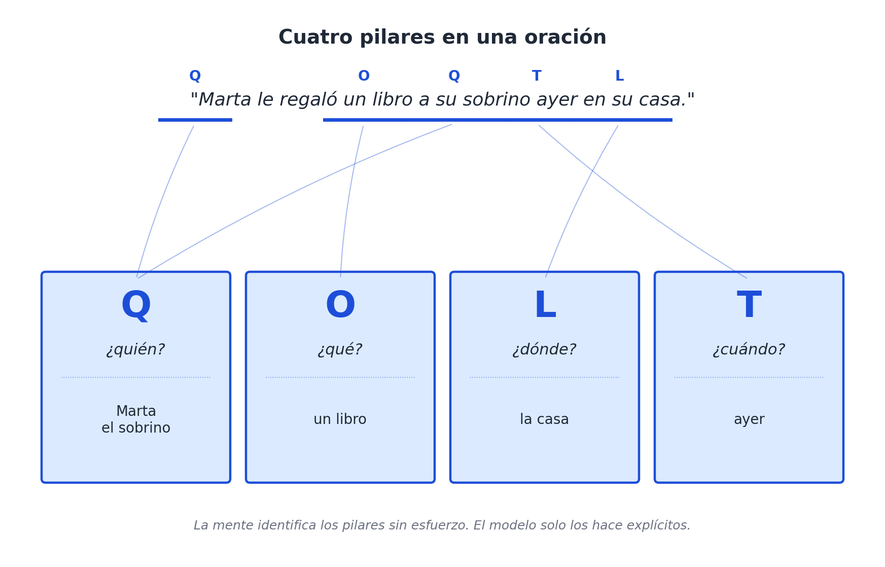

# Capítulo 4 — Quién, qué, dónde, cuándo: los cuatro pilares

## Una oración sencilla

Empecemos este análisis por la oración más inocente y cotidiana que se nos pueda ocurrir:

> *Marta le regaló un libro a su sobrino ayer en su casa.*

Cualquier persona que hable español entiende esta frase sin hacer el menor esfuerzo consciente. Sin embargo, esa comprensión aparentemente simple esconde un trabajo de procesamiento mental extraordinario. Al leerla, nuestro cerebro identifica de manera automática y en una fracción de segundo cuatro elementos totalmente distintos: **una persona que ejecuta la acción** (Marta), **una cosa que cambia de manos** (un libro, que involucra a un receptor, el sobrino), **un lugar físico donde todo ocurre** (la casa) y **un momento específico en el tiempo** (ayer). 

No solo identificamos estas piezas al vuelo, sino que las encajamos en su lugar exacto. Nadie con un nivel básico de comprensión lectora confundiría la casa con el libro, ni pensaría que "ayer" es el nombre de la persona que recibe el regalo. 

Esa capacidad de descomposición automática que tiene nuestra mente es, literalmente, la materia prima sobre la cual se construye el modelo de este libro. Esas cuatro preguntas que nuestro cerebro acaba de responder sin que nos demos cuenta —*quién*, *qué*, *dónde*, *cuándo*— conforman los **cuatro pilares**. Son las dimensiones fundamentales que aparecen en cualquier descripción de un hecho real, sin importar el idioma que hablemos o el nivel técnico del tema. Si falta alguna de estas piezas, sentimos intuitivamente que la historia está incompleta. Si las cuatro están presentes, tenemos, como mínimo, el esqueleto funcional de un hecho.



En este capítulo vamos a recorrer estos pilares uno por uno. Todavía no los vamos a tratar como ejes matemáticos formales —eso lo haremos más adelante cuando toquemos la arquitectura—, sino que vamos a analizarlos como **preguntas con personalidad propia**. Cada una de ellas esconde rarezas, trampas de diseño y convenciones que solemos pasar por alto. Entender a fondo cómo se comportan ahora nos va a ahorrar muchísimos dolores de cabeza cuando empecemos a modelar bases de datos.

## Q — Quién: la pregunta por la agencia

A simple vista, la pregunta "¿quién?" parece la más obvia e inofensiva de las cuatro. Queremos saber quién hizo algo, quién recibió la acción o sobre quién recae la responsabilidad. La respuesta estándar y canónica que esperamos encontrar aquí es **un agente capaz de ejecutar una acción**: una persona individual, un grupo de personas o una organización formal.

Si lo cruzamos con nuestros cuatro ejemplos de prueba, el resultado es bastante plano:
- *Receta*: ¿quién prepara el risotto? El cocinero.
- *Gol*: ¿quién marca? El delantero (y si queremos más detalle, quién da la asistencia).
- *Canción*: ¿quién compone? El autor o el músico.
- *Noticia política*: ¿quién anuncia la nueva medida? El ministro de turno.

Hasta aquí no hay mayor fricción. Pero esta pregunta empieza a volverse muy interesante apenas la sacamos de su zona de confort y la enfrentamos a la realidad de los datos.

Pensemos en un partido de fútbol. ¿Quién marca el gol cuando el balón rebota accidentalmente en un defensor rival y entra al arco? Las estadísticas oficiales de los torneos hablan de un "gol en contra" y, para efectos de la tabla de goleadores, le adjudican el tanto al delantero que pateó originalmente, no al defensor que desvió el balón. Entonces, a nivel de datos, ¿quién es el agente real de ese evento? El reglamento deportivo toma una decisión, por supuesto, pero estructurar esa pregunta en un sistema informático no es algo trivial.

O miremos la industria musical. ¿Quién compone exactamente una canción cuando un autor escribe la letra en su casa y otro músico compone la melodía en un estudio meses después? La industria tiene muy clara la distinción legal entre *letrista* y *compositor*, pero muchísimos sistemas de software simplemente meten a ambos en un campo genérico llamado `compositor`. Cuando una base de datos intenta compartir esa información con otra, si no sabemos qué convención interna usó cada una, los datos chocan.

En el caso de una receta clásica de fideos con tuco, la situación temporal lo complica todo: ¿quién "prepara" el plato si la receta original la escribió la abuela hace cincuenta años, pero la salsa la está cocinando el nieto esta noche? Existe una distinción fundamental entre el *autor* (quien diseñó el conocimiento) y el *ejecutor* (quien materializa la acción hoy). Ambas personas son respuestas totalmente legítimas a la pregunta "¿quién?", pero pertenecen a momentos y naturalezas de acción distintas.

Y aquí aparece un caso límite que merece mención explícita y cuidadosa. ¿Qué ocurre con el "quién" cuando el que ejecuta la acción no es una persona ni una empresa, sino un objeto inanimado? Un horno inteligente que se enciende solo al alcanzar cierta temperatura, el sistema VAR que interrumpe un partido para anular un gol, o un algoritmo de Spotify que decide sugerirte una canción. En nuestra forma natural de hablar, les otorgamos agencia sin pensarlo: *el horno se encendió*, *el VAR anuló la jugada*, *el algoritmo decidió*. 

Sin embargo, a nivel de arquitectura de la información, estos objetos no pertenecen naturalmente al eje *quién*; su lugar de origen es el eje *qué*, ya que son sistemas o cosas. Lo que sucede aquí es que, **en situaciones muy específicas, un objeto asume temporalmente la capacidad de agencia**. 

Esta observación aparentemente menor tiene un peso enorme en el diseño de software. La idea central es que la "agencia" (la capacidad de hacer algo) no es una propiedad estática que un objeto tiene siempre, sino una **propiedad puramente contextual**. Dependiendo de la situación, un objeto pasivo puede "vestirse" de agente. A este principio lo llamaremos "agencia contextual", y será una de nuestras decisiones de diseño más fuertes cuando lleguemos a la Parte III.

## O — Qué: la pregunta por la cosa

La pregunta "¿qué?" es profundamente engañosa porque en la gramática parece exigir una sola respuesta concreta, pero en la práctica termina abriendo la puerta a entidades completamente distintas. Si preguntas "¿Qué pasó?", esperas que te cuenten un evento. Si preguntas "¿Qué le regaló?", buscas un objeto material. Si preguntas "¿Qué situación atraviesa el equipo?", estás pidiendo un contexto complejo. Las tres preguntas son gramaticalmente correctas, las tres aterrizan en el eje *qué*, pero se refieren a estructuras de datos que no se parecen en nada.

Para mantener la cordura en nuestro modelo, adoptaremos un criterio funcional y amplio: **el eje *qué* va a alojar absolutamente todo lo que no sea un agente, un lugar o un momento temporal**. Y al hacerlo, debemos reconocer que dentro de este gran contenedor conviven al menos tres familias muy diferenciadas. 

La primera familia son los **objetos**. Hablamos de cosas tangibles o intangibles que existen por sí mismas, que persisten a lo largo del tiempo y que pueden ser mencionadas en muchas situaciones distintas. El libro que regaló Marta, el balón oficial del partido, el documento en PDF donde se redactó el decreto, o el papel manchado donde está anotada la receta.

La segunda familia son los **eventos**. Estos son hechos que ocurren, que tienen un punto de inicio y un punto de finalización claros, y que suelen ser la materia prima de las noticias. El remate al arco, el anuncio oficial en el micrófono, el acto de estampar la firma en el decreto, o la sesión de grabación del disco.

La tercera familia son las **situaciones**. Se trata de marcos de referencia mucho más amplios y duraderos, dentro de los cuales ocurren múltiples eventos pequeños que están interconectados. El partido de fútbol en su totalidad, la conferencia de prensa completa, o la cena de aniversario.

Aquí hay una intuición de diseño muy sutil pero crítica: estas tres familias no están separadas por muros impenetrables. Un evento puede transformarse en un objeto cuando otro dato hace referencia a él (por ejemplo, cuando decimos "**el gol** fue revisado minuciosamente por el VAR"). Del mismo modo, una situación gigante puede ser vista como un evento simple si la miramos desde un contexto aún mayor ("**el partido** fue suspendido a causa de la lluvia torrencial"). El eje *qué* tiene una flexibilidad inherente respecto a la escala o la granularidad: lo que en un nivel de la base de datos es un evento activo, en un nivel superior es simplemente un objeto pasivo al que hacemos referencia.

Esa flexibilidad es una ventaja arquitectónica masiva. Nos permite tratar de forma uniforme cosas que la programación tradicional suele obligar a separar en tablas de bases de datos distintas y difíciles de cruzar. Pero, cuidado, también es una trampa mortal para los ingenieros de datos: hay que ser muy precisos para no perder la riqueza de un evento complejo al reducirlo a un simple objeto de texto, o viceversa. En la Parte III vamos a desmenuzar este problema bajo el concepto formal de **reificación**.

Por el momento, nos basta con asimilar esta intuición operativa usando nuestros dominios:
- *Receta*: el texto de la receta es el objeto; el acto físico de cocinar es el evento; la cena familiar donde se come es la situación.
- *Gol*: el balón es el objeto; el disparo a portería es el evento; los noventa minutos de partido son la situación.
- *Canción*: la partitura musical es el objeto; la interpretación del cantante en la cabina es el evento; la gira de conciertos es la situación.
- *Noticia política*: el papel del decreto es el objeto; la rúbrica del presidente es el evento; el mandato presidencial de cuatro años es la situación.

En cada caso, usamos el mismo eje *qué* tres veces, pero operando en tres registros distintos. El modelo no se confunde ni se rompe; simplemente aloja la información en su nivel correspondiente.

## L — Dónde: la pregunta por el lugar

La pregunta "¿dónde?" suele ser la más física y concreta de los cuatro pilares, y precisamente por esa aparente simplicidad es la que los desarrolladores dan por sentada con mayor frecuencia. Sin embargo, detrás de ella se esconde una decisión semántica que, si no se toma de forma explícita, arruina los cruces de información.

En el uso diario del lenguaje, utilizamos dos tipos de "dónde" completamente distintos. El primero es el **lugar físico estricto**: una coordenada en un mapa, una dirección postal, una ciudad o un recinto. La casa de Marta, las gradas del estadio, la sala de grabación B, o el palacio presidencial. 

El segundo es el **lugar organizacional o administrativo**: un departamento corporativo, un ministerio del gobierno, una sucursal de una franquicia, o un club deportivo. Hablamos de la selección nacional, el Ministerio de Salud, o un sello discográfico específico.

Ambos conceptos responden con total naturalidad a la pregunta "¿dónde?", pero tecnológicamente apuntan a realidades estructuralmente distintas. Una ciudad es un polígono geográfico; un ministerio es un organigrama de personas e intenciones. Si cometemos el error de mezclarlos en el diseño —si guardamos `Lima` y `Ministerio de Salud` indiscriminadamente en una misma columna genérica llamada `ubicacion`— perdemos para siempre la capacidad matemática de separar dónde está ocurriendo algo físicamente y a qué estructura administrativa pertenece.

La regla que vamos a adoptar para evitar este caos es **explicitar siempre la naturaleza** del lugar. El eje *dónde* se reservará de manera estricta para los lugares físicos. Los lugares organizacionales, cuando estén ejecutando una acción, se moverán al eje *quién* (actuando como agentes); y cuando funcionen meramente como contenedores administrativos, podrán aparecer en el eje *dónde*, pero irán etiquetados obligatoriamente con una marca de "organización". Esta distinción teórica tomará mucho más sentido cuando veamos el código en los próximos capítulos; por ahora, es vital tenerla mapeada.

Veamos cómo conviven en nuestros cuatro ejemplos:
- *Receta*: ¿Dónde se prepara físicamente? En la cocina. ¿Dónde se sirve? En la mesa del comedor. ¿Dónde tiene su origen histórico? En una región extensa como Sicilia o Yucatán. Tenemos tres "dóndes" con escalas físicas totalmente distintas conviviendo sin problemas.
- *Gol*: ¿Dónde se produjo el impacto del remate? A cinco metros fuera del área penal. ¿Dónde se jugó el partido? En un estadio específico, dentro de una ciudad específica. De nuevo, convivencias de escalas.
- *Canción*: ¿Dónde se grabaron las pistas? En un estudio de Londres. ¿Dónde se escribió la letra? A veces es un dato histórico conocido, a veces es un misterio.
- *Noticia política*: ¿Dónde se firmó el documento? En el despacho presidencial (ubicación física). ¿Dónde tiene jurisdicción la ley? En todo el territorio nacional (ubicación política). 

Vale la pena dejar asentada una observación fundamental: el pilar "dónde" está diseñado por naturaleza para soportar jerarquías o anidamientos. La cocina está dentro de la casa, la casa pertenece a un barrio, el barrio está contenido en la ciudad, y la ciudad en el país. A nivel lógico, todas esas respuestas son matemáticamente correctas para la pregunta "¿dónde ocurrió?" aplicada a un mismo hecho. Todo dependerá del nivel de "zoom" que requiera la consulta del usuario. El modelo que estamos construyendo tendrá que ser capaz de navegar por esas cuatro escalas hacia arriba o hacia abajo sin generar ambigüedades.

## T — Cuándo: la pregunta por el tiempo

Llegamos al último de los cuatro pilares base, el cual solemos tratar con mucha ligereza en informática asumiendo que se soluciona con un simple formato de fecha (`YYYY-MM-DD`). La realidad es que el "cuándo" resulta ser el eje más rico y lleno de sutilezas lógicas de todo el modelo. El lenguaje natural tiene muchísimas formas de expresar el tiempo, y las fechas de calendario son apenas una de ellas. 

Volvamos a la oración con la que abrimos el capítulo: *Marta le regaló un libro a su sobrino ayer en su casa*. La respuesta al "cuándo" es la palabra *ayer*. Como arquitectos de datos, ¿cómo abordamos esto? Si el sistema simplemente guarda el dato frío como `2026-05-13`, estamos destruyendo información valiosa: perdemos el contexto de que la acción ocurrió "ayer" en relación al momento exacto en que la persona habló. Por otro lado, si guardamos literalmente la cadena de texto "ayer", el motor de la base de datos se vuelve inútil, porque no puede realizar cálculos de antigüedad ni ordenar los eventos cronológicamente. La salida técnica razonable es guardar la fecha absoluta computacional y, en una capa complementaria, conservar el adverbio relativo ("ayer") como contexto asociado.

Pero el problema se vuelve más profundo cuando salimos del calendario estándar. En la notación musical, una nota tiene una duración de "una negra" o "una corchea"; el tiempo aquí no lo dicta un reloj de cuarzo, es un **tiempo musical** interno que se mide en compases y ritmo. En el análisis de una obra literaria o cinematográfica, decimos que una muerte ocurre "al final del segundo acto"; estamos frente a un **tiempo narrativo**, medido por la posición estructural dentro de un relato. En un entorno hospitalario, la ficha indica que el paciente sufrió una crisis "tres horas después de la ingesta del medicamento"; este es un **tiempo relativo anclado a un evento previo**. En el ámbito jurídico, un decreto entra en vigencia "a los treinta días hábiles de su publicación en el boletín oficial"; nos topamos con un **tiempo derivado por reglas legales**.

Si prestamos atención al uso natural de la información, descubrimos que la pregunta "cuándo" exige soportar, como mínimo, cinco tipos de tiempo distintos:

1. **Tiempo absoluto:** Las fechas y horas exactas atadas al calendario gregoriano.
2. **Tiempo relativo:** Expresiones relacionales como "antes de", "durante" o "inmediatamente después de" otro hecho comprobable.
3. **Tiempo de reloj corto:** Marcadores temporales internos de un evento cerrado (por ejemplo, el minuto 87 del partido de fútbol).
4. **Tiempo cíclico:** Patrones de repetición (todos los lunes hábiles, cada inicio de mes).
5. **Tiempo no-reloj:** Escalas abstractas como compases de una partitura, el número de página de un libro, o el paso número cuatro de un manual de instrucciones.

Cualquier eje *cuándo* robusto tiene que estar preparado para recibir estos cinco formatos y, más importante aún, tener la inteligencia para reconocer cuál de ellos se está utilizando en cada transacción. La estrategia que adoptaremos formalmente más adelante es la **pluralidad de tiempos**. No intentaremos forzar toda la información a pasar por un único reloj universal. En su lugar, el eje funcionará como un espacio donde conviven múltiples escalas temporales, todas válidas, operando cada una bajo su propio sistema de coordenadas.

A esto se le suma una complicación técnica fascinante en la que no profundizaremos mucho ahora, pero que dejaremos planteada. Una propiedad o un dato puede ser completamente **válido** en un período de tiempo, y dejar de serlo en el siguiente. Marta vivió ininterrumpidamente en esa casa entre 2010 y 2025; pero si consultamos en 2026, su residencia es otra. La respuesta a "dónde vive Marta" no es un bloque de piedra inamovible; es un flujo temporal compuesto por una sucesión de valores, cada uno con su propia fecha de caducidad. Este concepto es lo que en la teoría de bases de datos avanzadas se conoce como **bitemporalidad**, y en la lingüística estructural se denomina **vigencia**. Será un componente explícito de nuestro diseño final.

Si aplicamos todo esto a nuestros casos de uso:
- *Receta*: ¿Cuándo se ejecuta? Puede ser un tiempo absoluto (la preparé anoche), un patrón cíclico (es la comida de todos los domingos), o un tiempo relativo interno ("añadir la sal después de que rompa a hervir").
- *Gol*: ¿Cuándo ocurre? En el minuto 87, en la segunda mitad, o en el tiempo de descuento. Todo esto es tiempo de reloj corto, que solo tiene sentido en relación con el pitido inicial del árbitro.
- *Canción*: ¿Cuándo debe entrar el coro instrumental? Exactamente en el compás 17. ¿Cuándo se grabó físicamente el disco? El 14 de mayo de 2026. Aquí vemos dos líneas de tiempo conviviendo en paralelo.
- *Noticia política*: ¿Cuándo se estampó la firma presidencial? Ayer en la tarde. ¿Cuándo entra en vigor la ley para los ciudadanos? Dentro de treinta días. Un tiempo absoluto y un tiempo derivado operando sobre el mismo objeto.

## Cuando un pilar se confunde: una anécdota de IA en estado salvaje

Antes de dar por cerrado este capítulo conceptual, resulta sumamente instructivo analizar un caso de la vida real. Es una anécdota que ilustra a la perfección qué ocurre cuando un sistema avanzado confunde los pilares fundamentales de un hecho. La historia circuló bastante en foros de tecnología hace un par de años y, debido a lo común del fallo, se ha convertido casi en un ejemplo de estudio clásico sobre las limitaciones de la inteligencia artificial sin estructura.

Imagina a un usuario que acaba de terminar su jornada laboral. Agarra su teléfono y le dicta lo siguiente a su asistente virtual:

> *Estoy en mi coche, que se me ensució muchísimo viniendo del trabajo. Lo tengo que llevar al autolavado, que me queda a solo dos cuadras de aquí. ¿Me recomiendas ir caminando o ir en carro?*

La respuesta que devolvió el modelo de lenguaje fue desconcertante: 
*"Si te queda tan cerca, puedes ir caminando sin problemas. Es mucho más saludable y de paso ahorras combustible."*

Evidentemente, el consejo es un absurdo físico. Es imposible llevar un vehículo a un centro de lavado yendo a pie. Sin embargo, el error no nace de una "estupidez" del algoritmo, sino de un problema técnico muy específico: una **mala asignación de roles semánticos a los cuatro pilares**. 

Analicemos la situación utilizando la notación que acabamos de establecer. Una lectura humana y estructuralmente correcta del escenario identifica las siguientes variables:

```text
Q (quién)             : el usuario (agente)
O (qué, objeto que se mueve) : el coche (paciente)
L (dónde, destino)    : el autolavado, ubicado a dos cuadras
T (cuándo)            : ahora
M (con_finalidad)     : lavar el coche
```

El verbo núcleo de toda la situación es *llevar*. El usuario funciona claramente como el agente de la acción, pero el **paciente** de ese verbo (la cosa física que sufre el transporte) es el coche. La finalidad ineludible de toda esta maniobra es someter ese coche a un proceso de lavado. Si eliminamos esa finalidad de la ecuación, la pregunta "¿caminar o en carro?" pierde absolutamente todo su sentido.

¿Qué fue lo que entendió el modelo de IA basado puramente en cálculo estadístico? Su asignación de roles probablemente se vio así:

```text
Q (quién)             : el usuario (agente)
O (qué, objeto que se mueve) : el usuario (¡el mismo!)
L (dónde, destino)    : el autolavado, ubicado a dos cuadras
T (cuándo)            : ahora
M (con_finalidad)     : trasladarse al autolavado
```

Bajo esta lectura errónea, el coche desaparece de su rol legítimo como paciente y es empujado conceptualmente a un rol de **instrumento opcional** ("puedes ir en carro o no"). La finalidad real (lavar el vehículo) se diluye y es reemplazada por el mero acto de llegar a unas coordenadas geográficas. Como el modelo estadístico evalúa que la distancia ("dos cuadras") es mínima, sus pesos probabilísticos sugieren que caminar es la acción más eficiente y saludable.

El fallo no es una deficiencia matemática. Es una deficiencia de **modelado del mundo**. El sistema perdió el rastro de una asignación estructural básica: en este contexto específico, el coche **es** el objeto central en el eje `O`, no una herramienta accesoria. Apenas esa pieza se cae del tablero, toda la cadena de razonamiento posterior colapsa, y el modelo ni siquiera es consciente del error.

Es aquí donde la promesa central de este libro cobra fuerza industrial. Si pudiéramos ofrecerle los hechos del mundo a los asistentes de inteligencia artificial utilizando una estructura donde los cuatro pilares fueran **explícitos** (el agente siempre en la caja `Q`, el paciente en la caja `O`, el lugar en la `L` y el momento temporal en la `T`), esta clase de absurdos lógicos desaparecerían. Y no porque hayamos creado un algoritmo más inteligente, sino porque la propia **arquitectura estructural impide que ocurra la asignación incorrecta**. 

Un sistema con bases firmes "sabe" por diseño que un verbo transitivo como *llevar* exige obligatoriamente la existencia de un paciente. Sabe que ese paciente tiene que estar registrado en el eje `O`. Si el paciente no está, el sistema detecta que la orden está incompleta y, en lugar de alucinar una respuesta, detiene el proceso para pedir aclaraciones. La estadística deja de gobernar a ciegas; la estructura toma el control y le da límites seguros. Esto es lo que la industria de la IA necesita con mayor urgencia en la actualidad.

## Los cuatro pilares y lo que falta

Si hacemos un repaso de las cuatro preguntas exploradas —*quién*, *qué*, *dónde*, *cuándo*— y recordamos la oración sencilla del principio del capítulo, comprobamos que las cuatro piezas están ahí, ejecutando un trabajo de ordenamiento preciso. Marta (quién) le regaló un libro (qué) ayer (cuándo) en su casa (dónde). El escenario queda sólidamente descrito.

¿Son suficientes para modelar la realidad completa? Para frases como esa, sí lo son. Pero no pasará mucho tiempo en un entorno de producción antes de que nos topemos con registros de datos donde estas cuatro cajas se queden cortas.

Imaginemos una leve expansión de nuestra oración original:

> *Marta le regaló a su sobrino, por su cumpleaños, un libro de cuentos que costó treinta dólares.*

El hecho base sigue siendo el mismo, pero el volumen de información ha escalado. De pronto, tenemos que procesar un **precio** (treinta dólares). Entró en juego un **motivo o finalidad** clara de la acción (por su cumpleaños). Además, tenemos una **clasificación mucho más específica** del objeto: no es un libro genérico, es un libro *de cuentos*. Y, de paso, la frase deja en claro que el sobrino pertenece a la categoría de *persona* (igual que Marta), un detalle técnico que nuestros cuatro pilares aún no nos permiten declarar explícitamente, ya que el pilar `Q` sirve para guardar individuos concretos, no para definir categorías teóricas.

Conceptos como *"persona"*, *"libro de cuentos"* o *"dólar"* no son objetos palpables. Son **clases** o arquetipos. Y, por definición, no encajan limpiamente en ninguno de los cuatro pilares que acabamos de estudiar.

La intuición que comienza a emerger es que los cuatro pilares son **estrictamente necesarios, pero arquitectónicamente insuficientes**. Necesitamos incorporar, como mínimo, una quinta pregunta —*qué tipo de cosa es esto*— que exija un eje propio y exclusivo: el zócalo categórico donde habitarán los tipos, las familias y los conceptos abstractos. A esto debemos sumarle una sexta pregunta para las métricas —*cuánto*— que lidiará con sus propias trampas de conversión (como las unidades de medida); y finalmente, una séptima y octava pregunta —*cuál* y *cómo*— encargadas de articular las conexiones y atributos que amarran todo el modelo. 

Nos quedan cuatro preguntas por descubrir, y cuatro capítulos por delante para consolidar por fin la Parte II del libro.

En el próximo capítulo (Capítulo 5), nos sumergiremos directamente en el eje categórico. Es, por mucho, el eje más delicado de todo el modelo y, paradójicamente, el que soporta la mayor carga de trabajo en los sistemas del mundo real. Es aquí donde la arquitectura de WQuestions se integra pacíficamente con los gigantes de la industria (como Schema.org, QUDT, SNOMED o CIDOC CRM), utilizándolos como aliados en lugar de intentar competir contra ellos. Es el momento de definir el vocabulario común para asegurarnos de no volver a construir, nunca más, la torre de Babel de los datos.