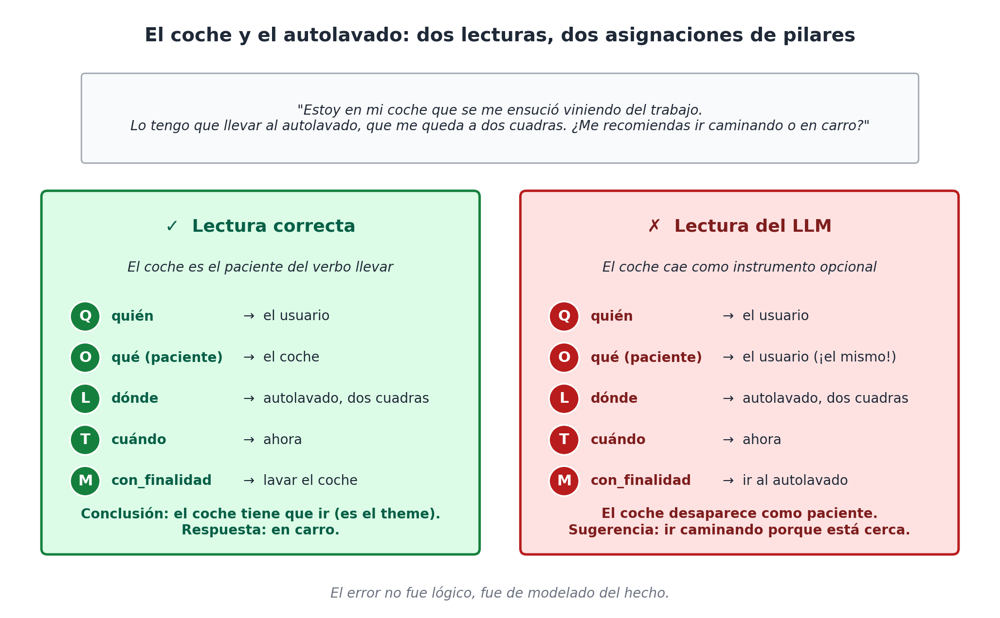

# Capítulo 4 — Quién, qué, dónde, cuándo: los cuatro pilares

## Una oración sencilla

Empecemos por la oración más inocente que se nos pueda ocurrir:

> *Marta le regaló un libro a su sobrino ayer en su casa.*

Cualquier hablante de español entiende la oración sin esfuerzo. Pero esa comprensión, mirada de cerca, esconde un trabajo notable. La mente que lee identifica, de manera automática y casi instantánea, cuatro cosas distintas: **una persona que actúa** (Marta), **una cosa que circula** (un libro, junto con otra persona implicada, el sobrino), **un lugar donde ocurre** (la casa) y **un momento en el tiempo** (ayer). No solo las identifica: las coloca cada una en su lugar correcto. Nadie confunde la casa con el libro, ni el ayer con Marta.

Esa descomposición automática es la materia prima del modelo que este libro construye. Las cuatro preguntas que la mente respondió en una fracción de segundo — *quién*, *qué*, *dónde*, *cuándo* — son los **cuatro pilares**: las dimensiones que aparecen en cualquier descripción de un hecho del mundo, en cualquier idioma, en cualquier dominio. Si alguna falta, la descripción se siente incompleta. Si las cuatro están, tenemos al menos el esqueleto de un hecho.


Este capítulo las recorre una por una. No las trata todavía como ejes formales — eso vendrá más adelante —, sino como **preguntas con personalidad propia**: cada una tiene sus rarezas, sus trampas, sus convenciones. Conocerlas bien ahora ahorra confusiones después.

## Q — Quién: la pregunta por la agencia

La pregunta "quién" parece la más obvia de las cuatro. Quién hizo algo, quién lo recibió, quién es el responsable. La respuesta canónica es **un agente capaz de acción**: una persona, un grupo de personas, una organización.

Tres ejemplos triviales:

- *Receta*: ¿quién prepara el risotto? El cocinero.
- *Gol*: ¿quién marca? El delantero (y, opcionalmente, quién asiste).
- *Canción*: ¿quién compone? El autor o el compositor.
- *Noticia política*: ¿quién anuncia la medida? El ministro.

Hasta aquí todo plano. Pero la pregunta se vuelve interesante apenas la empujamos un poco.

¿Quién marca el gol cuando el balón rebota en un defensor rival y entra al arco? Las estadísticas oficiales hablan de "gol en contra" y le adjudican el tanto al delantero que remató, no al defensor. ¿Quién es el agente entonces? El reglamento decide, pero la pregunta no es trivial.

¿Quién compone una canción cuando un autor escribe la letra y otro la música? La industria distingue *letrista* y *compositor*, pero algunos sistemas los meten en un solo campo `compositor`. Cuando una base le entrega a otra esa información, hay que saber qué convención usaba cada una.

¿Quién prepara una receta de fideos con tuco si los fideos los hizo la abuela hace dos generaciones y el tuco lo hace hoy el nieto? Hay una distinción entre *autor* (quien diseñó la receta) y *ejecutor* (quien la prepara hoy). Ambas son legítimas respuestas a "quién", pero refieren a personas y a momentos distintos.

Aparece, además, un caso que merece mención explícita. ¿Quién es el agente cuando lo que actúa no es una persona ni una organización, sino una cosa? Un horno que se enciende solo cuando alcanza una temperatura, un VAR que valida un gol, un algoritmo de recomendación que sugiere una canción. En el lenguaje cotidiano hablamos de "agentes" en sentido amplio: *el horno se encendió*, *el VAR anuló el gol*, *el algoritmo decidió*. Sin embargo, esos objetos no viven naturalmente en el eje *quién*: viven en el eje *qué*, como objetos o sistemas. Lo que pasa es que, **en ciertas situaciones, un objeto adquiere temporalmente capacidad de agencia**.

Esta observación va a tener importancia. La idea, anticipada ahora, es que la agencia no es una propiedad permanente de un objeto sino una **propiedad contextual**: en una situación dada, un objeto puede comportarse como agente, aunque normalmente sea un objeto pasivo. Llamaremos a este principio "agencia contextual" y lo retomaremos como decisión de diseño en la Parte III.

## O — Qué: la pregunta por la cosa

La pregunta "qué" es engañosa porque parece pedir una sola cosa y termina pidiendo varias. "¿Qué pasó?" pide un evento. "¿Qué le regaló?" pide un objeto. "¿Qué situación atraviesa el equipo?" pide una situación compleja. Las tres son válidas, las tres caen en el eje *qué*, pero refieren a cosas estructuralmente distintas.

En este libro adoptaremos un criterio amplio: **el eje *qué* aloja todo lo que no es agente, lugar ni momento**, y reconoce que dentro de ese eje conviven al menos tres familias.

La primera familia son los **objetos**: el libro de Marta, el balón con el que se marcó el gol, el papel donde se anotó la receta, el documento donde se firmó el decreto. Cosas tangibles o intangibles que existen, persisten en el tiempo, y son referidas en distintas situaciones.

La segunda familia son los **eventos**: el gol, el anuncio, la firma del decreto, la preparación del plato, la grabación de la canción. Hechos que ocurren, que tienen comienzo y fin, que se pueden contar como noticias.

La tercera familia son las **situaciones**: el partido en su conjunto, la conferencia de prensa, la sesión de grabación, la cena. Marcos que duran, dentro de los cuales ocurren múltiples eventos relacionados.

Hay una intuición clave aquí, sutil pero importante: las tres familias no son disjuntas. Un evento puede ser contemplado como objeto cuando otra información lo refiere ("**el gol** fue revisado por el VAR"); una situación puede ser contemplada como evento dentro de una situación más grande ("**el partido** fue suspendido por la lluvia"). El eje *qué* es flexible respecto a la granularidad: lo que en un nivel es evento, en otro nivel es objeto referido.

Esa flexibilidad es una ventaja arquitectónica enorme, porque permite tratar uniformemente cosas que la programación tradicional separa en tablas distintas. Pero también es una trampa: hay que cuidarse de no perder la identidad de un evento al reducirlo a objeto, o de no inflar un objeto trivial al estatus de evento. En la Parte III discutiremos este punto con cuidado, bajo el nombre de **reificación**.

Por ahora, alcanza con esta intuición operativa:

- *Receta*: la receta misma como objeto; el acto de cocinarla como evento; la cena donde se sirve como situación.
- *Gol*: el balón como objeto; el remate y el gol como eventos; el partido como situación.
- *Canción*: la canción como objeto (composición); su interpretación como evento; el concierto como situación.
- *Noticia política*: el decreto como objeto; la firma como evento; el período de gobierno como situación.

Cada caso usa el eje *qué* tres veces, en tres registros distintos. El modelo no se queja: lo aloja sin más.

## L — Dónde: la pregunta por el lugar

"¿Dónde?" es la pregunta más concreta de las cuatro, y por eso mismo la que más fácilmente se da por sentada. Sin embargo, esconde una decisión semántica que vale la pena hacer explícita.

Hay dos tipos de "dónde" en uso cotidiano. El primero es el **lugar físico**: una dirección, una ciudad, un país, un punto geográfico. La casa de Marta, el estadio, el estudio de grabación, el palacio de gobierno. El segundo es el **lugar organizacional**: un departamento, un ministerio, una sucursal, un club. La selección, el Ministerio de Salud, el sello discográfico, la cadena de restaurantes.

Los dos comparten que responden a "¿dónde?", pero apuntan a cosas estructuralmente distintas. Una ciudad es una entidad geográfica; un ministerio es una entidad organizacional. Si los confundimos al modelar — si guardamos `Lima` y `Ministerio de Salud` en el mismo campo `ubicacion` — pierdes la capacidad de razonar por separado sobre dónde está físicamente algo y a qué organización pertenece.

La convención que adoptaremos es **explicitar la naturaleza** del lugar: el eje *dónde* alojará lugares físicos, y los lugares organizacionales — cuando funcionen como agentes — irán al eje *quién*; cuando funcionen como contenedores administrativos podrán aparecer también en *dónde*, marcados como organización. La distinción se vuelve más clara en los capítulos posteriores; por ahora, basta con tenerla presente.

Ejemplos en los cuatro dominios:

- *Receta*: ¿dónde se prepara? La cocina. ¿Dónde se sirve? El comedor. ¿Dónde nació la receta? Una región (Sicilia, el Yucatán). Tres "dóndes" con resoluciones distintas conviven sin chocar.
- *Gol*: ¿dónde fue el remate? Fuera del área. ¿Dónde ocurrió el partido? En tal estadio, en tal ciudad. Otra vez, distintas escalas de "dónde".
- *Canción*: ¿dónde fue grabada? Tal estudio en tal ciudad. ¿Dónde fue compuesta? A veces se sabe, a veces no.
- *Noticia política*: ¿dónde se firmó el decreto? En la sede de gobierno. ¿Dónde se aplica? En el territorio nacional. Otra vez, dos escalas.

Una observación útil: el "dónde" admite naturalmente jerarquías. La cocina está en la casa, la casa está en el barrio, el barrio está en la ciudad, la ciudad en el país. Todas son respuestas correctas a "¿dónde?" para el mismo hecho, dependiendo de la resolución que pida la consulta. El modelo tendrá que ser capaz de responder a las cuatro escalas sin ambigüedad. Volveremos a esto.

## T — Cuándo: la pregunta por el tiempo

La última de los cuatro pilares es la que más nos hemos acostumbrado a tratar como trivial, y resulta ser la más rica en sutilezas. "Cuándo" parece pedir una fecha. Pero las fechas son apenas una de las muchas formas en que el tiempo aparece en el lenguaje natural.

Considera la oración de la apertura: *Marta le regaló un libro a su sobrino ayer en su casa*. El "cuándo" es *ayer*. ¿Cómo lo guardamos en una base de datos? Si lo guardamos como `2026-05-13`, perdemos algo: el hecho de que era "ayer" relativo a la enunciación. Si lo guardamos como la cadena "ayer", no podemos hacer consultas temporales. Lo razonable es guardar la fecha absoluta y, opcionalmente, el adverbio relativo como información complementaria.

Pero hay más tipos de tiempo. En música, una nota dura "una negra"; en una partitura, el tiempo no es de reloj sino **musical**, medido en compases y figuras. En narrativa, un evento ocurre "después del segundo capítulo"; el tiempo es **narrativo**, medido en posición del relato. En historia clínica, una crisis ocurre "tres horas después del inicio de los síntomas"; el tiempo es **relativo a un evento ancla**. En política, una ley entra en vigor "treinta días después de su publicación"; el tiempo es **derivado por regla**.

La pregunta "cuándo" admite, al menos, cinco tipos de tiempo en uso natural:

1. **Tiempo absoluto** — fecha y hora del calendario gregoriano.
2. **Tiempo relativo** — antes, después, durante otro evento.
3. **Tiempo de reloj corto** — minutos, segundos dentro de un evento (el minuto 87 del gol).
4. **Tiempo cíclico** — cada lunes, todos los meses (recetas semanales, partidos de fin de semana).
5. **Tiempo no-reloj** — compases musicales, número de capítulo, página, paso de un procedimiento.

El eje *cuándo* tiene que poder alojar los cinco, y reconocer cuál está siendo usado en cada caso. La estrategia, que retomaremos formalmente, es la de **pluralidad de tiempos**: el eje no es un solo reloj universal sino un espacio donde conviven varias escalas temporales, todas legítimas, cada una con su propio sistema de coordenadas.

Una complicación adicional, que apenas dejaremos asomar: una propiedad puede ser **válida** en un tiempo y dejar de serlo en otro. Marta vivió en su casa entre 2010 y 2025; en 2026 vive en otro lado. El "dónde vive Marta" no es un valor fijo: es una sucesión de valores con sus respectivos rangos de validez. Esto es lo que las bases de datos llaman **bitemporalidad** y los lingüistas llaman **vigencia**. Aparecerá explícitamente más adelante.

Ejemplos en los cuatro dominios:

- *Receta*: ¿cuándo se hace? Pueden ser fechas (la cena de anoche), patrones cíclicos (cada domingo), pasos relativos ("después de hervir la pasta").
- *Gol*: ¿cuándo? El minuto 87, el segundo tiempo, los descuentos. Es tiempo de reloj corto, relativo al inicio del partido.
- *Canción*: ¿cuándo entra el coro? En el compás 17. ¿Cuándo se grabó? El 14 de mayo de 2026. Dos tiempos coexisten.
- *Noticia política*: ¿cuándo se firmó el decreto? Ayer. ¿Cuándo entra en vigor? En treinta días. Dos tiempos, uno absoluto, otro derivado.

## Cuando un pilar se confunde: una anécdota de IA en estado salvaje

Conviene parar un momento antes del cierre del capítulo y mirar un caso real, anecdótico pero ilustrativo, donde la confusión entre pilares de un hecho hizo trastabillar a un asistente de inteligencia artificial. La historia circuló en redes hace pocos años y se repite, en variantes, con suficiente frecuencia como para haberse vuelto un género propio.

Un usuario, terminando su jornada de trabajo, le escribe al chatbot algo así:

> *Estoy en mi coche que se me ensució viniendo del trabajo. Lo tengo que llevar al autolavado, que me queda a dos cuadras. ¿Me recomiendas ir caminando o en carro?*

La respuesta del modelo: *"Si te queda cerca, puedes ir caminando, es más saludable y ahorras combustible."*

La respuesta es, por supuesto, absurda. Llevar un coche al autolavado caminando es físicamente imposible. Pero la respuesta no es absurda por estupidez — es absurda por una **mala asignación de roles a los cuatro pilares**. Veámoslo en la notación del capítulo.

Una lectura correcta del hecho identifica:

```
Q (quién)             : el usuario
O (qué, el objeto que se mueve) : el coche
L (dónde, destino)    : el autolavado, dos cuadras
T (cuándo)            : ahora
M (con_finalidad)     : lavar el coche
```

El verbo principal de la situación es *llevar*. El usuario es el agente, pero el **paciente** del verbo *llevar* — la cosa que efectivamente se transporta — es el coche. La finalidad de toda la operación es lavar el coche; sin esa finalidad, la pregunta "caminar o en carro" no tiene sentido.

Lo que hizo el modelo, sospechamos, fue otra asignación de roles:

```
Q (quién)             : el usuario
O (qué, objeto que se mueve) : el usuario (¡el mismo!)
L (dónde, destino)    : el autolavado, dos cuadras
T (cuándo)            : ahora
M (con_finalidad)     : ir al autolavado
```

En esa lectura, el coche desaparece como paciente y queda como un mero **instrumento opcional** ("ir en carro"), intercambiable con "ir caminando". La finalidad ya no es lavar el coche; es simplemente llegar a un lugar. Y como la distancia es corta, la probabilidad estadística — el motor con el que el modelo razona — sugiere caminar.



El error no es de cálculo ni de lógica. Es de **modelado del hecho**. El modelo perdió de vista una asignación clave: que en este contexto el coche **es** el objeto en O, no un instrumento en M. Apenas se pierde esa pieza, la cadena de razonamiento se derrumba sin que el modelo lo note.

La pregunta que abre la apuesta del libro asoma con fuerza en este caso. Si los hechos del mundo se le ofrecieran a un asistente de IA con la estructura de los cuatro pilares **explícita** — el agente en Q, el paciente en O, el lugar en L, el momento en T, la finalidad como relación canónica en M —, este tipo de errores no pueden ocurrir. No porque el modelo sea más inteligente, sino porque la **estructura impide la asignación incorrecta**. El sistema sabe que un verbo como *llevar* exige un paciente; sabe que el paciente debe estar en O; sabe que sin paciente el hecho está incompleto y debe pedirlo. La probabilidad ya no manda sola: la tipa.

Esta es, en miniatura, la apuesta práctica del libro. No mejorar al modelo: dar al modelo una arquitectura que **no le permita** perder el contexto que importa. WQuestions no es una promesa de "IA más inteligente". Es una promesa de "IA sostenida por estructura". Que es probablemente lo que más falta.

## Los cuatro pilares y lo que falta

Si revisamos las cuatro preguntas — *quién*, *qué*, *dónde*, *cuándo* — y volvemos a la oración de la apertura, vemos que las cuatro están y que cada una hace un trabajo distinto. Marta (quién) le regaló un libro (qué) ayer (cuándo) en su casa (dónde). El hecho queda descripto.

¿Bastan? Para esa oración, sí. Para muchas, también. Pero pronto aparecen oraciones donde las cuatro no alcanzan.

> *Marta le regaló a su sobrino, por su cumpleaños, un libro de cuentos que costó treinta dólares.*

Mismo hecho, más información. Apareció un **precio** (treinta dólares). Apareció un **motivo** (por su cumpleaños). Apareció una **descripción más precisa** del libro: *de cuentos*, no genérico. Y de paso quedó claro que el sobrino es una *persona*, igual que Marta — algo que los pilares todavía no nos dejan decir explícitamente, porque Q es el inventario de individuos, no de categorías. *"Persona"*, *"libro de cuentos"*, *"dólar"*: estas son **clases**, no instancias. Y no caben en ninguno de los cuatro pilares.

La intuición que se asoma es que los cuatro pilares son **necesarios pero no suficientes**. Hay al menos una quinta pregunta — *qué tipo de cosa es esto* — que reclama un eje propio: el zócalo categórico donde viven los tipos, las clases y los conceptos abstractos. Hay también una sexta — *cuánto* — que aparece transversalmente con sus propias trampas (las unidades), y una séptima y una octava — *cuál* y *cómo* — que articulan los predicados que conectan a todos los demás. Cuatro preguntas más, cuatro capítulos por delante para cerrar la Parte II.

El próximo, el capítulo 5, se ocupa del eje categórico — el más sutil del modelo y, paradójicamente, el que más trabajo hace en sistemas reales. Es el lugar donde WQuestions abraza a las ontologías existentes (Schema.org, QUDT, SNOMED, CIDOC CRM) en lugar de competir con ellas. Es donde aparece el vocabulario común que las consultas necesitan para no caer otra vez en la torre de Babel del capítulo 1.

Veámoslo.
