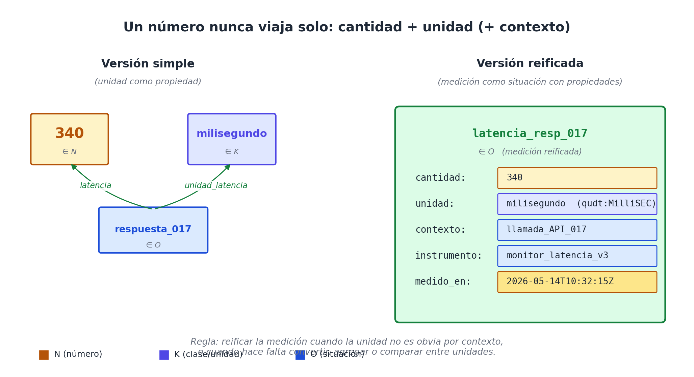

# Capítulo 6 — Cuánto: el eje cuantitativo y sus trampas

## Una sonda que se estrelló y un equipo de IA que se desconcertó

En septiembre de 1999, la sonda *Mars Climate Orbiter* de la NASA se acercó a Marte después de un viaje de nueve meses, ejecutó la maniobra final de inserción orbital y se desintegró en la atmósfera marciana. La pérdida costó 327 millones de dólares. La causa fue, mirándola desde lejos, una de las cosas más estúpidas que pueden pasarle a un proyecto de ingeniería: el software de Lockheed Martin enviaba el empuje de los propulsores en **libras-fuerza por segundo**, y el software de navegación de NASA lo recibía como si fueran **newtons por segundo**. La discrepancia — un factor de 4.45 — se acumuló silenciosamente durante el viaje y, cuando la nave llegó a Marte, ya estaba demasiado baja en su trayectoria. Nadie había hecho mal el número. Cada equipo había escrito perfectamente bien su número. El problema era que el número no llevaba la unidad pegada.

En agosto de 2024, un equipo de producto en una startup que construía un asistente de IA para análisis de documentos legales tuvo una versión miniaturizada de la misma historia. Habían escogido el modelo más nuevo de un proveedor, contento con su "ventana de contexto de 128.000". El primer usuario subió un contrato de 200 páginas y el sistema empezó a comportarse raro: respuestas truncadas, citas inventadas, alucinaciones obvias. El equipo de ingeniería miró el log y entendió: 128.000 eran **tokens**, no **caracteres**. 200 páginas en español denso son unos 200.000 tokens. El modelo estaba descartando silenciosamente las páginas que excedían el límite, y nadie en el equipo de producto sabía cuántos tokens había en un párrafo.

Ninguna de las dos historias es sobre números. Las dos son sobre lo mismo: **un número sin su unidad no es información, es ruido decorado de dígitos**.

Este capítulo se ocupa del eje que aloja los números — el eje **N** — y de la trampa que se les pone enfrente: pretender que un número se baste solo. No se basta. Y modelar bien esa dependencia es lo que hace la diferencia entre un sistema que escala y uno que falla justo cuando importa.

## Por qué N es un eje propio

La pregunta es legítima: ¿hace falta separar los números en un eje propio? ¿No serían cosas, como las botellas y los goles, que viven en O?

La respuesta es no, por una razón que se ve clarísima apenas se intenta lo opuesto. Una botella es un individuo: tiene identidad propia, persiste, puede aparecer en muchos hechos. Un gol es un evento: tiene un momento, un agente, un lugar. Pero el número 87 no es una cosa: es un valor. No "existe" un 87 que esté en algún lado y al que dos hechos podrían referirse simultáneamente; lo que hay son muchos hechos que mencionan el valor 87 — el minuto del gol de Messi, el porcentaje de precisión del clasificador, el número de tokens descartados por el modelo. Cada uso del 87 es independiente. La identidad del número está en su valor, no en su existencia.

Esa diferencia tiene consecuencias arquitectónicas concretas. Q, O, L y K son ejes donde los individuos necesitan **identidad propia**: una botella, una persona, una ciudad o un concepto tiene un sustrato que persiste y al que múltiples hechos pueden referirse. Cualquier implementación seria asignará a cada uno un identificador interno estable (un UUID, una clave surrogada, una URI). N **no** necesita eso: el valor *es* la identidad. Cuando un hecho dice "el modelo respondió en 340 milisegundos", el 340 no necesita un identificador interno; el dato es el número crudo. Lo mismo pasa con T (las fechas se comparan por igualdad de valor, no por identidad surrogada). **N y T son los dos ejes de valor; los demás son ejes de entidad.**

## Las unidades no son neutrales

Volvamos al desastre marciano y al malentendido de los tokens. Lo que las dos historias muestran es que **todo número que viene del mundo lleva una unidad implícita**, y que confundir las unidades es una de las formas más caras de error.

La conclusión arquitectónica es contundente: **un valor de N nunca debería viajar solo**. Siempre debe ir acompañado de una unidad. Modelar esto bien implica que la unidad viva en el eje **K** (las unidades son tipos, no entidades concretas — *kilogramo*, *segundo*, *token*, *dólar* son categorías, no objetos físicos) y que cada hecho que use un número lo conecte con su unidad por una relación canónica.

En notación del modelo:

```
(gol_messi_87, minuto,        87)        ∈ M(O, N)
(gol_messi_87, unidad_minuto, minuto)    ∈ M(O, K)

(respuesta_017, latencia,         340)         ∈ M(O, N)
(respuesta_017, unidad_latencia,  milisegundo) ∈ M(O, K)
```

A primera vista parece redundante: ¿no es obvio que un minuto se mide en minutos? Sí, hasta que un día alguien quiere agregar segundos y entonces hace falta saber, sin ambigüedad, en qué unidad estaba cada dato.

La opción más limpia, cuando la conversión es frecuente, es **reificar la medición**: subirla al estatus de situación en O y darle propiedades propias.

```
(latencia_resp_017) ∈ O
  cantidad   : 340           → N
  unidad     : milisegundo   → K
  contexto   : llamada_API_017 → O
```

Esto es lo que cambia un sistema que devuelve "340" por uno que devuelve "340 ms, medidos sobre la llamada API 017, en el modelo gpt-X tal día tal hora". El primero es un número; el segundo es información.



La regla de oro, que ya vimos en el contexto general de la reificación: **reificar la medición solo cuando la unidad no es obvia por contexto, o cuando se va a convertir, agregar o comparar entre unidades distintas**. Si todos los minutos del partido están en minutos, no hace falta reificar cada uno; si las latencias vienen mezcladas en ms, μs y s, sí.

## El catálogo de unidades: QUDT y los dialectos de dominio

Una pregunta natural: ¿cada sistema inventa sus unidades? La respuesta es: no, y ahí está una de las pocas victorias claras de la estandarización digital. Existe **QUDT** (*Quantities, Units, Dimensions and Types*) [18], una ontología pública que cataloga miles de unidades reconocidas, con sus dimensiones físicas, sus conversiones canónicas, y sus URIs estables. *Milisegundo* es `qudt:MilliSEC`; *byte* es `qudt:Byte`; *dólar estadounidense* es `qudt:USD`.

Cuando un modelado en WQuestions adopta una unidad, lo hace con un **alias de dominio** sobre un URI canónico de QUDT. La sintaxis interna del sistema usa la URI; el usuario del dominio ve "ms" o "milisegundo".

Pero hay dominios donde QUDT se queda corto, sobre todo donde las unidades son emergentes y específicas. La IA es uno de ellos. ¿Qué unidad mide la calidad de una respuesta de un modelo de lenguaje? ¿Qué unidad mide la similitud entre dos embeddings? ¿Qué unidad tiene el "score" devuelto por un clasificador? Algunas son adimensionales por construcción; otras dependen del benchmark. La convención del modelo es:

1. Si existe en QUDT, usar QUDT.
2. Si no, definir una unidad de dominio explícita en K, con su descripción, y opcionalmente su relación de conversión a una unidad QUDT cuando exista.

Ejemplos para IA:

```
K:token              — unidad de longitud de texto, dependiente del modelo
K:parametro_modelo   — unidad para tamaños de modelos (7B, 13B, 70B)
K:flops              — operaciones de punto flotante (sí está en QUDT)
K:precision_clasificador — proporción entre 0 y 1
K:perplexity         — medida de calidad de un modelo de lenguaje
K:USD_per_million_tokens — unidad compuesta, frecuente en billing de APIs
```

La última es interesante: una "unidad compuesta" que mezcla moneda y cantidad de tokens. QUDT permite construir unidades derivadas, y WQuestions las acepta como elementos de K con su propia descomposición.

## Conversión, agregación, escala

Una vez que cada medición lleva su unidad explícita, las operaciones que antes eran traicioneras se vuelven seguras.

**Conversión:** si quieres sumar latencias provenientes de cuatro APIs (una reporta en ms, dos en μs, una en s), el sistema convierte todo a una unidad común antes de operar. La regla de conversión vive en K, no en cada consulta.

**Agregación:** la media de "340 ms, 1200 μs, 0.7 s" no es la media aritmética cruda; es la media de los tres valores convertidos a una misma unidad. Si el sistema no sabe las unidades, da un número sin sentido y lo presenta como si lo tuviera. (Esto, dicho sea de paso, es exactamente lo que hacen muchísimos dashboards en producción hoy.)

**Escala temporal de moneda:** los dólares de 2020 no son los dólares de 2026. Para una receta de panadería el costo de un kilo de harina cambia con la inflación; para un contrato indexado al IPC el monto efectivo varía mes a mes. Modelar correctamente significa que "100 dólares" lleva no solo su unidad (USD) sino su **fecha de denominación**. Una propiedad cambiante en el tiempo, lo cual es exactamente lo que el modelo gestiona vía la decisión D9 — reificación con vigencia, que retomaremos al hablar de situaciones reificadas en la Parte III.

## Incertidumbre, precisión y rangos

Los números del mundo real no suelen ser puntuales. La calidad de un modelo de lenguaje en un benchmark se reporta como *78.3% ± 2.1%*; la latencia de un endpoint se mide como una distribución con percentiles (p50, p95, p99); la posición de un objeto detectado por un modelo de visión es un punto con una incertidumbre.

El eje N puede alojar tres formas distintas de "cuánto":

1. **Valor puntual** — un solo número (`340 ms`).
2. **Rango** — un intervalo cerrado (`[300 ms, 400 ms]` para el p50–p95).
3. **Distribución** — un objeto en O que tiene como propiedades su tipo (normal, exponencial), sus parámetros (media, varianza), y opcionalmente su muestreo empírico.

Cuando el dato es puntual, no hay nada que decir. Cuando es un rango, el modelo lo trata como un par de números con la misma unidad. Cuando es una distribución, **se reifica**: la distribución es una entidad en O con sus propiedades propias, y el "valor" reportado por el sistema (la media, la mediana, el modo) es una proyección de esa distribución.

Esto último importa especialmente con IA. La respuesta de un modelo de lenguaje no es determinista: para una misma entrada, el modelo puede devolver respuestas distintas. La "calidad" del modelo no es un número, es una distribución de calidad sobre una población de entradas. Cuando un benchmark dice "GPT-X obtiene 78.3% en MMLU", está reportando la **media** de una distribución de aciertos sobre 14.000 preguntas. Modelar bien implica que el sistema sepa que detrás del 78.3% hay un objeto en O con propiedades de variabilidad, no un escalar inerte.

## Cuatro dominios, cuatro veces N

Volvamos a los cuatro casos que vienen acompañándonos, y agreguemos un quinto explícitamente: la IA.

- **Receta**: 200 gramos de harina, 30 minutos a 180 °C, rinde 4 porciones. Tres números, tres unidades distintas (`gramo`, `minuto`, `°C`), una cardinalidad sin unidad (4 porciones — aunque "porción" es ya una unidad propia, definida por la receta).
- **Gol de fútbol**: minuto 87, remate desde 22 metros, velocidad estimada del balón 105 km/h. Cuatro mediciones, tres unidades. El "87" del minuto es ambiguo si no se aclara que es "minuto desde el inicio del partido" (no del segundo tiempo).
- **Canción**: BPM 128, duración 3 minutos 24 segundos, en sol mayor (esta última no es N, sino un valor en K — el tono no se mide en escala numérica de la misma manera). Posición en el ranking: número 1 (cardinalidad, no magnitud).
- **Noticia política**: el decreto entra en vigor en 30 días, asigna un presupuesto de 50 millones de dólares (de 2026), afecta a 3 ministerios. Tres números, tres unidades, una de ellas con escala temporal.
- **IA — llamada a un LLM**: tamaño de entrada 4.500 tokens, tamaño de salida 1.200 tokens, latencia 2.3 segundos, costo 0.018 dólares, temperatura 0.7, precisión esperada según benchmark 78.3% ± 2.1%. Seis números, seis unidades, dos con incertidumbre.

La consulta interesante es la que cruza los cinco. ¿Cuánto cuesta, en términos de tokens y dólares, generar una receta nueva cada día durante un año para un asistente culinario? ¿Cuánto demora un modelo en analizar un decreto político de 30 páginas? ¿Cuánto cambia el costo si el modelo se actualiza y el precio por millón de tokens baja un 40%? Todas son preguntas razonables, todas mezclan unidades distintas, todas requieren que el sistema sepa qué unidad tiene cada número y cómo se convierten entre sí.

Sin ese cuidado, las respuestas son adivinaciones con apariencia de cálculo.

## Resumen del eje N

Antes de seguir con el siguiente eje, vale la pena consolidar lo que se ha establecido sobre N:

1. N es un eje de **valor**, no de entidad. Los números son su propia identidad; no llevan UUID interno.
2. Todo número viene con una **unidad implícita**. Modelar bien implica que la unidad viva en K y aparezca explícita en algún hecho asociado.
3. Cuando la unidad no se infiere por contexto, o cuando hace falta convertir, agregar o comparar entre unidades, se **reifica la medición**: pasa a ser una situación en O con cantidad, unidad y contexto como propiedades.
4. **QUDT** provee el vocabulario canónico de unidades; los dominios emergentes (notablemente, IA) requieren extensiones específicas (token, parámetro de modelo, score, perplexity).
5. La **incertidumbre** se modela como rango, o se reifica la distribución como entidad en O.
6. La **escala temporal** de algunas unidades (moneda, especialmente) requiere fecha de denominación, lo cual conecta N con T y con la maquinaria de vigencia (D9).

## Lo que viene

Con N en su lugar, el universo de individuos del modelo está completo. Tenemos los cuatro pilares concretos (Q, O, L, T), el zócalo categórico (K) y el eje de magnitudes (N). Es decir, **todo lo que el modelo necesita para alojar valores**.

Lo que falta no son más ejes para valores, sino **predicados** que conecten esos valores entre sí: las etiquetas que dicen *cómo* un sujeto se relaciona con un objeto. Esos predicados viven en dos ejes adicionales — P (propiedades) y M (relaciones) — que son los conectores entre todo lo demás.

El próximo capítulo cierra la Parte II presentándolos juntos, porque están más conectados de lo que la intuición primera sugiere: la diferencia entre una "propiedad" y una "relación" es matemáticamente más sutil de lo que parece. Y aquí aparece una de las decisiones de diseño más finas del modelo — la decisión D3 — sobre por qué propiedades y relaciones se unifican algebraicamente en lugar de tratarse como cosas distintas.
