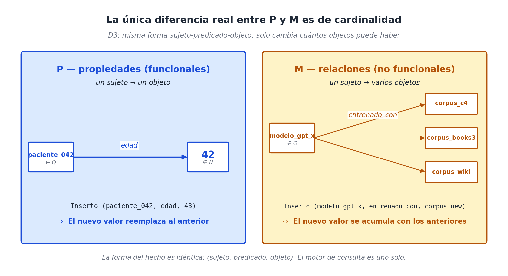
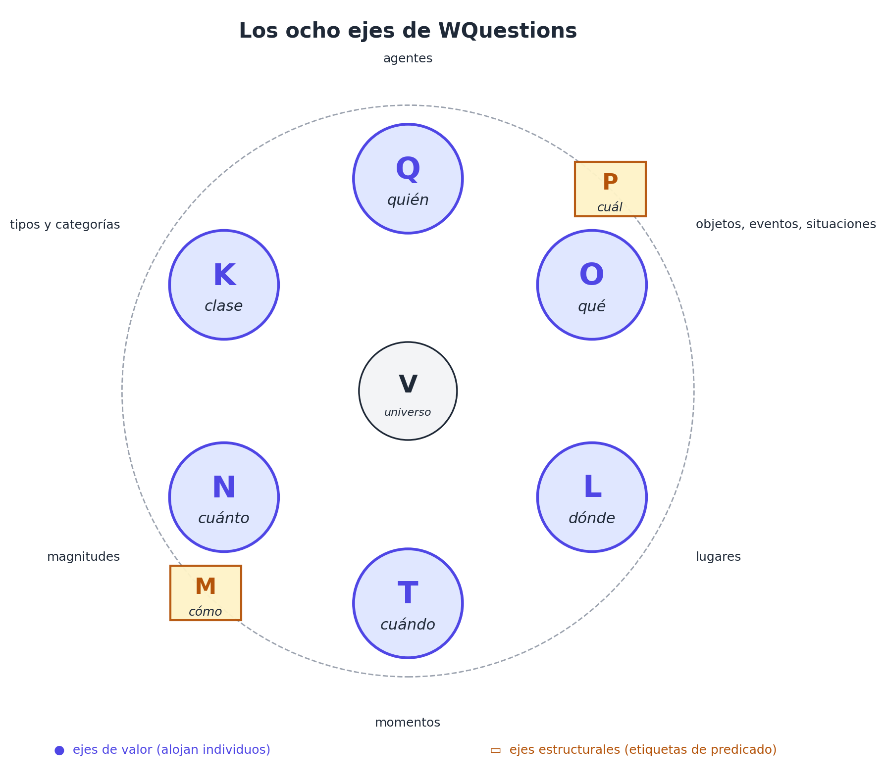

# Capítulo 7 — Cuál y cómo: los predicados (P y M)

## El universo está completo, pero las cosas siguen sueltas

Si miramos el inventario que hemos construido en los capítulos previos, el modelo tiene todo lo que necesita para alojar valores. Q recibe a los agentes; O a los objetos, eventos y situaciones; L a los lugares; T a los momentos; N a las magnitudes; K a las categorías. Seis ejes, seis tipos distintos de individuos. Cualquier cosa que ocurra en el mundo, en cualquier dominio, puede ubicarse en alguno de esos seis ejes.

Y sin embargo, si nos quedáramos solamente con eso, el sistema no podría todavía decir gran cosa. *"Marta"* viviría en Q. *"Buenos Aires"* en L. *"1984"* en T. *"45"* en N. *"persona"* en K. Pero ¿cómo se conectan? ¿Cómo expresamos que *Marta vive en Buenos Aires*, que *nació en 1984*, que *tiene 45 años*, que *es una persona*? Los seis ejes alojan a los individuos pero no a los **enlaces** que dicen qué tiene que ver cada uno con cada uno.

Esos enlaces son lo que faltan. Y son lo que este capítulo se ocupa de presentar.

Los enlaces — los *predicados* del modelo — viven en dos ejes distintos pero estructuralmente idénticos:

- **P** (de *Proprietas*) aloja los predicados llamados **propiedades**.
- **M** (de *Modus*) aloja los predicados llamados **relaciones**.

Este capítulo es el último de la Parte II. Cierra el inventario de los ocho ejes. Y plantea una pregunta que, vista de cerca, resulta más interesante de lo que parece: *¿qué diferencia hay realmente entre una propiedad y una relación?* La respuesta — la decisión de diseño **D3** — es lo que vamos a desarrollar.

## Una pregunta que parece tonta

Empecemos con la pregunta más simple. Tenemos cinco hechos:

```
(paciente_042, edad,             42)
(paciente_042, fecha_nacimiento, 1984-03-17)
(paciente_042, vive_en,          buenos_aires)
(modelo_gpt_x, parametros,       175_000_000_000)
(modelo_gpt_x, entrenado_con,    corpus_c4)
```

Si pidiéramos a alguien sin entrenamiento técnico que distinguiera "propiedades" de "relaciones", probablemente diría: *edad*, *fecha de nacimiento* y *parámetros* son **propiedades** (atributos atómicos del sujeto); *vive en* y *entrenado con* son **relaciones** (enlaces con otra entidad). La intuición es: propiedad = atributo simple; relación = vínculo.

La intuición funciona en estos ejemplos, pero apenas se la empuja un poco se desordena.

- *El paciente vive en Buenos Aires* parece relación. Pero también puede leerse como *"el paciente tiene ciudad de residencia = Buenos Aires"*, que se parece a propiedad.
- *El modelo tiene 175 mil millones de parámetros* parece propiedad. Pero también puede leerse como *"el modelo se relaciona con el número 175.000.000.000 por la propiedad parámetros"*, que se parece a relación.
- *El paciente nació en 1984* parece propiedad. Pero el "1984" es una fecha que vive en T — es un individuo, no un valor inherente al paciente. ¿Es entonces relación con un individuo de T?

Si miramos las cinco con cuidado, descubrimos algo importante: la diferencia entre propiedad y relación **no es una diferencia objetiva en el mundo**. Es una diferencia en cómo nosotros las nombramos en lenguaje natural. Cuando decimos "tiene 42 años" usamos una construcción gramatical posesiva; cuando decimos "vive en Buenos Aires" usamos una construcción locativa. Pero estructuralmente, al nivel del dato que el sistema almacena, los dos hechos son lo mismo: un sujeto, una predicación, un valor.

Esa observación es el punto de partida de D3. Pero antes de formularla, conviene entender la forma común que comparten los cinco hechos.

## La forma común: signatura tipada

Todo hecho del modelo, sea propiedad o relación, tiene la misma forma:

```
hecho = (sujeto, predicado, objeto)
```

Y cada predicado lleva consigo una **signatura** que dice de qué eje viene su sujeto y a qué eje va su objeto. En notación de funciones:

```
edad             : Q → N
fecha_nacimiento : Q → T
vive_en          : Q → L
parametros       : O → N      (un modelo es objeto reificado en O)
entrenado_con    : O → O
```

La signatura es lo que convierte una tripleta opaca en un hecho **tipado y validable**. Si alguien intenta `(paciente_042, edad, "rojo")`, el sistema lo rechaza: la signatura dice que `edad : Q → N`, y `"rojo"` no está en N. Esa validación temprana es una de las ventajas operativas más concretas del modelo, y es lo que distingue a WQuestions de un grafo RDF puro donde cualquier sujeto puede ser conectado por cualquier predicado a cualquier objeto.

Esta forma común es la que se va a unificar en P y en M. Lo que las distingue no es la forma — es la **cardinalidad**.

## La distinción real: funcional o no

Mirá las cinco signaturas otra vez. Cuatro de ellas son **funciones** en el sentido matemático: para un sujeto dado, el predicado determina un único objeto. Un paciente tiene una sola edad, una sola fecha de nacimiento, vive en una sola ciudad principal; un modelo tiene un único conteo de parámetros. La quinta — `entrenado_con` — **no** es función: un modelo puede haber sido entrenado con varios corpus distintos, todos legítimos. Para el mismo sujeto pueden coexistir muchos objetos.

Esta es la única diferencia matemática genuina entre lo que la intuición llama "propiedad" y "relación":

- Las etiquetas **funcionales** (un solo objeto por sujeto) son **propiedades** y viven en **P**.
- Las etiquetas **no funcionales** (potencialmente varios objetos por sujeto) son **relaciones** y viven en **M**.

P y M son ejes distintos por una sola razón: la **lógica de actualización** que el sistema aplica al insertar un hecho nuevo difiere según el caso. Una propiedad nueva **reemplaza** a la anterior — un paciente que cumple años pasa de tener edad 42 a tener edad 43; no se acumulan los dos valores. Una relación nueva **se agrega** a las existentes — un modelo entrenado con un corpus adicional simplemente añade el hecho a los que ya había, sin reemplazar nada.

Esa diferencia operativa justifica que P y M se mantengan como ejes separados en el catálogo. Pero **el motor de consulta los trata igual**. La consulta `(paciente_042, edad, ?)` y la consulta `(modelo_gpt_x, entrenado_con, ?)` se ejecutan con exactamente la misma operación; la primera devuelve un solo objeto, la segunda potencialmente varios.



## D3: la unificación algebraica

Esto nos lleva a la decisión de diseño que articula el capítulo:

> **D3 — Propiedades (P) y relaciones (M) se unifican matemáticamente como etiquetas predicativas con signatura tipada. La diferencia entre ellas es de cardinalidad — funcional vs. no funcional — y se preserva como dos ejes distintos solo por la lógica de actualización: P reemplaza, M acumula.**

Vista en su forma más fuerte, D3 dice algo más que una observación gramatical. Dice que la división tradicional entre *atributo* y *vínculo* que aparece en SQL (donde los atributos son columnas y los vínculos son JOINs entre tablas), en programación orientada a objetos (donde los atributos son campos y los vínculos son referencias a otros objetos), y hasta en RDF (donde los predicados de "data property" y de "object property" se separan), es **un artefacto pedagógico**, no una propiedad esencial del modelado.

Visto desde el punto de vista del dato, todo es una tripleta con signatura. Y eso es lo que el modelo aprovecha.

## Qué se gana con la unificación

D3 paga al menos cuatro veces.

**Un solo motor de consulta.** El sistema no tiene "consultas de propiedad" y "consultas de relación" como dos lenguajes distintos. Tiene una sola operación: *dado un sujeto y un predicado, devolver objetos*. Si el predicado es funcional, devuelve a lo sumo uno. Si no, devuelve los que haya. La consulta SQL tradicional, con sus *SELECT campos* (propiedades) y sus *JOIN tablas* (relaciones), se reemplaza por una sola forma uniforme.

**Un solo formato JSON.** Cuando un agente de IA pide los datos de un sujeto vía function calling, el sistema devuelve siempre la misma estructura: una lista de pares `predicado: objeto(s)`. No hay que enseñarle al agente que "edad" se accede de un modo y "entrenado_con" de otro. Es el tipo de uniformidad que hace barata la integración con LLMs.

**Un solo lugar para extender.** Agregar una etiqueta nueva al modelo no requiere decidir si va a ser "campo de tabla" o "tabla puente". Se declara su signatura y su cardinalidad en el catálogo de predicados, y el motor sabe qué hacer.

**Una sola conversación con el lenguaje natural.** En el capítulo del lexicon veremos que cada verbo del idioma se mapea a un conjunto de roles, y cada rol se traduce a una etiqueta de P o de M sin que el usuario tenga que distinguirlas. *"María vendió un libro a Juan por treinta dólares"* produce hechos sobre cinco roles — agente, tema, beneficiario, monto, moneda —, y al modelo le da igual si tres viven en P y dos en M, porque el formato es uniforme.

## Tres dominios cruzados

Veamos cómo se distribuyen las etiquetas P y M en tres dominios distintos para sentir la diversidad sin perder la uniformidad.

### Una receta de cocina

```
P (funcionales):
  tiempo_preparacion : O → N    (15 minutos)
  tiempo_coccion     : O → N    (45 minutos)
  porciones          : O → N    (4)
  dificultad         : O → K    (intermedia)

M (no funcionales):
  ingrediente        : O → K    (varios ingredientes por receta)
  paso               : O → O    (varios pasos)
  utensilio          : O → K    (varios utensilios)
  inspirada_en       : O → O    (puede haber varias recetas fuente)
```

La intuición se valida: lo que el sentido común llamaría "atributos de la receta" cae en P; lo que llamaría "componentes" o "vínculos" cae en M.

### Una llamada a un modelo de lenguaje

```
P:
  tokens_entrada     : O → N    (4500)
  tokens_salida      : O → N    (1200)
  latencia_ms        : O → N    (2300)
  costo_usd          : O → N    (0.018)
  modelo_usado       : O → K    (gpt-x-2026-05)
  temperatura        : O → N    (0.7)
  modo               : O → K    (streaming)

M:
  herramienta_invocada : O → O  (varias function calls por llamada)
  fuente_documento     : O → O  (varios docs en RAG)
  parte_de             : O → O  (la llamada es parte de una sesión, que es parte de un proyecto)
```

Misma distribución de fondo: lo que es atributo único de la llamada cae en P; lo que tiene cardinalidad arbitraria cae en M.

### Un partido de fútbol

```
P:
  resultado_final    : O → K    (victoria_local, victoria_visitante, empate)
  duracion_minutos   : O → N    (95)
  asistencia         : O → N    (52.000)
  arbitro_principal  : O → Q    (juan_perez)

M:
  partes             : O → V    (los dos equipos; cardinalidad fija pero múltiple)
  gol                : O → O    (varios goles por partido)
  tarjeta_amarilla   : O → O    (varias tarjetas)
  jugador_alineacion : O → Q    (22 jugadores)
```

La distinción no siempre es intuitiva. `partes` (los dos equipos) podría sentirse como propiedad porque la cardinalidad es siempre dos, pero es no-funcional (dos objetos para el mismo sujeto), así que vive en M. La cardinalidad fija no la convierte en funcional; lo que cuenta es si la respuesta es **única**.

## Una sutileza importante: el subobjeto contingente

Hay una distinción más fina, escondida en los casos anteriores, que conviene nombrar. Cuando una etiqueta de M apunta a algo *cuya existencia es accesoria al sujeto* — un gol existe porque hay un partido, un paso existe porque hay una receta —, lo natural es que ese objeto sea una **situación reificada** (en O) que vive *dentro* del sujeto en lugar de ser un individuo independiente. El gol no es un objeto del mundo que el partido recoja; es un objeto que el partido **crea**.

Esto se modela mediante la relación canónica `parte_de`:

```
(gol_001,  agente,   messi)              ∈ M(O, Q)
(gol_001,  minuto,   87)                 ∈ P(O, N)
(gol_001,  parte_de, partido_arg_per)    ∈ M(O, O)
```

El gol es un individuo de O — tiene UUID propio, propiedades propias, puede ser referido — pero su existencia es **contingente** al partido. Si el partido se cancela, el gol no tiene sentido.

La distinción entre "objetos del mundo" y "subobjetos contingentes" no es un eje nuevo del modelo, sino una convención de modelado que se vuelve central cuando lleguemos a las situaciones reificadas en la Parte III. Lo dejamos sembrado acá para que el lector lo reconozca cuando reaparezca.

## Por qué los modelos de lenguaje encuentran D3 natural

Hay un argumento práctico, no solo teórico, para la unificación que propone D3. Los modelos de lenguaje grandes, entrenados sobre texto humano, no distinguen "propiedades" de "relaciones" de manera operativa. Lo que un LLM produce cuando se le pide describir un hecho es siempre una construcción `sujeto-predicado-objeto` (o `sujeto-predicado-objeto-modificadores`). Si el modelo subyacente al sistema espera dos tipos distintos de hechos — *"los que son propiedades"* y *"los que son relaciones"* —, el LLM tiene que aprender la distinción específica del sistema, y eso introduce errores en cada nuevo dominio.

Si el modelo acepta hechos uniformes y deja que la cardinalidad emerja del catálogo de etiquetas, el LLM no tiene que aprender nada nuevo. Una herramienta `agregar_hecho(sujeto, predicado, objeto)` cubre tanto *edad* como *autoría*. Dos herramientas separadas — `set_propiedad` y `agregar_relacion` — son redundantes y obligan al modelo a clasificar antes de actuar, lo cual multiplica el espacio de error sin pagar nada a cambio.

Esto se vuelve operativo en function calling: un agente conectado a una base WQuestions ve una única interfaz de escritura, una única interfaz de lectura, y un catálogo de predicados con sus signaturas. Todo lo demás emerge de combinar esos elementos.

## Cinco consecuencias prácticas de D3

Cerramos el capítulo con las consecuencias operativas que se derivan de la unificación:

1. Todo hecho tiene la forma `(sujeto, predicado, objeto)`, sea propiedad o relación.
2. Cada etiqueta tiene una **signatura tipada** que el sistema valida automáticamente.
3. El motor de consulta es uno solo. El formato JSON de salida es uno solo. Las herramientas para LLMs son una sola.
4. Cuando hay duda sobre si algo es propiedad o relación, la pregunta correcta es: *¿hay un solo valor para este sujeto, o puede haber varios?* La respuesta decide el eje. La pregunta es operativa, no filosófica.
5. El subcaso especial del *subobjeto contingente* (un gol como parte de un partido) se modela como individuo de O con relación `parte_de`, no como nuevo tipo de hecho.

## Cierre de la Parte II

Con P y M presentados, hemos cerrado el inventario completo de los **ocho ejes** del modelo:

```
Q  (quién)   — agentes
O  (qué)     — objetos, eventos, situaciones
L  (dónde)   — lugares
T  (cuándo)  — momentos
N  (cuánto)  — magnitudes
K  (clase)   — tipos y categorías
P  (cuál)    — propiedades funcionales
M  (cómo)    — relaciones no funcionales
```

Seis ejes para valores (Q, O, L, T, N, K) y dos ejes para predicados (P, M). El universo cabe entre estos ocho. La promesa del libro hasta acá ha sido inventariar las preguntas; eso quedó hecho.



Pero el inventario es solo el comienzo. Los ejes presentados por separado no muestran todavía cómo se combinan para describir el mundo. Esa es la materia de la Parte III: cómo funcionan **juntas** las ocho preguntas.

## Lo que viene

La Parte III construye, ahora sí, el modelo en operación. Cuatro capítulos.

- **Capítulo 8** introduce el **hecho atómico** como unidad mínima — la tripleta tipada que combina los ejes en información concreta.
- **Capítulo 9** muestra que los hechos atómicos, vistos en conjunto, forman un **espacio multidimensional** sobre el que se pueden hacer consultas, comparaciones, federación de dominios.
- **Capítulo 10** se ocupa de las **situaciones reificadas** — los puntos articuladores del grafo donde múltiples hechos convergen.
- **Capítulo 11** cierra la Parte III con el tratamiento de las relaciones de **"por qué"** — el conector argumentativo que une eventos, causas y propósitos.

Con la Parte III en pie, el modelo deja de ser un catálogo de ejes y se vuelve una arquitectura. Es lo que viene.
