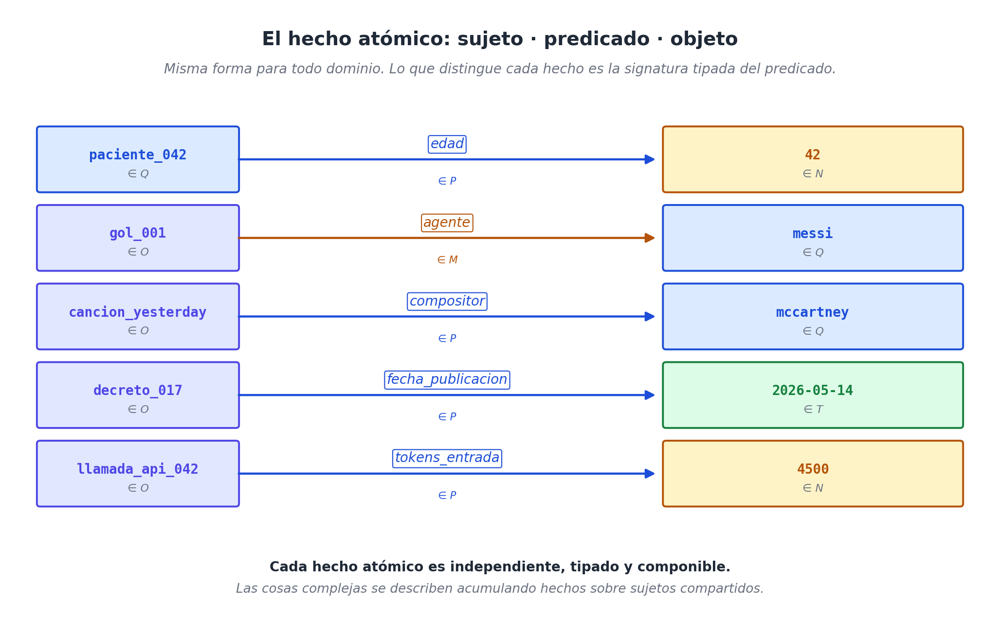
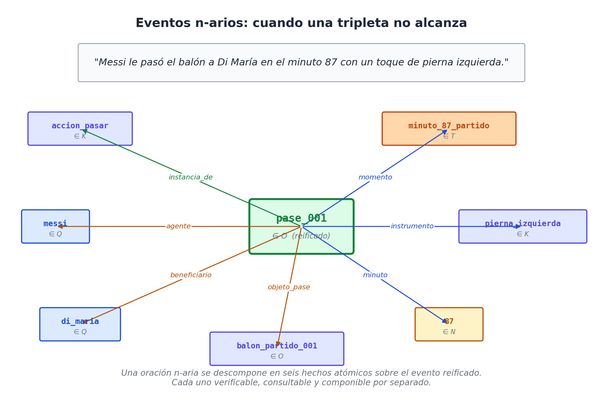

# Capítulo 7 — El hecho atómico

## La unidad mínima que hace funcionar todo

A lo largo de los capítulos anteriores nos hemos dedicado a presentar nuestros siete ejes (Q, O, L, T, N, K, M) como si fueran piezas sueltas de un enorme rompecabezas (que la cantidad de piezas no nos abrume, recordemos que toda la información está codificada por millones de ceros y unos, solo necesitamos reglas claras y válidas). Es hora de dejar de mirar las piezas por separado y empezar a armarlo. Para que este rompecabezas de datos tenga sentido y empiece a describir el mundo real, necesitamos una pieza central: **lo que construimos al conectar esos ejes**.

A esta pieza maestra la llamaremos **hecho atómico**. Su estructura informática es tan simple que parece engañosa:

> **hecho = (sujeto, predicado, objeto)**

Solo tres campos. El `sujeto` y el `objeto` son individuos que sacamos de alguna de nuestras cajas de valor (como Personas, Lugares o Números). El `predicado` es el cable conector del eje M (*cómo*); puede ser funcional (un solo valor por sujeto) o múltiple. Y eso es todo. **Absolutamente toda la información que el sistema sabe del mundo se construye, bloque a bloque, utilizando esta misma forma exacta.**

Sé que afirmar esto suena a exageración técnica. ¿De verdad todo cabe aquí? ¿Las recetas, los goles, las canciones de Los Beatles, las leyes de un gobierno, las historias clínicas y las llamadas a ChatGPT? Sí, todo. Este capítulo se va a encargar de demostrarlo. Vamos a ver por qué aferrarnos a esta estructura atómica lo cambia todo, cómo logramos describir cosas súper complejas acumulando piezas simples, y por qué —casi por arte de magia— esta estructura resulta ser exactamente la forma natural en la que los humanos y la Inteligencia Artificial hablan.
Para ser honesto, al empezar este libro solo tenía la intuición de que las 7 preguntas podían modelar la información en un multiverso al que se accedía con un par de coordenadas, eje_a vs eje_b, pero la tripleta es el resultado de someter al modelo a las pruebas de laboratorio, más adelante veremos cómo.

## La forma inalterable

Como dijimos, un hecho atómico es siempre una frase de tres partes (una tripleta). Para visualizarlo, tomemos un ejemplo rápido de cada uno de los escenarios que venimos estudiando:

```text
(receta_risotto,    tiempo_coccion,    45)              ∈ M(O, N)
(gol_001,           agente,            messi)           ∈ M(O, Q)
(cancion_yesterday, compositor,        mccartney)       ∈ M(O, Q)
(decreto_017,       fecha_publicacion, 2026-05-14)      ∈ M(O, T)
(llamada_api_042,   tokens_entrada,    4500)            ∈ M(O, N)
```

Tenemos cinco hechos atómicos. Pertenecen a cinco industrias totalmente distintas y utilizan cinco cables diferentes. Pero, y esto es vital, todos mantienen **exactamente la misma forma estructural**. Ese es el mensaje más potente de este capítulo: esta uniformidad no es un capricho para que el código se vea bonito, es la propiedad arquitectónica que hace que el sistema no se rompa nunca.



Veamos por qué esto es tan poderoso.

## La regla de diseño D3: El átomo de la información

Ha llegado el momento de escribir esto en piedra. Se trata de nuestra **tercera decisión de diseño** (después de la D1 y D2 que ya estudiamos), y probablemente es la regla más pesada de todo el libro, porque todo lo demás se apoya sobre ella:

> **D3 — Cualquier hecho de la realidad se va a representar siempre como una "tripleta atómica" de la forma `(sujeto, cable, objeto)`. Este cable debe estar tipado (saber qué cajas conecta) para que el sistema valide si el dato es lógico o absurdo. Las descripciones de cosas complejas jamás se construyen creando estructuras raras o tablas gigantes; se construyen apilando decenas de estas tripletas simples sobre un mismo sujeto.**

Todo lo que leas a partir de aquí es la consecuencia directa de habernos atrevido a tomar esta decisión.

## Tres pruebas de fuego que el átomo debe superar

Para que esta "unidad mínima" realmente funcione como el cimiento de cualquier base de datos mundial, tiene que cumplir tres reglas muy estrictas:

**Exigencia 1: Tiene que estar "Tipada" (Protección contra el caos).** 
Cada cable lleva pegada su propia regla de seguridad (su signatura). El cable `tiempo_coccion` *sabe de fábrica* que debe conectar un Objeto (eje O) con un Número (eje N). Si un programador cansado intenta ingresar el dato `(receta_risotto, tiempo_coccion, "muy rojo")`, el sistema lo rechaza al instante: la palabra "rojo" no vive en la caja de Números. Esta protección es lo que convierte a nuestra tripleta en un bloque de información seguro y validable en tiempo real.

**Exigencia 2: Tiene que ser Independiente.** 
Cada hecho atómico tiene que tener sentido por sí solo, sin depender de nada más. La frase `(gol_001, agente, messi)` significa exactamente lo mismo aunque se te olvide anotar el minuto en que ocurrió el gol. Esta independencia estructural nos da un superpoder: nos permite guardar estos datos en archivos de texto, en bases de datos relacionales, o enviarlos por internet sin que pierdan su significado original.

**Exigencia 3: Tiene que ser Componible (Apilable).** 
Aunque los hechos son independientes, su verdadera magia se desata cuando los "apilas" uno sobre otro usando el mismo sujeto para describir realidades complejas. Por ejemplo, una receta de cocina no se describe en una sola frase gigantesca. Se describe con una lluvia de hechos atómicos que comparten a `receta_risotto` como sujeto:

```text
(receta_risotto, instancia_de,      receta)              ∈ M(O, K)
(receta_risotto, tiempo_coccion,    45)                  ∈ M(O, N)
(receta_risotto, unidad_tiempo,     minuto)              ∈ M(O, K)
(receta_risotto, porciones,         4)                   ∈ M(O, N)
(receta_risotto, ingrediente,       arroz_arborio)       ∈ M(O, K)
(receta_risotto, ingrediente,       caldo_vegetal)       ∈ M(O, K)
(receta_risotto, ingrediente,       azafran)             ∈ M(O, K)
(receta_risotto, dificultad,        intermedia)          ∈ M(O, K)
```

Ocho pequeñas piezas de Lego se han apilado para dibujar el plato completo. Cada pieza se entiende por separado, pero juntas forman la receta. 

Lo increíble viene cuando el restaurante quiere ser más preciso y añadir el peso exacto de cada ingrediente. En una base de datos tradicional, esto obligaría a destruir la tabla de ingredientes y crear una nueva con más columnas (rompiendo todo el sistema). En nuestra arquitectura, **la estructura jamás cambia**. Simplemente agregamos un par de tripletas más, convirtiendo el uso del ingrediente en un evento físico (algo que ya aprendimos a llamar *reificación*):

```text
(uso_arroz_001,  parte_de,    receta_risotto)            ∈ M(O, O)
(uso_arroz_001,  ingrediente, arroz_arborio)             ∈ M(O, K)
(uso_arroz_001,  cantidad,    320)                       ∈ M(O, N)
(uso_arroz_001,  unidad,      gramo)                     ∈ M(O, K)
```

Esta es la ventaja más espectacular del modelo: **el sistema escala acumulando bloques de información, no obligando a los programadores a rediseñar la base de datos**.

## El universo de los datos es solo una pizarra gigante

A medida que tu empresa empieza a guardar miles y millones de estos hechos atómicos, se empieza a formar una red inmensa a la que llamamos un *grafo*. Técnicamente hablando, tu base de datos WQuestions no es más que **un conjunto gigante de oraciones de tres partes**. Ni más, ni menos.

Esto es liberador porque significa que "el estado de la realidad" para el sistema se reduce a contar cables. No hay archivos ocultos, ni arquitecturas secretas que solo entienden los creadores del software. Si le pides a la computadora *"¿quién compuso la canción Yesterday?"*, la máquina solo busca cables que arranquen en `cancion_yesterday` y que usen la etiqueta `compositor`. 

Si pides algo complejo como *"búscame a todos los compositores que hicieron canciones después de 1960"*, el sistema hace un trabajo muy tonto pero muy rápido: busca todos los cables de `año_composicion` donde el número final sea mayor a 1960; luego mira qué canciones están pegadas a esos cables, y finalmente rastrea quién es su `compositor`. Cada paso es simplemente saltar de una tripleta a otra. Fin del misterio.

## Cuando tres palabras no son suficientes: La Reificación en acción

A veces, la realidad es demasiado compleja para resumirla en una sola tripleta. Piensa en la siguiente narración deportiva:

> *"Messi le pasó el balón a Di María en el minuto 87 con un toque de pierna izquierda."*

Esta frase es una mina de oro de información: tiene un autor (Messi), un receptor (Di María), un objeto (el balón), un tiempo (el minuto 87) y un instrumento (la pierna izquierda). Si intentamos guardarlo como una tripleta simple `(messi, paso_el_balon_a, di_maria)`, estamos botando a la basura los otros tres datos vitales. ¿Cómo resolvemos esto sin romper la regla D3?

Aquí es donde entra al rescate la **reificación** (de la que ya hablamos antes). El truco es simple: elevamos ese pase de balón al estatus de "Evento Oficial" dentro del eje O. Le damos un nombre propio (`pase_001`) y conectamos a todos los participantes usando tripletas separadas que apunten a ese evento central:

```text
(pase_001, instancia_de,  accion_pasar)                  ∈ M(O, K)
(pase_001, agente,        messi)                         ∈ M(O, Q)
(pase_001, beneficiario,  di_maria)                      ∈ M(O, Q)
(pase_001, objeto_pase,   balon_partido_001)             ∈ M(O, O)
(pase_001, minuto,        87)                            ∈ M(O, N)
(pase_001, instrumento,   pierna_izquierda)              ∈ M(O, K)
```

Lo que era un nudo lingüístico imposible de guardar en una tabla tradicional, se desarmó elegantemente en seis hechos atómicos independientes.



La regla práctica que debes tatuarte como ingeniero de datos es esta: **reifica solo cuando te falte espacio**. Si la relación es entre dos sujetos y nada más, usa una tripleta directa. Si el hecho involucra a más personas o tiene detalles propios (como tiempo o lugar), elévalo a Evento Oficial y engánchale sus tripletas correspondientes.

## El modelo y el lenguaje humano son hermanos gemelos

Hay un fenómeno asombroso que ocurre cuando ponemos este modelo frente a la Inteligencia Artificial moderna, y es algo que conviene resaltar de inmediato. 

Cuando tú le pasas un artículo larguísimo de noticias a un modelo de lenguaje (como ChatGPT o Claude) y le pides: *"Describe paso a paso quién hizo qué en esta noticia"*, el modelo de IA te responde *casi siempre* con una lista estructurada, sin que nadie se lo haya pedido:

*   El ministro firmó el decreto.
*   El decreto entra en vigor en 30 días.
*   El decreto asigna 50 millones de dólares.
*   La medida afecta a tres ministerios.

Nos arroja cuatro líneas, cuatro hechos limpios. Y cada línea tiene su Sujeto, su Verbo y su Objeto. La IA no responde así porque conozca nuestro libro de WQuestions; responde así porque **así es exactamente como funciona el lenguaje humano cuando intentamos describir la realidad**. Las oraciones simples que aprendemos en la escuela (Sujeto + Verbo + Predicado) son idénticas, molécula a molécula, a nuestros hechos atómicos tipados.

Esta coincidencia tiene un impacto brutal en el negocio. Si tu base de datos guarda la información usando tripletas, y la Inteligencia Artificial piensa usando tripletas, **la comunicación entre la IA y tu empresa se vuelve totalmente automática**. No necesitas programar costosos algoritmos de comprensión del lenguaje natural (NLP) ni construir capas de traducción complicadas. Existe un "enchufe" directo entre lo que dice la IA y lo que guarda tu sistema.

Esa simplicidad es la llave maestra para lograr lo que tanto busca el mercado hoy: un agente de Inteligencia Artificial capaz de conversar, auditar y guardar información en cualquier empresa del mundo, sin obligar al robot a memorizar la estructura interna de las bases de datos de cada cliente.

## Hacer una consulta es simplemente "tapar un hueco"

Sabiendo que toda la información se guarda como tripletas, el proceso de buscar información en la base de datos se vuelve un juego de niños. Hacer una consulta es, literalmente, escribir una tripleta pero tapando uno de los tres campos con un signo de interrogación (como si fuera un hueco que el sistema debe llenar).

Mira estos tres patrones de búsqueda:

```text
(messi, ?,           ?)        →  "Dime todo lo que sepas sobre Messi"
(?,     compositor,  mccartney) →  "¿Qué cosas tienen a McCartney como compositor?"
(?,     agente,      messi)     →  "Búscame todas las acciones donde Messi fue el protagonista"
```

Incluso, si necesitas hacer una búsqueda digna de un analista avanzado, lo único que haces es escribir varias "tripletas con huecos" juntas, pidiéndole al sistema que encuentre los datos que encajen en todas ellas a la vez:

```text
(?gol,  agente,      messi)
(?gol,  parte_de,    ?partido)
(?partido, fecha,    [2026-01-01, 2026-12-31])
→ Traducción: "Encuentra todos los goles hechos por Messi en partidos del año 2026"
```

Así de simple. No importan los diagramas complejos ni las consultas eternas de código SQL. **Consultar información es simplemente decirle a la máquina que busque un patrón de cables dentro de la gran red**. La operación matemática es idéntica en cualquier industria y a cualquier escala. Justamente lo que la antigua "Torre de Babel" de datos nos impedía hacer.

## Los cuatro ejemplos de siempre, pasados por el átomo

Para cerrar el capítulo con los pies en la tierra, veamos cómo este sistema de hechos atómicos mapea nuestros cinco escenarios principales.

**La Receta:** Ya la analizamos. Bastan ocho tripletas para describir la idea general del plato, y si requerimos precisión en los gramos de cada ingrediente, reificamos el paso sumando nuevas tripletas sin tocar el diseño base.

**El Gol de fútbol:**
```text
(gol_001, instancia_de,  gol_jugada_abierta)
(gol_001, agente,        messi)
(gol_001, asistente,     di_maria)
(gol_001, parte_de,      partido_arg_per_2026)
(gol_001, minuto,        87)
(gol_001, pierna,        zurda)
```
Seis simples líneas. Suficiente detalle táctico para las casas de apuestas deportivas, sin reducir el evento a una aburrida columna de Excel.

**La Canción:**
```text
(cancion_yesterday, compositor,    mccartney)
(cancion_yesterday, año_creacion,  1965)
(cancion_yesterday, album,         help)
(cancion_yesterday, tonalidad,     fa_mayor)
(cancion_yesterday, duracion_seg,  125)
```
Cinco hechos que son oro puro para un algoritmo de Spotify. Bastan y sobran para cruzar datos como: "muéstrame canciones hechas antes de 1970 en tono mayor".

**La Noticia política (el decreto):**
```text
(decreto_017, instancia_de,    decreto_ejecutivo)
(decreto_017, firmante,        ministro_017)
(decreto_017, fecha_firma,     2026-05-14)
(decreto_017, entra_en_vigor,  2026-06-13)
(decreto_017, presupuesto,     50_000_000)
(decreto_017, moneda,          dolar)
(decreto_017, afecta_a,        ministerio_salud)
(decreto_017, afecta_a,        ministerio_educacion)
(decreto_017, afecta_a,        ministerio_trabajo)
```
Nueve cables para definir un acto de Estado. Si alguien le pregunta al sistema *"¿qué leyes firmó el ministro 017 este año?"*, la máquina cruza las dos primeras tripletas y responde de inmediato.

**La Llamada a una IA:**
```text
(llamada_042, instancia_de,    llamada_modelo_lenguaje)
(llamada_042, modelo,          gpt_x_2026_05)
(llamada_042, agente_usuario,  juan)
(llamada_042, tokens_entrada,  4500)
(llamada_042, tokens_salida,   1200)
(llamada_042, latencia_ms,     2300)
(llamada_042, costo_usd,       0.018)
(llamada_042, temperatura,     0.7)
(llamada_042, herramienta,     busqueda_web)
(llamada_042, herramienta,     lectura_archivo)
```
Diez hechos atómicos. Contienen toda la telemetría que un programador moderno exige: qué usuario fue, qué IA respondió, cuánto costó el chiste y si el robot tuvo que buscar en internet. Es cien veces más limpio que enviar reportes inentendibles.

## Resumen del capítulo

El hecho atómico es la piedra fundacional de nuestra arquitectura. Siempre tiene una forma rígida de tres partes: *(sujeto, cable, destino)*. Posee protección interna para evitar que se mezclen cosas absurdas, y tiene la capacidad de combinarse para describir cosas increíblemente complejas sin exigir cambios de programación. En nuestro sistema, la base de datos es literalmente un océano de estos hechos atómicos.

Lo hermoso de este hallazgo no es que hayamos inventado un código nuevo, sino que descubrimos que esta forma matemática coincide milimétricamente con la forma en que los seres humanos (y la Inteligencia Artificial) hablan. El modelo no intenta obligar a las empresas a aprender un idioma robótico; simplemente **toma la estructura natural del lenguaje humano y la convierte en tecnología**.

Hasta aquí hemos tratado cada hecho atómico como una pieza independiente, viviendo por su cuenta. Pero cuando se amontonan todos juntos, se forma un **espacio geométrico**: no una metáfora, sino una herramienta matemática que permite hacer consultas masivas aplicando restricciones sobre coordenadas, como si jugáramos a la batalla naval.
