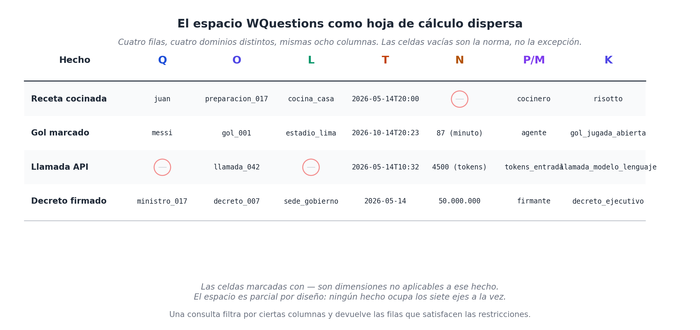
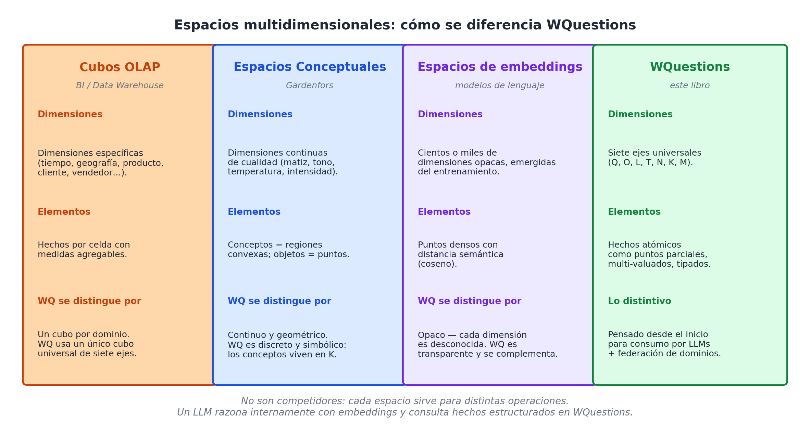

# Capítulo 8 — El espacio multidimensional

## Una hoja de cálculo imposiblemente grande

Para visualizar cómo funciona este modelo en su totalidad, imagina por un momento la hoja de cálculo de Excel más grande que hayas visto en tu vida. Esta tabla tiene exactamente ocho columnas, una por cada letra de nuestro sistema: **Q, O, L, T, N, P, M, K**. 

Cada fila de esta tabla representa un único "hecho" que ha ocurrido en el mundo. En cada celda de esa fila, anotamos el valor que le corresponde a esa columna. Ahora bien, en la inmensa mayoría de las filas, habrá varias celdas vacías. Esto es normal: un hecho cotidiano (como "Juan compró pan") solo involucra a dos o tres columnas (quién, qué), no a las siete a la vez. Pero lo importante es que todas las columnas existen y están siempre disponibles, esperando a que cualquier hecho necesite usarlas.

A nivel de arquitectura de datos, esa inmensa hoja de cálculo es lo que llamamos **el espacio multidimensional de WQuestions**. Tiene 8 dimensiones (las columnas), y los hechos de la realidad son simplemente puntos dentro de ese espacio (las filas). En este espacio hay zonas con muchísima actividad —hechos muy detallados que llenan casi todas sus columnas— y otras zonas casi desiertas. Pero todos, sin excepción, viven bajo las mismas leyes de la física geométrica.

Este capítulo está dedicado a entender esa geometría. Y no lo hacemos por amor a las matemáticas teóricas; lo hacemos porque ver la base de datos como un "espacio geométrico" cambia por completo la forma en que los programadores escriben el código de búsqueda y, sobre todo, cambia cómo los sistemas de Inteligencia Artificial auditan nuestra información corporativa. Veámoslo de cerca.

## La metáfora formal (Sin complicarnos demasiado)

Si quisiéramos ponernos estrictamente matemáticos, diríamos que nuestro universo de datos (al que llamaremos **V**) es simplemente la suma de todos los individuos que viven en nuestras cajas físicas y conceptuales: **V = Q ∪ O ∪ L ∪ T ∪ N ∪ K**. A eso le sumamos nuestros dos tipos de cables conectores (**P** y **M**). Al multiplicar todo esto, creamos el "espacio total" de nuestro sistema.

Pero en la práctica, no necesitamos pensar en fórmulas. Como decíamos, la mayoría de los hechos no usan todas las cajas al mismo tiempo. Un hecho como *"Messi marcó un gol"* solo toca la caja `Q` (Messi), la caja `O` (el gol) y usa un cable de la caja `M` (agente). Las cajas de Lugar, Tiempo o Números se quedan vacías o **sin asignar**.

Por eso es mucho más útil y realista pensar en este espacio como una **estructura parcial**: cada evento de la vida ocupa únicamente las dimensiones que necesita. El sistema no te obliga a inventar datos para rellenar los huecos vacíos. La promesa central de este modelo no es que todo en la vida sea hipercomplejo; la promesa es que *cualquier* hecho, por raro que sea, **puede encontrar su ubicación exacta** en este mapa de siete ejes, dejando en paz las dimensiones que no le importan.

Cuando una empresa empieza a guardar millones de estos hechos parciales, se produce la magia: el sistema se convierte en una nube densa de puntos conectados. Si dos hechos distintos comparten el mismo valor en la caja `O` (porque ambos hablan del mismo gol de Messi, aunque uno hable del minuto y el otro de la pierna que usó), el sistema los conecta automáticamente. Si tres hechos comparten el mismo valor en la caja `T` (porque ocurrieron el mismo día), también se conectan. Esta telaraña de conexiones automáticas es lo que le da forma y poder a nuestro espacio.

## Tres diferencias clave con los espacios matemáticos clásicos

Si eres analista de datos o programador, probablemente la idea de un "espacio multidimensional" te suene a algo que ya conoces, como los Cubos OLAP o los espacios vectoriales. Aunque comparten la idea de usar "dimensiones", nuestro espacio WQuestions tiene tres diferencias radicales que lo hacen único:

**Diferencia 1: Nuestro espacio acepta el vacío.** En la geometría matemática pura, cada punto en un mapa tiene que tener obligatoriamente un número en cada eje (X, Y, Z). En nuestro modelo, un hecho normal tiene datos en dos o tres ejes y el resto se queda vacío. Si un usuario busca *"todos los goles del torneo"*, no le importa si esos goles no tienen registrada una temperatura o un lugar exacto; el sistema simplemente omite las columnas vacías. 
En la programación tradicional, cuando falta un dato, el sistema te obliga a meter un engorroso valor `NULL` o "Desconocido" para que la tabla no se rompa. En nuestro espacio, la dimensión que no aplica simplemente no existe para ese hecho. Es limpio y eficiente.

**Diferencia 2: Aceptamos valores múltiples en una misma caja.** En la matemática tradicional, un punto en el mapa solo puede tener una coordenada X. En WQuestions, gracias a nuestros cables múltiples (el eje `M` que vimos en el capítulo anterior), un mismo hecho puede disparar varios valores hacia la misma caja. Un partido de fútbol tiene **dos** equipos; una llamada a ChatGPT puede haber utilizado **cinco** documentos distintos como fuente. En la matemática pura esto rompería las reglas, pero en la arquitectura de datos reales, esta flexibilidad "multivaluada" es obligatoria.

**Diferencia 3: Cada eje tiene personalidad.** En un gráfico matemático escolar, todos los ejes son iguales: todos son líneas de números infinitos. En WQuestions, cada eje es de una "especie" totalmente distinta: uno guarda humanos (`Q`), otro fechas (`T`), otro magnitudes numéricas (`N`) y otro conceptos teóricos (`K`). Esto significa que el espacio es **tipado** (protegido). El sistema sabe que es un absurdo lógico intentar sumar a una persona (`Q`) con una fecha (`T`), por lo que protege a la base de datos de cometer errores ridículos al cruzar información.

## La hoja de cálculo dispersa en acción

Para que no quede ninguna duda de cómo se ve esto en la vida real, imaginemos nuestra "hoja de cálculo gigante" con cuatro hechos sacados de nuestras cuatro industrias de ejemplo.

Míralo en formato de tabla:

| El Hecho que ocurrió | Quién (Q)    | Qué (O)         | Dónde (L)     | Cuándo (T)       | Cuánto (N) | El Cable (P/M) | Clase (K)               |
| :------------------- | :----------- | :-------------- | :------------ | :--------------- | :--------- | :------------- | :---------------------- |
| **Receta cocinada**  | juan         | preparacion_017 | cocina_casa   | 2026-05-14T20:00 | —          | cocinero       | risotto                 |
| **Gol marcado**      | messi        | gol_001         | estadio_lima  | 2026-10-14T20:23 | 87         | agente         | gol_jugada_abierta      |
| **Llamada a una IA** | —            | llamada_042     | —             | 2026-05-14T10:32 | 4500       | tokens_entrada | llamada_modelo_lenguaje |
| **Decreto firmado**  | ministro_017 | decreto_007     | sede_gobierno | 2026-05-14       | 50_000_000 | firmante       | decreto_ejecutivo       |

Las cuatro filas, a pesar de ser de mundos que no tienen nada que ver entre sí, conviven pacíficamente en la misma hoja. La llamada a la Inteligencia Artificial tiene vacía la columna del Lugar (`L`) porque ocurre en la nube; también tiene vacía la columna del Quién (`Q`) porque la hizo un proceso automatizado. 

Pero fíjate en lo importante: **la estructura es exactamente la misma para todos**. Cualquier analista de datos, e incluso cualquier modelo de IA, puede leer esta tabla y entender inmediatamente qué dice cada fila sin necesidad de ser un experto en fútbol o en leyes.

Esta uniformidad milagrosa es lo que hace que buscar datos sea un paseo en el parque. Si el gerente de la empresa pide ver *"absolutamente todos los eventos que pasaron el 14 de mayo de 2026"*, el código solo tiene que filtrar la columna `T` por esa fecha. El sistema le devolverá instantáneamente la receta, la llamada a la IA y el decreto firmado. No hace falta programar conectores complejos entre el servidor de cocina, el de informática y el legal. Todo está en la misma matriz.

## Consultar es jugar a "Hundir la flota"

Si entendemos que todos los hechos son puntitos flotando en este gran espacio de siete ejes, entonces hacer una búsqueda en la base de datos no es más que **poner restricciones geométricas sobre las coordenadas**, casi como si jugaras al clásico juego de mesa de los barquitos (*Hundir la flota* o *Batalla Naval*).

En la práctica, las empresas hacen tres tipos básicos de "cortes" o búsquedas en este espacio:

1.  **Fijar un punto y dejar el resto libre:** 
    *"Muéstrame todo lo que involucre a Messi"*. 
    El sistema clava una estaca en la caja `Q = messi` y extrae todos los hechos conectados a él, sin importar en qué año, estadio o país ocurrieron.
2.  **Acotar un intervalo de tiempo o cantidad:** 
    *"Dame todos los eventos ocurridos entre el 1 y el 31 de mayo"*. 
    El sistema pone una regla de medición sobre el eje `T` y corta todo lo que esté fuera de esas fechas, dejando libres a las personas y a los lugares involucrados.
3.  **Hacer cortes cruzados (la intersección):** 
    *"Encuentra todos los goles de Messi jugando en Argentina en el año 2026"*. 
    El sistema corta por la coordenada `Q = messi`, luego corta por `K = gol`, y finalmente por `T = 2026`. El resultado que el usuario ve en pantalla es el pequeño cuadrito donde esos tres cortes geométricos se cruzan.

La belleza técnica de esto radica en que el motor de la base de datos siempre ejecuta exactamente la misma operación de "corte geométrico", sin importarle si está buscando goles, diagnósticos médicos o fraudes financieros. Esta es la promesa cumplida del modelo WQuestions: un único lenguaje universal para hacerle preguntas al universo entero.

## Para los técnicos: Cómo se compara con otros sistemas modernos

Si eres un profesional del sector, es útil contrastar rápidamente nuestro espacio WQuestions con tres tecnologías multidimensionales famosas para entender sus límites:

**1. Cubos OLAP (Business Intelligence):** Los analistas financieros usan "cubos" que tienen dimensiones (tiempo, país, tienda) para sumar ventas o gastos. *La diferencia:* un cubo OLAP está cerrado en su propio mundo (un cubo para ventas, otro cubo para recursos humanos). WQuestions es **un único cubo maestro para toda la empresa**, donde la "industria" es solo un filtro más dentro de la categoría `K`. Pasamos de tener mil cubos pequeños a un solo universo integrado.

**2. Los Espacios Conceptuales (Gärdenfors):** El investigador Peter Gärdenfors `[13]` propuso que el cerebro humano entiende los conceptos agrupándolos en espacios geométricos continuos (como organizar colores por tono y brillo). *La diferencia:* el modelo de Gärdenfors se usa para explicar cómo el cerebro *aprende* un concepto general; WQuestions se usa para archivar **los hechos reales y concretos** que usan esos conceptos. Ambas teorías se dan la mano pacíficamente.

**3. Vectores y Embeddings (La mente secreta de la IA):** Cuando ChatGPT "lee" una palabra, la transforma en una lista gigante de números (un vector denso) para medir qué tan cerca está esa palabra de otras (por ejemplo, "rey" está matemáticamente cerca de "reina"). *La diferencia:* el espacio de los embeddings es una caja negra; es **opaco**. Los humanos no podemos leer esos millones de números para saber por qué la IA conectó dos palabras. El espacio WQuestions, en cambio, es totalmente **transparente y auditable**: cada columna tiene una etiqueta clara que podemos leer. La IA usa los embeddings para pensar rápido en secreto, pero usa WQuestions para guardar el resultado de forma segura y explicable para los humanos. ¡Ambos sistemas se necesitan mutuamente!

## Una ventaja inesperada: La "Densidad Emergente"

Hay algo casi mágico que ocurre en la vida real cuando una empresa implementa este sistema. No es una regla matemática, sino un fenómeno orgánico: a medida que el sistema empieza a chupar millones de datos todos los días, **ciertas regiones del espacio geométrico se empiezan a llenar muchísimo más que otras**. Esto es lo que llamamos "densidad emergente".

Si aplicamos el modelo en un hospital gigante, veremos que la zona del espacio donde se cruzan los pacientes (`Q`), las citas médicas (`O`), las fechas (`T`) y las enfermedades (`K`) se vuelve un nodo densísimo de información, brillando en el mapa. 

La maravilla corporativa ocurre cuando a ese mismo hospital le instalas un sistema nuevo (por ejemplo, un chatbot de citas por WhatsApp). El nuevo chatbot empieza a registrar sus propios hechos: llamadas (`O`), latencias (`N`) y tipos de IA usados (`K`). El chatbot empieza a poblar su propia esquina vacía del espacio, **sin estorbar ni romper un solo dato del sistema hospitalario**. Y el día en que un usuario pregunta por WhatsApp: *"¿Qué día me toca ir al médico?"*, ambos sistemas se cruzan en un punto del mapa de manera natural, sin necesidad de programar complejos túneles de integración entre el servidor médico y el de WhatsApp.

Como beneficio extra, esta densidad te sirve para auditar empresas. Si llegas a una compañía y ves un mapa donde la zona de "ventas" está densamente poblada pero la de "reclamos" está misteriosamente vacía, sabes de inmediato dónde están los puntos ciegos de su negocio, sin tener que leer una sola línea de documentación.

## Tres cosas que este espacio NO es (Para evitar confusiones)

Para mantener las expectativas bajo control, es sano aclarar tres cosas que la metáfora de la "geometría espacial" no hace:

1.  **No mide distancias físicas:** Que dos hechos compartan la misma fecha no significa que uno esté "cerca" del otro a nivel de afinidad. Este modelo sirve para cruzar conexiones exactas, no para calcular qué tan parecido es un paciente a otro. (Para eso existen los embeddings de la IA).
2.  **No te obliga a usar un servidor raro:** Este "espacio de 7 ejes" es una forma de pensar y organizar el código. A la hora de guardarlo en un disco duro físico, el programador puede usar la tecnología que más le guste: filas en PostgreSQL, documentos en MongoDB, o grafos en Neo4j. La filosofía funciona en todas.
3.  **No es una prisión de datos:** Si tú decides mapear todo el sistema de Recursos Humanos en WQuestions, no significa que te prohíba mapear Contabilidad mañana. Todo lo que modeles aterriza seguro en este espacio; lo que decidas no modelar, simplemente no se ve. Es un sistema modular e infinito.

## El modelo y los Agentes de Inteligencia Artificial

Cerremos este capítulo conectando la teoría con el futuro del mercado.

Cuando un agente autónomo de Inteligencia Artificial se conecta a la base de datos de tu empresa para hacer un trabajo, lo que está haciendo matemáticamente es **navegar como un dron a través de esta geometría espacial**. Cuando usa una herramienta para "agregar un cliente nuevo", simplemente está dibujando un puntito nuevo en el mapa. Cuando el agente quiere investigar un fraude, simplemente "recorta un cuadrado" en la geometría y lee lo que hay adentro. 

Y aquí viene el golpe maestro: este mapa de siete ejes (quién, qué, dónde, cuándo...) **es el mismo mapa cognitivo que la Inteligencia Artificial ya usaba en su cabeza para entender el lenguaje humano**. Al presentarle los datos corporativos estructurados de esta manera, el agente de IA no tiene que aprender un ecosistema nuevo; **se encuentra con un universo digital que funciona bajo las mismas leyes físicas que su propio entrenamiento neuronal**.

Esta compatibilidad absoluta entre la estructura de la mente de la IA y la estructura de los discos duros de la empresa es lo que hace que todo el esfuerzo valga la pena.

Pero en la vida real las cosas no siempre son tan simples. En el eje O viven unos individuos muy especiales, los "nudos gordianos" de la base de datos: las **situaciones reificadas**, eventos gigantes (como un partido entero o una guerra) donde miles de hechos pequeños convergen y se agrupan porque hablan de lo mismo. Es ahí donde el sistema demuestra si tiene los músculos para manejar eventos extremadamente complejos a lo largo del tiempo, y desatar esos nudos sin que la base de datos explote.