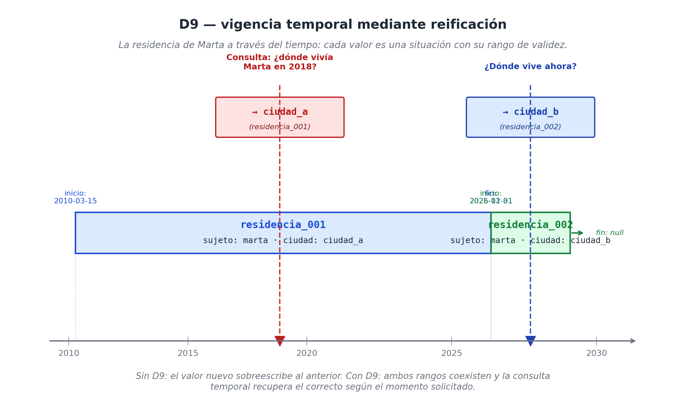

# Capítulo 9 — Situaciones reificadas: los puntos articuladores

## Por qué algunas acciones merecen ser sustantivos

Si te fijas con cuidado, el idioma español tiene un truco gramatical fascinante y muy útil: nos permite convertir cualquier verbo en un sustantivo sin el menor esfuerzo. El verbo *correr* se transforma en *la carrera*. *Vender* se vuelve *la venta*. *Operar* pasa a ser *la operación*. *Decidir* se convierte en *la decisión*. 

Esos sustantivos nuevos no nombran cosas físicas que puedas tocar, como una taza de café o un escritorio; nombran **acciones, eventos o procesos**. Pero al volverlos sustantivos, les hemos otorgado algo vital: identidad propia. Los hemos convertido en "cosas" de las que podemos hablar.

Este cambio no es solo un adorno literario; en la arquitectura de datos, es la diferencia entre un sistema que entiende el mundo y uno que se ahoga en detalles. 

Piénsalo así: decir *"María le vendió un libro a Juan"* no es lo mismo que decir *"la venta de María a Juan ocurrió ayer y quedó registrada bajo el código 14"*. En la primera oración, "vender" es solo un acto pasajero que conecta a María con el libro. En la segunda oración, **la venta se ha convertido en una entidad en sí misma**. Ahora tiene un código, una fecha, y lo más importante: podemos añadirle nuevos datos en el futuro. Podemos decir que "la venta se canceló", "se rectificó" o "se pagó en cuotas".

A este truco tecnológico de tomar un evento fugaz y convertirlo en un objeto de primera clase con identidad propia, nuestro modelo lo llama **reificación** (del latín *res*, que significa 'cosa': literalmente, "hacer cosa" un evento). Y a la entidad que nace de ese proceso la llamamos **situación reificada**. 

Estas situaciones reificadas van a vivir siempre en el eje `O`. Son los "nudos" o **puntos articuladores** de nuestra red de datos. Son los conectores maestros donde docenas de pequeños hechos convergen porque todos hablan exactamente de lo mismo. Sin la reificación, nuestro modelo solo podría procesar oraciones simples. Con la reificación, el modelo puede entender y guardar cualquier evento humano, por gigantesco e intrincado que sea.

## La regla de oro: ¿Cuándo conviene reificar?

Llegados a este punto, la duda lógica es: *¿Debo convertir absolutamente todo en una situación reificada? ¿Si Juan es alto, debo crear "la situación de la altura de Juan"?* 

La respuesta es un rotundo no. Reificar cuesta dinero y recursos. Cada vez que conviertes un hecho en una "situación", estás creando un objeto nuevo en tu base de datos, tienes que asignarle un código de identidad único (un UUID) y el sistema tardará un milisegundo extra en buscarlo. Si reificas todo por costumbre, vas a inflar tu base de datos con basura abstracta.

Para mantener la base de datos veloz y limpia, nuestro modelo sigue una regla de oro: **solo se reifica cuando se cumple al menos una de estas cuatro condiciones**.

1.  **El evento tiene demasiados detalles.** Si el hecho tiene propiedades que no caben en una oración simple (como la hora exacta, el lugar, el instrumento usado o un agente secundario), reifícalo. Un gol no es solo `(messi, anota, gol)`. Un gol profesional tiene un minuto exacto, una pierna utilizada, un pase previo y una distancia. Esos detalles no tienen de dónde "colgar" a menos que conviertas el gol en una entidad propia.
2.  **Participan más de dos personas o cosas.** Una transacción de venta tiene un vendedor, un comprador, un producto, un precio y una fecha. Como vimos en el capítulo 7, nuestra "tripleta atómica" solo puede conectar dos cosas a la vez (Sujeto y Objeto). Reificar la venta es el mecanismo estándar para conectar a cinco actores distintos sin romper nuestras reglas matemáticas.
3.  **Vas a necesitar hablar de este evento más tarde.** Si sabes que en el futuro vas a recibir actualizaciones sobre este hecho, debes reificarlo. Datos como *"la venta fue anulada"*, *"el diagnóstico fue apelado"* o *"el partido fue suspendido por lluvia"* exigen que la venta, el diagnóstico o el partido existan previamente como objetos independientes en la base de datos para poder recibir esas actualizaciones.
4.  **El dato va a cambiar en el futuro y necesitas guardar el historial.** El dato "dónde vive Marta" es temporal. Hoy vive en una ciudad, mañana vivirá en otra. Si solo guardamos el dato actual, perdemos todo su historial. Si convertimos su residencia en una "situación" y le ponemos una fecha de `inicio` y un `fin`, conservamos la historia intacta. A esto lo llamaremos la regla de **vigencia temporal**, y la veremos más abajo.

Si un dato no cumple ninguna de estas cuatro reglas, **no lo reifiques**. Dejarlo como un hecho atómico simple `(juan, estatura, 1.80)` es perfecto y mantiene el sistema rápido.

Para que no queden dudas, esta será la **cuarta decisión de diseño** de nuestra arquitectura:

> **D4 — Un evento o relación solo se transforma en una "situación reificada" (guardada en el eje O) si cumple al menos uno de cuatro requisitos: (1) tiene atributos propios como lugar o modo, (2) participan más de dos actores, (3) será referenciado por otros eventos en el futuro, o (4) su valor cambiará y necesitamos conservar un registro histórico. Si no cumple ninguna, usamos una tripleta simple.**

## Autopsia de una situación reificada

¿Cómo se ve uno de estos "nudos" por dentro? Abramos uno para revisarlo. Tomemos un evento cotidiano pero complejo: la consulta médica de la paciente María Gonzales del 14 de mayo de 2026 con la Dra. Torres. 

A nivel humano, sabemos que una consulta médica incluye a un paciente, un doctor, una fecha, un consultorio, un motivo de visita, un diagnóstico oficial y, finalmente, un pago. 

En nuestro sistema, lo primero que hacemos es "hacer cosa" la consulta, creándola en el eje O:
```text
(consulta_2026_05_14) ∈ O
```

Ese código, `consulta_2026_05_14`, se convierte en nuestro punto articulador. Todos los detalles de la visita médica se van a enganchar a este nodo central utilizando nuestros hechos atómicos de tres partes:

```text
(consulta_2026_05_14, instancia_de,   accion_consultar)        ∈ M(O, K)
(consulta_2026_05_14, agente,         dra_torres)              ∈ M(O, Q)
(consulta_2026_05_14, paciente,       maria_gonzales)          ∈ M(O, Q)
(consulta_2026_05_14, momento,        2026-05-14T10:30:00Z)    ∈ M(O, T)
(consulta_2026_05_14, lugar_de,       consultorio_03)          ∈ M(O, L)
(consulta_2026_05_14, motivo,         control_rutinario)       ∈ M(O, K)
(consulta_2026_05_14, diagnostico,    hipertension_grado_1)    ∈ M(O, K)
(consulta_2026_05_14, estatus_factual, real)                   ∈ M(O, K)
```

Hemos usado ocho hechos atómicos para dibujar la consulta completa. Y aquí viene la recompensa de haberlo reificado: como `consulta_2026_05_14` ahora es una entidad con identidad propia, otros eventos posteriores pueden apuntar directamente a ella:

```text
(prescripcion_medica_017,  parte_de,        consulta_2026_05_14)
(pago_tarjeta_001,         sobre_situacion, consulta_2026_05_14)
(control_mes_siguiente,    prevista_por,    consulta_2026_05_14)
```

Fíjate en lo que acabamos de hacer. La prescripción, el pago y la futura visita son, cada una de ellas, **nuevas situaciones reificadas** que se conectan al nodo maestro original. La red de la base de datos crece de forma natural, sin cambiar jamás su formato de "tres columnas".


## D5: El agente no siempre es un humano

Hagamos una pausa para oficializar algo que los ejemplos ya nos venían gritando. En la consulta médica, el rol de `agente` se lo dimos a una persona de carne y hueso (la Dra. Torres). Sin embargo, si miramos otros mundos, el "agente" de una acción puede ser cualquier cosa: el algoritmo de Uber que te asigna un chófer, el servidor bancario que te cobra mantenimiento, o un modelo de IA que redacta un contrato.

Esto significa que nuestro modelo **no exige que el protagonista de la acción sea humano**.

> **D5 — Agencia contextual. El rol de `agente` puede ser ocupado por humanos, corporaciones, algoritmos de software o sensores físicos. Todo depende del verbo de la acción. Hay verbos que exigen un agente (como "vender") y otros que no necesitan a nadie ("ocurrir", "llover").**

Esta regla (D5) es la que nos permite auditar sistemas industriales, plantas químicas o plataformas de Inteligencia Artificial utilizando exactamente el mismo lenguaje que usaríamos para registrar ventas humanas. 

### Los límites de la agencia: el rol, no la voluntad

Conviene fijar el límite, porque la pregunta es legítima: si un horno inteligente o un algoritmo de recomendación pueden "vestirse" de agente, ¿cuándo deja un objeto de ser una *herramienta* y pasa a ser un *actor*? La tentación es buscar la frontera en la **voluntad** o la **conciencia** del objeto — y por ahí no hay salida limpia, porque ni un algoritmo ni una empresa "quieren" nada en sentido fuerte.

El modelo esquiva esa trampa filosófica: el criterio **no es la voluntad, es el rol que la entidad ocupa en una situación concreta**. Una misma cosa puede ser las dos cosas en momentos distintos. El bisturí con el que opera un cirujano es un **instrumento** (un objeto en O) de la situación *operar* — el agente es el cirujano. Pero "el robot Da Vinci ejecutó la sutura" pone al robot en el rol de **agente** (Q) de la situación *suturar*, donde no hay otro candidato a protagonista. El mismo aparato es herramienta o actor según **qué verbo lo invoque y qué rol llene**, no según una propiedad que lleve puesta.

La regla operativa, entonces, es simple: una entidad entra a Q como agente cuando **ocupa el rol `agente` de un verbo que exige uno** (vender, asignar, redactar, suturar); se queda como instrumento en O cuando es solo el medio a través del cual otro actúa. La agencia la determina la **gramática de la situación**, no la metafísica del objeto. Por eso el modelo puede auditar a un algoritmo que niega un crédito con el mismo rigor con que audita a un gerente que lo niega — sin tener que resolver primero si el algoritmo "tiene voluntad".

## El Estatus Factual: Eventos que todavía no han pasado

Una situación en nuestro sistema no tiene que ser obligatoriamente un hecho consumado. A menudo, las empresas necesitan guardar situaciones que están planeadas, reuniones que se cancelaron, diagnósticos que son meras hipótesis o compras que fueron devueltas.

Para no tener que inventar etiquetas duplicadas para todo (como tener un cable `agente_real` y otro cable `agente_planeado`), la solución más limpia que encontramos fue obligar a todas las situaciones a declarar abiertamente su **estatus factual**:

```text
estatus_factual : de O hacia K
  Opciones permitidas: real | planeado | confirmado | hipotético | cancelado | rectificado
```

Si agendas una consulta médica para el mes que viene, la guardas en el sistema exactamente igual que si fuera una consulta real, pero le añades la propiedad `estatus_factual: planeado`. Si el paciente asiste a su cita, el sistema no borra el plan; crea una *nueva* situación con el estatus `real` y la conecta a la antigua diciendo que la "cumplió". Si el paciente llama para cancelar, creamos una situación de cancelación.

```text
(futuro_control_001) ∈ O
  instancia_de    : accion_consultar
  agente          : dra_torres
  momento         : 2026-06-04T10:00:00Z
  estatus_factual : planeado                    ← ¡La clave está aquí!
```

Este pequeño truco asegura la **inmutabilidad** de la base de datos: el pasado jamás se reescribe. A la vez, nos permite mapear toda la red de expectativas, promesas y fallos que componen el día a día de cualquier negocio real.

## Vigencia y la Regla D6: Datos que caducan con el tiempo

Llegamos a uno de los trucos de diseño más inteligentes de todo el modelo. 

Hay propiedades que simplemente no duran para siempre. El monto del alquiler que pagas hoy cambiará el año que viene por la inflación. El medicamento que receta el doctor hoy, se suspenderá en tres semanas. Si una base de datos antigua recibe un precio nuevo, borra el precio viejo y pone el nuevo encima, destruyendo el historial corporativo para siempre. 

Nosotros evitamos ese desastre utilizando la reificación para dominar el flujo del tiempo. Esta es nuestra sexta decisión de diseño:

> **D6 — Las propiedades que cambian con el paso del tiempo no se guardan directamente. Se reifican convirtiéndolas en situaciones, y se les añade una fecha de `inicio` y una de `fin` (su rango de vigencia).**

En lugar de hacer la barbaridad de reescribir un dato así:
```text
(marta, vive_en, ciudad_a)    ← (Y si se muda, borrar este texto y poner ciudad_b)
```

Lo que hacemos es crear una situación histórica:

```text
(residencia_historial_001) ∈ O
  sujeto         : marta
  ciudad         : ciudad_a
  inicio         : 2010-03-15
  fin            : 2025-12-31

(residencia_historial_002) ∈ O
  sujeto         : marta
  ciudad         : ciudad_b
  inicio         : 2026-01-01
  fin            : null          ← Al estar vacío, el sistema sabe que esta es la actual.
```

Gracias a esto, cuando le preguntes al sistema "¿dónde vive Marta?", la máquina te pedirá una fecha de referencia. Si pides el año 2024, el motor leerá los rangos de tiempo y te devolverá de forma automática la `ciudad_a`. 



Esta técnica (llamada *bitemporalidad*) vuelve ridículamente fáciles consultas que antes volvían locos a los analistas de datos, tales como: *"¿Qué versión exacta del algoritmo de IA estaba corriendo en producción el día que se reportó el fallo el año pasado?"*. Sin la regla D6, responder eso es casi imposible.

## ¿Cómo se conectan las situaciones entre sí?

Para evitar que la base de datos se convierta en una selva inmanejable de eventos sueltos, hemos definido un grupo de cables oficiales (relaciones canónicas) que se encargan de organizar cómo interactúan estas situaciones reificadas entre sí. Son pocos, pero cubren todos los escenarios:

**1. Jerarquía (`parte_de` y su inverso `contiene`):** 
Sirve para meter eventos pequeños dentro de eventos gigantes. Una compra con tarjeta es `parte_de` las ventas del mes. Un gol es `parte_de` un partido. 
```text
(gol_001,         parte_de,   partido_arg_per_2026)
(compra_tarjeta,  parte_de,   cierre_mes_julio)
```

**2. Secuencia lógica (`precede` y su inverso `sigue_a`):** 
Organiza el flujo de los procesos. No importa tanto la hora del reloj, sino qué paso obligatoriamente va antes que otro.
```text
(examen_sangre_001,  precede,  diagnostico_medico)
```

**3. Acción y reacción (`cumple`, `cancela`, `modifica`, `rectifica`):** 
Define cómo un evento nuevo impacta o anula a un evento del pasado. Un pago de nómina `cumple` la obligación mensual. Una boleta de devolución `cancela` la compra anterior.
```text
(transferencia_julio,   cumple,    obligacion_pago_julio)
(boleta_rectificativa,  rectifica, boleta_original_007)
```

**4. El grupo del "Por qué" (`causado_por`, `motivado_por`, `justificado_por`):** 
Los cables que explican los motivos humanos o mecánicos detrás de las situaciones. A estos les dedicaremos un análisis profundo más adelante.

## El Zoom de la reificación: Tú decides cuánto detalle quieres

Cerramos con una aclaración vital para cualquier arquitecto de software: reificar la información no es un interruptor que simplemente se enciende o se apaga. Es como hacer zoom con una cámara. Un mismo evento puede modelarse de tres formas distintas en la base de datos, dependiendo de cuán obsesionada esté tu empresa con los detalles.

Imagina que queremos guardar el *"consumo eléctrico mensual de un edificio corporativo"*. Podemos hacerlo en tres niveles de profundidad:

**Nivel 1 — El brochazo gordo (Tripleta plana):**
```text
(edificio_017, consumo_octubre, 1240)    
(edificio_017, unidad_consumo,  kWh)     
```
Es rápido, barato, y suficiente si el gerente solo quiere ver el total gastado en el mes.

**Nivel 2 — Reificación corporativa:**
```text
(consumo_oct_017) ∈ O
  edificio   : edificio_017
  cantidad   : 1240
  unidad     : kWh
  periodo    : 2026-10
  medido_por : empresa_distribuidora_luz
```
Aquí "hicimos cosa" al recibo de luz. Es necesario si el departamento de contabilidad exige auditorías sobre qué proveedor emitió el cobro y en qué periodo exacto.

**Nivel 3 — Reificación extrema (Microdatos):**
```text
(consumo_oct_017) ∈ O
  edificio    : edificio_017
  total       : 1240 kWh
  ...
(consumo_oct_017_dia_03) ∈ O    ← (Y decimos que esto es "parte_de" consumo_oct_017)
  fecha    : 2026-10-03
  cantidad : 42 kWh
```
Aquí desarmamos el recibo gigante en 30 "situaciones de consumo diario" individuales. Solo harías esto si el edificio tiene paneles solares y necesitas calcular tarifas hora por hora para ahorrar energía.

¿Cuál de los tres niveles es el correcto? **Los tres son perfectamente legales**. Todo depende del presupuesto de tu empresa y de lo que quieras lograr. Y lo más hermoso de esta arquitectura es que **saltar del nivel 1 al nivel 3 no rompe tu base de datos**. Si mañana necesitas más detalle, simplemente inyectas nuevas situaciones y las conectas a las antiguas usando el cable `parte_de`. El sistema jamás se detiene.

Las situaciones reificadas son los semáforos y las rotondas por donde circula el tráfico de nuestra base de datos. Pero para que el mapa esté completo, falta pavimentar un tipo de conexión muy especial que une a estas rotondas: los cables del **"por qué"**. Saber que ocurrió una venta o un accidente médico es útil, pero saber *qué lo causó*, *qué normativa lo justificó* o *qué finalidad oculta perseguía* es lo que eleva una base de datos al nivel de inteligencia de negocios. Esas cuatro conexiones canónicas (*causado por, motivado por, con finalidad, justificado por*) son las que nos permiten construir una estructura capaz de dar explicaciones razonadas.