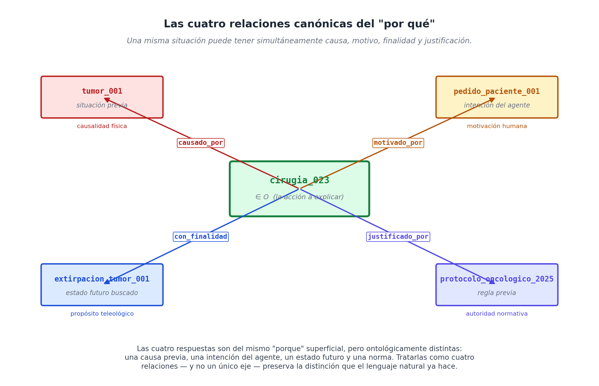
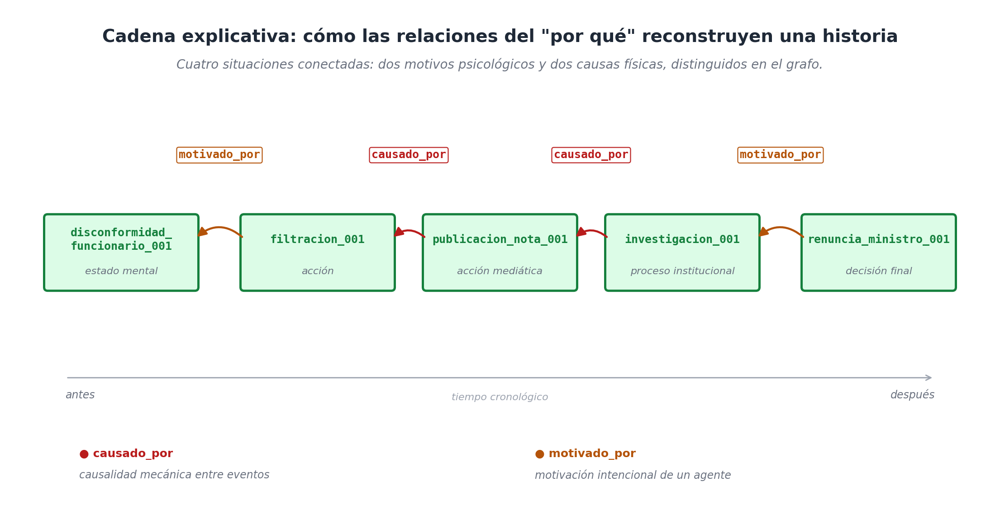

# Capítulo 11 — El "por qué" no es una pregunta más

## El niño que no dejaba de preguntar

Cualquiera que haya pasado tiempo con un niño de tres o cuatro años conoce perfectamente la fase del "por qué". Es una etapa agotadora pero fascinante. El niño te mira y dispara: *"¿Por qué se rompió el vaso?"*. Tú le respondes que se cayó al suelo. Él ataca de nuevo: *"¿Por qué llora la abuela?"*. Tú le dices que está emocionada. Sigue la ráfaga: *"¿Por qué vamos al médico?"*. Y remata con: *"¿Por qué no puedo comer tierra?"*.

Para el niño, la palabra es exactamente la misma en todos los casos. Utiliza la misma herramienta gramatical. Sin embargo, tú, como adulto, haces un esfuerzo mental inconsciente y le das cuatro tipos de respuestas completamente distintas. Al vaso le das una explicación **física** (la gravedad). A la abuela le das una explicación **psicológica** (los sentimientos). Al médico le das una explicación orientada al **futuro** (para curarnos). Y a la tierra le das una explicación **normativa** (porque es una regla de higiene y salud).

Esa misma trampa lingüística en la que caen los niños es la que ha confundido a los ingenieros de bases de datos durante décadas. En el mundo del software empresarial, tomamos preguntas que parecen idénticas y tratamos de guardarlas en el mismo cajón. 

Observemos esto en un entorno profesional:

   *¿Por qué se cayó el servidor?* — Porque hubo un cortocircuito.
   *¿Por qué Marta vendió las acciones?* — Porque tenía miedo de perder dinero.
   *¿Por qué el cirujano abrió esta vía?* — Para acceder al pulmón izquierdo.
   *¿Por qué se canceló el contrato?* — Porque la cláusula 14 lo exige en caso de impago.

Si nos quedamos en la superficie, todas estas frases se responden con un "porque" o un "para". Pero si analizamos qué tipo de información estamos entregando, son cuatro universos distintos: una **causa mecánica**, un **motivo mental**, una **finalidad u objetivo**, y una **justificación legal**. 

Esto plantea un problema arquitectónico gigantesco para nuestro modelo: si quisiéramos crear un eje exclusivo para el "por qué", **¿qué demonios guardaríamos adentro?**

## Por qué no existe el eje "Por qué"

Hagamos memoria de cómo funcionan las "cajas" (los ejes) que ya hemos construido. La caja `Q` guarda personas o agentes con intención. La caja `T` guarda fechas. La caja `K` guarda conceptos. Cada eje es ordenado y homogéneo: todo lo que vive adentro está hecho de la misma sustancia.

Para que existiera un eje llamado "Por qué", todo lo que metiéramos ahí debería ser similar. Pero acabamos de ver que no lo es: 
La respuesta a *"¿por qué se cayó el servidor?"* es **un evento del pasado** (un cortocircuito, que vive en la caja `O`). La respuesta a *"¿por qué vendió las acciones?"* es **una emoción** (un miedo, que también vive en `O` pero es un estado mental). La respuesta a *"¿por qué abrió esa vía?"* es **un evento del futuro** (alcanzar el pulmón, algo que todavía no ocurre). Y la respuesta a *"¿por qué se canceló el contrato?"* es **una ley** (un documento normativo).

Intentar forzar todas estas cosas en un solo eje sería como meter en la misma bolsa un cortocircuito, la tristeza, un plan a futuro y un documento legal. Si le pides a una computadora que trate todo eso por igual, la condenas a la confusión. Si un gerente pregunta *"¿qué causó este error?"*, la máquina podría contestarle mostrándole una ley en lugar de una falla mecánica.

Aquí entra nuestra **séptima decisión de diseño (D7)**, y es mejor dejarla por escrito formalmente:

> **D7 — El modelo no tiene un eje "por qué". En su lugar, el sistema toma el "porque" del lenguaje natural y lo divide en cuatro cables distintos (relaciones canónicas) que conectan a las situaciones entre sí. Esos cables son: `causado_por` (para la física), `motivado_por` (para la intención humana), `con_finalidad` (para el propósito futuro) y `justificado_por` (para las reglas y leyes).**

En la práctica, esto significa que no hay una caja nueva. Simplemente usamos nuestros cables de relación múltiple (`M`) para conectar eventos (situaciones en la caja `O`) con otros eventos:

```text
causado_por      : conecta O con O     (La física de causa y efecto)
motivado_por     : conecta O con O     (La intención en la mente de alguien)
con_finalidad    : conecta O con O     (Un propósito proyectado al futuro)
justificado_por  : conecta O con O     (La autoridad de una norma o regla)
```

Tenemos cuatro relaciones precisas, no un eje confuso. Desambiguamos la pregunta *antes* de guardarla, no después.



## Las cuatro relaciones, diseccionadas una por una

### 1. `causado_por` — El efecto dominó (La causa eficiente)

Usamos este cable para describir conexiones mecánicas y ciegas entre dos eventos: el primer evento empuja al segundo, sin que haya ningún deseo, pensamiento o ley de por medio. Es el "porque" de la física, del dominó que cae y tumba al siguiente.

```text
(caida_vaso_001,    causado_por, empujon_001)        
(incendio_edif_017, causado_por, cortocircuito_001)
(infeccion_001,     causado_por, bacteria_001)
```

Este cable es el favorito de los diagnósticos médicos y los ingenieros. Tiene una propiedad interesantísima: **no necesita agentes humanos**. Un terremoto causa un derrumbe sin que haya intención de por medio. Por eso, el sistema no te exige que vincules a una persona cuando usas este cable.

### 2. `motivado_por` — La chispa mental (El motivo intencional)

Este cable se conecta cuando queremos explicar una acción a través del estado mental (deseo, miedo, creencia) de la persona que la ejecutó. Es la respuesta perfecta cuando la pregunta no es *"¿qué fuerza movió esto?"*, sino *"¿qué pasaba por la cabeza de este sujeto para actuar así?"*.

```text
(venta_casa_002,      motivado_por, deseo_mudarse_marta)    
(renuncia_001,        motivado_por, conflicto_con_jefe_017)
(consulta_medica_046, motivado_por, dolor_persistente_001)
```

Ojo aquí, la diferencia con el cable de causa física parece sutil, pero es vital. Decir *"el incendio causó el derrumbe"* es muy distinto a decir *"el incendio motivó la evacuación"*. El derrumbe no es algo que el edificio *quisiera* hacer, simplemente ocurrió. Pero la evacuación sí fue una decisión tomada por alguien asustado. Las causas viven en el mundo físico; los motivos viven en las mentes de la gente. 

### 3. `con_finalidad` — El viaje al futuro (El propósito teleológico)

Este es el cable más raro de la familia, porque no conecta un hecho con algo del pasado, sino que **lo conecta con un resultado que se busca en el futuro**. Es el cable del objetivo a alcanzar.

```text
(incision_001,       con_finalidad, acceso_pulmon_izquierdo_001)   
(rebajar_precio_001, con_finalidad, aumento_ventas_q3_2026)
(reunion_004,        con_finalidad, decision_inversion_001)
```

Seguramente te preguntas: *¿Cómo guardo en la base de datos un evento que todavía no ocurre?* 
Fácil: lo guardas hoy como una "situación" más en el eje `O`, pero le pones una etiqueta de estado (la propiedad `estatus_factual` que vimos en el capítulo anterior) indicando que es `previsto`, `intencionado` o `hipotético`. El evento futuro ya vive en tu disco duro; lo que apunta hacia adelante es simplemente su etiqueta de "aún no realizado".

### 4. `justificado_por` — El sello de aprobación (La autoridad normativa)

Este cable aparece cada vez que una acción no se explica por un choque físico, ni por un deseo emocional, sino por **una regla, protocolo o ley que te da permiso para hacerla**. Es el cable indispensable para el derecho, los procedimientos hospitalarios y las auditorías de calidad.

```text
(rescision_contrato_017,   justificado_por, clausula_14_contrato_017)   
(despacho_radioactivo_001, justificado_por, protocolo_iaea_2022)
(rechazo_devolucion_001,   justificado_por, politica_30_dias_tienda)
```

Lo que justifica la acción no es un evento del mundo natural, es una **norma**. Y como veremos más adelante, las normas se guardan en el sistema como objetos con su fecha de creación, su condición y su emisor. Este cable es el que hace que cualquier sistema regulado sea 100% auditable.

## Las cuatro respuestas en una sola acción

Lo maravilloso de tener estos cuatro cables bien definidos es que un mismo evento puede tenerlos todos conectados al mismo tiempo, enriqueciendo la historia de forma espectacular. Piensa en una cirugía oncológica real:

```text
(cirugia_023, causado_por,      tumor_001)                  ← La realidad física que la obliga.
(cirugia_023, motivado_por,     pedido_paciente_001)        ← El deseo mental de sanar.
(cirugia_023, con_finalidad,    extirpacion_tumor_001)      ← El resultado futuro que se busca.
(cirugia_023, justificado_por,  protocolo_oncologico_2025)  ← La regla médica que ampara al doctor.
```

Cuatro hechos atómicos simples dando cuatro explicaciones distintas a la misma cirugía. Si cometiéramos el error de unificar el "por qué" en un solo campo, toda esta riqueza explicativa se aplastaría.

## El camino de migas de pan: Cadenas explicativas

En la vida real, los porqués casi nunca vienen solos. Se enganchan unos con otros formando una historia completa, a lo que llamamos una **cadena explicativa**.

Veamos un escándalo de noticias políticas: Un ministro renuncia. ¿Por qué? Porque enfrenta una investigación. ¿Y por qué hay investigación? Porque un periodista sacó una nota. ¿Y por qué sacó la nota? Porque alguien le filtró datos. ¿Y por qué filtraron los datos? Porque un funcionario estaba enojado.

En nuestro sistema, esa historia se ve como un camino de migas de pan perfectamente enlazado:

```text
(renuncia_ministro_001,     motivado_por, investigacion_001)
(investigacion_001,         causado_por,  publicacion_nota_001)
(publicacion_nota_001,      causado_por,  filtracion_001)
(filtracion_001,            motivado_por, disconformidad_funcionario_001)
```

Esto no es un relato literario; es un mapa navegable para la computadora. Si le pides a la base de datos: *"¿qué eventos contribuyeron a la renuncia del ministro?"*, el motor simplemente se agarra del primer evento y empieza a trepar por los cables hacia atrás. Y lo mejor es que puedes pedirle a la máquina cosas súper precisas como: *"recorre la historia hacia atrás, pero muéstrame solo las motivaciones humanas, ignora las causas mecánicas"*.



## Convertir las reglas en objetos de la base de datos

Hagamos un paréntesis rápido: si el cable `justificado_por` se conecta a una "regla", ¿cómo guardamos una regla en la base de datos?

Nuestro sistema trata a las reglas como **situaciones reificadas**, pero de un tipo especial. Toda buena regla tiene una condición, una consecuencia, una fecha de inicio y una autoridad que la emitió. En código, se ve así:

```text
(regla_devolucion_001) ∈ O
  instancia_de    : norma_comercial
  emisor          : tienda_central
  vigencia_desde  : 2025-01-01
  condicion       : situacion_compra con dias_desde_compra ≤ 30
  consecuente     : devolucion_autorizada
```

Una vez que guardas la regla como si fuera un objeto más, la magia ocurre. Puedes modificarla en el futuro, puedes citarla y puedes cruzarla con otras. Cuando un cliente logra que le devuelvan el dinero, la base de datos simplemente conecta la acción con la regla:

```text
(devolucion_solicitada_017, justificado_por, regla_devolucion_001)
```

Esto hace que tu empresa sea auditable al instante. Si hay un problema, la base de datos te dice exactamente qué ley autorizó la acción y quién la había aprobado. Además, puedes inventar reglas nuevas mañana y la base de datos no se rompe; simplemente asimila el nuevo objeto.

*(Aclaración técnica: el modelo guarda la regla de maravilla para que puedas consultarla, pero no es un robot que toma decisiones por sí solo. Para que la máquina vea la regla y decida sola devolverle el dinero al cliente, necesitas conectarle un evaluador o una IA por encima. WQuestions te da la información perfecta; el razonamiento automático lo construyes encima).*

## Lo que se gana destruyendo el cajón de "Observaciones"

Repasemos por qué hemos hecho todo esto, comparándolo con las prácticas mediocres que plagan el software de hoy en día.

La opción más perezosa (y la más común) es ponerle al sistema un campo de texto gigante llamado *"Observaciones"* o *"Justificación"*, donde la gente escribe lo que quiere. Esto convierte a la base de datos en un cementerio: la computadora no puede leer eso, no puede auditarlo, y es imposible seguir una cadena de eventos.

La otra mala opción sería usar un solo cable general llamado `por_que`. Mejoraría un poco, pero perderíamos la frontera entre la física, la mente, el futuro y la ley. Un reporte corporativo mezclaría cortocircuitos eléctricos con miedos de empleados como si fueran lo mismo.

Al usar nuestra familia de cuatro conectores (`causado_por`, `motivado_por`, `con_finalidad`, `justificado_por`), logramos atrapar el detalle exacto que el cerebro humano usa para entender el mundo. Usamos simples hechos atómicos de tres partes y los conectamos a la misma maquinaria de búsqueda. Sin escribir código complejo, nuestra base de datos dejó de ser un simple cajón de archivos y se convirtió en una **red de explicaciones lógicas y recorribles**.

## Cierre de la Parte III

Con este capítulo cerramos la Parte III, el corazón arquitectónico del libro. 

Hagamos un inventario rápido de lo que logramos. Empezamos descubriendo el bloque de Lego fundamental: el hecho atómico (Capítulo 8). Luego te demostré que al juntar miles de esos bloques se forma un mapa geométrico donde buscar datos es facilísimo (Capítulo 9). Aprendimos a amarrar eventos complejos usando situaciones reificadas (Capítulo 10). Y, finalmente, le dimos a la base de datos la capacidad de explicar sus propias acciones usando los cables del "por qué" (Capítulo 11).

La maquinaria conceptual está lista, armada y engrasada. 

Pero nos falta una pieza crucial. Al final del día, nadie en tu empresa va a sentarse a escribir "tripletas atómicas" a mano en un teclado; la gente quiere hablar y escribir de forma natural. La **Parte IV** se encargará de resolver el último gran obstáculo: cómo construimos un traductor (un *Lexicon*) para que la base de datos entienda perfectamente el desordenado, hermoso y ambiguo lenguaje humano.