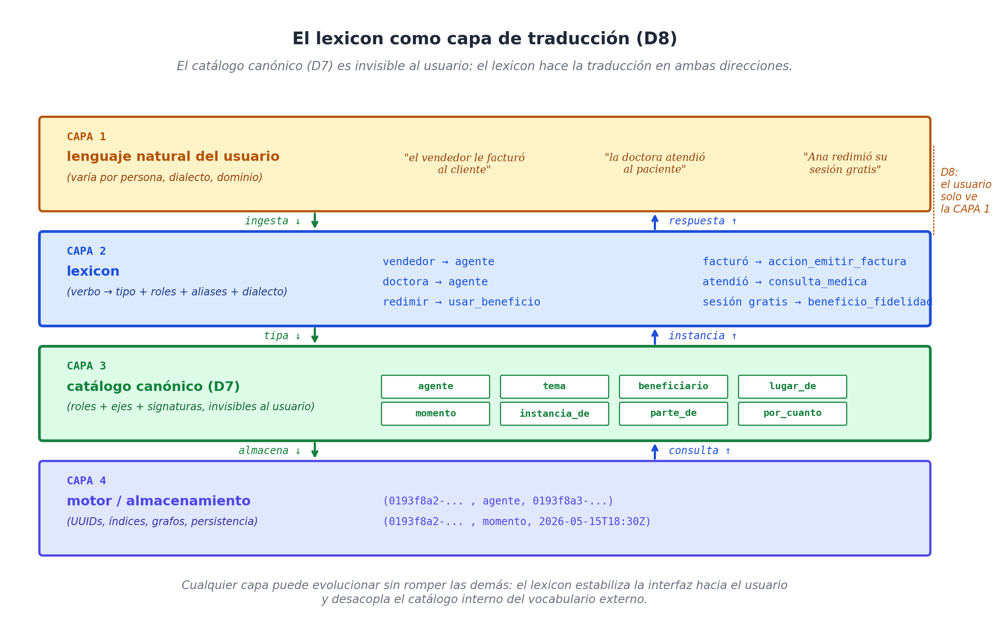
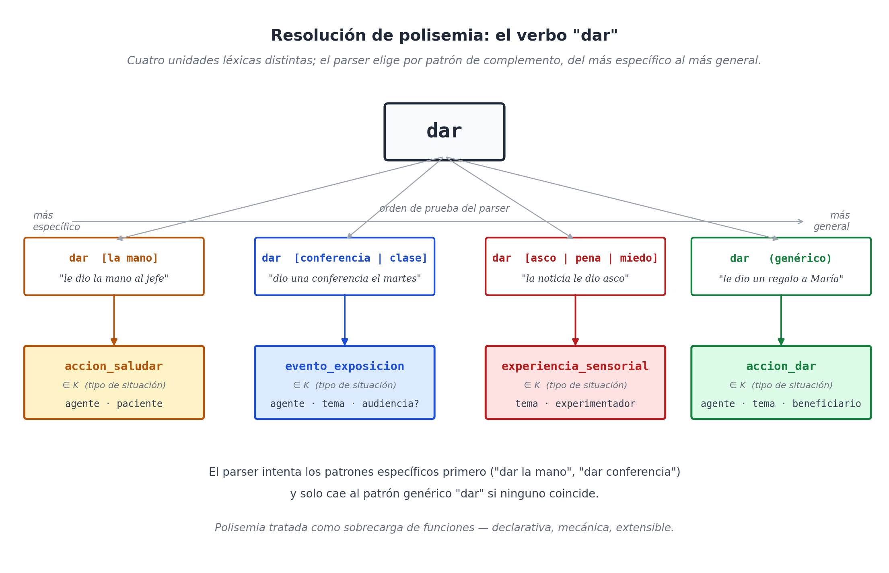

# Capítulo 12 — El Lexicon: El traductor maestro

## El problema de la mano (O por qué los verbos nos mienten)

Piensa en estas dos oraciones tan comunes en español:

* Pedro le dio un regalo a María.
* Pedro le dio la mano a su jefe.

Si aplicamos al pie de la letra las reglas matemáticas que aprendimos en el capítulo anterior, nuestra base de datos leería el verbo "dar" y crearía automáticamente un evento de tipo `accion_dar`. El sistema creería que Pedro (el agente) le transfirió algo (el objeto) a un beneficiario. 

En la primera oración, todo funciona perfecto: María ahora es dueña de un regalo. Pero en la segunda oración... hay un gran problema. El jefe de Pedro no salió de la oficina con una mano ensangrentada en el bolsillo. No hubo ninguna "transferencia" física de nada. 
*Dar la mano* es una expresión idiomática de nuestro idioma que simplemente significa **saludar formalmente**. Es decir, la segunda oración no debería guardarse como una `accion_dar`, sino como una `accion_saludar`. 

Y el verbo *dar* esconde aún más trampas:
*   *Pedro dio una conferencia el martes*: No transfirió nada, simplemente **realizó** un evento de exposición (`evento_exposicion`).
*   *El reloj dio las tres*: Es una metáfora, el reloj no regala tiempo, simplemente **suena** (`accion_sonar`).
*   *La noticia le dio asco*: No hay regalo físico, es una **experiencia sensorial** interna (`experiencia_asco`).

Un mismo verbo, cinco tipos de situación completamente distintos. A este fenómeno —cuando el significado del verbo depende de la palabra que lo acompaña— los lingüistas lo llaman **polisemia léxica**. Y es la regla de oro de la comunicación humana, no la excepción.

Nuestra base de datos **necesita resolver** qué tipo de situación está ocurriendo realmente antes de empezar a conectar cables. Porque la regla de seguridad del verbo `dar(agente, regalo, beneficiario)` no tiene la misma firma que `dar_la_mano(agente, persona_saludada)` ni que `dar_conferencia(agente, tema, audiencia)`. 

Para que la máquina no colapse, necesitamos construir un **diccionario** que no mapee palabras sueltas, sino frases completas (el verbo + su complemento clave). A este diccionario maestro lo llamaremos **El Lexicon**.

## El Lexicon es la pieza más visible del proyecto

Antes de bajar al código, tenemos que entender la importancia arquitectónica de este diccionario. 

En el capítulo 11 dijimos que el sistema funciona con un catálogo oficial de roles o cables (como `agente`, `tema` o `beneficiario`). Ahora vamos a presentar una decisión de diseño paralela, nuestra **novena regla (D9)**:

> **D9 — El catálogo oficial de roles es completamente invisible para el usuario final. Un humano jamás debe ser obligado a escribir palabras como "agente" o "beneficiario" para que el sistema funcione. Los usuarios deben poder usar su idioma natural ("vendedor", "comprador", "cliente"), y el sistema debe traducirlo silenciosamente.**

¿Quién hace esa traducción? El Lexicon. D8 estableció **qué hay debajo del capó**; el Lexicon establece **cómo se maneja el coche desde arriba**. 

Sin este diccionario, nuestro modelo sería una librería interna maravillosamente diseñada, pero inútil para la gente. Con el Lexicon, se vuelve una interfaz amigable. Y lo que es mejor: D9 garantiza que los ingenieros puedan cambiar la arquitectura interna del software (agregar roles, cambiar códigos) sin romper la experiencia de los clientes, porque la única "cara" que el usuario ve es la del Lexicon. Ese es el trato: el Lexicon es estable hacia afuera; los engranajes por dentro pueden moverse.



## Autopsia de una entrada en el diccionario

Veamos cómo se ve una "página" de este diccionario por dentro. Tomemos el caso de `vender`. Así lo escribiría un ingeniero:

```yaml
verbo: vender
  tipo_situacion: accion_vender
  roles:
    agente:
      canónico:  agente
      aliases:   ["vendedor", "el que vende", "quien vende"]
    tema:
      canónico:  tema
      aliases:   ["producto", "lo vendido", "ítem", "mercancía"]
    beneficiario:
      canónico:  beneficiario
      aliases:   ["comprador", "cliente", "el que compra"]
    por_cuanto:
      canónico:  por_cuanto
      aliases:   ["precio", "monto", "costo"]
  obligatorios: [agente, tema, beneficiario, por_cuanto]
  opcionales:   [momento, lugar_de, moneda, instrumento]
  ejemplo:      "María le vendió el libro a Juan por 20 dólares"
```

Desarmemos este bloque. Tiene seis piezas y todas tienen un trabajo muy claro:

**1. `verbo`**: Es la unidad que activa esta regla. Puede ser una sola palabra (`vender`) o un patrón compuesto (`dar [la mano]`). 
**2. `tipo_situacion`**: Es el código interno exacto al que se anclará el evento en la caja `K`. Es el motor oculto que el usuario no ve.
**3. `roles` y sus *aliases***: Aquí está la magia de la traducción. El rol oficial es `agente`, pero la lista de *aliases* le enseña al sistema que si un humano dice *"vendedor"* o *"quien vende"*, significa lo mismo. Así, *"el vendedor le dio una factura al cliente"* y *"el agente proveyó un comprobante al beneficiario"* generan exactamente el mismo registro en la base de datos.
**4. `obligatorios`** y **`opcionales`**: Son las reglas de seguridad de la firma. Dictan qué datos no pueden faltar para que la base de datos acepte la información.
**5. `ejemplo`**: Una frase humana real. No es decorativa: el motor de pruebas (o la Inteligencia Artificial) lee esta frase para aprender cómo se usa este verbo en la vida real.

Vista así, una entrada del Lexicon no es solo una definición; es **una declaración de función de código con su propio manual de uso**.

## El Lexicon habla el idioma de la Inteligencia Artificial (Function Calling)

Los modelos de lenguaje más potentes del mundo actual (GPT-4, Claude, Gemini) han adoptado una forma estándar de conectarse con el software corporativo. Se llama *Function Calling* (o "Uso de Herramientas"). 

Funciona así: la empresa le entrega a la IA un catálogo con formato JSON que describe todas las herramientas disponibles y sus reglas. Cuando un humano le pide algo a la IA, ella lee el catálogo, elige la herramienta correcta y envía una orden estructurada a la base de datos.

Lo fascinante es que el formato JSON que exigen estas IAs... **es estructuralmente idéntico a una entrada de nuestro Lexicon**. Tomemos la entrada de `vender` y traduzcámosla al formato que lee una IA:

```json
{
  "name": "vender",
  "description": "Registrar una venta: transferencia de un bien con compensación monetaria",
  "parameters": {
    "type": "object",
    "properties": {
      "agente":       {"type": "Q", "description": "vendedor, el que vende"},
      "tema":         {"type": "O", "description": "producto, ítem, mercancía"},
      "beneficiario": {"type": "Q", "description": "comprador, cliente"},
      "por_cuanto":   {"type": "N", "description": "precio, monto, costo"},
      "momento":      {"type": "T", "description": "cuándo ocurrió"},
      "lugar_de":     {"type": "L", "description": "dónde ocurrió"}
    },
    "required": ["agente", "tema", "beneficiario", "por_cuanto"]
  }
}
```

Las correspondencias son uno a uno. El `tipo_situacion` se vuelve el `name`. Los *aliases* se convierten en la `description` para que la IA sepa qué significan. Los ejes (`Q`, `O`, `T`) se vuelven los tipos obligatorios. **Nuestro Lexicon es, literalmente, un catálogo de herramientas listo para que un LLM lo invoque.**

Esto significa que cuando un usuario de un spa le escribe a un bot: *"Ana se inscribió ayer en el plan mensual"*, el modelo de IA no tiene que inventar cómo estructurar eso. Revisa el Lexicon, ve qué función debe llamar (`inscribirse`), qué roles llenar y qué datos espera tu base de datos. Esta convergencia no es suerte; es la demostración de que la estructura de la lingüística formal y la inteligencia artificial moderna llegaron exactamente al mismo puerto.

En la práctica, exponer el lexicon a un LLM convierte una frase suelta en un hecho estructurado sin que nadie escriba un parser. El prompt es casi todo catálogo:

```text
SISTEMA. Eres un extractor de hechos WQuestions. Dada una frase en español,
devuelve SOLO un JSON con la situación y sus roles canónicos.

Catálogo (verbo → situación · roles obligatorios):
  inscribirse → inscripcion  · [agente, tema]
  tomar       → servicio_spa · [cliente, lugar_de]

Frase del usuario: "Ana se inscribió ayer en el plan mensual"
```

Y el modelo responde con la situación lista para asentar en el grafo:

```json
{
  "situation_type": "inscripcion",
  "agente": "ana",
  "tema": "plan_mensual",
  "momento": "2026-06-06"
}
```

## Resolviendo el caos de la "Mano" (Polisemia)

Volvamos al verbo `dar`. ¿Cómo lo trata el Lexicon para no confundirse?
La respuesta es brutalmente directa: **crea una entrada distinta para cada significado**. El Lexicon no intenta que una sola regla mágica cubra todos los usos. En su lugar, hace una lista de patrones, cada uno apuntando a su propio evento:

```text
dar
  tipo_situacion: accion_dar
  obligatorios:   [agente, tema, beneficiario]
  ejemplo:        "Pedro le dio un regalo a María"

dar [la_mano]
  tipo_situacion: accion_saludar
  obligatorios:   [agente, paciente]
  ejemplo:        "Pedro le dio la mano a su jefe"

dar [conferencia | clase | charla]
  tipo_situacion: evento_exposicion
  obligatorios:   [agente, tema]
  opcionales:     [audiencia, lugar_de, momento, duracion]
  ejemplo:        "Pedro dio una conferencia el martes"

dar [las_horas]
  tipo_situacion: accion_sonar
  obligatorios:   [agente, tema]
  ejemplo:        "El reloj dio las tres"

dar [asco | pena | miedo]
  tipo_situacion: experiencia_sensorial
  obligatorios:   [tema, experimentador]
  ejemplo:        "La noticia le dio asco"
```

El procedimiento de resolución es el mismo que usan los compiladores de código: el sistema intenta encajar la frase **desde el patrón más específico hacia el más general**. Si la oración contiene *dar la mano*, se activa la entrada de saludo. Si la oración dice *dar un regalo*, el sistema no encuentra un patrón específico para "regalo", así que aplica la regla genérica de `accion_dar`. 



La complejidad del lenguaje no desaparece, simplemente se traslada al lugar correcto: al diccionario, donde un modelador de datos puede registrar nuevos significados sin tener que alterar el núcleo de la base de datos.

## Dialectos de dominio (La jerga corporativa)

Existe otro nivel de traducción en el Lexicon que es clave para los negocios. Hasta ahora vimos *aliases* por rol ("vendedor" en lugar de `agente`). Pero hay palabras que aplican transversalmente a toda una empresa, sin importar qué verbo se esté usando.

Un sistema de salud siempre habla de "DNI", "paciente" y "diagnóstico". Un spa habla de "cliente", "plan mensual" y "promoción". Para que nuestro motor universal funcione en todos estos lugares sin obligar a la gente a cambiar su forma de hablar, el Lexicon permite instalar **dialectos de dominio**.

Es un pequeño archivo de traducción que se ve así:

```yaml
dominio: spa_oasis
  aliases_de_dominio:
    cliente:           agente
    sesion:            servicio_spa
    plan_mensual:      contrato_servicio
    sesion_gratuita:   beneficio_fidelidad
    promo:             aplicacion_de_promocion
    redimir:           verbo_usar_beneficio
```

Con este dialecto cargado, un empleado del spa puede escribir: *"El cliente redimió su sesión gratuita"*. El sistema, automáticamente, traduce "cliente" a `agente`, "redimió" al verbo `usar_beneficio` y "sesión gratuita" a la categoría `beneficio_fidelidad`. El sistema central sigue intacto, pero la clínica, el aeropuerto y el spa sienten que el software fue hecho a su medida.

## A hombros de gigantes: Precedentes industriales (FrameNet, VerbNet, PropBank)

Es crucial entender que nosotros no nos estamos inventando estas estructuras desde cero. La lingüística computacional lleva treinta años construyendo inmensos catálogos con esta misma lógica, y cualquier implementación seria de nuestro Lexicon debe alimentarse de ellos. No tenemos que reinventar la rueda.

**FrameNet `[14]`:** Iniciado en la Universidad de Berkeley en los años noventa, este proyecto clasifica el idioma en *escenarios conceptuales* (frames). Su escenario de "Comercio" tiene roles predefinidos como `Buyer` (Comprador), `Seller` (Vendedor) y `Goods` (Mercancía), casi idéntico a nuestra entrada de `vender`. Sus más de 1.200 escenarios son una mina de oro para poblar nuestra caja `K` de forma profesional.

**VerbNet `[15]`:** Creado en la Universidad de Pensilvania, agrupa miles de verbos en inglés que comparten la misma estructura lógica (por ejemplo, verbos de transferencia o verbos de encuentro). 

**PropBank:** Es un proyecto que prioriza la velocidad, etiquetando masivamente textos reales con roles genéricos (`Arg0` a `Arg5`). Es la base de datos favorita para entrenar modelos de Inteligencia Artificial modernos.

WQuestions no busca competir ni reemplazar a estas obras maestras. Al contrario, WQuestions actúa como una **capa de agregación**. Podemos extraer las signaturas de FrameNet, alinearnos con VerbNet y usar los datos de PropBank para entrenar a nuestro propio sistema. El camino ya está pavimentado.

## Un buen puñado de entradas del Lexicon (En acción)

Para que esta teoría pase a la realidad, es necesario mostrarte cómo se ve un catálogo abundante de entradas del Lexicon aplicadas a múltiples industrias. 

Mientras lees esta inmensa lista, quiero que notes tres cosas fundamentales:
1. **Reciclamos los mismos roles siempre.** Observa cómo `agente`, `tema` y `beneficiario` se repiten en hospitales, bancos y escuelas. El catálogo base de 38 roles (D8) basta para todo.
2. **Los eventos "meteorológicos" y los dolores caben perfecto.** Verás verbos como *llover* o *doler* que funcionan a la perfección simplemente dejando en blanco la necesidad de un "agente".
3. **El poder de los *aliases***. Nota cómo las palabras en español cambian según la industria, pero el esqueleto de datos por debajo es siempre el mismo.

(Cada bloque contiene al final un ejemplo entre comillas que ilustra cómo el sistema leería la frase).

### Comercio y e-commerce

```yaml
verbo: comprar
  tipo_situacion: accion_comprar
  roles:
    agente:        ["comprador", "el que compra", "cliente"]
    tema:          ["producto", "artículo", "ítem", "mercancía"]
    beneficiario:  ["vendedor", "tienda", "el que vende"]
    por_cuanto:    ["precio", "monto", "valor"]
  obligatorios: [agente, tema, beneficiario, por_cuanto]
  opcionales:   [unidad, momento, lugar_de, instrumento]
  ejemplo:      "Sofía compró tres camisetas en Zara por 89 dólares con tarjeta"

verbo: pagar
  tipo_situacion: accion_pagar
  roles:
    agente:        ["pagador", "el que paga", "deudor"]
    beneficiario:  ["receptor", "acreedor", "el que cobra"]
    monto:         ["importe", "cantidad", "monto"]
    instrumento:   ["medio de pago", "tarjeta", "transferencia"]
    tema:          ["concepto", "factura", "deuda", "servicio"]
  obligatorios: [agente, beneficiario, monto]
  ejemplo:      "Juan le pagó 250 dólares al plomero por la reparación"

verbo: facturar
  tipo_situacion: accion_facturar
  roles:
    agente:        ["proveedor", "vendedor", "el que emite"]
    beneficiario:  ["cliente", "el que recibe la factura"]
    tema:          ["servicio prestado", "producto entregado"]
    monto:         ["importe facturado", "total"]
  obligatorios: [agente, beneficiario, tema, monto]
  ejemplo:      "El estudio jurídico le facturó 1.200 dólares a la constructora"

verbo: reclamar
  tipo_situacion: accion_reclamar
  roles:
    agente:        ["reclamante", "el que reclama", "afectado"]
    paciente:      ["empresa demandada", "destinatario del reclamo"]
    tema:          ["motivo del reclamo", "defecto", "problema"]
    con_finalidad: ["lo que se pide", "compensación", "devolución"]
  obligatorios: [agente, paciente, tema]
  ejemplo:      "Mariana reclamó al banco una transferencia mal procesada para que se la devolvieran"

verbo: devolver
  tipo_situacion: accion_devolver
  roles:
    agente:        ["devolvedor", "el que devuelve", "cliente"]
    tema:          ["producto devuelto", "ítem"]
    beneficiario:  ["tienda", "vendedor"]
    causado_por:   ["motivo de devolución", "defecto", "razón"]
  obligatorios: [agente, tema, beneficiario]
  ejemplo:      "Pedro devolvió la cafetera defectuosa a la tienda online"
```

### Banca y finanzas

```yaml
verbo: transferir
  tipo_situacion: accion_transferir
  roles:
    agente:        ["ordenante", "remitente"]
    beneficiario:  ["destinatario", "el que recibe"]
    monto:         ["importe", "cantidad"]
    origen:        ["cuenta_origen", "de qué cuenta"]
    destino:       ["cuenta_destino", "a qué cuenta"]
  obligatorios: [agente, beneficiario, monto, origen, destino]
  ejemplo:      "Lucía transfirió 500 dólares de su cuenta corriente a la cuenta de su madre"

verbo: depositar
  tipo_situacion: accion_depositar
  roles:
    agente:        ["depositante"]
    monto:         ["importe", "cantidad depositada"]
    destino:       ["cuenta", "destino"]
    instrumento:   ["efectivo", "cheque", "transferencia recibida"]
  obligatorios: [agente, monto, destino]
  ejemplo:      "El comerciante depositó 3.200 dólares en efectivo en la cuenta del negocio"

verbo: prestar
  tipo_situacion: accion_prestar
  roles:
    agente:        ["prestamista", "banco"]
    beneficiario:  ["prestatario", "el que recibe"]
    monto:         ["capital", "importe del préstamo"]
    inicio:        ["fecha de desembolso"]
    fin:           ["fecha de vencimiento"]
    con_finalidad: ["destino del préstamo", "para qué"]
  obligatorios: [agente, beneficiario, monto]
  ejemplo:      "El banco le prestó 50.000 dólares a Ramiro para la compra de su vivienda"

verbo: cobrar
  tipo_situacion: accion_cobrar
  roles:
    agente:        ["acreedor", "el que cobra"]
    paciente:      ["deudor", "el que paga"]
    monto:         ["importe cobrado"]
    tema:          ["concepto", "factura", "comisión"]
  obligatorios: [agente, paciente, monto]
  ejemplo:      "El banco le cobró 18 dólares de comisión por mantenimiento de cuenta"
```

### Salud

```yaml
verbo: consultar
  tipo_situacion: accion_consultar
  roles:
    agente:        ["médico", "doctora", "profesional"]
    paciente:      ["paciente", "persona atendida"]
    motivo:        ["motivo de consulta", "queja principal"]
    lugar_de:      ["consultorio", "sala", "centro médico"]
  obligatorios: [agente, paciente]
  ejemplo:      "La Dra. Vega consultó a Renata el martes por dolor lumbar"

verbo: prescribir
  tipo_situacion: accion_prescribir
  roles:
    agente:        ["médico", "prescriptor"]
    paciente:      ["paciente"]
    tema:          ["medicamento", "principio activo"]
    cantidad:      ["dosis", "miligramos"]
    duracion:      ["por cuántos días"]
    con_finalidad: ["objetivo terapéutico"]
    justificado_por: ["diagnóstico", "protocolo"]
  obligatorios: [agente, paciente, tema]
  ejemplo:      "El cardiólogo prescribió enalapril 10mg diarios para controlar la hipertensión"

verbo: diagnosticar
  tipo_situacion: accion_diagnosticar
  roles:
    agente:        ["médico", "diagnosticador"]
    paciente:      ["paciente"]
    tema:          ["diagnóstico", "enfermedad", "condición"]
    causado_por:   ["evidencia", "síntomas", "estudio"]
  obligatorios: [agente, paciente, tema]
  ejemplo:      "El pediatra diagnosticó otitis media aguda basándose en la otoscopia"

verbo: operar
  tipo_situacion: accion_operar
  roles:
    agente:        ["cirujano", "equipo quirúrgico"]
    paciente:      ["paciente"]
    tema:          ["zona operada", "órgano"]
    instrumento:   ["instrumental", "equipo"]
    con_finalidad: ["objetivo de la intervención"]
    duracion:      ["duración de la cirugía"]
  obligatorios: [agente, paciente, tema]
  ejemplo:      "El Dr. Larrea operó la rodilla de Marcelo durante tres horas para reparar el menisco"

verbo: vacunar
  tipo_situacion: accion_vacunar
  roles:
    agente:        ["enfermera", "personal sanitario"]
    paciente:      ["paciente", "vacunado"]
    tema:          ["vacuna", "antígeno"]
    con_finalidad: ["enfermedad prevenida"]
  obligatorios: [agente, paciente, tema]
  ejemplo:      "La enfermera vacunó a 47 niños con la dosis triple viral el sábado"
```

### Educación

```yaml
verbo: inscribirse
  tipo_situacion: accion_inscribirse
  roles:
    agente:        ["estudiante", "inscripto", "postulante"]
    tema:          ["curso", "programa", "carrera"]
    momento:       ["fecha de inscripción"]
    con_finalidad: ["objetivo académico"]
  obligatorios: [agente, tema]
  ejemplo:      "Diana se inscribió en la maestría en ciencia de datos para mejorar su perfil"

verbo: examinar
  tipo_situacion: accion_examinar
  roles:
    agente:        ["examinador", "profesor"]
    paciente:      ["examinado", "estudiante"]
    tema:          ["contenido evaluado", "materia"]
    momento:       ["fecha del examen"]
    calificacion:  ["nota", "resultado"]
  obligatorios: [agente, paciente, tema]
  ejemplo:      "El tribunal examinó a Andrés sobre cálculo integral y le puso un 8.5"

verbo: graduarse
  tipo_situacion: accion_graduarse
  roles:
    agente:        ["graduado", "el que se gradúa"]
    tema:          ["título obtenido", "carrera"]
    lugar_de:      ["institución", "universidad"]
    momento:       ["fecha de graduación"]
  obligatorios: [agente, tema]
  ejemplo:      "Camila se graduó de ingeniera civil en la Universidad Nacional en 2026"

verbo: enseñar
  tipo_situacion: accion_ensenar
  roles:
    agente:        ["docente", "profesor", "instructor"]
    beneficiario:  ["alumno", "estudiante", "audiencia"]
    tema:          ["materia", "contenido", "concepto"]
    instrumento:   ["método", "material didáctico"]
  obligatorios: [agente, beneficiario, tema]
  ejemplo:      "El profesor Méndez enseñó programación a 25 alumnos durante tres meses"
```

### Legal y gobierno

```yaml
verbo: firmar
  tipo_situacion: accion_firmar
  roles:
    agente:        ["firmante", "el que firma"]
    tema:          ["documento", "contrato", "acuerdo"]
    momento:       ["fecha de firma"]
    lugar_de:      ["lugar de firma"]
  obligatorios: [agente, tema]
  ejemplo:      "Eduardo firmó el contrato de alquiler el lunes en la escribanía"

verbo: denunciar
  tipo_situacion: accion_denunciar
  roles:
    agente:        ["denunciante", "el que denuncia"]
    paciente:      ["denunciado", "acusado"]
    tema:          ["hecho denunciado", "delito", "irregularidad"]
    beneficiario:  ["autoridad receptora", "fiscalía", "policía"]
  obligatorios: [agente, paciente, tema]
  ejemplo:      "La asamblea denunció al constructor por daño ambiental ante la fiscalía"

verbo: multar
  tipo_situacion: accion_multar
  roles:
    agente:        ["autoridad", "oficial", "ente regulador"]
    paciente:      ["multado", "infractor"]
    monto:         ["importe de la multa"]
    causado_por:   ["infracción cometida"]
    justificado_por: ["norma aplicada", "artículo legal"]
  obligatorios: [agente, paciente, monto, causado_por, justificado_por]
  ejemplo:      "El SUNAT multó a la empresa con 8.500 dólares por declaración tardía"

verbo: votar
  tipo_situacion: accion_votar
  roles:
    agente:        ["votante", "elector"]
    tema:          ["candidato", "opción", "moción"]
    lugar_de:      ["mesa de votación", "centro electoral"]
    momento:       ["fecha de la elección"]
  obligatorios: [agente, tema]
  ejemplo:      "Mariana votó por la lista 14 en la mesa 087 el domingo en la mañana"
```

### Trabajo y empleo

```yaml
verbo: contratar
  tipo_situacion: accion_contratar
  roles:
    agente:        ["empleador", "empresa contratante"]
    beneficiario:  ["empleado", "contratado"]
    tema:          ["puesto", "rol", "función"]
    inicio:        ["fecha de inicio del contrato"]
    monto:         ["salario", "remuneración"]
  obligatorios: [agente, beneficiario, tema]
  ejemplo:      "La empresa contrató a Federico como ingeniero con un salario de 4.500 dólares"

verbo: despedir
  tipo_situacion: accion_despedir
  roles:
    agente:        ["empleador"]
    paciente:      ["despedido", "ex empleado"]
    causado_por:   ["causa", "motivo del despido"]
    justificado_por: ["cláusula contractual", "ley laboral"]
    momento:       ["fecha de despido"]
  obligatorios: [agente, paciente]
  ejemplo:      "La empresa despidió a Roberto en marzo por incumplimiento del reglamento interno"
```

### Tecnología y operaciones

```yaml
verbo: desplegar
  tipo_situacion: accion_desplegar
  roles:
    agente:        ["devops", "el que despliega", "pipeline"]
    tema:          ["aplicación", "versión", "release"]
    lugar_destino: ["entorno", "servidor", "producción"]
    momento:       ["timestamp del deploy"]
  obligatorios: [agente, tema, lugar_destino]
  notas:        "El agente puede ser un humano o un algoritmo automatizado (Regla D5)"
  ejemplo:      "El pipeline desplegó la versión 3.4.1 en producción el martes a las 9:14"

verbo: fallar
  tipo_situacion: evento_fallo
  roles:
    paciente:      ["sistema afectado", "componente que falló"]
    causado_por:   ["causa raíz", "trigger"]
    momento:       ["timestamp del incidente"]
    duracion:      ["downtime"]
  obligatorios: [paciente]
  notas:        "Verbo sin agente. Los sistemas caen sin intervención intencional."
  ejemplo:      "El servicio de pagos falló durante 47 minutos a causa de un overflow"

verbo: invocar
  tipo_situacion: accion_invocar_funcion
  roles:
    agente:        ["llamador", "cliente API", "LLM"]
    tema:          ["función invocada", "endpoint"]
    instrumento:   ["protocolo", "HTTP"]
    con_finalidad: ["objetivo de la invocación"]
  obligatorios: [agente, tema]
  ejemplo:      "Claude invocó la función registrar_venta con los parámetros extraídos"
```

### Estados mentales (experimentador)

```yaml
verbo: temer
  tipo_situacion: experiencia_emocional
  roles:
    experimentador: ["el que teme", "persona asustada"]
    tema:           ["lo temido", "objeto del miedo"]
    inicio:         ["desde cuándo"]
  obligatorios: [experimentador, tema]
  notas:        "No hay agente. La persona no actúa, sufre un estado interno."
  ejemplo:      "Andrés teme a las alturas desde su accidente de niñez"

verbo: gustar
  tipo_situacion: experiencia_preferencia
  roles:
    tema:           ["lo que gusta", "objeto del gusto"]
    experimentador: ["a quién le gusta"]
  obligatorios: [tema, experimentador]
  notas:        "Verbo invertido en español. El sujeto de la frase es la cosa que gusta."
  ejemplo:      "A Sofía le gusta el jazz brasileño"

verbo: doler
  tipo_situacion: experiencia_dolor
  roles:
    tema:           ["lo que duele", "zona dolorida"]
    experimentador: ["a quién le duele"]
    intensidad:     ["nivel del dolor"]
  obligatorios: [tema, experimentador]
  ejemplo:      "A Marta le duele la rodilla derecha desde el lunes con una intensidad 7 sobre 10"
```

### Sin agente: Meteorología y eventos espontáneos

```yaml
verbo: llover
  tipo_situacion: evento_meteorologico
  roles:
    lugar_de:    ["dónde llueve", "región", "ciudad"]
    momento:     ["cuándo"]
    intensidad:  ["leve", "moderada", "intensa", "torrencial"]
    duracion:    ["por cuánto tiempo"]
  obligatorios: []
  notas:        "Verbo totalmente impersonal. No tiene roles obligatorios."
  ejemplo:      "Llovió torrencialmente en Lima durante seis horas el sábado"

verbo: ocurrir
  tipo_situacion: evento_generico
  roles:
    tema:        ["lo que ocurre", "evento"]
    lugar_de:    ["dónde"]
    momento:     ["cuándo"]
    causado_por: ["disparador del evento"]
  obligatorios: [tema]
  ejemplo:      "Ocurrió un sismo de magnitud 5.4 en la zona costera a causa del rozamiento de placas"

verbo: vencer
  tipo_situacion: evento_vencimiento
  roles:
    tema:        ["lo que vence", "contrato", "plazo"]
    momento:     ["fecha de vencimiento"]
  obligatorios: [tema, momento]
  notas:        "Las cosas vencen por el simple paso del tiempo, sin agente humano."
  ejemplo:      "La licencia comercial vence el 31 de diciembre de 2026"
```

### Verbos con polisemia clásica

```yaml
verbo: correr
  tipo_situacion: accion_correr_fisica
  roles:
    agente:    ["corredor", "el que corre"]
    distancia: ["distancia recorrida"]
    duracion:  ["tiempo invertido"]
    lugar_de:  ["dónde"]
  obligatorios: [agente]
  ejemplo:      "Daniela corrió 10 km en el parque en 52 minutos"

verbo: correr [riesgo]
  tipo_situacion: estado_de_riesgo
  roles:
    experimentador: ["el que corre el riesgo"]
    tema:           ["lo que se arriesga", "el riesgo"]
  obligatorios: [experimentador, tema]
  notas:        "Verbo de soporte: correr = estar expuesto a."
  ejemplo:      "La empresa corre el riesgo de perder el contrato más grande del año"

verbo: correr [el rumor | la noticia]
  tipo_situacion: difusion_informacion
  roles:
    tema:     ["la información que circula"]
    lugar_de: ["dónde se difunde"]
  obligatorios: [tema]
  ejemplo:      "Corre el rumor de que la oficina central va a mudarse"

verbo: cerrar
  tipo_situacion: accion_cerrar_fisica
  roles:
    agente: ["el que cierra"]
    tema:   ["lo cerrado", "puerta", "ventana"]
  obligatorios: [agente, tema]
  ejemplo:      "El conserje cerró la puerta principal"

verbo: cerrar [trato | negocio | acuerdo]
  tipo_situacion: accion_acordar
  roles:
    agente:        ["las partes que acuerdan"]
    tema:          ["el acuerdo cerrado"]
    beneficiario:  ["contraparte"]
  obligatorios: [agente, tema]
  ejemplo:      "Las dos empresas cerraron un trato por 2.5 millones de dólares"

verbo: cerrar [el año | el mes | el ejercicio]
  tipo_situacion: accion_finalizar_periodo
  roles:
    agente:    ["organización"]
    tema:      ["período contable"]
    monto:     ["resultado financiero"]
  obligatorios: [agente, tema]
  ejemplo:      "La empresa cerró el ejercicio con una utilidad de 340.000 dólares"
```

### Cierre: Lo que se ve mirando el catálogo entero

Si miras estas casi cuarenta entradas en perspectiva, aparecen revelaciones técnicas que valen oro:

- **Se usan los mismos cables siempre:** Observa cómo casi todos los verbos, sin importar si hablan de despidos, graduaciones o tormentas, utilizan los mismos 8 a 10 roles del catálogo base de D8 (`agente`, `tema`, `lugar_de`, `momento`).
- **Los *aliases* son el verdadero poder de adaptación:** Lo que diferencia al módulo de Salud del módulo Bancario no son los códigos internos, sino las palabras naturales. *"Médico"* y *"Acreedor"* ambos se mapean al mismo `agente`; *"Factura"* y *"Diagnóstico"* van ambos al mismo `tema`. La base de datos es ignorante sobre el negocio, el Lexicon le hace todo el trabajo de traducción.
- **Lo raro también es normal:** Nota cómo los verbos raros que no tienen sujeto (como *llover*) o que son internos (como *doler* o *temer*) encajan a la perfección en esta arquitectura sin forzar nada. 

Un sistema robusto a nivel empresarial puede llegar a tener un archivo de Lexicon con dos mil o cinco mil entradas. Las que acabas de ver son el cimiento.

## Lo que tu empresa gana implementando el Lexicon

Para cerrar, enlistemos las diferencias brutales entre usar este modelo y no hacerlo:

**1. Entiende el idioma real de tu gente.** 
Sin el Lexicon, tendrías que enseñarle a cada empleado de cada departamento cómo usar los campos robóticos del sistema. Con el Lexicon, un entrenador de gimnasio escribe *"el usuario faltó a la clase"*, y la base de datos registra perfectamente el evento usando la jerga de ese gimnasio.

**2. Es la puerta de entrada perfecta para la Inteligencia Artificial.** 
Como vimos, el Lexicon es un listado en formato JSON (Function Calling) esperando a ser leído. Una IA conectada a tu Lexicon puede empezar a redactar, archivar y auditar datos en tu servidor mañana mismo, sin necesidad de reprogramar tu sistema.

**3. Desambigua el caos del idioma antes de ensuciar los discos duros.** 
Los clásicos problemas de la polisemia (como el verbo *dar*) se quedan resueltos a nivel de diccionario. La base de datos siempre recibe datos purificados y etiquetados de antemano con códigos exactos en `K`.

**4. Permite a la empresa escalar infinitamente.** 
Si mañana tu compañía abre una rama en logística marítima, tus ingenieros no tienen que destruir la base de datos SQL para crear 40 tablas nuevas sobre barcos. Simplemente añaden un nuevo bloque de verbos al archivo de texto del Lexicon, y el motor central hereda ese conocimiento de inmediato.

Afirmar que el Lexicon es *la pieza más decisiva de toda la arquitectura* no es una exageración técnica. La genialidad matemática de los siete ejes es el corazón palpitante, sí; pero **la usabilidad y la adopción real** del sistema dependen entera y exclusivamente de este traductor maestro.