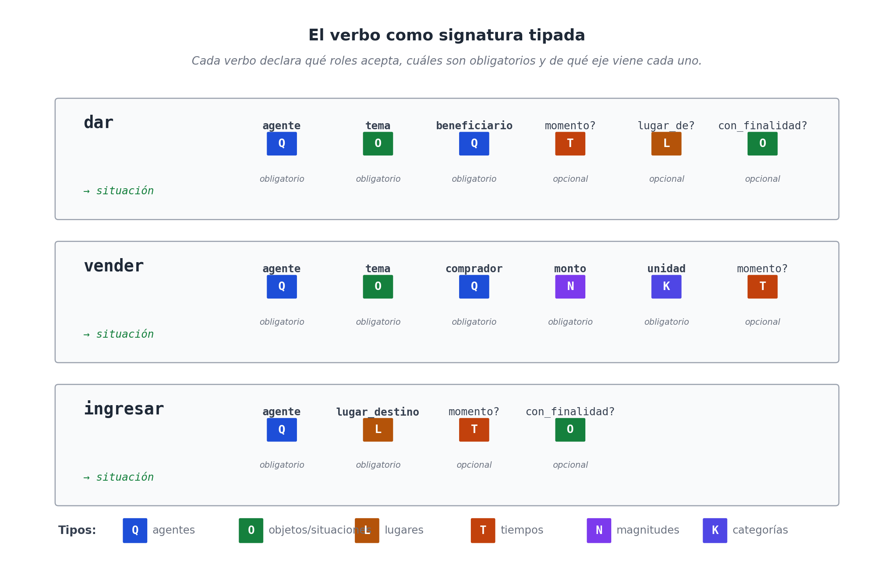
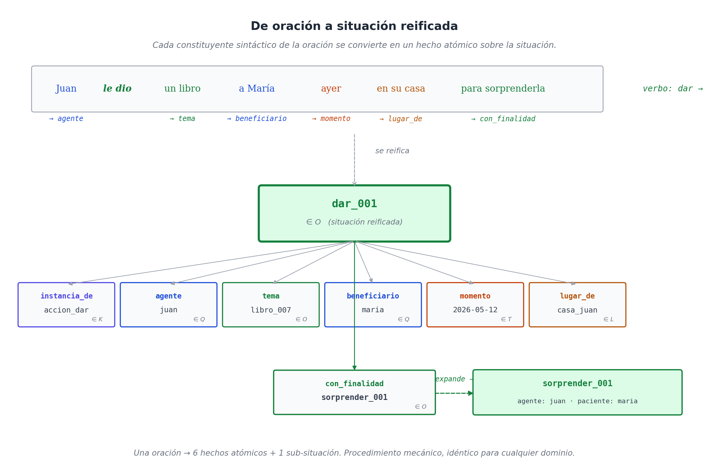

# Capítulo 12 — El verbo: signatura de tipo de la oración

## Lo que descubrió Davidson

En 1967, el filósofo Donald Davidson publicó un artículo de veinte páginas que cambió la manera en que la filosofía analítica y la lingüística formal pensaban las oraciones de acción [12]. El problema que planteó era engañosamente simple. Tomemos esta oración:

> *Juan pateó la pelota.*

Es fácil escribirla como un predicado de dos argumentos: `Patear(juan, pelota)`. Funciona. Pero observemos qué pasa si la oración crece:

> *Juan pateó la pelota con fuerza, en el patio, a las tres de la tarde, para asustar al perro.*

¿Es ahora `Patear(juan, pelota, con_fuerza, patio, 15:00, asustar_perro)`? ¿Un predicado de seis argumentos? ¿Y si agregamos *"con el pie izquierdo"*? ¿Siete? El verbo *patear*, según esta lectura, cambia de aridad cada vez que el hablante decide añadir un modificador. Eso no puede ser correcto: el verbo es el mismo en las dos oraciones.

La propuesta de Davidson fue introducir un argumento adicional, oculto en la sintaxis pero presente en la lógica: **un evento**. La oración no afirma simplemente que Juan pateó la pelota; afirma que **existió un evento de patear**, cuyo agente fue Juan, cuyo objeto fue la pelota, cuya manera fue con fuerza, cuyo lugar fue el patio, cuyo momento fue las tres. El verbo siempre tiene la misma forma básica; los modificadores son predicados sobre el evento.

La generación posterior — Parsons, Castañeda, Higginbotham, Kratzer — llevó esta intuición a su extremo lógico: incluso el sujeto y el objeto directo entran como **roles temáticos** sobre el evento, no como argumentos directos del verbo.

```
∃e [ Patear(e)
    ∧ Agente(e, juan)
    ∧ Tema(e, pelota)
    ∧ Manera(e, con_fuerza)
    ∧ Lugar(e, patio)
    ∧ Momento(e, 15:00)
    ∧ Finalidad(e, asustar_perro) ]
```

Esta es la formulación **neo-davidsoniana**, y es estructuralmente idéntica a lo que WQuestions hace en su núcleo. El evento es una situación en O. Cada rol temático es un hecho atómico con signatura. La oración del español se convierte mecánicamente en un manojo de tripletas sobre el mismo sujeto reificado.

Lo que la lingüística formal lleva sesenta años destilando — la reificación del evento como individuo, los roles como predicados, la apertura a modificadores arbitrarios — es exactamente el aparato que el modelo necesita para hablar el idioma del usuario. No es coincidencia. Es la convergencia, una vez más, de dos tradiciones que estaban resolviendo el mismo problema desde extremos opuestos.

## El verbo nombra un tipo

El primer hecho fundamental: cuando una oración del español contiene un verbo, ese verbo no nombra una acción individual — nombra un **tipo de acción**. *Patear*, *dar*, *vender*, *consultar*, *renunciar*, *llover* no son individuos en O; son categorías en K. Cada categoría tiene asociado un patrón de qué participantes y qué circunstancias pueden o deben aparecer en una situación de ese tipo.

Cuando uno usa un verbo en una oración concreta, dos cosas pasan a la vez:

1. Se **instancia** una situación nueva en O — un individuo reificado, con su identificador propio.
2. Esa situación se etiqueta con `instancia_de` apuntando al tipo en K.

```
(dar_001) ∈ O
(dar_001, instancia_de, accion_dar)   ∈ M(O, K)
```

Esto es exactamente lo que hace una declaración de función en un lenguaje de programación: la función `dar` está definida en algún lado (en K, en el lexicon); cada vez que el programa la *llama*, se crea una invocación particular (en O) que registra qué argumentos se le pasaron.

## El verbo como signatura tipada

La analogía con funciones se profundiza si miramos qué argumentos espera un verbo. *Dar* no acepta cualquier cosa en cualquier posición: espera un agente (alguien que da), un tema (algo que se da), un beneficiario (alguien a quien se da). Opcionalmente, un momento, un lugar, una finalidad. Espera tipos específicos en cada posición: el agente debe ser un Q; el tema, un O; el beneficiario, un Q; el momento, un T; el lugar, un L.

Eso es una **signatura tipada**. Es lo mismo que diría una declaración de función en cualquier lenguaje moderno:

```
dar(agente: Q, tema: O, beneficiario: Q,
    momento?: T, lugar?: L, con_finalidad?: O) → situación
```

Cada verbo del español tiene una signatura así. Algunos son simples:

```
llover(momento?: T, lugar?: L) → situación      // sin agente
soñar(experimentador: Q, tema: O, momento?: T) → situación
costar(tema: O, monto: N, unidad: K) → situación
```

Otros son más complejos:

```
vender(agente: Q, tema: O, comprador: Q, monto: N,
       unidad: K, momento?: T, lugar?: L) → situación

ingresar(agente: Q, lugar_destino: L,
         momento?: T, motivo?: O) → situación
```



Tres consecuencias se siguen directamente de tratar los verbos así.

**Primera consecuencia: la validación se vuelve mecánica.** Si una oración dice *"el aeropuerto pateó la pelota"*, el motor puede objetar antes de aceptar el hecho: el rol `agente` espera un valor en Q (un agente capaz de acción), y `aeropuerto` vive en L. No hay que entender de fútbol para detectar el error; basta con la signatura.

**Segunda consecuencia: los argumentos opcionales son opcionales de verdad.** *Llovió* es una oración completa; no hace falta especificar dónde ni cuándo si el contexto los proporciona o si no importan. La signatura declara qué es obligatorio y qué es opcional, igual que una función con valores por defecto.

**Tercera consecuencia: el verbo carga su propio inventario de modificadores admisibles.** *Patear* admite `manera`, `instrumento`, `con_finalidad`. *Llover* admite `intensidad`, `duracion`. No tiene sentido decir *"pateó con intensidad alta"* — eso es lo que se dice de la lluvia. La signatura captura esa intuición sin tener que listar reglas pragmáticas.

## De oración a situación, paso a paso

Tomemos una oración cargada y desarmémosla con el procedimiento. Volveré al ejemplo clásico, ahora con todos sus complementos:

> *Juan le dio un libro a María ayer en su casa para sorprenderla.*

El procedimiento es mecánico, casi tonto en su simplicidad.

**Paso 1 — Identificar el verbo principal.** *Dio* (pretérito de *dar*). La signatura del verbo `dar` en el lexicon es la que vimos arriba.

**Paso 2 — Reificar la situación.** Generamos un identificador interno (UUID v7) — llamémoslo `dar_001`. Ese identificador es ahora un punto en O. No tiene aún ninguna propiedad; lo iremos vistiendo con hechos atómicos.

**Paso 3 — Anclar el tipo.** El primer hecho atómico que producimos es la categoría:

```
(dar_001, instancia_de, accion_dar)    ∈ M(O, K)
```

**Paso 4 — Mapear cada constituyente sintáctico a su rol.** El analizador toma cada parte de la oración y la deposita en el rol que su posición sintáctica le asigna.

```
Juan         → sujeto       → agente         → Q
un libro     → OD           → tema           → O
a María      → OI           → beneficiario   → Q
ayer         → adv. tiempo  → momento        → T
en su casa   → adv. lugar   → lugar_de       → L
para sorprenderla → adv. fin → con_finalidad → O
```

Cada flecha del lado derecho produce un hecho atómico:

```
(dar_001, agente,        juan)              ∈ M(O, Q)
(dar_001, tema,          libro_007)         ∈ P(O, O)
(dar_001, beneficiario,  maria)             ∈ P(O, Q)
(dar_001, momento,       2026-05-12)        ∈ P(O, T)
(dar_001, lugar_de,      casa_juan)         ∈ P(O, L)
(dar_001, con_finalidad, sorprender_001)    ∈ M(O, O)
```

**Paso 5 — Recurrir si hay sub-situaciones.** El complemento de finalidad *para sorprenderla* contiene a su vez un verbo (*sorprender*). Aplicamos el mismo procedimiento al subevento:

```
(sorprender_001, instancia_de, accion_sorprender)
(sorprender_001, agente,       juan)         // implícito: el mismo del dar
(sorprender_001, paciente,     maria)        // pronominal
```

Resultado total: **una oración del español → siete hechos atómicos + un sub-evento de tres hechos**. Diez tripletas; sin pérdida de información; sin texto libre; sin convenciones particulares del dominio. El lenguaje natural cedió su contenido al modelo con casi cero fricción.



## El mismo procedimiento en un dominio nuevo

Que el procedimiento es general y no depende del dominio se ve mejor aplicándolo a algo que no sea el ejemplo de manual. Tomemos una oración del dominio de un sauna:

> *Ana ingresó a la cámara de vapor a las seis y media para relajarse.*

Verbo: *ingresar*. Signatura desde el lexicon:

```
ingresar(agente: Q, lugar_destino: L,
         momento?: T, con_finalidad?: O) → situación
```

Reificación y mapeo:

```
(ingresar_017, instancia_de,    accion_ingresar)
(ingresar_017, agente,          cliente_ana)
(ingresar_017, lugar_destino,   camara_vapor_1)
(ingresar_017, momento,         2026-05-15T18:30Z)
(ingresar_017, con_finalidad,   relajacion_001)

(relajacion_001, instancia_de, estado_relajacion)
(relajacion_001, experimentador, cliente_ana)
```

El verbo *ingresar* no comparte signatura con *dar* — sus roles son distintos, los ejes a los que apuntan son distintos. Pero el procedimiento de descomposición es **idéntico**: identificar el verbo, reificar, anclar el tipo, mapear constituyentes a roles, recurrir. Esa uniformidad es lo que hace que el modelo pueda absorber dominios nuevos sin reescribir el motor — el motor solo necesita que el lexicon le diga la signatura del verbo correspondiente.

## Las preguntas-WH son consultas tipadas

La simetría se completa cuando notamos qué hace el lenguaje cuando *pregunta* en lugar de afirmar. Las palabras interrogativas del español — *quién*, *qué*, *dónde*, *cuándo*, *cuánto*, *cuál*, *cómo* — no son palabras cualquiera: son **proyecciones tipadas sobre roles**.

Tomemos la situación `dar_001` que armamos arriba. Cada pregunta-WH sobre la oración original corresponde a una consulta del modelo, donde una posición se deja como variable y el resto fija el contexto:

```
"¿Quién le dio el libro a María?"
   { instancia_de: accion_dar, tema: libro, beneficiario: maria, agente: ? } → Q

"¿Qué le dio Juan a María?"
   { ..., agente: juan, beneficiario: maria, tema: ? }                       → O

"¿A quién le dio Juan el libro?"
   { ..., agente: juan, tema: libro, beneficiario: ? }                       → Q

"¿Cuándo se lo dio?"
   { ..., momento: ? }                                                       → T

"¿Dónde se lo dio?"
   { ..., lugar_de: ? }                                                      → L

"¿Para qué se lo dio?"
   { ..., con_finalidad: ? }                                                 → O
```

Cada pregunta queda definida por dos cosas: el patrón de roles fijos (lo que se sabe) y la posición vacía (lo que se pregunta). La posición vacía tiene tipo — está restringida al eje del rol — porque la signatura del verbo lo determina. Esto significa que el motor de consulta no tiene que ser distinto del motor de ingesta: ambos operan sobre patrones de hechos atómicos, unos buscando coincidencias completas para almacenar, otros buscando coincidencias parciales para responder.

La razón histórica de esta simetría es probablemente más profunda de lo que parece. Las palabras-WH del español son herederas directas de las *circumstantiae* de Cicerón [2], que a su vez codificaron en gramática lo que la cognición humana ya hacía: indexar los hechos por las preguntas que se les pueden plantear. El neo-davidsoniano lo redescubrió por la vía formal; el modelo lo reaprovecha como interfaz natural.

## Cláusulas embebidas: lo que dice o piensa otro

Hay un caso que vale la pena verificar para confirmar que el procedimiento aguanta composición arbitraria. ¿Qué pasa cuando una oración habla de otra oración?

> *El cliente dijo que la cámara seca estaba muy caliente.*

El verbo principal es *decir*. Su signatura:

```
decir(agente: Q, tema: O, [momento?: T], [destinatario?: Q]) → situación
```

El `tema` de `decir` no es un objeto físico — es **otra situación**. Una afirmación, un reporte, un contenido proposicional. El modelo no se inmuta: una situación puede ser el valor de un rol de otra situación, porque los individuos en O están todos en pie de igualdad.

```
(decir_023, instancia_de,  accion_decir)
(decir_023, agente,        cliente_ana)
(decir_023, tema,          estado_camara_001)
(decir_023, momento,       2026-05-15T19:15Z)

(estado_camara_001, instancia_de,  estado_temperatura)
(estado_camara_001, sujeto,        camara_seca)
(estado_camara_001, calificacion,  muy_caliente)
(estado_camara_001, estatus_factual, reportado_no_verificado)
```

La cláusula embebida produce su propia situación reificada (`estado_camara_001`) que el dicho del cliente toma como tema. El `estatus_factual : reportado_no_verificado` deja claro al motor que esta situación no es un hecho del mundo afirmado por el sistema; es un dicho que el sistema registra. Cuando alguien más vaya a consultar *"¿qué tan caliente está la cámara seca?"*, el motor sabrá que esta evidencia es de segunda mano.

Esto es composición arbitraria: una situación dentro de otra, todas las veces que haga falta. *"María dijo que Juan piensa que Pedro creía que..."* es una pila de situaciones, cada una con su propio agente, su propio momento y su propio `estatus_factual`. El modelo lo aguanta sin agregar un solo mecanismo nuevo.

## El verbo como contrato

Cerremos el capítulo con una idea que conviene dejar nítida. Lo que el verbo provee a la oración es un **contrato de tipos**: una declaración de qué argumentos son obligatorios, qué argumentos son opcionales, y de qué eje viene cada uno. Igual que la signatura de una función en código moderno, el contrato del verbo es **chequeable, ejecutable y consultable**.

Chequeable: si una oración entrante no provee el rol obligatorio o lo provee con el eje equivocado, el motor lo rechaza. Ejecutable: dada una oración bien formada, el procedimiento de reificación es mecánico — siete pasos, cero ambigüedad. Consultable: las preguntas-WH proyectan sobre la misma signatura, buscando lo que la situación ya tiene o no tiene.

Para que todo esto funcione hace falta un componente más: el diccionario que asocia cada verbo del español con su signatura canónica. Ese diccionario es el **lexicon**, y es lo que el próximo capítulo desarrolla — no como un anexo léxico aburrido, sino como **la pieza más visible y más decisiva del proyecto**, la que decide si un usuario humano (o un modelo de lenguaje) puede hablarle al sistema en su propio idioma.
