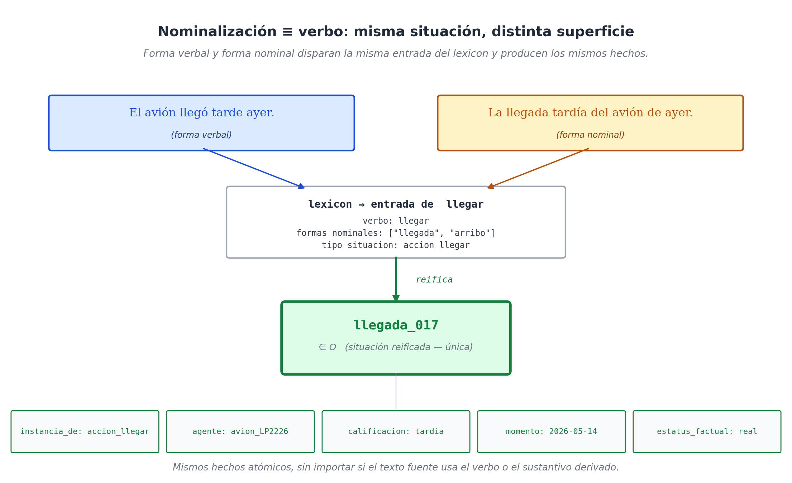
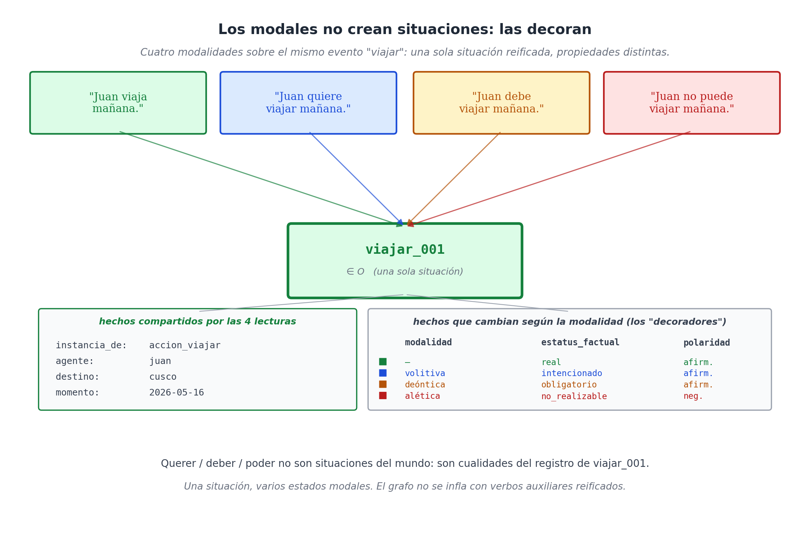

# Capítulo 14 — Cuando el lenguaje aprieta: nominalizaciones, modales e idiomas

## Tres frases que harían explotar a un robot

Tomemos tres oraciones que cualquier hispanohablante entiende sin esfuerzo, pero que harían cortocircuito en un sistema diseñado únicamente con las reglas mecánicas que vimos en el capítulo 12:

* La llegada tardía del avión causó la cancelación de la conexión.
* El cliente quería contratar el plan mensual pero no podía pagarlo todavía.
* La doctora le tomó el pelo al residente nuevo durante la guardia.

Si un robot ingenuo intentara procesar esto buscando "verbos de acción", el desastre sería total. 
En la primera frase, el robot buscaría un verbo de acción y se encontraría con "causó", pero la verdadera carne de la frase (la llegada y la cancelación) están escondidas bajo disfraces de sustantivos. 
En la segunda frase, el sistema crearía un evento oficial llamado "querer" y otro evento llamado "poder", que son cosas que no existen en el mundo físico, separándolos del evento real que es "contratar". 
En la tercera frase, el robot crearía un evento de "tomar" donde el objeto físico arrebatado es "el pelo" de un médico. Ridículo. Todos sabemos que *tomar el pelo* significa **bromear o engañar amistosamente**, y no tiene nada que ver con robar cabello.

Estos tres escenarios —las **nominalizaciones** (verbos disfrazados de sustantivos), los **modales** (verbos de intención) y los **idiomas** (frases hechas)— son las pruebas de fuego para cualquier arquitectura de datos. En este capítulo no venimos a presumir de que nuestro modelo tiene una varita mágica para resolverlos; venimos a mostrarte con qué reglas exactas los absorbemos y en qué rincones oscuros todavía nos cuesta trabajo.

## Nominalización: El verbo disfrazado de sustantivo

El español tiene una habilidad fascinante para convertir acciones en cosas. El verbo *llegar* se vuelve *la llegada*; *vender* se vuelve *la venta*; *consultar* se vuelve *la consulta*. A esta mutación gramatical se le llama **nominalización**. 

Para la mente humana, decir *"el avión llegó"* o *"la llegada del avión"* es exactamente lo mismo. Y para nuestra base de datos, también debe serlo.

La regla de arquitectura aquí es vital: **una nominalización no es un evento nuevo; es exactamente la misma situación reificada, pero con otro empaque gramatical**. La frase *"la llegada"* no necesita que inventemos un eje nuevo, solo necesita que el Lexicon sea lo suficientemente inteligente para saber que "llegada" es un alias que dispara el mismo evento que "llegar".

Desarmemos la primera oración problemática:
> *La llegada tardía del avión causó la cancelación de la conexión.*

```text
(llegada_017, instancia_de,    accion_llegar)
(llegada_017, agente,          avion_LP2226)
(llegada_017, estatus_factual, real)
(llegada_017, calificacion,    tardia)
(llegada_017, momento,         2026-05-15T11:47Z)

(cancelacion_004, instancia_de, accion_cancelar)
(cancelacion_004, tema,         conexion_lima_arica)
(cancelacion_004, estatus_factual, real)

(cancelacion_004, causado_por,  llegada_017)    ← El conector clave (Eje M)
```

Fíjate en lo que acabamos de lograr. Dos sustantivos ("llegada" y "cancelación") produjeron dos situaciones oficiales en la caja `O`. Y el verbo "causó", que un robot ingenuo habría convertido en un evento tonto, nosotros lo convertimos en el cable `causado_por` que vimos en el capítulo 11. El resultado es un código limpio y perfecto.



¿Cómo logramos que el sistema haga esto solo? Le decimos al Lexicon que acepte formas nominales:

```yaml
verbo: llegar
  formas_nominales: ["llegada", "arribo"]  ← El truco está aquí
  tipo_situacion: accion_llegar
  obligatorios:   [agente]
```

La ganancia comercial de esto es inmensa: a la base de datos le da exactamente igual si un médico escribe *"Diagnostiqué al paciente con asma"* o *"El diagnóstico de asma del paciente"*. La maquinaria extrae los datos y genera los mismos cables, ignorando la poesía del redactor.

## Modales: Decorando eventos que no han ocurrido

Los verbos modales (*querer, deber, poder, soler, parecer*) son una trampa mortal para las bases de datos. Parecen verbos principales, pero en realidad son **modificadores** de un segundo verbo. 

Si un cliente dice *"Quiero viajar"*, no está realizando un evento de "querer" por un lado y un evento de "viajar" por otro. Lo que hay es **una sola situación (viajar)** que tiene pegada una etiqueta de intención, avisando que todavía no ocurre.

Si convirtiéramos cada "querer" y "poder" en un evento oficial en la base de datos, multiplicaríamos el tamaño de los discos duros por cuatro, llenando el sistema de basura abstracta. Para evitarlo, nuestro modelo trata a los modales simplemente como **decoraciones** (propiedades) sobre el evento principal.

Observemos cómo se desarma la segunda oración:
> *El cliente quería contratar el plan mensual pero no podía pagarlo todavía.*

```text
(contratar_017, instancia_de,    accion_contratar)
(contratar_017, agente,          cliente_003)
(contratar_017, tema,            plan_mensual_oasis)
(contratar_017, modalidad,       volitiva)          ← Es un deseo
(contratar_017, estatus_factual, intencionado)      ← Aún no pasa

(pagar_017, instancia_de,    accion_pagar)
(pagar_017, agente,          cliente_003)
(pagar_017, tema,            plan_mensual_oasis)
(pagar_017, modalidad,       alética)               ← Se trata de una capacidad
(pagar_017, polaridad,       negativa)              ← No tiene la capacidad
(pagar_017, estatus_factual, no_realizable)

(pagar_017, contrasta_con, contratar_017)           ← Conector para el "pero"
```

Generamos dos situaciones (`contratar` y `pagar`), no cuatro. El "querer" se guardó como `modalidad: volitiva`, y el "no poder" como `polaridad: negativa`. Ahorramos espacio, evitamos crear nodos fantasma y mantuvimos la regla de oro: **una situación en el mundo real equivale a una situación en el sistema**.



*(Nota técnica: Si alguien dice "Pedro quiere a María", ahí el verbo querer significa "amar", no es un modal. El Lexicon es lo suficientemente listo para distinguir que "querer + verbo" es un modal, y "querer + persona" es un evento emocional).*

## Expresiones Idiomáticas: Cuando las palabras mienten

Llegamos a la tercera oración y al problema más espinoso. Frases como *tomar el pelo* (bromear), *dar a luz* (parir), o *ponerse las pilas* (esforzarse) no pueden separarse palabra por palabra. El lenguaje humano está plagado de estas trampas.

La solución arquitectónica ya la planteamos en el Capítulo 13: **en nuestro Lexicon, la unidad de traducción no es la palabra suelta, es el patrón completo**. Las frases hechas se registran en el diccionario como reglas fijas que apuntan a sus verdaderos significados:

```yaml
tomar [el_pelo a Q]
  tipo_situacion: accion_bromear
  obligatorios:   [agente, paciente]
  ejemplo:        "la doctora le tomó el pelo al residente"
  notas:          Frase idiomática; ignorar relación con el cabello humano.

dar [a_luz a Q]
  tipo_situacion: accion_parir
  obligatorios:   [agente, paciente]
  ejemplo:        "dio a luz a una niña sana"
```

El sistema lee de lo más específico a lo más general. Si ve *"tomar el pelo"*, ejecuta la regla de bromear. Si ve *"tomar la orden"*, ejecuta la regla general de recibir. 

El verdadero reto aquí no es técnico, es de escala. El idioma español tiene miles de estas frases. Llenar el Lexicon con todas ellas es un trabajo titánico de años. La buena noticia es que **los modelos de Inteligencia Artificial modernos ya conocen estas frases**. El LLM hace el trabajo pesado de entender la ironía, y nuestro modelo le da la estructura perfecta para guardarla.

## Honradez intelectual: Donde el modelo todavía sufre

Sería deshonesto terminar esta sección fingiendo que nuestro modelo resuelve el 100% de los problemas de la lingüística mundial. Hay terrenos pantanosos donde nuestra arquitectura avanza con dificultad o simplemente cruje. Y un buen ingeniero debe conocer los límites de su propio sistema:

**1. Negaciones complejas:** Decir *"Juan no cree que María vino"* no es lo mismo que *"Juan cree que María no vino"*. El modelo tiene que hacer acrobacias para saber a qué evento exacto le debe pegar la etiqueta de `polaridad: negativa`. A veces los analizadores automáticos se equivocan.
**2. Cuantificación abstracta:** Frases como *"La mayoría de los pacientes mejoran"* no apuntan a una persona concreta (un agente en `Q`). Obliga al sistema a crear eventos sobre "clases enteras de personas", lo cual vuelve la matemática mucho más pesada.
**3. El tono exacto del tiempo:** El español distingue magistralmente entre *empezó a hablar*, *estaba hablando*, *terminó de hablar* y *acababa de hablar*. El modelo captura el núcleo temporal, pero para atrapar esas micro-diferencias se ve obligado a reificar "fases del evento", lo cual infla el sistema.
**4. Lo que no se dice (Presuposiciones):** Si digo *"Juan dejó de fumar"*, el lenguaje da por hecho que Juan fumaba en el pasado. El modelo guardará el "dejar de fumar" de hoy, pero no es capaz de deducir mágicamente el hábito del pasado y guardarlo. Dependemos de que una IA superior haga esa deducción y nos la envíe.
**5. Sarcasmo e indirectas:** *"¿Puedes pasarme la sal?"* gramaticalmente es una pregunta sobre la capacidad física de una persona. Pragmáticamente es una orden. El modelo es literal; la comprensión del sarcasmo depende del Lexicon o de la IA conectada a él.

Estos problemas no son defectos de nuestro software; son los misterios sin resolver de las ciencias cognitivas en las últimas cinco décadas. Lo importante es que cuando el modelo choca con estos muros, **no se rompe ni borra la base de datos**; simplemente guarda una representación parcial y segura, esperando a que un humano o una IA futura lo refine.

## Cierre de la Parte IV: El pacto entre el Grafo y la Inteligencia Artificial

Quiero cerrar esta parte teórica con una reflexión vital para la era moderna. Hoy en día, herramientas como ChatGPT o Claude pueden procesar libros enteros en segundos. Muchos ingenieros de empresas piensan: *"¿Para qué necesito este complejo modelo de WQuestions? Simplemente tiraré los 50.000 PDFs de mi empresa en la IA y que ella busque las respuestas sola"*.

Sí, eso funciona. Pero es un desastre financiero y técnico. Primero, porque gastas un dineral en "tokens" (poder de cómputo) haciéndole leer texto basura mil veces. Segundo, porque el texto humano es **terriblemente ambiguo**. Una historia clínica de cinco páginas en texto plano está llena de "él", "ella", "eso", y la IA tiene que adivinar a quién se refiere. 

En cambio, si procesas esa historia clínica usando el Lexicon y la conviertes en **un grafo de hechos atómicos (WQuestions)**, reduces esas cinco páginas a unas cuantas líneas de código matemático y estructurado. 

El Grafo y la Inteligencia Artificial no compiten; tienen una relación **simbiótica**:
*   La IA es la mente brillante y creativa: entiende el sarcasmo, maneja el contexto y habla bonito.
*   El modelo WQuestions es el disco duro de titanio: no olvida, no confunde a Juan con Pedro, audita reglas y sabe exactamente qué cosas son intenciones y cuáles son hechos reales.

Cuando pones a la IA como el recepcionista que charla con el usuario y al Grafo como el archivo de acero detrás de él, obtienes el sistema corporativo perfecto.

Y con esto, terminamos la teoría pura. En la **Parte V**, nos mancharemos las manos. Dejaremos la academia atrás y aplicaremos este modelo de extremo a extremo en industrias reales y concretas.