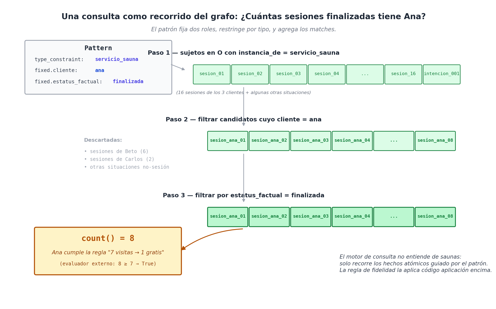

# Capítulo 15 — Modelando un negocio completo: El caso de un Spa

## La Parte V empieza con código real

Hasta este punto, el libro ha sido un viaje conceptual. Te he explicado cada decisión de diseño utilizando ejemplos pequeños y aislados (*Marta vende un libro, Ana ingresa a la cámara de vapor, Carlos cambia de ciudad*). Pero, siendo honestos, ninguna arquitectura de software puede llamarse "universal" si no es capaz de sostener un negocio entero de principio a fin.

La Parte V cambia las reglas del juego. A partir de aquí, cada capítulo tomará una empresa completa y te mostrará cómo nuestro modelo absorbe toda su operación diaria. Y lo más importante: **lo haremos con código real que tú puedes ejecutar**.

El código base que acompaña a este libro (escrito en Python) no es un juguete académico. Es un prototipo honesto de unas 2.250 líneas que demuestra que todo lo que hemos prometido es verdad. Los ocho ejes, los hechos atómicos, las situaciones reificadas, el catálogo de roles, el Lexicon y los cables del "por qué" existen en ese código y funcionan.

Para abrir esta sección, elegí un negocio que todos entendemos al instante: un **Spa comercial de barrio**. Un negocio pequeño pero engañosamente complejo. El Spa tiene clientes, sesiones, habitaciones calientes, horarios, precios, planes mensuales, promociones cruzadas, tarjetas de fidelidad, venta de jugos y recomendaciones de salud. 

En un solo negocio vamos a utilizar casi todas las herramientas que construimos en las Partes II y III. Veamos cómo se arma.

## El Spa "Oasis" en una página

El negocio funciona así: El Spa Oasis tiene una sede principal con dos cámaras de vapor y una cámara seca (todas operando a 60 grados centígrados). Los clientes pagan 20 dólares por sesión. El protocolo de salud recomienda estar veinte minutos en cada cámara y finalizar con una ducha de agua helada, lo que produce una relajación profunda.

Además, el negocio tiene reglas comerciales:
   **Fidelidad:** Si vienes siete veces, la octava sesión es gratis.
   **Planes mensuales:** Por una cuota fija, tienes derecho a dos sesiones por semana.
   **Inventario:** El local también vende jugos y ensaladas de frutas.

Usaremos a tres clientes frecuentes (Ana, Beto y Carlos) para poner a prueba nuestro modelo de datos.

## Paso 1: Mapear el negocio en los Seis Ejes

El primer trabajo de cualquier arquitecto de datos es acomodar las entidades del negocio en nuestras famosas "cajas". Si te equivocas aquí, el sistema colapsa después. Así se mapea el Spa Oasis:

   **Q (Quién - Agentes):** Los clientes (Ana, Beto, Carlos), la recepcionista, la masajista. Ojo aquí: la empresa "Spa Oasis" como entidad legal también vive en esta caja, porque es un agente que cobra dinero.
   **O (Qué - Eventos y Objetos):** Las sesiones individuales (`sesion_ana_01`), los pagos con tarjeta, los contratos del plan mensual y las reglas de fidelidad. Todo eso son "cosas que pasan" o "reglas oficiales" y se reifican aquí.
   **L (Dónde - Lugares):** El local, la cámara de vapor 1, la cámara seca y las duchas. *(Dato técnico: las cámaras viven en L porque son lugares donde ocurre la sesión, pero también viven en O porque son máquinas que requieren mantenimiento y tienen una temperatura).*
   **T (Cuándo - El Tiempo):** Fechas exactas de ingreso, rangos de vigencia de las promociones y tiempos de estadía en la ducha.
   **N (Cuánto - Magnitudes):** Los 20 dólares, los 60 grados centígrados de la cámara y el contador de 7 visitas de la tarjeta de fidelidad.
   **K (Clase - El Diccionario Abstracto):** Aquí guardamos las etiquetas del negocio: `servicio_spa`, `servicio_masaje`, estados como `finalizada` o `cancelada`, y las unidades de medida (Dólares, Grados Celsius, Minutos).


## La Sesión: El "Nudo" central del negocio

Si tuviéramos que elegir el evento más importante de toda la base de datos de esta empresa, sería **La Sesión**. Todo lo demás orbita a su alrededor: quién la tomó, dónde fue, a qué hora, cuánto costó y si la pagó en efectivo o usó su tarjeta de fidelidad.

En nuestro modelo, la sesión número siete de Ana se guarda como una lista limpia de hechos atómicos (cables P y M):

```text
(sesion_ana_07) ∈ O
  instancia_de    : servicio_spa
  cliente         : ana                              
  lugar_de        : camara_vapor_1                   
  inicio          : 2026-04-22T18:00Z                
  fin             : 2026-04-22T18:40Z                
  estatus_factual : finalizada                       
```

En el código Python real, esto se construye y se guarda en la base de datos con una orden pequeñita de cinco líneas de código:

```python
sit = ingest_situation(u, lex, "tomar",
    roles={
        "cliente":  ana,
        "lugar_de": camara_vapor_1,
        "inicio":   t_inicio,
        "fin":      t_fin,
    },
    complements=["sesion"],         
    extra={"estatus_factual": finalizada},
    sit_id="sesion_ana_07",
)
```

La función `ingest_situation` hace el trabajo sucio que vimos en el Capítulo 12: consulta el Lexicon, desambigua el verbo "tomar", crea el evento, le enchufa los cables y **valida que no haya errores**. Si un programador despistado intenta poner a "Ana" en el campo de `lugar_de`, el sistema aborta la operación al instante y te grita un error de seguridad (`SignatureError`).

## El Lexicon del Spa: Enseñándole a la máquina a hablar

Para que el personal del Spa no tenga que aprender jerga informática, configuramos el Lexicon con las palabras exactas de su negocio.

Aquí resolvemos el clásico problema de la polisemia (el doble sentido) del verbo "tomar":

```python
lex.register(LexiconEntry(
    verb="tomar",
    situation_type="servicio_spa",
    obligatory=["cliente", "lugar_de"],
    pattern=("sesion",),                  # Si dicen "tomar una sesión", activa esta regla.
))

lex.register(LexiconEntry(
    verb="tomar",
    situation_type="accion_bromear",
    obligatory=["agente", "paciente"],
    pattern=("el_pelo",),                 # Si dicen "tomar el pelo", activa la regla de bromear.
))
```

Además, le instalamos el "dialecto corporativo" que vimos en el Capítulo 13, para que la máquina entienda que cuando un empleado dice "cliente", se refiere al `agente` principal:

```python
lex.register_domain_dialect("spa_oasis", {
    "cliente":         "agente",
    "sesion":          "servicio_spa",
    "plan_mensual":    "contrato_servicio",
    "sesion_gratuita": "beneficio_fidelidad",
})
```

Gracias a esto, la recepcionista puede chatear con el sistema diciendo *"El cliente usó su sesión gratuita"* y la base de datos lo traduce mágicamente a sus códigos internos.

## Tres preguntas de negocio reales y cómo las responde el código

El valor de un software se mide por la facilidad con la que responde preguntas financieras y operativas. Veamos cómo nuestro código resuelve tres clásicos problemas de este Spa.

**Consulta 1: ¿Cuántas sesiones lleva Ana este mes?**
El código no tiene que escribir complejas sentencias SQL (JOINs) para cruzar tablas de clientes y ventas. Simplemente busca un patrón en el grafo:

```python
n = count(u, Pattern(
    fixed={"cliente": ana, "estatus_factual": finalizada},
    type_constraint=u.ind("servicio_spa"),
))
```
La máquina busca todos los cables de "servicio de spa" que conecten a "Ana" y que tengan la etiqueta "finalizada", y los cuenta. Es una operación hiperveloz.

**Consulta 2: ¿Ana ya se ganó la sesión gratis?**
La regla del negocio dice que si tienes 7 visitas, la octava es gratis. Esto se calcula simplemente evaluando la variable anterior:
```python
qualifies = n >= 7
```
El modelo no ejecuta la regla solo (para eso necesitas un motor externo de código o una IA), pero el modelo te entrega la información prístina y estructurada para que ese motor tome la decisión correcta sin equivocarse.

**Consulta 3: ¿Dónde vivía el cliente Carlos en el año 2022?**
Resulta que Carlos se mudó de ciudad en enero de 2026. Si nuestro sistema fuera primitivo, la dirección vieja se habría borrado. Pero como nosotros usamos la **Regla de Vigencia (D6)** que aprendimos antes, la mudanza se guardó como un evento con fechas de inicio y fin. 
La búsqueda se hace así:

```python
# Preguntamos por la residencia en 2022
res_2022 = query(u, ..., at=datetime(2022, 6, 1))
# El sistema responde: "ciudad_a"

# Preguntamos por la residencia actual (2027)
res_2027 = query(u, ..., at=datetime(2027, 6, 1))
# El sistema responde: "ciudad_b"
```
El sistema nunca olvida. Navega por el tiempo como si fuera una dimensión más.



## El ADN de las explicaciones: Los cables del "Por qué"

En un negocio real, saber *qué* pasó no es suficiente; necesitas saber *por qué* pasó. Aquí es donde los cuatro cables especiales del Capítulo 11 brillan con luz propia.

**1. El placer físico de la ducha (El cable `causado_por`)**
Ana termina su sauna con una ducha helada. Según los médicos del local, esto causa relajación. En la base de datos se guarda así:

```text
(ducha_fria_001,       parte_de,        sesion_ana_08)
(ducha_fria_001,       justificado_por, recomendacion_del_local)  ← Regla normativa

(satisfaccion_ana_001, causado_por,     ducha_fria_001)           ← Reacción física
```
Mira cómo un solo evento (la ducha) se conecta con dos realidades distintas: está **justificada** por el manual del local, pero **causa** un efecto físico en la clienta. No mezclamos ambas cosas en un solo campo de "observaciones". 

**2. El cliente que casi compra (El cable del `estatus_factual`)**
Ana quería comprar el plan mensual del gimnasio, pero no tenía dinero en ese momento. En cualquier base de datos tradicional, este dato se pierde o se anota en un post-it. En WQuestions, se guarda formalmente como una "intención":

```text
(intencion_ana_001, instancia_de,    contrato_servicio)
(intencion_ana_001, cliente,         ana)
(intencion_ana_001, modalidad,       volitiva)          ← Ella quería hacerlo
(intencion_ana_001, estatus_factual, intencionado)      ← Pero aún no es un contrato real
```
Cuando el equipo de marketing pregunte: *"¿Qué clientes tienen un plan mensual activo?"*, el sistema filtra por estatus `real` y Ana no aparece (no le cobrarán por error). Pero cuando marketing pregunte: *"¿A qué clientes podemos llamar para ofrecer un descuento?"*, filtran por estatus `intencionado` y el nombre de Ana salta a la luz.

## Balance del Spa: Misión Cumplida

Cerremos este capítulo revisando qué logró demostrar nuestro prototipo de código en la vida real:

   **Los 8 ejes funcionan juntos:** Manejamos 4 personas, 32 situaciones, 7 lugares, decenas de horarios, magnitudes de dinero y 17 categorías de servicios, todo en la misma estructura.
   **Ahorro brutal de espacio:** 184 hechos atómicos bastaron para describir un mes entero de operaciones con todos los lujos y detalles. Para hacer lo mismo en una base de datos antigua (SQL), tendríamos que haber programado docenas de tablas complejas.
   **Diez pruebas de seguridad superadas:** El sistema contó la fidelidad, separó las intenciones de las ventas reales, soportó la polisemia de las palabras y navegó por el pasado sin romperse ni una sola vez.
   **Cero parches en el código:** Todo el Spa se logró modelar utilizando únicamente los 38 cables base (roles) de nuestra arquitectura. No tuvimos que inventar ingeniería nueva.

El Spa Oasis fue un cliente amable y relajado. Pero el verdadero fuego de la prueba vendrá en el próximo capítulo, cuando intentemos modelar un **aplicativo de taxis estilo Uber**. 

El taxi es un monstruo despiadado: lidiaremos con GPS en tiempo real, viajes que cambian de estado cada cinco segundos y una red donde los conductores, la aplicación y los clientes pelean por tomar decisiones simultáneas. Ahí es donde WQuestions demostrará si tiene lo necesario para dominar el Big Data en tiempo real.