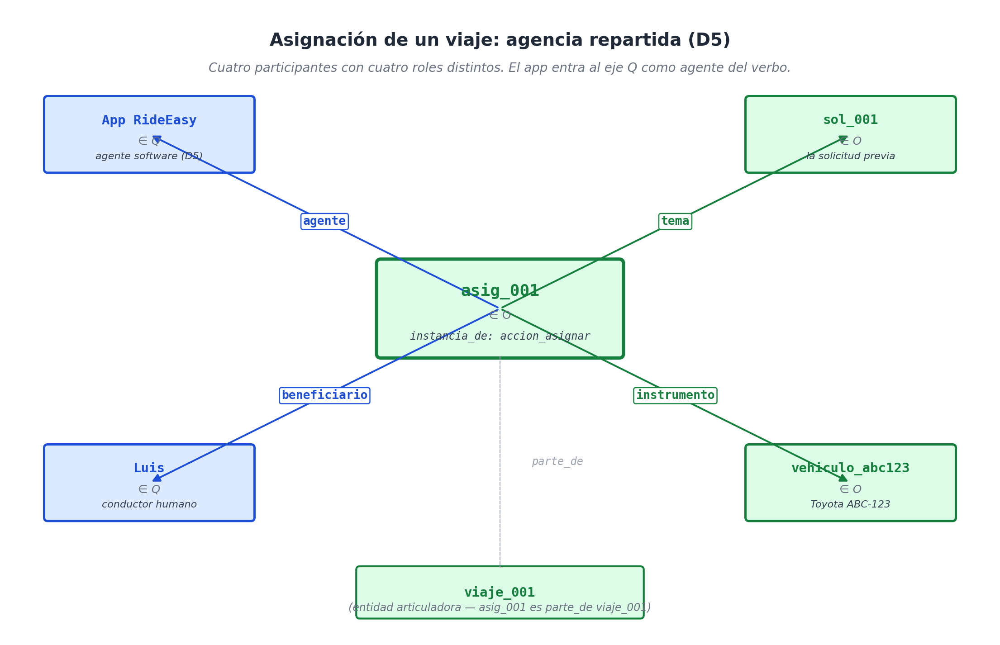

# Capítulo 16 — Un servicio on-demand: el app de taxi

## El gesto que dispara una cadena de eventos

Valeria sale de un edificio en la plaza principal a las dos y media de la tarde, abre la aplicación de taxis en su celular y toca el botón de "Pedir viaje". Treinta y cinco minutos después, se baja en el aeropuerto. 

A los ojos de Valeria, esto fue un solo evento. Pero si miramos los discos duros de Uber o Cabify, entre el momento en que ella tocó el botón y el momento en que se bajó del auto ocurrieron muchísimas cosas: el sistema buscó conductores cercanos, eligió a uno, el conductor aceptó, manejó hasta la plaza, recogió a Valeria, condujo hasta el aeropuerto y finalizó el viaje. Cada uno de esos pasos dejó huellas digitales, generó un cobro, alteró el tráfico y quizás produjo un reclamo que alguien en soporte técnico tuvo que revisar.

Visto desde la ingeniería de datos, **un viaje en taxi no es un evento; es una cadena de seis o siete situaciones distintas que ocurren una tras otra**, donde entran y salen diferentes protagonistas, con relojes cronometrados al segundo, y con reglas matemáticas que dependen del tráfico en tiempo real. 

El capítulo anterior (el del Spa) fue como modelar un estanque tranquilo: el cliente llega a su sauna, se relaja y se va. Este capítulo nos lanza a los rápidos: aquí lidiaremos con la **pluralidad de agentes** (humanos y robots tomando decisiones a la vez), el **encadenamiento rápido de eventos** y la **causalidad emergente** (como cuando el precio del viaje sube de golpe porque hay lluvia o alta demanda). Veamos cómo nuestra arquitectura absorbe este caos sin inmutarse.

## Cuatro agentes en una sola transacción

Si le preguntamos a cualquier persona *"¿quién está participando en el viaje?"*, la respuesta obvia es: Valeria y su conductor, Luis. Pero en nuestro sistema hay dos participantes más que suelen pasar desapercibidos: **el App** (un robot de software que toma decisiones autónomas) y **el vehículo** (la máquina física que permite el traslado).

Para que la base de datos sea auditable, necesitamos registrar el trabajo de los cuatro. Aquí es donde nuestra **Regla de Diseño D5 (La agencia contextual)** brilla con todo su esplendor. El App no es solo un programa tonto; es el protagonista absoluto del verbo *asignar*. Es el algoritmo —no Valeria, no Luis— quien decidió darle ese viaje a ese conductor. Por lo tanto, convertimos al algoritmo en un agente con identidad propia.

Observa cómo se enchufan los cables de esta decisión en nuestro código (las cinco líneas que generan la orden):

```python
asig = ingest_situation(u, lex, "asignar", roles={
    "agente":       app,            # ¡EL ALGORITMO VIVE EN EL EJE Q!
    "tema":         solicitud_v,    # Qué cosa se asigna: el pedido de Valeria
    "beneficiario": luis,           # A quién se le asigna: al conductor
    "instrumento":  vehiculo,       # Con qué se hará el trabajo: el coche
    "momento":      at(1),          # La hora exacta
}, sit_id="asig_001")
```

En un solo evento tenemos cuatro participantes cumpliendo roles perfectos. El algoritmo de la App entra a la caja de las personas (`Q`) como un agente más, capaz de tomar decisiones. El vehículo entra a la caja de objetos (`O`) actuando como el *instrumento* del trabajo. Y los dos humanos ocupan sus roles habituales.



*(Aclaración técnica: Notarás que el vehículo vive en la caja de objetos `O`. Aunque un coche inteligente tiene GPS y "hace cosas", casi siempre actúa como el instrumento del humano. Si mañana necesitamos auditar al GPS del coche porque tomó una curva peligrosa solo, simplemente creamos un agente "GPS" en la caja `Q` y lo vinculamos al coche físico. Nuestro modelo no te obliga a elegir entre humano o máquina; acepta a ambos).*

## La cadena de las seis situaciones

Cronológicamente, el viaje de Valeria genera seis eventos reificados (es decir, seis nodos independientes en la base de datos):

```text
solicitar  →  asignar  →  aceptar  →  recoger  →  trasladar  →  completar
   14:30      14:31      14:32      14:38       14:40         15:05
```

Las flechas que ves ahí arriba no son dibujos ilustrativos; son cables reales en nuestro sistema llamados `precede` y `sigue_a`. Esto es oro puro. Significa que el sistema sabe el orden exacto de los eventos sin tener que hacer tediosos cálculos matemáticos restando horas de reloj. Si le preguntas a la máquina: *"¿Qué pasó justo después de que Luis aceptara el viaje?"*, el sistema simplemente sigue el cable al nodo siguiente y te responde al instante.

Pero el tiempo no es lo único que importa. Algunos eventos ocurren como **consecuencia** del evento anterior. El algoritmo no le asignó el viaje a Luis por pura casualidad a las 14:31; lo hizo **porque** Valeria tocó el botón un minuto antes. Para guardar esa causalidad, usamos el cable `motivado_por` que vimos en el Capítulo 11:

```text
(asignacion_001, motivado_por, solicitud_001)
```

Y el hecho de que Luis recoja a Valeria no es solo el "siguiente paso temporal"; es una obligación nacida del momento en que aceptó el viaje:

```text
(recogida_001, sigue_a,      aceptacion_001)  ← Cable temporal
(recogida_001, motivado_por, solicitud_001)   ← Cable de motivo humano
```

Ambos cables (el temporal y el motivacional) conviven en la misma base de datos sin estorbarse. Y ambos son invaluables: el temporal sirve para hacer cálculos de velocidad; el motivacional sirve para que un auditor entienda por qué se tomaron las decisiones.


**El truco final:** Para que estos seis eventos no queden flotando como basura suelta en el servidor, los agrupamos a todos bajo una "carpeta maestra". Creamos un evento gigante llamado `viaje_001` y conectamos a los otros seis eventos a él usando el cable `parte_de`. 
El `viaje_001` es la unidad comercial real; es a este nodo al que le pegamos la factura final y al que acude soporte técnico si hay un problema.

## Tarifa dinámica (Surge pricing): Explicando el caos del mercado

Este negocio tiene un reto que pone a prueba la estructura de nuestra base de datos: el precio cambia según el clima o el tráfico. Si hay alta demanda o está lloviendo, la tarifa sube. 

Cualquier programador mediocre simplemente le añadiría a la factura un campo numérico que diga: `multiplicador_clima: 1.67`. Funciona para cobrar, pero arruina la auditoría. Si un cliente reclama, no hay forma de explicarle al usuario qué pasó exactamente en su calle a esa hora para cobrarle el doble.

La solución de nuestro modelo (usando la Regla D7) es **reificar el estado del clima o del mercado**, convirtiéndolo en un evento oficial en la caja `O`, y conectarlo al precio final usando el cable `causado_por`:

```python
# 1. Creamos el estado de la calle (Lloviendo y con alta demanda)
estado_demanda = u.add_individual(Individual(id="alta_demanda_14_30", axis=Axis.O))
u.assert_fact(estado_demanda, "lugar_de", plaza)
u.assert_fact(estado_demanda, "momento", at(0))

# 2. Creamos la factura y la conectamos al clima
tarifa = u.add_individual(Individual(id="tarifa_viaje_001", axis=Axis.O))
u.assert_fact(tarifa, "monto", n_25_usd)
u.assert_fact(tarifa, "causado_por", estado_demanda)  ← ¡Aquí está la magia!
```

La diferencia a nivel empresarial es monumental. Si un usuario manda un correo quejándose: *"¿Por qué demonios me cobraron 25 dólares hoy si ayer me costó 15?"*, el sistema lee el cable `causado_por` y le responde al instante: *"Su tarifa fue calculada debido a un evento de Alta Demanda registrado exactamente a las 14:30 en la Plaza Central"*. Sin esta arquitectura, un empleado tendría que bucear horas en registros de tráfico y clima para dar una respuesta decente.

## Cuando las cosas se cancelan (El arte de no borrar nada)

El mundo de los taxis vive de cancelaciones. Alguien pide un auto y se arrepiente; un conductor acepta y luego se le pincha una llanta. La gran duda de los programadores siempre es: *¿Qué hago con el viaje cancelado? ¿Lo borro? ¿Lo marco con color rojo?*

La convención de oro de nuestro modelo es **la inmutabilidad absoluta**: nunca borramos nada, nunca reescribimos el pasado. Una cancelación es, sencillamente, **un nuevo evento** que ataca al evento viejo. Nuestro Lexicon trae un verbo específico para esto:

```python
# Creamos la cancelación oficial
canc = ingest_situation(u, lex, "cancelar", roles={
    "agente":   valeria,
    "tema":     viaje_001,      ← El tema es el viaje anterior
    "momento":  at(62),
}, sit_id="canc_001")

# Enchufamos la cancelación al viaje original
u.assert_fact(canc, "cancela", viaje_001)
u.assert_fact(viaje_001, "estatus_factual", cancelado)
```

Nacieron dos hechos nuevos: la cancelación oficial (con su hora exacta y la persona culpable de hacerla) y una marca de "estado" pegada al viaje original. El viaje antiguo sigue intacto en el disco duro, pero ahora está marcado como muerto. Cuando la empresa quiera calcular las ventas del día, el código simplemente ignora los eventos que tengan la marca "cancelado". La base de datos se vuelve un registro histórico indestructible, perfecto para auditorías legales.

## Tres consultas operativas

Veamos cómo tres preguntas críticas del negocio se resuelven en nuestra base de datos en cuestión de milisegundos:

**Consulta 1 — ¿Adónde llevó Luis a Valeria?**
```python
r = query(u, Pattern(
    fixed={"agente": luis, "paciente": valeria},
    ask={"destino": Var()},
    type_constraint=u.ind("accion_trasladar"),
))
```
El motor rastrea en el mapa geométrico todos los eventos de "trasladar" donde Luis y Valeria coincidan, y escupe el destino (`aeropuerto`).

**Consulta 2 — ¿Cuántos viajes completó Luis hoy?**
```python
n = count(u, Pattern(
    fixed={"agente": luis, "estatus_factual": completado},
    type_constraint=u.ind("viaje"),
))
```
Fíjate en algo asombroso: este código es matemáticamente **idéntico** al que usamos en el Spa para contar las visitas de Ana. La uniformidad de nuestro modelo te permite reciclar código entre empresas que no tienen nada que ver entre sí.

**Consulta 3 — ¿Por qué la tarifa fue de 25 dólares?**
```python
explicaciones = u.facts_about(tarifa_viaje_001)
causa = [f for f in explicaciones if f.role == "causado_por"]
# Resultado: "alta_demanda_14_30"
```
Seguimos el cable causal y obtenemos la justificación matemática. Simple, rápido e indiscutible.

## Resumen: Lo que el Taxi nos enseñó (que el Spa ocultaba)

El Spa fue un calentamiento; el negocio del Taxi nos demostró la resistencia extrema del modelo en tres áreas clave:

1.  **Agentes Robots:** Le dimos poder de decisión al algoritmo (el App). Comprobamos que el sistema no hace distinciones entre un humano y un software a la hora de asignar responsabilidades legales sobre una acción.
2.  **Cadenas de alta velocidad:** Comprobamos que podemos encadenar decenas de microeventos en orden cronológico y guardarlos dentro de una gran "carpeta maestra" (el viaje_001) para no perder el orden del negocio.
3.  **Los "Porqués" del mercado:** Demostramos que podemos convertir conceptos abstractos como "la lluvia" o "el alza de precios" en eventos físicos para justificar cambios matemáticos en las facturas, solucionando el peor dolor de cabeza de los servicios de atención al cliente.

La prueba de código superó las simulaciones. No tuvimos que inventar ningún parche raro ni modificar nuestro diccionario de roles oficiales para sostener a esta empresa transnacional.

## Lo que viene

En el próximo capítulo daremos un salto mortal a un dominio donde un error te puede costar la vida (o la cárcel): **La Historia Clínica Médica**. 

En la clínica no hay viajes rápidos ni tarifas que cambien con la lluvia. En la clínica hay diagnósticos, drogas, contraindicaciones, protocolos hospitalarios y una densidad abrumadora de información médica. Vamos a ver cómo nuestro modelo, que ya dominó los negocios comerciales, se enfrenta a la pesada carga de la ciencia y la vida humana sin desmoronarse.