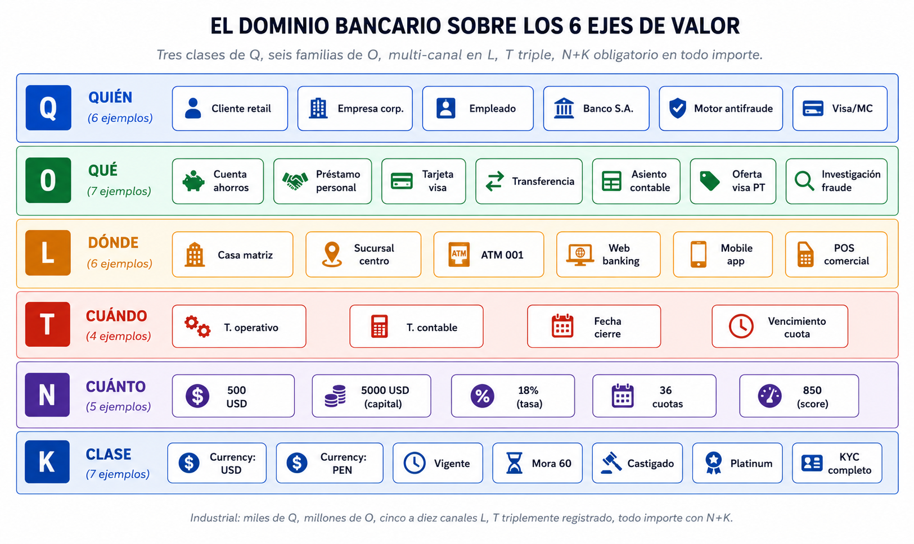
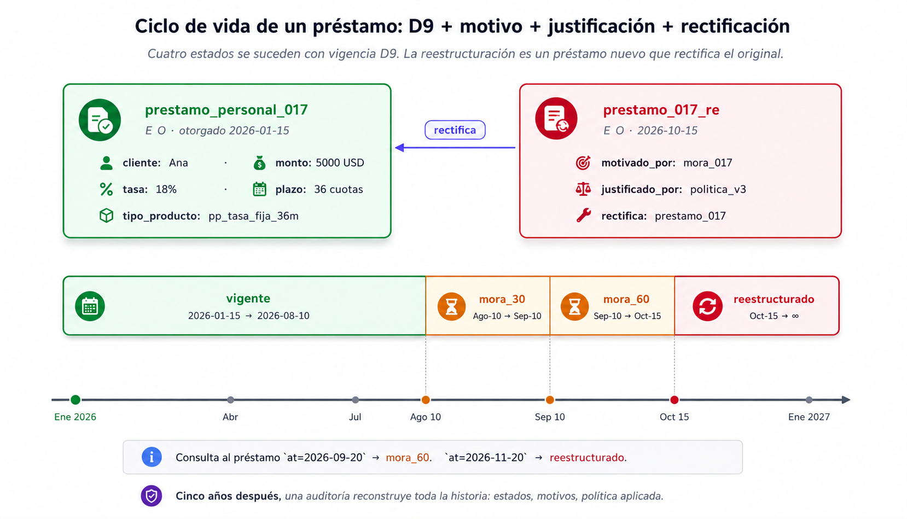

# Capítulo 17 — El dominio más exigente: un banco

## Por qué el banco es la prueba de fuego definitiva

Si miras una empresa promedio, probablemente tenga su información guardada en unas 150 tablas de datos, un par de sistemas viejos y un software contable. Pero si miras un banco regional típico (uno de tamaño mediano), el paisaje es aterrador: tienen 1.500 tablas solo para el corazón del banco, otras mil para las tarjetas de crédito, otras mil para los seguros y docenas de aplicaciones satélites para créditos rápidos, fraudes y la app del celular. Cada sistema tiene sus propios jefes, sus propias reglas y su propio idioma.

Si en el capítulo del Spa probamos que el modelo era ágil, y en el del Taxi probamos que soportaba la velocidad, **el banco es el campo de batalla donde WQuestions demuestra si sirve para el mundo real**. 

Los bancos gastan fortunas intentando mantener arquitecturas tradicionales que se caen a pedazos. Es aquí donde nuestras decisiones de diseño (como no borrar nunca el pasado con la regla D6, o tratar al software como un agente más con la regla D5) dejan de ser lujos teóricos y se convierten en **exigencias de supervivencia dictadas por la ley**.

Este capítulo no pretende modelar un banco entero (necesitaríamos otro libro para eso). Vamos a tomar cuatro situaciones críticas —una transferencia, el ciclo de vida de un préstamo, una investigación por fraude y el catálogo de tarjetas— para demostrar que nuestro modelo aguanta el peso del dinero sin doblarse.

## La triste realidad: Cinco islas que no se hablan

Antes de empezar, seamos honestos sobre cómo funciona un banco por dentro hoy en día. Si trabajas en uno, vas a sonreír; si no, te vas a sorprender. Un banco es un archipiélago de cinco islas desconectadas:

*   **Isla 1 (El Cerebro Central):** Es el servidor principal (el *core bancario*). Aquí viven los saldos, los movimientos oficiales y la contabilidad pesada. Es la "verdad" que el gobierno audita.
*   **Isla 2 (Las Agencias):** Cada sucursal tiene pequeños softwares propios para simular créditos o sacar turnos. Estos programitas toman decisiones todos los días, pero rara vez le explican al Cerebro Central cómo llegaron a esa conclusión.
*   **Isla 3 (Contabilidad):** El zoológico oculto. Parte vive en el servidor, pero otra gran parte vive en gigantescas hojas de Excel que se ajustan a mano a fin de mes. Cuando hay diferencias entre el Cerebro y Contabilidad, suele ganar Contabilidad, pero nadie sabe explicar por qué.
*   **Isla 4 (Los Promotores):** Los agentes de campo que venden créditos en la calle anotan datos en Excel o papeles. Toda esa valiosa información del cliente es "fantasma" hasta el día en que se aprueba el crédito y recién ahí entra al banco.
*   **Isla 5 (Los Reportes):** Cuando el gerente pide un reporte que cruce datos de las cuatro islas anteriores, los ingenieros tardan un mes en armar un túnel temporal que junte todo en un "Data Lake". A veces, los datos no cuadran y el proyecto fracasa.

**¿Por qué pasa esto?** Porque cuando los bancos intentan modernizarse, cometen el error de obligar a todas estas islas a hablar el mismo idioma robótico. Y reprogramar un software viejo de 15 años para que hable el idioma moderno es tan caro que los bancos prefieren dejarlo morir en paz.

**WQuestions cambia el juego por completo.** Nuestro modelo no le exige a la sucursal o a Contabilidad que cambien su software. Solo les exige que **traduzcan** lo que están haciendo y lo envíen a nuestro mapa central (el Grafo) usando su propia jerga. 
Contabilidad envía sus datos hablando de "partidas"; la sucursal envía datos hablando de "simulaciones". Nuestro Lexicon (Capítulo 12) se encarga de traducirlo todo al catálogo universal D8. 


Cada isla sigue operando como siempre, pero ahora la gerencia puede hacerle una pregunta al mapa central y cruzar los datos de todas las islas en milisegundos.

## Mapeando el Banco en nuestras cajas maestras

Para dominar este caos, ordenemos rápidamente las piezas del banco en nuestras cajas de valor:

*   **Q (Quién - Agentes):** Aquí metemos a los clientes físicos, a las empresas (personas jurídicas) y —muy importante— a los **Sistemas**. El motor antifraude o el autorizador de Visa toman decisiones solos; por lo tanto, tienen derecho a vivir en la caja `Q` como agentes activos.
*   **O (Qué - Eventos):** Las cuentas de ahorro, los préstamos, los movimientos de dinero, las tarjetas de crédito, los asientos contables y las investigaciones de fraude. Aquí vive el 90% del peso del banco.
*   **L (Dónde - Lugares):** Sucursales físicas, cajeros automáticos (ATMs) y lugares virtuales como la App móvil o la web. 
*   **T (Cuándo - Tiempos):** Ojo aquí, porque hay triple reloj: la hora a la que el cliente hizo el pago, la hora a la que el servidor lo procesó y la fecha de cierre contable. Nuestro modelo anota los tres.
*   **N (Cuánto - Magnitudes):** Dinero, tasas de interés, plazos y puntajes de riesgo. 
*   **K (Clase - Etiquetas):** Tipos de cuentas, monedas (Dólares, Euros), estados de mora y códigos legales.



## Caso 1: Una transferencia (Cinco agentes ocultos)

A los ojos de un humano, una transferencia es simple: *"Ana le manda $500 a Beto"*. Pero en la base de datos de un banco, este movimiento involucra a cinco agentes y genera registros espejo en contabilidad. Mira cómo lo desglosa nuestro sistema:

Primero, creamos el evento central de la transferencia:
```text
(transferencia_001) ∈ O
  instancia_de:        accion_transferir
  agente:              ana                       ← Agente 1 (Inicia)
  beneficiario:        beto                      ← Agente 2 (Recibe)
  cuenta_origen:       cta_ana_001               
  monto:               n_500_usd                 
  lugar_de:            app_movil_banco           
  autorizado_por:      sistema_web_banco         ← Agente 3 (Da el ok)
  verificado_por:      motor_antifraude          ← Agente 4 (Revisa que no sea robo)
```

Pero la transferencia no se detiene ahí. Detrás del telón, el departamento de Contabilidad (Agente 5) tiene que hacer sus balances. En WQuestions, creamos dos **sub-situaciones** y las colgamos de la transferencia usando el cable `parte_de`:

```text
(asiento_debito_001) ∈ O                           // Le quitamos plata a Ana
  parte_de:        transferencia_001
  cuenta_contable: ahorros_ana_interna
  monto:           500 USD
  tipo_movimiento: debito

(asiento_credito_001) ∈ O                          // Le ponemos plata a Beto
  parte_de:        transferencia_001
  cuenta_contable: ahorros_beto_interna
  monto:           500 USD
  tipo_movimiento: credito
```

Si el día de mañana esta operación resulta estar mal hecha, **jamás la borramos**. Simplemente creamos una "transferencia rectificativa" que ataca a la vieja y la anula. Los bancos están obligados por ley a guardar todo el historial de errores, y nuestra base de datos lo hace por defecto.

## Caso 2: La novela de un Préstamo y la regla del tiempo

Un préstamo no es un evento de un segundo; es una novela que dura años. Se aprueba, se pagan cuotas, el cliente se atrasa (entra en mora) y a veces se reestructura la deuda. En un sistema viejo, la celda "Estado" del préstamo se va borrando y reescribiendo, destruyendo el historial.

Nosotros usamos la **Regla D6 (Vigencia Temporal)**. Cada vez que el préstamo de Ana cambia de estado, no borramos nada; inyectamos una línea nueva con fecha de inicio y fin:

```text
(prestamo_017, estado, vigente,          inicio=2026-01-15, fin=2026-08-10)
(prestamo_017, estado, mora_30_dias,     inicio=2026-08-10, fin=2026-09-10)
(prestamo_017, estado, mora_60_dias,     inicio=2026-09-10, fin=2026-10-15)
(prestamo_017, estado, reestructurado,   inicio=2026-10-15, fin=hoy)
```

Cinco años después, en medio de un juicio, si el juez pregunta: *"¿En qué estado exacto estaba este préstamo el 20 de septiembre de 2026?"*, la base de datos filtra por fecha y responde implacablemente: *"Mora de 30 días"*. Sin D6, los bancos tienen que construir carísimas tablas paralelas solo para guardar estos "fantasmas del pasado".



## Caso 3: CSI Bancario (Investigando un fraude)

Ana llama furiosa: alguien usó su tarjeta para pagar $1.840 en un casino de Las Vegas anoche. El banco tiene que abrir una investigación. Aquí es donde nuestra arquitectura aplasta a la competencia. 

El investigador no necesita ver el saldo de Ana de hoy; necesita viajar en el tiempo a la noche del fraude y preguntar: *¿Dónde creía el banco que estaba Ana anoche? ¿Qué decía el perfil de riesgo a esa hora exacta?* 

```text
(perfil_riesgo_ana_v3, instancia_de, perfil_antifraude,
                       inicio=2026-04-10, fin=2026-05-22)
(perfil_riesgo_ana_v3, score_riesgo, 0.31)
```

Gracias a nuestro diseño, el investigador puede ver que esa noche la tarjeta pasó porque el `score_riesgo` era bajo. Al confirmar el robo, el investigador no borra el pago del casino (el pago fue real y descontó dinero); en su lugar, crea un evento de "reverso" que ataca al original, documentando el porqué:

```text
(reverso_pago_casino, cancela,         autorizacion_original_001)
(reverso_pago_casino, justificado_por, investigacion_fraude_001)
```
El historial queda intacto, el dinero vuelve y el banco tiene pruebas perfectas para el seguro.

## Caso 4: Una Tarjeta Platinum no es una idea, es un objeto

Finalmente, resolvamos un error común de programación. Cuando el banco le da una "Tarjeta Visa Platinum" a Ana, muchos programadores creen que "Visa Platinum" es una categoría abstracta (Caja `K`). Falso. 

La "Oferta Visa Platinum de Enero 2026" es **un objeto real y reificado** (Caja `O`), que tiene anexado un contrato, unas tasas de interés y una fecha de caducidad. 

Cuando el banco le da el plástico a Ana, conectamos la tarjeta de Ana a la oferta específica que estaba vigente ese día:

```text
(visa_platinum_oferta_2026_Q1) ∈ O                  ← El contrato de oferta del banco
  cuota_manejo_mensual:   8 USD
  vigencia:               inicio=Enero, fin=Junio

(tarjeta_ana_001) ∈ O                               ← El plástico que tiene Ana
  cliente:                ana
  cubierto_por:           visa_platinum_oferta_2026_Q1
```

¿Por qué es vital hacer esto? Porque si en julio el banco lanza una versión nueva de la tarjeta que cuesta 10 USD, la tarjeta de Ana no puede subir de precio mágicamente; ella firmó el contrato de la oferta de Enero. Al tratar a los productos financieros como "objetos independientes congelados en el tiempo", el banco evita demandas multimillonarias por cambiar reglas sin avisar.

## Balance: El banco no logró tumbar al modelo

Este capítulo demostró que WQuestions no es un experimento de laboratorio. Observa todo lo que soportó sin trucos sucios:

1.  **Múltiples agentes no humanos:** Sistemas informáticos tomando decisiones y asumiendo responsabilidades legales en el eje `Q`.
2.  **Doble contabilidad paralela:** Eventos que se ramifican en la parte operativa y en la parte contable sin perder la conexión entre sí.
3.  **Auditoría del pasado indestructible:** La regla de vigencia temporal (D6) permitió guardar el rastro de deudas y reglas obsoletas para blindar al banco ante juicios y auditorías.

A nivel conceptual, la arquitectura está lista para la guerra financiera corporativa.