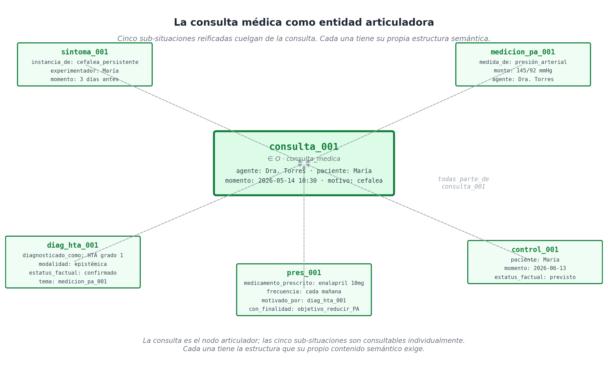

# Capítulo 17 — Un dominio nuevo: la historia clínica

## El cambio de registro

El sauna y el taxi tenían algo en común que pasa desapercibido hasta que uno se sienta a modelar un tercer dominio: eran **transaccionales**. Sus situaciones eran eventos puntuales — *la sesión de Ana*, *el viaje de Valeria*, *el pago de Beto* — con inicio, fin, agente y resultado. Modelar uno es ejercitar las herramientas; modelar el otro es repetirlas con otro vocabulario.

La historia clínica es distinta. Una consulta médica es una situación, sí, pero lo que importa de ella no es el evento sino **el contenido que produce**: un diagnóstico, una prescripción, una contraindicación, un control futuro. Estos son los objetos sobre los que el médico va a razonar durante años — el diagnóstico de hipertensión que sigue válido un año después, la medicación que se ajusta, la regla farmacológica que prohíbe combinar dos fármacos, el síntoma que reaparece. La densidad semántica está dentro de cada situación, no en la sucesión de eventos.

Esto pone al modelo bajo una presión distinta. No basta con que los eventos se encadenen bien: hay que poder hablar de **qué dice cada uno**, con suficiente estructura para que un sistema clínico — o un modelo de lenguaje consultando ese sistema — pueda razonar sobre el contenido. Y hay que poder hacerlo a lo largo del tiempo, porque los diagnósticos cambian, las medicaciones se modifican, las reglas farmacológicas se actualizan. La historia clínica es donde D9 deja de ser elegante y se vuelve indispensable.

Este capítulo modela un caso típico — una consulta de la doctora Torres con María Gonzales por cefalea persistente — y muestra cómo el modelo absorbe la densidad semántica del dominio. Es también, deliberadamente, el primer dominio del libro donde **el modelo encuentra una fricción que aparece más de una vez**: lo que mide, diagnostica o prescribe vive en K, mientras el rol canónico `tema` exige O. Veremos cómo se resuelve y qué nos enseña.

## La consulta como situación articuladora

Igual que el taxi tenía un `viaje` superior que articulaba sus seis sub-situaciones, la consulta médica articula las suyas. Una consulta típica produce cinco objetos de información:

- **El síntoma**: lo que el paciente reporta. *"Cefalea persistente hace tres días."*
- **La medición**: signos vitales tomados durante la consulta. *"Presión arterial 145/92 mmHg."*
- **El diagnóstico**: la conclusión del médico. *"Hipertensión grado 1 confirmada."*
- **La prescripción**: la intervención terapéutica. *"Enalapril 10 mg, cada mañana, indefinido."*
- **El control futuro**: el seguimiento agendado. *"Control en 30 días."*

Las cinco son sub-situaciones reificadas que cuelgan de la consulta por `parte_de`. El grafo queda así:

```
(consulta_001) ∈ O
  instancia_de    : consulta_medica
  agente          : dra_torres
  paciente        : maria_g
  lugar_de        : consultorio_03
  momento         : 2026-05-14T10:30Z
  motivo          : cefalea_persistente
  estatus_factual : real

(sintoma_001    ∈ O, parte_de, consulta_001)
(medicion_001   ∈ O, parte_de, consulta_001)
(diag_hta_001   ∈ O, parte_de, consulta_001)
(pres_001       ∈ O, parte_de, consulta_001)
(control_001    ∈ O, parte_de, consulta_001)
```

El patrón es idéntico al del viaje del taxi: una entidad superior contiene un manojo de sub-situaciones, cada una con su propia estructura. Pero el contenido de cada sub-situación es lo que cambia el carácter del dominio.



## Lo que el modelo descubre: K aparece donde uno espera O

Acá entra la fricción anunciada. Cuando el médico mide la presión arterial, intuitivamente decimos *"la medición tiene como tema la presión arterial"*. Pero **"presión arterial" es una categoría**: es un tipo de variable fisiológica, no un objeto individual con identidad. Vive en K, no en O.

El catálogo D7 declara `tema: O → O`. Una medición cuyo `tema` apuntara a una K rompería esa signatura. Lo mismo pasa con la prescripción: *"prescribir enalapril"* — pero **enalapril es una categoría de medicamento**, no un objeto físico individual. La caja de pastillas que el paciente compra en la farmacia es un O; el principio activo `enalapril_10mg` que la doctora prescribe es K.

El prototipo me obligó a darme cuenta de esto. Al intentar `ingest_situation(...)` con `tema: enalapril`, el catálogo lanzó `SignatureError`. Lo que hubiera sido un detalle imperceptible — y un bug semántico latente — se volvió visible en el primer test.

La solución es directa: usar **roles de dominio específicos** cuya signatura apunte explícitamente a K. La política liberal del modelo (los roles no declarados se aceptan) habilita esto sin tocar el catálogo:

```python
# El medicamento prescrito es una categoría (K), no un objeto.
u.assert_fact(pres, "medicamento_prescrito", enalapril)

# La variable medida es una categoría también.
u.assert_fact(medicion, "medida_de", presion_arterial)
```

Esto deja claras dos cosas. Primero: **el catálogo D7 cubre los roles más universales**, pero cada dominio agrega los suyos con signaturas específicas. Segundo: la fricción no es del modelo — es de mi intuición pidiéndole a `tema` que sea más promiscuo de lo que su signatura permite. El modelo me hizo explícita la distinción O/K que el lenguaje natural mezcla.

Una variante: si quisiéramos canonizar este patrón, podríamos agregar al catálogo un rol `tema_categorico: O → K` que generalice "lo medido/prescrito/diagnosticado cuando es una categoría". Es trabajo pendiente; mientras tanto, los roles de dominio cubren cada caso particular.

## Diagnóstico: certeza, modalidad, vigencia

El diagnóstico merece atención propia, porque combina tres dimensiones que el modelo introdujo en capítulos distintos.

**Primera dimensión: modalidad epistémica.** Un diagnóstico no es una afirmación absoluta del mundo; es una afirmación sobre lo que el médico cree que es cierto, basado en evidencia. El modelo lo refleja con `modalidad: epistemica`. Y la certeza relativa del diagnóstico — *probable*, *posible*, *confirmado*, *descartado* — vive en `estatus_factual`:

```
(diag_hta_001, modalidad,       epistemica)
(diag_hta_001, estatus_factual, confirmado)
```

**Segunda dimensión: causalidad evidencial.** Un diagnóstico se construye a partir de evidencia. El de hipertensión está basado en la medición que la precedió. El modelo lo expresa con `motivado_por` y, opcionalmente, `tema`:

```
(diag_hta_001, tema, medicion_pa_001)
```

La medición no es solo un dato suelto: es **fundamento del diagnóstico**. Cuando un colega revisa el diagnóstico, el grafo le da la evidencia con un salto.

**Tercera dimensión: vigencia.** Y esta es la pieza que el dominio clínico exige sin negociación. Un diagnóstico no es eterno: se confirma, se modifica, se reemplaza. Si la hipertensión que en mayo de 2026 fue grado 1 se reclasifica en enero de 2027 como grado 2, el grafo necesita preservar **ambos** estados — el viejo y el nuevo — con sus rangos de vigencia. D9 hace exactamente eso:

```python
# Diagnóstico original (vigente hasta el rediagnóstico)
u.assert_fact(diag, "diagnosticado_como", hta_g1,
              valid_from=t_consulta, valid_to=t_redx)

# Rediagnóstico (vigente desde T1, abierto al futuro)
u.assert_fact(diag2, "diagnosticado_como", hta_g2,
              valid_from=t_redx)
u.assert_fact(diag2, "rectifica", diag)
```

La consulta *"¿qué diagnóstico activo tenía María en agosto 2026?"* devuelve HTA grado 1; *"¿y en marzo de 2027?"* devuelve grado 2. La misma consulta, parametrizada por `at`, recupera la verdad clínica de cualquier momento. La relación `rectifica` deja explícito que el rediagnóstico no es un diagnóstico nuevo independiente, sino una corrección/actualización del original.


Esta capacidad — **consultar el pasado tal como era**, no como lo reescribimos después — es lo que distingue un sistema clínico auditable de uno que solo guarda el estado actual. En un litigio por mala praxis, en una revisión de cohorte para estudio epidemiológico, en una auditoría de calidad, lo único que sirve es lo que el sistema sabía en el momento. El modelo trata esto como **propiedad estructural**, no como funcionalidad añadida.

## Prescripción: finalidad, motivo, contraindicación

La prescripción es donde varias relaciones del "por qué" coexisten sobre una misma situación. Veamos:

```python
pres = ingest_situation(u, lex, "prescribir", roles={
    "agente":                dra_torres,
    "paciente":              maria_g,
    "medicamento_prescrito": enalapril,
    "frecuencia":            cada_manana,
    "duracion":              indefinida,
    "momento":               at(0),
})

u.assert_fact(pres, "motivado_por",   diag)        # por qué se prescribió
u.assert_fact(pres, "con_finalidad",  objetivo)    # para qué se prescribió
u.assert_fact(pres, "verificado_contra", regla_contraindicacion)
```

Tres relaciones distintas sobre la misma prescripción. `motivado_por` apunta al diagnóstico que la justifica; `con_finalidad` apunta al objetivo terapéutico — una situación-objetivo reificada — que el médico busca alcanzar; `verificado_contra` apunta a la regla farmacológica que el sistema usó para confirmar que la prescripción es segura. El "porque", el "para qué" y el "bajo qué autoridad" — exactamente la familia D6 del capítulo 11 — quedan registrados sin contorsiones.

La regla farmacológica merece su propia atención. Una contraindicación — *"no enalapril durante embarazo"* — no es código aplicación; es un **dato reificado** que el modelo almacena con la misma estructura que cualquier otra situación:

```
(contraindicacion_enalapril_embarazo) ∈ O
  instancia_de:           contraindicacion
  medicamento_prescrito:  enalapril           ∈ M(O, K)
  condicion:              estado_embarazo     ∈ M(O, K)
  consecuente:            evitar_medicamento  ∈ M(O, K)
```

Cuando el médico prescribe, un evaluador externo recorre el grafo: busca contraindicaciones con `medicamento_prescrito` igual al recetado, y para cada una verifica si la condición se cumple en el paciente. Si la regla se viola, el sistema alerta. La regla está en el grafo; el evaluador está afuera. Es exactamente el patrón visto en el sauna con la fidelidad y en el taxi con el surge pricing.

## Lo que el modelo absorbe sin esfuerzo

Validamos en el prototipo ocho cosas que el dominio clínico exige y el modelo entrega:

1. **La consulta articula cinco sub-situaciones por `parte_de`** sin tener que inventar tablas auxiliares.
2. **La prescripción está `motivada_por` el diagnóstico** — la evidencia clínica queda explícita.
3. **El control futuro tiene `estatus_factual: previsto`** — el modelo distingue lo agendado de lo ocurrido sin reglas especiales.
4. **D9 en el diagnóstico**: en agosto 2026 vigente HTA-g1; en marzo 2027 vigente HTA-g2; sin perder el histórico.
5. **`verificado_contra` la contraindicación** — la auditabilidad farmacológica es una arista, no un módulo separado.
6. **El rediagnóstico `rectifica` el original** — la trazabilidad de cambios viene del catálogo D7, no de código a medida.
7. **`con_finalidad` apunta a una situación-objetivo reificada** — el "para qué" del tratamiento es consultable.
8. **62 hechos atómicos** describen toda esta consulta — comparable al sauna en densidad informacional.

## Metodología: cómo se elige qué reificar

Cerremos con una observación de método que vale para cualquier dominio nuevo. Modelar la consulta clínica obligó a tomar varias decisiones de reificación. Cada vez la pregunta fue la misma: **¿esta cosa va a ser sujeto de alguna afirmación futura, o solo es un valor?**

- *¿El síntoma se reifica?* Sí: el médico va a querer registrar **cuándo empezó**, **qué intensidad tiene**, **si se acompaña de otros síntomas**. Es sujeto de muchas afirmaciones futuras → O.
- *¿La medición se reifica?* Sí: el médico va a querer ligarla al diagnóstico (`tema` del diag), referenciarla en el seguimiento, compararla con la próxima. → O.
- *¿La frecuencia "cada_manana" se reifica?* No: es un valor terminal, no se va a referenciar de otra afirmación. → K.
- *¿El objetivo terapéutico se reifica?* Sí: aparece como `con_finalidad`, y eventualmente el médico va a querer afirmar *"el objetivo fue alcanzado"* o *"el objetivo fue ajustado"*. → O.
- *¿La contraindicación se reifica?* Sí: tiene su propia condición, consecuente, vigencia, emisor. Es regla → O.

La regla operativa, repetida tres veces en este libro: **si alguna vez vas a afirmar algo sobre esta cosa, reifícala**. Si nunca, déjala como valor terminal en K, T o N. El costo de reificar es bajo (un UUID, un nodo); el costo de no reificar y luego necesitarlo es muy alto (refactorización del schema).

## Lo que viene

Hasta acá modelamos tres dominios con grados crecientes de exigencia: sauna (comercial simple), taxi (concurrencia y agencia repartida), clínica (densidad semántica y vigencia temporal). Cada uno mostró una faceta distinta del modelo. El próximo capítulo cambia la estrategia: en lugar de **modelar un dominio en profundidad**, va a **someter al modelo a cuatro dominios cualitativamente distintos en serie** — música, química, fútbol y contrato — para encontrar lo que el modelo aún no resuelve bien. Es el capítulo donde el libro deja de presumir y empieza a admitir.
