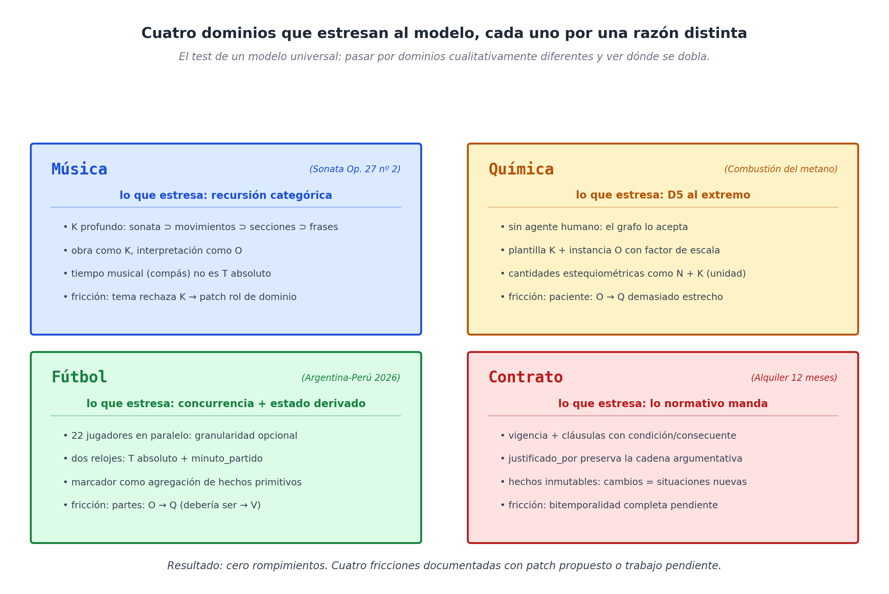
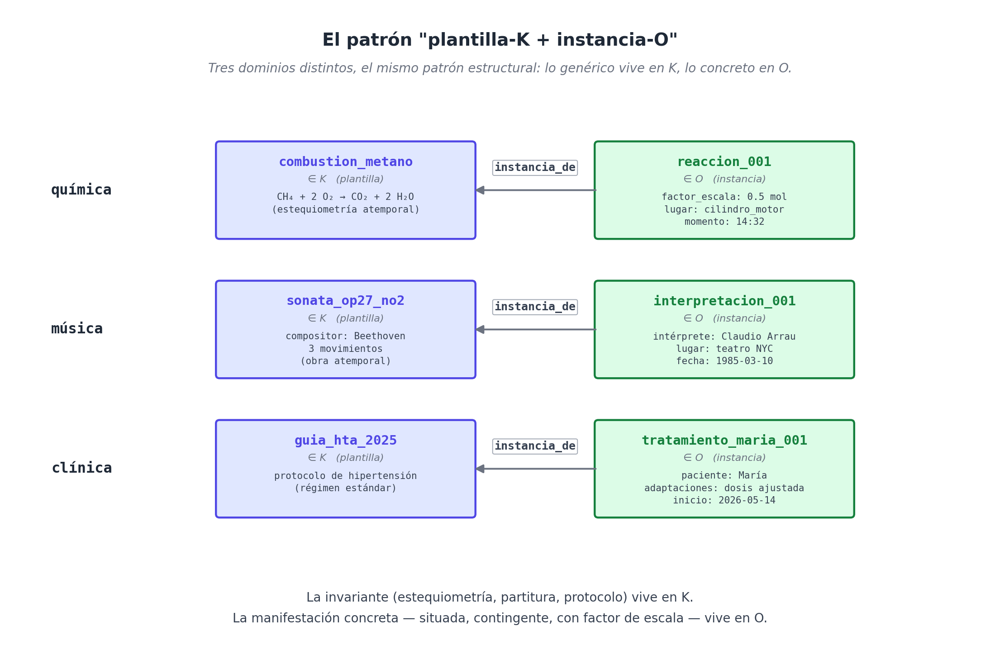

# Capítulo 18 — Cuatro dominios incómodos: música, química, fútbol, contrato

## El test que vale la pena pasar

Hasta acá la Parte V acumuló tres victorias relativamente cómodas. El sauna es un negocio comercial; el taxi es un negocio comercial con concurrencia; la clínica es densidad semántica pero todavía dentro de un esquema reconocible (consultar → diagnosticar → prescribir). Tres dominios donde el modelo funcionó con poca fricción.

Cualquier propuesta arquitectónica que se vende como **universal** debe pasar un test más duro: enfrentar dominios que no se parecen al estándar comercial-clínico-administrativo en absoluto. Dominios donde las categorías son recursivas, donde no hay agentes humanos, donde el estado del mundo emerge de eventos paralelos, donde lo normativo es más importante que lo factual. Si el modelo se rompe ahí, se rompe; si se dobla pero no se quiebra, hay que decirlo en limpio.

Este capítulo somete al modelo a cuatro dominios cualitativamente distintos — **música**, **química**, **fútbol** y **contrato** — uno por sección. La estrategia es deliberada: en vez de modelar uno en profundidad, vamos a tomar de cada uno la fricción **más característica** y ver cómo el modelo la enfrenta. Algunas frichas se resuelven con elegancia; otras requieren patches al catálogo D7; otras dejan pendientes que el libro asume sin disimular. Al final del capítulo enumero qué emergió de cada uno y cómo refinó la propuesta.



## Dominio 1 — Música: la recursión categórica

El primer dominio incómodo del libro fue una **composición musical** — una sonata de Beethoven, por concretarla con un caso real. El test fue modelar la *Sonata op. 27 nº 2 (Claro de luna)*, su estructura, sus movimientos, una interpretación específica en un teatro de Nueva York, y poder consultar tanto la obra abstracta como esa noche particular.

**Lo que estresa.** Una composición musical es una entidad **atemporal** — fue creada, sí, pero no ocurre en un momento; existe como objeto cultural. Una interpretación específica, en cambio, sí ocurre: tiene fecha, lugar, intérprete. Encima, la obra tiene **estructura interna recursiva**: una sonata se compone de tres movimientos; cada movimiento, de varias secciones; cada sección, de frases; cada frase, de motivos; cada motivo, de notas. Cinco niveles de jerarquía categórica, anidados.

El primer impulso es modelar la obra como T — un patrón temporal abstracto. El modelo de WQuestions lo rechaza: T es para momentos puntuales y rangos, no para entidades estables. La obra vive en **K** (categórica, atemporal); la interpretación en **O** (situada). La distinción D4 — *K son conceptos atemporales; O son entidades creadas/situadas* — quedó probada exactamente acá.

```
(sonata_op27_no2) ∈ K
  subtipo_de:    sonata
  compositor:    beethoven
  año_composicion: 1801
  movimientos:   [adagio_sostenuto, allegretto, presto_agitato]   ← otros K

(interpretacion_001) ∈ O
  instancia_de:        accion_interpretar
  agente:              claudio_arrau
  obra_interpretada:   sonata_op27_no2     ∈ M(O, K)
  lugar_de:            teatro_nyc
  momento:             1985-03-10T20:00Z
```

**La fricción**. `tema: O → O` rechaza valores en K. La obra es K. El prototipo me obligó a usar un **rol de dominio** — `obra_interpretada: O → K` — exactamente la solución que aparecerá otras dos veces en este libro (medicamento prescrito, plan contratado). La música no es excepcional ahí; es la primera vez que el patrón aparece.

**Lo nuevo que aportó.** La recursión categórica — sonata contiene movimientos, movimientos contienen secciones — se modela con `subtipo_de` y un rol de dominio `compone_a / compuesto_por` que conecta categorías. K no es una lista plana de etiquetas: es un **árbol denso** con jerarquía interna, donde una consulta tipo *"¿qué obras de Beethoven contienen un adagio?"* es un recorrido transitivo sobre `subtipo_de` y `compuesto_por`.

Donde el dominio **todavía deja pendientes**: el "tiempo musical" — los compases, los pulsos, los tempi — no encaja en T (que es tiempo absoluto). Por ahora se modela como K (`figura_redonda`, `figura_negra`, `compás_4_4`) o como O reificado cuando se quiere hablar de un compás específico. La fricción está documentada y postergada; no rompe nada operativamente.

## Dominio 2 — Química: D5 al extremo

El segundo dominio es la **combustión del metano**: una reacción química que ocurre cuando hay metano, oxígeno y energía suficiente, y produce CO₂ y agua. Modelar esto pone al modelo bajo presiones muy distintas a las del sauna o el taxi.

**Lo que estresa.** Primero, **no hay agente humano**. Una reacción química no la *hace* nadie en sentido intencional; ocurre porque las condiciones físicas se cumplen. D5 — agencia contextual — establece que la `agente` no es obligatoria si el verbo no lo exige, y la química es donde esto se pone a prueba sin red. La situación reificada de una reacción concreta no tiene `agente` y el grafo lo acepta sin marcar.

Segundo, **plantilla + instancia con escala**. La química distingue entre *la reacción de combustión del metano en general* (una entidad categórica, K, que describe la estequiometría — un mol de CH₄ + dos moles de O₂ → un mol de CO₂ + dos moles de H₂O) y *esta reacción específica de combustión que ocurrió en ese motor a las 14:32* (un O reificado con cantidades reales escaladas). El modelo necesita capturar ambas y conectar instancia a plantilla.

```
(combustion_metano) ∈ K
  reactivos_estequiometricos: [{CH4: 1}, {O2: 2}]
  productos_estequiometricos: [{CO2: 1}, {H2O: 2}]

(reaccion_001) ∈ O
  instancia_de:   combustion_metano
  factor_escala:  0.5                     ← la mitad de la estequiometría
  insumo:         n_0.5mol_ch4   (multi)
  insumo:         n_1mol_o2      (multi)
  lugar_de:       cilindro_motor_001
  momento:        2026-05-16T14:32Z
```

**Las fricciones.** Dos quedaron registradas en `dominios.md` y persisten:

1. **`paciente: O → Q` es demasiado restrictivo**. En química "el paciente" de una reacción es el metano (una cantidad N, ligada a una categoría K). El modelo rechaza esto con la signatura actual. La solución por el momento es usar un rol de dominio `insumo: O → N (multi)` que cubre el caso.

2. **`reactivo` / `producto` no son canónicos**. Los catálogos D7 del libro no los incluyen. La política liberal permite registrarlos como roles de dominio, pero queda el patch documentado de canonizarlos eventualmente porque el patrón es universal (cualquier transformación tiene entradas y salidas).

**Lo nuevo que aportó.** La pareja **K-plantilla + O-instancia + factor de escala** es un patrón general que el dominio musical también usa (sonata = plantilla, interpretación = instancia, *tempo* y matices = "factor de escala"), y que aparecerá en cualquier dominio con regularidad invariante y manifestaciones particulares: recetas (la receta = K, la preparación = O), procesos industriales (el SOP = K, la corrida = O), protocolos clínicos (el guía clínica = K, la atención particular = O). La química fue donde el patrón se hizo nítido.



## Dominio 3 — Fútbol: la concurrencia y el estado derivado

El tercer dominio es un **partido de fútbol** específico — por hablar de algo real, Argentina-Perú de las eliminatorias de 2026, donde Messi marcó al minuto 23 con un toque de pierna izquierda y asistencia de Di María. Modelar esto trae complicaciones que el sauna y el taxi no tenían.

**Lo que estresa.** Primero, **concurrencia real**: en cada momento del partido hay 22 jugadores haciendo cosas simultáneamente, más el árbitro, más los técnicos, más el público. Lo que se decide modelar es solo lo significativo; el resto queda implícito. Esto no es una fricción del modelo — es una decisión de granularidad — pero el modelo tiene que **no obligar** a registrar todo, y en efecto no lo hace.

Segundo, **pluralidad de tiempos**. Hay dos relojes simultáneos: el tiempo absoluto (T en formato ISO, *2026-09-14T20:23:42Z*) y el minuto de partido (el "minuto 23", que vive en una escala distinta). El modelo lo absorbe con doble registro: cada evento tiene un `momento: T` absoluto, y opcionalmente un `minuto_partido: N` relativo al inicio. Las dos consultas — "¿qué pasó a las 20:23 hora local?" y "¿qué pasó al minuto 23?" — funcionan en paralelo sin pisarse.

Tercero, **el marcador es un estado derivado**. El "Argentina 1 - Perú 0" no es un hecho que alguien afirma; **es la conclusión** de agregar todos los goles del partido. Esto es la misma forma estructural que la fidelidad del sauna (7 sesiones → 1 gratis) y el costo total de un viaje del taxi: el modelo almacena los **hechos primitivos** (cada gol como evento reificado), y un evaluador externo recorre el grafo agregando. El modelo no calcula marcadores; los **prepara** para que cualquier evaluador lo haga.

```python
n_goles_arg = count(u, Pattern(
    fixed={"equipo": argentina},
    type_constraint=u.ind("evento_gol"),
))
n_goles_per = count(u, Pattern(
    fixed={"equipo": peru},
    type_constraint=u.ind("evento_gol"),
))
marcador = f"{n_goles_arg} - {n_goles_per}"
```

**La fricción.** Una sola, registrada en `dominios.md`: el rol `partes` aplicado a un partido (los dos equipos) tenía signatura `T → Q` (asumiendo que partes son agentes), pero un *equipo* es más cómodo como O (un colectivo compuesto). El patch propuesto fue **generalizar `partes` a `O → V`** — admitiendo cualquier eje de valor como rango. El prototipo confirmó la fricción y la sorteó vía rol de dominio (`parte: O → O`), pero el patch al catálogo es un trabajo pendiente real.

**Lo nuevo que aportó.** La distinción entre **hechos primitivos** y **estado derivado** quedó nítida acá. El modelo guarda lo primero; cualquier sistema productivo construye lo segundo encima. Esto importa porque rompe una expectativa que la mayoría de los sistemas relacionales traen consigo: que el "estado actual" se almacene como tal. WQuestions almacena la **historia de cambios** y deriva el estado por consulta. El precio es que el evaluador externo debe existir; la ganancia es que **el pasado nunca se pierde**.

## Dominio 4 — Contrato: lo normativo manda

El cuarto dominio es un **contrato de alquiler** de doce meses con cláusulas, obligaciones recíprocas, una cláusula de rescisión por impago, y eventualmente una rescisión efectiva. Es el dominio donde lo *factual* (lo que pasó) es secundario frente a lo *normativo* (lo que está permitido, exigido, prohibido por las cláusulas).

**Lo que estresa.** Primero, la **vigencia temporal del contrato mismo y de cada cláusula**. Algunas cláusulas son válidas durante todo el contrato; otras solo durante períodos específicos (la cláusula de actualización del alquiler aplica solo en el aniversario). El modelo absorbe esto con D9 — cada hecho lleva su rango — pero al implementarlo se hace evidente que **bitemporalidad completa** sería ideal: no solo *cuándo es cierto* sino también *cuándo lo afirmamos*. Esa pieza queda documentada como pendiente.

Segundo, **condicionales y consecuencias**. Una cláusula tiene la forma *"si X entonces Y"*: si el inquilino impaga durante dos meses, el arrendador puede rescindir. El modelo trata esto reificando la cláusula como una situación con `condicion` y `consecuente`:

```
(clausula_14) ∈ O
  instancia_de:  clausula_contrato
  parte_de:      contrato_alq_001
  condicion:     impago_2_meses
  consecuente:   rescision_autorizada
```

Cuando una rescisión efectivamente ocurre, esa rescisión apunta a la cláusula con `justificado_por`:

```
(rescision_001, justificado_por, clausula_14)
```

La auditoría legal — *"¿bajo qué autoridad se rescindió este contrato?"* — se reduce a un recorrido por `justificado_por`. La regla no se dispara sola: un evaluador (humano o algorítmico) verifica que la condición se cumpla y emite la rescisión como hecho nuevo. Pero la **estructura argumentativa** está toda en el grafo.

Tercero, **mutabilidad de hechos**. ¿Qué pasa cuando una cláusula se renegocia? La regla del modelo es severa y deliberada: **los hechos son inmutables**. Una renegociación es una **situación nueva** que `rectifica` o `cancela` la previa. El historial se preserva en su totalidad; el "estado actual" se reconstruye por consulta. Esto es exactamente lo que vimos en la clínica con el rediagnóstico y en el taxi con las cancelaciones.

**Las fricciones.** Dos quedaron registradas y siguen pendientes:

1. **Bitemporalidad completa** (valid time + transaction time). Tenemos lo primero, no lo segundo. Para contratos donde un litigio puede preguntar *"¿qué sabía el sistema en mayo de 2024?"*, hace falta agregar `tx_inicio`/`tx_fin` a los hechos. El prototipo lo trae como `tx_time` pero no como query parameter aún.

2. **Reglas de derivación versionadas**. Si la ley cambia y el contrato firmado anteriormente debe leerse bajo la ley vieja, el evaluador necesita saber qué versión de qué regla aplicar. Esto se modela con D9 sobre la regla misma, pero la **mecánica de evaluación versionada** queda como trabajo de la capa superior (motor de inferencia).

**Lo nuevo que aportó.** La importancia de la **estructura argumentativa explícita**. En dominios normativos, lo que el sistema necesita producir no es solo el resultado (rescindido / no rescindido) sino la **cadena de razonamiento** que lo justifica. El modelo, al exigir `justificado_por` apuntando a una cláusula, **fuerza** la producción de esa cadena. No es opcional.

## Lo que emergió de los cuatro

Los cuatro dominios, vistos en serie, dejaron tres lecciones:

**Primera: el patrón "plantilla-K + instancia-O" es universal.** Apareció en química (reacción genérica vs concreta), música (sonata vs interpretación), también en clínica (protocolo vs atención concreta) y en taxi (tarifa estándar vs aplicada a un viaje). No es específico de ningún dominio; es un patrón de modelado tan central como la reificación misma. Vale la pena destacarlo como **convención** explícita en el lexicon de cualquier proyecto.

**Segunda: el evaluador externo es estructural.** Marcador de fútbol, fidelidad del sauna, surge pricing del taxi, evaluación de cláusulas del contrato, conteo de visitas para diagnóstico — todo el "estado derivado" del sistema es trabajo del evaluador. WQuestions almacena los hechos primitivos y prepara el grafo; el razonamiento, simple o complejo, se construye encima. Esta separación es un **principio arquitectónico**, no una decisión postergada por simplicidad.

**Tercera: las fricciones genuinas son pocas y conocidas.** Después de ocho dominios (los cuatro de este capítulo más los cuatro anteriores), las fricciones reales son: (a) algunos roles canónicos del catálogo D7 son demasiado restrictivos (`paciente`, `partes`, `tema` aceptarían valores en más ejes); (b) bitemporalidad completa pendiente; (c) tiempo musical y patrones temporales finos pendientes; (d) reglas de derivación versionadas pendientes. Cuatro pendientes documentados, ningún punto donde el modelo se quiebre por completo.

La Parte V termina acá. Hemos modelado siete dominios — sauna, taxi, clínica, música, química, fútbol, contrato — con un prototipo Python de unas 2.250 líneas y un catálogo D7 de 38 roles canónicos. El modelo se sostuvo; las fricciones tienen patch o se documentaron como pendientes. La Parte VI, que sigue, deja de modelar y empieza a pensar: **qué se vuelve posible cuando este modelo se conecta con modelos de lenguaje grandes**, qué aplicaciones aparecen, qué falta para hacerlo infraestructura real.
