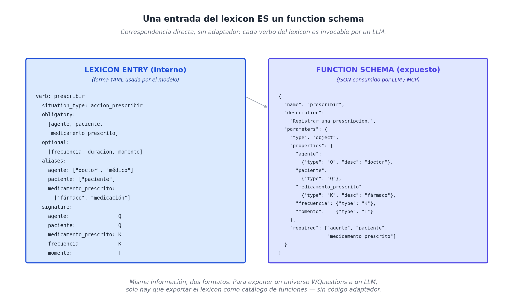

# Capítulo 19 — WQuestions y los modelos de lenguaje

## Una conversación, vista desde adentro

La doctora Torres, sentada en su consultorio antes de la primera consulta del día, abre el asistente conversacional de su sistema clínico y escribe:

> *¿Qué medicación venía tomando María Gonzales y desde cuándo?*

Tres segundos después, la pantalla responde:

> *María Gonzales tomaba enalapril 10 mg desde el 14 de mayo de 2026, en una toma cada mañana. Su tratamiento se mantuvo sin cambios hasta el 10 de enero de 2027, cuando la doctora ajustó la dosis al rediagnosticarla como hipertensión grado 2.*

Vista desde la doctora, la interacción es trivial: una pregunta en español llano, una respuesta en español llano. Pero entre el momento en que ella tocó *Enter* y el momento en que la pantalla mostró el texto, ocurrieron seis pasos:

1. **El modelo de lenguaje** — un LLM, podría ser Claude, GPT, Gemini, Llama — recibió el texto y lo interpretó como una intención de consulta.
2. **Eligió la función adecuada** del catálogo que el sistema le expone: `consultar_tratamiento(paciente, periodo)`.
3. **Tradujo el español a argumentos estructurados**: paciente → `maria_g`, periodo → todo el histórico hasta hoy.
4. **Invocó la función**, que internamente ejecutó un patrón sobre el grafo WQuestions: `query(Pattern(fixed={"paciente": maria_g}, ask={"medicamento_prescrito": Var()}, type_constraint="accion_prescribir"), at=hoy)`.
5. **El grafo respondió** con la prescripción vigente y su histórico, usando D9 para devolver exactamente lo válido en cada momento.
6. **El modelo recompuso la respuesta** en lenguaje natural fluido, con detalle, referencias temporales y conexiones causales.

Esa secuencia — usuario natural → LLM → función estructurada → grafo persistente → respuesta natural — es el patrón que define el momento tecnológico de 2026. Y es exactamente para lo que WQuestions, sin haberse propuesto serlo, resulta estructuralmente diseñado.

Este capítulo se ocupa de eso: por qué WQuestions y los modelos de lenguaje contemporáneos forman una **simbiosis natural**, cómo se expone el modelo a un LLM (vía function calling y MCP), y qué se vuelve posible que antes era engorroso o imposible.


## Por qué este es el momento

Los modelos de lenguaje de la generación 2024-2026 son fluidos como nunca antes — pero tienen tres debilidades estructurales que vienen incluidas en el paquete:

**No tienen estado persistente.** Una conversación termina y el modelo olvida. Si vuelve a hablar con la doctora Torres mañana, no recuerda qué le preguntó hoy, qué pacientes mencionó, qué decisiones se tomaron. La continuidad se reconstruye **artificialmente** poniendo todo el historial dentro del prompt — caro en tokens, difícil de mantener consistente.

**No distinguen lo que afirman de lo que les pasaron.** Un LLM puede ser convincentemente incorrecto. Cuando un usuario consulta sobre María Gonzales, el modelo puede *alucinar* — inventar tratamientos plausibles que nunca existieron en la historia clínica real. La diferencia entre *"el sistema lo registró"* y *"al modelo le suena verosímil"* desaparece en la salida.

**No auditan su razonamiento.** Si un asistente clínico recomienda algo, el médico tiene que poder rastrear **por qué** la recomendación: qué hecho la disparó, qué regla la justifica, qué evidencia la respalda. Un LLM razonando en lenguaje natural produce texto convincente pero no necesariamente trazable.

WQuestions, por el contrario, tiene exactamente las tres propiedades complementarias: persistencia inequívoca, distinción entre afirmado y conjeturado (vía `estatus_factual`), trazabilidad por las relaciones del "por qué". Pero le falta lo que los LLMs hacen mejor: la fluidez lingüística, la interpretación de matices, la generación de respuestas en prosa que un humano lee con gusto.

La pareja queda completa: el LLM se ocupa de la **superficie lingüística** (entrada y salida), el grafo se ocupa de la **profundidad estructural** (almacenamiento y razonamiento). Cada uno hace lo que hace mejor; ninguno carga con lo que no le sale bien.

## El lexicon es un function schema

Hay una observación que ya apareció en el capítulo 13 y que vale la pena retomar en limpio, porque es la **bisagra** entre las dos mitades. Una entrada del lexicon — *vender*, *prescribir*, *consultar*, *contratar* — tiene exactamente la estructura que los protocolos de function calling de los LLMs esperan. Veámoslo lado a lado.

Entrada del lexicon (representación interna del modelo):

```yaml
verb: prescribir
  situation_type: accion_prescribir
  obligatory: [agente, paciente, medicamento_prescrito]
  optional: [frecuencia, duracion, momento]
  aliases:
    agente:                 ["doctor", "médico", "doctora"]
    paciente:               ["paciente"]
    medicamento_prescrito:  ["fármaco", "medicación", "medicina"]
    frecuencia:             ["cada cuándo", "tomas por día"]
```

Schema JSON expuesto al LLM (Function Calling / MCP):

```json
{
  "name": "prescribir",
  "description": "Registrar una prescripción médica.",
  "parameters": {
    "type": "object",
    "properties": {
      "agente":                {"type": "Q", "description": "doctor, médico"},
      "paciente":              {"type": "Q", "description": "paciente"},
      "medicamento_prescrito": {"type": "K", "description": "fármaco, medicación"},
      "frecuencia":            {"type": "K"},
      "duracion":              {"type": "K"},
      "momento":               {"type": "T"}
    },
    "required": ["agente", "paciente", "medicamento_prescrito"]
  }
}
```

La correspondencia es uno a uno: `verb` → `name`; `situation_type` se vuelve el tipo retornado; los `aliases` alimentan el campo `description` que ayuda al LLM a reconocer cómo se expresa el rol en lenguaje natural; los ejes (`Q`, `O`, `L`, `T`, `N`, `K`) se vuelven tipos del schema; `obligatory` se vuelve `required`.

**Implicación práctica**: para exponer WQuestions a un LLM no hay que escribir un adaptador a medida. Hay que **exportar el lexicon** como un catálogo de funciones. Las herramientas que ya existen para function calling consumen ese catálogo sin modificación.



## MCP: el cable estándar

En 2024 Anthropic publicó la especificación de **MCP** — *Model Context Protocol* — un estándar abierto para que herramientas externas se expongan a modelos de lenguaje de forma uniforme. La idea es simple: en lugar de que cada aplicación inventara su propia manera de conectar un LLM a sus datos, MCP define un protocolo común. Un *servidor MCP* declara qué funciones expone, qué argumentos acepta, qué tipo de respuesta devuelve. Cualquier LLM que hable MCP puede usar ese servidor sin código adicional.

Para WQuestions, esto significa que **el servidor MCP de un sistema WQuestions es esencialmente el lexicon expuesto como funciones**. Cada verbo del lexicon se vuelve una herramienta; cada consulta-WH típica se vuelve otra herramienta:

```
Tools del servidor MCP del Sauna Oasis:

  ingesta:
    - registrar_sesion(cliente, lugar, inicio, fin)
    - aplicar_promocion(cliente, promocion, momento)
    - redimir_beneficio(cliente, beneficio)

  consulta:
    - sesiones_de_cliente(cliente, desde, hasta) → List[Sesion]
    - cliente_califica_fidelidad(cliente) → bool
    - clientes_con_intencion_de_contratar() → List[Cliente]

  auditoría:
    - por_que_este_cobro(pago) → Explicacion
    - estado_de_cliente_en(cliente, momento) → Estado
```

Una asistente conversacional de un sistema corporativo — pensada al estilo *"asistente del CFO"*, *"asistente del médico de cabecera"*, *"asistente del periodista de investigación"* — se construye conectando un LLM a ese servidor MCP. No hay glue code complicado; hay un catálogo declarativo de funciones y el LLM las elige según la conversación.

## Tres casos de uso concretos

Conviene aterrizar la idea con tres escenarios que ya son técnicamente posibles en 2026, donde WQuestions encaja exactamente en el espacio que los LLMs no llenan solos.

### Asistente operativo de un negocio

El dueño del Sauna Oasis, en lugar de revisar reportes, le habla al sistema:

> *— ¿Cuántos clientes nuevos vinieron este mes?*
>
> — *Vinieron 23 clientes nuevos en mayo, 30% más que abril. Los miércoles concentraron el 40% del crecimiento.*
>
> *— ¿Y cuáles de los nuevos están cerca del beneficio de fidelidad?*
>
> — *Cinco están a una o dos sesiones del beneficio. Tres reservaron sesiones para esta semana; los otros dos no aparecen hace más de diez días.*
>
> *— Mándales un mensaje a los que no vinieron.*
>
> — *Listo. Borrador preparado para los dos clientes — Mariana C. y Tomás R. ¿Lo envío?*

Cada turno de la conversación se traduce a una o más llamadas a funciones del lexicon del sauna. El LLM **no sabe** de saunas — sabe del lexicon. El grafo guarda el estado real. La conversación es la **interfaz**, no la base de datos.

Lo interesante: el dueño jamás escribe SQL, jamás abre un dashboard, jamás aprende un lenguaje de consulta. El lexicon del sauna es la API; el LLM es el traductor. El sistema se vuelve **operable conversacionalmente** sin que el negocio renuncie a su rigor estructural.

### Ingesta automática desde texto no estructurado

Un hospital tiene veinte años de historias clínicas escritas en prosa libre. Migrar a un sistema estructurado tradicional es un proyecto multimillonario que requiere reescribir cada nota a mano.

Con WQuestions y un LLM, el flujo cambia. Una nota como:

> *"Paciente femenina de 54 años, refiere cefalea persistente de 3 días de evolución, presión arterial 145/92 mmHg al momento del examen. Se diagnostica HTA grado 1 y se inicia tratamiento con enalapril 10 mg cada mañana. Control en 30 días."*

Se procesa con un prompt que le da al LLM el lexicon clínico y le pide: *"Extrae todas las situaciones de esta nota."* El LLM produce — usando function calling para cada situación — los hechos atómicos:

```python
ingest_situation("consultar", roles={
    "agente": dra_torres, "paciente": maria_g,
    "momento": fecha_nota, "motivo": cefalea,
})
ingest_situation("medir", roles={
    "agente": dra_torres, "paciente": maria_g,
    "medida_de": presion_arterial,
    "monto": "145/92", "unidad": mmHg,
})
ingest_situation("diagnosticar", roles={
    "agente": dra_torres, "paciente": maria_g,
    "diagnosticado_como": hta_g1,
})
ingest_situation("prescribir", roles={
    "agente": dra_torres, "paciente": maria_g,
    "medicamento_prescrito": enalapril,
    "frecuencia": cada_manana,
})
ingest_situation("controlar", roles={
    "paciente": maria_g, "agente": dra_torres,
    "momento": fecha_nota_plus_30,
    "estatus_factual": previsto,
})
```

Cinco situaciones reificadas, todas validadas contra el catálogo. La prosa original queda como nota de respaldo; la estructura entra al grafo, donde se vuelve consultable, agregable, auditable.

**El número que importa**: una nota de 240 palabras (≈ 320 tokens en prosa) genera 24 hechos atómicos cuya serialización JSON pesa unos 80 tokens. **Compresión 4:1**, sin pérdida semántica, ganando estructura. Ahora multiplíquese por veinte años de hospital.

### Razonamiento cross-dominio

Un periodista económico investiga el efecto de la reforma tributaria sobre las ventas minoristas. Tradicionalmente tendría que cruzar bases inconexas: el registro de ventas usa un schema, los datos macroeconómicos otro, las noticias políticas son texto libre.

Con WQuestions como **substrato común**, los tres dominios viven en el mismo grafo con su propio dialecto. El periodista escribe:

> *"Tráeme las noticias políticas relacionadas con impuesto al consumo desde 2024, y cruza con las ventas trimestrales del sector de retail."*

El LLM combina dos consultas, una por dominio, con su tipo correspondiente:

```python
noticias = query(Pattern(
    fixed={"tema_categorico": impuesto_consumo},
    type_constraint="noticia_politica",
    ask={"agente": Var(), "momento": Var(), "contenido": Var()},
))

ventas = query(Pattern(
    fixed={"sector": retail},
    type_constraint="agregado_ventas_trimestral",
    ask={"momento": Var(), "monto": Var()},
))
```

Las dos listas se devuelven al LLM, que las correlaciona por proximidad temporal y produce una respuesta narrativa. **Es posible porque ambos dominios comparten el mismo modelo subyacente** — el periodista no necesita saber que existen dos bases, dos schemas, dos sistemas. El grafo WQuestions absorbió ambos.

## La economía de tokens, vista en limpio

Los modelos de 2026 manejan ventanas de contexto enormes — un millón de tokens, dos millones, cuatro millones. El instinto natural es escribir todo en prosa y dejar al modelo encontrar lo que necesita.

Esto funciona. Pero gasta el presupuesto a velocidad ingenua. Tres números, tomados de los dominios que modelamos:

| Información | Prosa (tokens) | Grafo WQuestions (tokens) | Compresión |
| --- | --- | --- | --- |
| Una nota clínica típica | 320 | 80 | 4× |
| Un mes de operación del sauna (3 clientes) | 8.000 | 1.800 | 4.4× |
| Un contrato de alquiler con cláusulas | 2.500 | 700 | 3.6× |

La compresión por sí sola es importante, pero lo que más cambia el cálculo es el segundo factor: **la ambigüedad**. La prosa fuerza al LLM a reinterpretar coreferencias (*"él"*, *"el doctor"*, *"la paciente mencionada"*), a inferir relaciones implícitas, a reconstruir estructura. Todas esas operaciones consumen atención del modelo — tokens efectivos que no van al razonamiento sobre el contenido sino a la reconstrucción del esqueleto.

El grafo WQuestions entrega el esqueleto **ya reconstruido**. El LLM puede dedicar su capacidad a lo que sabe hacer mejor: razonar, conectar, generar prosa fluida. La economía es doble: menos tokens **y** mejor calidad de respuesta.

## Multi-agente, nativamente

El modelo D5 — agencia contextual, capítulo 10 — admite agentes de cualquier naturaleza: humanos, organizaciones, software, artefactos sensorizados. Esto no es decoración: es exactamente la propiedad que un futuro multi-agente necesita.

Un escenario plausible a tres años: un sistema empresarial donde varios LLMs especializados — uno clínico, uno financiero, uno legal — colaboran sobre el mismo grafo WQuestions. Cada uno tiene un sub-lexicon de su dominio. Cada uno entra al grafo como **agente** cuando ingresa un hecho:

```
(diagnostico_001, agente, lim_clinico_v3)         ∈ M(O, Q)
(asiento_001,     agente, lim_financiero_v2)
(opinion_001,     agente, lim_legal_v1)
```

El grafo registra **quién dijo qué y cuándo**, exactamente como registraría a un médico humano. Trazabilidad uniforme: el sistema puede auditar tanto a humanos como a modelos, con la misma maquinaria.

## WQuestions como infraestructura

Cerremos con la idea más ambiciosa del libro, y la única que merece todo el aparato conceptual de las cinco primeras partes. **WQuestions, expuesto vía MCP, es una pieza de infraestructura para la IA conversacional empresarial** — no un producto, no un framework: una capa estructural sobre la que se construyen aplicaciones.

La distinción importa. Un producto se compra; un framework se aprende; una **infraestructura** se da por sentado. Cuando un programador escribe una aplicación web no piensa en TCP/IP; cuando un sistema procesa pagos no piensa en SWIFT; cuando una conversación con un asistente fluye, no se piensa en el grafo subyacente. La infraestructura es lo que se vuelve invisible porque funciona.

El proyecto WQuestions, en su forma actual, no está terminado para ser infraestructura. Le faltan piezas — persistencia industrial, motor de inferencia, bitemporalidad completa, lexicon poblado con miles de entradas verbales en varios idiomas — todas las cuales el capítulo 21 enumera honestamente. Pero la **arquitectura** está completa, y el momento histórico es favorable: los modelos de lenguaje hicieron que la simbiosis sea operativa, los protocolos como MCP estandarizaron el cable, y el costo de cómputo bajó al punto donde un asistente conversacional con grafo persistente es asequible.

Lo que el capítulo 20 explora es el lado expansivo de esa misma idea: si WQuestions fuese infraestructura, **¿qué aplicaciones se vuelven posibles que antes no?**. Algunas suenan a ciencia ficción; otras son obvias en cuanto se nombran. Las dejaremos puestas, sin disimular la especulación, porque ahí — y solo ahí — es donde el libro se permite mirar hacia adelante.
