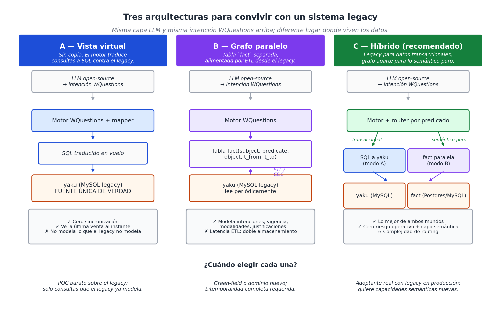

# Capítulo 23 — Llevando WQuestions a un sistema en producción

## El otro lado del espejo

En el capítulo 15 modelamos el Spa Oasis desde cero. Cuatro personas, una página de descripción, ciento ochenta y cuatro hechos atómicos. Era un ejercicio limpio: la pizarra en blanco, el modelo aplicado sin obstáculos. Eso es valioso para entender qué se puede hacer. Pero es poco honesto si el libro se queda ahí, porque **la mayoría de los lectores no tiene una pizarra en blanco**. Tiene un ERP de diez años, un CRM heredado, una base de datos relacional con tres mil tablas, o un sistema artesanal en PHP que mueve la empresa desde hace una década.

La pregunta operativa de ese lector no es *"¿cómo modelaría esto desde cero?"* sino *"¿cómo aplico WQuestions sin romper lo que ya funciona?"*. Este capítulo responde esa pregunta usando un caso real: **yaku**, un sistema MySQL que opera diariamente cuatro líneas de negocio — sauna, hostal, gimnasio y cafetín. Es el sistema operativo de un negocio real, con sus ~2.000 productos en catálogo, sus ~125.000 ventas históricas, sus dialectos locales del staff y sus decisiones de diseño hechas hace años por razones que ya nadie recuerda. Exactamente el escenario común.

Lo que sigue no es modelar yaku — es **mapearlo** a WQuestions sin tocarlo. La diferencia es categórica.

## yaku en media página

yaku corre sobre MySQL 5.7. Sus tablas centrales son las que un negocio de servicios siempre tendrá:

- `cliente` — quiénes consumen.
- `persona` — empleados (recepción, masajistas, gimnasio).
- `producto` — todo lo vendible: habitaciones, sesiones de sauna, jugos, gaseosas, planes mensuales.
- `venta` + `ventadet` — comandas y sus líneas.
- `asistencia` — registro de entrada/salida del gimnasio (con banderas anexas para sauna y ducha).
- `socio` + `plan` — membresías mensuales activas.

Y un detalle revelador: el campo `producto.MARCA` no guarda la marca comercial del producto. Guarda su **familia de negocio**: HOSTAL, SAUNA, GYM, RESTAURANT, STOCK. Es decir, yaku **ya** clasifica sus productos en categorías — solo que con un nombre que esconde su función real. Esto es el primer hallazgo de lo que llamaremos *arqueología semántica*.

## Arqueología semántica: qué de WQuestions ya está en yaku, sin que nadie lo haya bautizado así

El ejercicio de mapeo arranca con una pregunta inocente: para cada tabla de yaku, ¿en qué eje vive su contenido? El resultado es la figura 49, que merece detenerse en él:


Tres observaciones del mapa son las que justifican todo el capítulo:

**Primera — yaku ya implementa D6 (vigencia temporal) sin saberlo.** Los campos `socio.desde` y `socio.hasta` son exactamente el patrón que el cap. 9 prescribe para hechos cambiables: la membresía se modela como evento con inicio y fin, no como atributo del cliente. Cuando un socio renueva, no se sobreescribe — se crea un nuevo registro. Una consulta del tipo *"¿qué socios estaban activos el 15 de marzo del año pasado?"* responde correctamente, sin reconstrucciones aproximadas.

**Segunda — yaku ya tiene un embrión de `estatus_factual`.** Los flags `venta.ANULA` y `venta.CANCELADO` son la versión cruda del eje que en el cap. 15 distinguíamos como `{real, intencionado, planeado, hipotético, cancelado}`. yaku cubre el extremo *"esto no pasó"* (anulado, cancelado), pero le falta el otro extremo: el `intencionado` — el cliente que casi compró el plan trimestral y se fue sin firmar. Ese caso hoy se anota en `cliente.NOTAS` como prosa libre, no consultable.

**Tercera — el eje L está parcialmente externalizado.** yaku no tiene tabla de lugares físicos. Las habitaciones del hostal viven como `producto` (código H103, H201, etc.). Eso es **una decisión de modelado** que el cap. 15 prevé: una entidad puede vivir en O **y** en L a la vez (la cámara de vapor del Oasis era a la vez máquina y lugar). yaku eligió priorizar O para no complicar el flujo de ventas. WQuestions puede recuperar la cara L sin cambiar yaku — solo agregando, en el lexicon, que cada código de habitación es además un individuo del eje L.

El patrón general: **los sistemas legacy se aproximan a WQuestions a pedazos, sin nombrarlo**. La arqueología consiste en detectar qué pedazos están bien, qué pedazos están a medias, y qué pedazos faltan. No es una migración — es un diagnóstico.

## El concepto nuevo: modalidades de cobertura

En el cap. 15 introducíamos el `estatus_factual` para distinguir lo real de lo intencionado. Esa distinción es importante pero responde a una pregunta única: *¿esto pasó o no?* En yaku surge otra dimensión ortogonal que no habíamos formalizado en el libro hasta ahora: **¿cómo se cobró/se cubrió este servicio?**

En el negocio real hay cuatro modalidades distintas, todas conviviendo el mismo día:

- **Pago directo** — el cliente walk-in entra al sauna, paga 25 soles, sale. La venta cierra en sí misma.
- **Cubierto por plan** — la socia mensual entra a entrenar; su asistencia se registra pero `IMPORTE = 0`. El derecho viene del contrato vigente, no del pago del día.
- **Cargo a estancia** — el huésped del hostal pide una cerveza en el cafetín y la cargan a la habitación. El consumo es real, pero el cobro queda agrupado bajo la estancia.
- **Cortesía** — la recepcionista le regala una sauna al cliente que cumple años. El servicio ocurre, no hay cobro, hay un motivo.

Las cuatro modalidades comparten el mismo evento factual ("se usó el sauna") pero responden de forma distinta a la pregunta del cobro. En yaku, distinguirlas requiere cruzar `asistencia.IMPORTE`, presencia de `socio` activo y existencia de una `venta` asociada — tres consultas frágiles. En WQuestions se vuelve un único cable explícito, que llamaremos `cubierto_por`:

```text
(uso_sauna_001, instancia_de, servicio_sauna)
(uso_sauna_001, cliente, juan)
(uso_sauna_001, cubierto_por, pago_directo)             ← caso 1

(uso_sauna_002, cubierto_por, contrato_plan_maria_2026) ← caso 2 (apunta al socio)
(uso_sauna_003, cubierto_por, estancia_carlos_5234)     ← caso 3 (apunta a la venta-padre)
(uso_sauna_004, cubierto_por, promo_cumpleanos_ana)     ← caso 4 (apunta a la promoción)
```

Cada `uso_sauna` es un hecho idéntico en su esencia (alguien usó el sauna). La modalidad de cobertura, por separado, explica *por qué no se cobró como pago directo*. Esto es generalizable: aplica a clubes deportivos, hoteles, clínicas con cobertura de seguros, cualquier negocio donde un servicio puede tener orígenes de cobro heterogéneos.

Es un concepto nuevo que se gana del ejercicio, ortogonal a lo que ya teníamos. Cabe agregarlo al catálogo D7.

## Las tres arquitecturas de convivencia con un sistema legacy

Decir *"vamos a aplicar WQuestions"* deja sin responder una pregunta crítica: **¿dónde viven los datos?** Cuando ya existe un MySQL en producción con 125.000 ventas, no hay una sola respuesta — hay tres, y elegir bien evita mucho retrabajo. La figura 50 las ordena:



**Arquitectura A — vista virtual.** El motor WQuestions no almacena datos propios. Cuando recibe una consulta, su mapper la traduce a SQL contra las tablas legacy. yaku sigue siendo la única fuente de verdad. No hay sincronización, no hay copia, no hay latencia.

*Funciona bien para:* preguntas que el legacy ya sabe responder con sus tablas actuales — "¿cuántas saunas tomó Juan este mes?", "¿qué huéspedes están alojados ahora?".

*No funciona para:* preguntas que el legacy no modela — vigencia histórica de la dirección del cliente, intenciones de compra fallidas, justificaciones de cortesías.

**Arquitectura B — grafo paralelo.** Una tabla `fact(subject, predicate, object, t_from, t_to)` separada (en MySQL, Postgres, SQLite o donde sea). Un proceso ETL o CDC lee yaku periódicamente y proyecta sus filas a hechos atómicos. El motor WQuestions consulta exclusivamente esta tabla `fact`.

*Funciona bien para:* todo lo que el legacy no modela. Las intenciones, el por qué, la vigencia bitemporal completa, las modalidades de cobertura — todo se puede registrar limpiamente porque la tabla `fact` está diseñada para alojarlo.

*No funciona para:* latencia cero. Hay un retraso entre que una venta entra a yaku y aparece en el grafo. Para muchas aplicaciones esto es irrelevante (consultas analíticas, marketing); para otras es un bloqueador (decisiones en caja).

**Arquitectura C — híbrido.** Los datos transaccionales (clientes, productos, ventas, asistencias) se consultan en vivo contra el legacy vía A. Los datos puramente semánticos que WQuestions agrega (intenciones, modalidades de cobertura, justificaciones, vigencias históricas) viven en una tabla `fact` paralela. El motor decide a qué backend ir según el predicado de la consulta.

*Esta es la que yo recomendaría para casi cualquier adoptante real.* Aprovecha el sistema operativo existente para lo que ya hace bien; le añade encima la capa semántica que WQuestions aporta. Cero riesgo sobre la operación diaria, ganancia incremental en consultas nuevas.

El cap. 27 de este libro lista persistencia industrial como uno de los seis frentes pendientes. Lo que ese capítulo no menciona, y este sí, es que **persistencia industrial no es solo elegir entre Postgres y RDF**. Es también elegir si la capa WQuestions vive *con* el legacy o *aparte* de él, y la respuesta práctica casi siempre es "ambas, en proporciones distintas según el dato".

## El costo real de construir un lexicon

El cap. 13 presentaba el lexicon como una pieza ya construida. El cap. 27 reconoce que falta poblarlo *a nivel idioma* — miles de verbos del español, FrameNet español, AnCora. Pero entre el verbo genérico y la entrada del lexicon usable en producción hay un trabajo intermedio que el libro no mencionaba: **construir el lexicon de un negocio específico**.

Para yaku, ese trabajo se desglosa así:

1. **Inventariar el dialecto del staff.** ¿La recepcionista dice "tomar sauna", "usar sauna", "hacer sauna"? ¿Llama "huésped" al cliente del hostal o "señor de la habitación"? Esto sale de horas con el equipo, no de leer el SQL. En yaku encontramos los verbos `tomar`, `entrenar`, `hospedar`, `consumir`, `contratar`, más los modificadores `cargar a`, `regalar`, `cancelar`.

2. **Descubrir polisemias locales.** El verbo `tomar` cubre dos situaciones distintas según el complemento: *"tomar sauna"* es un servicio; *"tomar una cerveza"* es un consumo. yaku no resuelve esto — escribe ambos en la misma `ventadet`. El lexicon de WQuestions sí, vía el patrón sintáctico del cap. 13.

3. **Detectar campos legacy que conflate dimensiones.** El campo `producto.MARCA` codifica dos cosas ortogonales en uno: la categoría semántica (HOSTAL, RESTAURANT, SAUNA, GYM) y el control de inventario (STOCK = se cuenta, todos los demás = no se cuenta). Un jugo de naranja es semánticamente RESTAURANT (preparación) y operativamente no-STOCK (no hay jugos en stock, se preparan al pedido). El lexicon de WQuestions separa las dos dimensiones por construcción.

4. **Clasificar artefactos legacy en sub-clases.** yaku tiene ~96 planes (`plan.nplan` es texto libre). Hay que clasificar manualmente cada uno como `plan_sauna`, `plan_gym` o `plan_mixto`. Lo mismo con los productos HOSTAL (matrimonial, doble, simple, jacuzzi). Lo mismo con los productos SAUNA (adulto, niño, walk-in). Una pasada manual o asistida por LLM resuelve esto **una sola vez**, no por consulta.

5. **Inventariar las modalidades de cobertura** y sus señales en datos. Esto se trabajó en la sección anterior; es el insight ortogonal que sale del ejercicio.

La inversión total para yaku es del orden de **dos a cinco días** de trabajo etnográfico + clasificación + escritura del lexicon. Es trabajo arqueológico-lingüístico, no programación. Y se hace una sola vez: a partir de ese punto, **toda consulta futura sobre el negocio reusa el mismo lexicon**. Esa amortización es el ROI que justifica la inversión inicial.

## El gap del gimnasio: WQuestions no inventa información

Una observación honesta que falta en el libro: el modelo no es alquimia. Si el dato no se captura en algún lado, no aparece en el grafo por magia.

En yaku, el uso del gimnasio **solo** se registra cuando el cliente es socio en plan (entra al sistema vía la tabla `asistencia`). Los días sueltos comprados como producto MARCA=GYM se cobran en `venta` pero no generan registro de entrada/salida — no hay tabla `asistencia_walkin_gym`. Por lo tanto, la pregunta *"¿cuántas horas usó alguien el gimnasio este mes?"* hoy no puede responderse para los walk-ins, ni con yaku puro ni con WQuestions encima.

Esto es importante decirlo, porque el modelo es a veces vendido como una solución mágica para preguntas que las bases legacy no respondían. No lo es. WQuestions explicita estructura, conexiones, vigencia y por qué. Pero **lo que no se registra, no existe**. Cualquier capacidad nueva requiere captura nueva: un lector de huella en la entrada del gimnasio, un QR escaneado, una anotación manual en recepción. WQuestions solo puede modelar lo que el negocio decide capturar.

Esa honestidad es parte del contrato. El lector que aplica WQuestions sobre su legacy va a descubrir, igual que con yaku, gaps de información que el modelo no rellena por sí solo. Confundir "el modelo es expresivo" con "el sistema sabe todo" es un error costoso.

## Una consulta real, end-to-end, sobre yaku

Cerremos con un ejercicio concreto que ata todo lo anterior. La recepcionista pregunta: *"¿qué huéspedes han usado sauna durante su estancia este mes y cuánto extra han generado?"*

Esta consulta no tiene una vista `q*` en yaku. Hoy requiere cruzar `asistencia` + `venta` (filtradas por producto MARCA=HOSTAL) + `ventadet` (filtrados por MARCA=SAUNA o por bandera `asistencia.Sauna`) y desambiguar las saunas-anexas-de-gym de las saunas walk-in. Es factible, pero frágil — un cambio en los nombres de productos rompe el reporte.

En WQuestions (en arquitectura híbrida C, contra yaku) se vuelve:

```text
filter(O,
  instancia_de = uso_sauna,
  durante.instancia_de = estancia_hostal,
  durante.fin >= inicio_mes,
  cubierto_por.tipo = pago_directo
)
GROUP BY durante.huesped
PROJECT SUM(importe)
```

El motor traduce el patrón al SQL apropiado. La LLM, si la hay, traduce la frase en español a este patrón. Pero el patrón mismo es la pieza estable: tres roles canónicos (`instancia_de`, `durante`, `cubierto_por`) que cualquier negocio de servicios va a reusar.

Y la pregunta de seguimiento — *"¿alguno de esos huéspedes era además socio del gym?"* — se contesta agregando un filtro: `huesped IN socios_activos_gym(inicio_mes, fin_mes)`. Sin código nuevo. Sin reporte nuevo. El lexicon ya enseñó qué es un socio gym; el grafo ya conecta los huéspedes con sus contratos. La consulta compuesta sale de combinar piezas que ya existen.

Esta es la promesa de WQuestions sobre un sistema en producción: **convertir cada consulta nueva en una composición de piezas pre-construidas**, en vez de un reporte ad-hoc más.

## Conexión con el resto del libro

El cap. 15 demostró que el modelo absorbe un negocio. Este capítulo demuestra que el modelo **se aplica** sobre un negocio ya digitalizado, sin migrar nada. El cap. 25 que viene a continuación toma el siguiente paso lógico: con el lexicon construido, el grafo accesible y las modalidades de cobertura explicitadas, **enchufar una LLM por delante** y dejar que el staff de yaku haga preguntas en lenguaje natural.

Tres caminos de salida que el lector puede tomar después de este capítulo:

- Si tiene un sistema legacy y solo quiere ver si WQuestions vale: aplicar el ejercicio de arqueología semántica a sus propias tablas. Es trabajo de un fin de semana y devuelve un diagnóstico claro.
- Si ya tiene el diagnóstico y quiere probar el modelo: arquitectura C híbrida + un POC de una sola consulta crítica end-to-end. Si esa consulta sobrevive, el resto es repetir el patrón.
- Si quiere ir más lejos: cap. 25 (LLMs) muestra cómo el lexicon que se construyó aquí se vuelve directamente el function-schema que la LLM consume.

El sistema yaku que dio origen a este capítulo sigue funcionando como siempre. Ninguna fila se movió de lugar. Lo que cambió es que ahora, con dos a cinco días de inversión en el lexicon, **cualquier consulta del negocio se puede responder componiendo conceptos en vez de programando reportes**. Esa diferencia, multiplicada por años de operación, es lo que justifica el esfuerzo.
