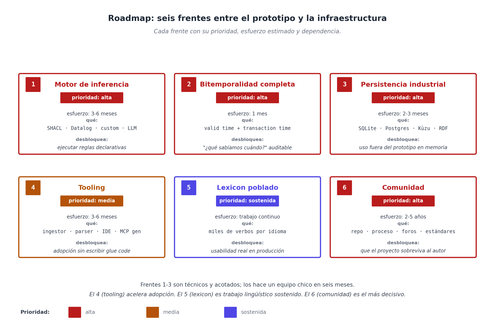

# Capítulo 27 — Qué falta: validación, tooling, comunidad

## El contrato del cierre

Hasta acá el libro presentó la propuesta completa y la sometió a prueba: un prototipo en Python con tests pasando, ocho dominios modelados que confirman que el catálogo se sostiene en territorios disímiles, y —en el capítulo anterior— el experimento reflexivo, donde el modelo bastó para describir su propia herramienta y se corrigió a sí mismo bajo carga.

Este capítulo cambia de registro deliberadamente. No es una recapitulación; no es una mirada al horizonte. Es un **mapa de implementación**: lo que falta para que WQuestions deje de ser una propuesta y se vuelva una pieza de infraestructura adoptable. Está pensado para quien lea el libro y quiera empujar el proyecto adelante — sea como contribuyente al núcleo, como adoptante temprano en su organización, o simplemente como observador que necesita medir el camino que queda.

Lo organizo en seis frentes, cada uno con tres cosas: **qué falta**, **qué tan urgente es**, **qué requiere para resolverlo**. Donde la prueba reflexiva ya adelantó terreno, lo señalo — porque cambia el punto de partida de varios frentes. Cierro con la pieza que importa más de todas — y la que el autor no controla solo.

## Frente 1 — El motor de inferencia

Apareció seis veces a lo largo del libro: el evaluador externo que recorre el grafo y dispara reglas. La regla *"siete sesiones → una gratis"* del spa. La verificación *"prescripción versus contraindicación"* de la clínica. El cálculo del marcador del partido. La aplicación de la cláusula de rescisión del contrato. Todas comparten la misma forma estructural: una condición declarativa sobre hechos del grafo, un consecuente que se efectúa cuando la condición se cumple.

El experimento reflexivo dio el **primer medio paso**: probó que la conducta puede vivir como dato y ejecutarse desde afuera —un evaluador genérico que despacha verbos leyéndolos del grafo—. Lo que ese motor **todavía no es** es un evaluador de **reglas declarativas**: sabe ejecutar verbos, no resolver "si se cumplen estas condiciones sobre los hechos, deriva este hecho nuevo".

**Qué falta**: esa capa de evaluación de reglas. Hay al menos cuatro tecnologías candidatas, cada una con su fortaleza:

- **SHACL** ([Shapes Constraint Language](https://www.w3.org/TR/shacl/), W3C 2017) — diseñado para validar grafos RDF. Bueno para chequear consistencia ("ningún paciente puede tener dos diagnósticos contradictorios vigentes"). Limitado para razonamiento positivo.
- **Datalog** — lenguaje lógico deductivo. Excelente para razonamiento composicional ("si X causa Y, e Y causa Z, entonces X causa Z transitivamente"). Bibliotecas como Soufflé tienen rendimiento industrial.
- **Código de aplicación** — funciones Python/Rust/Go que reciben el grafo y producen el efecto. Lo más flexible, lo menos auditable. Es, esencialmente, la forma que tomó el evaluador de verbos del prototipo.
- **LLM con function calling** — usar al propio LLM como evaluador para reglas borrosas o ambiguas. Útil para reglas pragmáticas; no apto para reglas de cumplimiento estricto.

**Urgencia**: alta. El prototipo ejecuta comportamiento, pero todavía no *infiere*: almacena la regla del spa, no la dispara. Para una mayoría de aplicaciones útiles, eso es un bloqueador.

**Qué requiere**: una **API de motor de inferencia** que el universo exponga (`u.evaluate(rule_id)`, `u.evaluate_all()`, con resultados que sean nuevamente hechos atómicos firmados por el evaluador). El primer paso es elegir un motor referencia —SHACL para validación, Datalog para inferencia— e integrarlo sobre el evaluador genérico que ya existe. Trabajo estimado: tres a seis meses para un primer release usable.

**El lugar de la IA en este frente.** La cuarta opción de la lista —usar un LLM— merece una aclaración, porque la tentación es grande: ¿no podría una IA, incluso open-source y autoalojada, ser el motor de inferencia, dado un buen prompt y un modelo bien definido? Hay que separar dos clases de regla. Para las **borrosas** —¿este reclamo es urgente?, ¿este texto implica consentimiento?— la respuesta es sí, y ahí el LLM es la herramienta correcta. Para las **estrictas** —las del spa, el banco, el contrato— la respuesta es no, por cuatro razones que ningún prompt arregla: el LLM es **probabilístico** (no determinista); no entrega una **derivación auditable** (y la tesis del modelo es justamente la auditabilidad: hechos firmados, bitemporales); es poco confiable en **conteo y agregación exactos** (contar goles, sumar costos, cerrar transitividades); y es caro de **escalar** y de **reproducir** una decisión pasada.

La forma productiva de sumar IA, entonces, no es ponerla de *runtime* sino de **autor**: que un LLM **compile** una regla escrita en lenguaje natural —*"a las siete sesiones, la octava es gratis"*— a una regla declarativa Datalog/SHACL sobre los hechos del grafo, y que el **motor determinista la ejecute**. El modelo bien definido vuelve esa compilación directa, porque los roles ya están tipados y la regla mapea a patrones sobre hechos canónicos. Así se obtiene la flexibilidad del lenguaje natural para *escribir* reglas y el rigor del motor para *ejecutarlas*: la IA entra dos veces —parsear lenguaje a hechos (Capítulo 24) y compilar reglas— pero el corazón de la inferencia estricta queda determinista y demostrable. Una nota a favor del open-source: un modelo autoalojado, con sus pesos fijados, es **más** reproducible que una API cerrada que cambia bajo los pies — y la reproducibilidad es exactamente lo que una auditoría exige.

## Frente 2 — Bitemporalidad completa

Hoy el modelo soporta **valid time**: cada hecho lleva su rango `[valid_from, valid_to)`. Una consulta `at=T` recupera lo cierto del mundo en ese momento. Lo que **falta** es **transaction time**: cuándo el sistema afirmó ese hecho.

La diferencia importa cuando alguien pregunta no *"¿qué era cierto?"* sino *"¿qué sabíamos?"*. Si en mayo de 2024 registramos que el plan mensual de un cliente venció el 31 de marzo, pero el cliente apareció en abril a reclamar y mostró que renovó, retrocedemos el plan. La pregunta del auditor *"¿qué estaba en el sistema entre el 1 de abril y la fecha de la corrección?"* solo se responde si el sistema preservó esa versión transitoria.

**Qué falta**: cerrar el transaction time de punta a punta. La estructura del hecho ya reserva un `tx_time`, pero la persistencia aún no lo conserva en el viaje de ida y vuelta a disco — queda como deuda concreta. El destino es un par de intervalos por hecho y consultas *as-of dual*: `query(at_valid=T1, at_tx=T2)`. Snodgrass [17] formalizó esto en los noventa; las bases bitemporales modernas (Datomic, XTDB) lo implementan en producción.

**Urgencia**: alta para dominios regulados (finanzas, salud, derecho); baja para el resto. Cuando un dominio lo necesita, no es opcional.

**Qué requiere**: una refactorización compatible del módulo `fact.py` para llevar dos intervalos en vez de uno, y de la capa de persistencia para preservarlos. Trabajo estimado: un mes para implementación, más tests sobre dominio regulado real.

## Frente 3 — Persistencia industrial

El experimento reflexivo cambió el punto de partida de este frente: el prototipo **ya no vive solo en memoria**. Su capa de persistencia guarda individuos y hechos en **SQLite** y los recarga al arrancar — una tabla de individuos `(id, axis, payload_json)` y una de hechos `(subject_id, role, value_id, valid_from, valid_to, …)` bastan. Es la prueba de que el modelo persiste sin esfuerzo.

**Qué falta**, entonces, no es "persistencia" sino **persistencia industrial y plural**: una **interfaz `Storage`** abstracta de la que SQLite sea la primera implementación, más backends con perfiles distintos:

- **SQLite** — para sistemas chicos y monousuario. **Ya existe** en el prototipo.
- **Postgres + JSONB** — para sistemas multi-usuario medianos. Aprovecha índices GIN sobre payload, FTS sobre etiquetas, partitioning por tx_time para auditoría.
- **Kùzu o Neo4j** — para sistemas que privilegian consultas de grafo (rutas, caminos transitivos). Modelo más natural pero curva de adopción mayor.
- **RDF/SPARQL** (Apache Jena, GraphDB) — para sistemas que quieran interoperar con la web semántica existente. Mapeo trivial: cada hecho es una tripleta RDF; D6 se mapea con grafos nombrados.

**Urgencia**: media. El piso (SQLite) ya permite construir; lo que falta habilita escala y casos exigentes.

**Qué requiere**: extraer la **interfaz `Storage`** del SQLite actual y escribir al menos un segundo backend (Postgres). El módulo `universe.py` delega lectura/escritura a esa interfaz. Trabajo estimado: dos a tres meses para los dos backends primarios.

## Frente 4 — Tooling

Una propuesta como WQuestions vive o muere por su tooling. Los conceptos pueden ser elegantes; si la fricción operativa es alta, nadie adopta. **Qué falta** se enumera por prioridad:

**4.1 — Lexicon ingestor.** Hoy las entradas del lexicon se escriben a mano. Hace falta una herramienta que ingiera entradas desde FrameNet [14], VerbNet [15], PropBank — recursos masivos ya construidos — y produzca entradas válidas del lexicon WQuestions. Esto da un piso de cobertura de miles de verbos sin trabajo manual.

**4.2 — Parser de lenguaje natural a hechos.** Hoy el parsing se hace vía LLM con function calling. Hace falta también un parser **local y determinístico** para textos donde la latencia del LLM importa (sistemas de tiempo real) o donde la privacidad lo exige (datos médicos). Combinar análisis sintáctico con el lexicon es trabajo concreto, no investigación abierta.

**4.3 — IDE / inspector.** El experimento reflexivo entregó una **primera versión**: un inspector que, junto a cada vista, muestra las tripletas que la sostienen ("lo que ves = datos"). Falta el resto del IDE: explorar individuos y vecinos a voluntad, consultar con patrones, seguir la cadena `causado_por`/`justificado_por` de cualquier nodo, y —la pieza que el propio experimento señaló como necesaria— **vistas con nombre** definidas como datos, para re-concretar el grafo sin ahogar al modelador en la abstracción. La base existe; el salto siguiente es de semanas, no de meses.

**4.4 — Validador de migración.** Cuando un sistema legacy quiere migrar a WQuestions, hay que validar que el dialecto de dominio mapea correctamente al canónico. Una herramienta de validación detecta cuellos: roles sin signatura, ejes ambiguos, vigencias inconsistentes. El paso "el dato registra su propia signatura", que la prueba reflexiva ya introdujo, facilita esta herramienta.

**4.5 — Generador de servidor MCP.** Dado un lexicon, generar automáticamente el servidor MCP correspondiente. Esto convierte cada dominio en un asistente conversacional sin escribir glue code. Trabajo de pocas semanas; impacto desproporcionado en adopción.

**Urgencia**: media en agregado, alta en el caso del **lexicon ingestor** (4.1) y el **generador MCP** (4.5), porque son los que más reducen el costo de probar la propuesta.

## Frente 5 — Lexicon poblado en varios idiomas

El catálogo D8 del libro tiene 38 roles canónicos. El lexicon del prototipo registra unos diez verbos. Para un sistema productivo, el lexicon de un solo idioma necesita del orden de **dos a cinco mil entradas** — los verbos frecuentes del español, sus formas nominales, las locuciones idiomáticas.

**Qué falta**: trabajo lingüístico paciente. Por dominio o por familia semántica (transferencia, comunicación, movimiento, percepción, estados, etc.), poblar el lexicon. FrameNet español, el spanish corpus de Universal Dependencies, AnCora son fuentes legítimas para mecanizar parcialmente este trabajo.

Para internacionalización: cada idioma necesita su propio lexicon. El **catálogo D8 es idiomáticamente neutral** (los nombres internos como `agente`, `paciente`, `tema` son etiquetas inglesas pero podrían ser griegas o números). Lo que cambia entre idiomas es la **capa de aliases** y los **patrones de polisemia** específicos.

**Urgencia**: la cobertura del lexicon **es** la usabilidad. Sin verbos suficientes, el modelo se siente incompleto. Esfuerzo sostenido, no proyecto puntual.

**Qué requiere**: equipo lingüístico-computacional. Idealmente colaboración con universidades que ya hacen recursos léxicos. Modelo de gobernanza para aceptar contribuciones de terceros.

## Frente 6 — Comunidad y gobernanza

Acá entramos en la pieza que el autor no controla. WQuestions, para volverse útil más allá de un libro, necesita **comunidad**: gente modelando dominios, contribuyendo lexicon, reportando fricciones, escribiendo herramientas, adoptándolo en proyectos.

**Qué falta**:

- **Repositorio canónico** abierto, con licencia permisiva. Una primera versión vive en GitHub mientras leés esto.
- **Proceso de contribución**: cómo proponer nuevas entradas al catálogo D8, nuevos dominios al lexicon, parches al motor. Necesita criterios escritos.
- **Foro o canal de discusión**: para resolver fricciones que surjan al modelar dominios nuevos. Cada conversación cualifica el catálogo — y la prueba reflexiva del capítulo anterior es evidencia de que las fricciones más valiosas aparecen al someter el modelo a una carga real.
- **Estandarización gradual**: una vez que varios proyectos adopten el modelo, vale la pena llevar partes del catálogo (los roles más universales) a un proceso de estandarización formal — IETF, W3C, ISO. Esto da estabilidad legal para uso empresarial.
- **Dialectos de dominio** mantenidos por comunidades sectoriales: clínico, financiero, legal, manufactura. Cada uno con su propia gobernanza dentro de la espina común.

**Urgencia**: el reloj corre. Si la comunidad no se forma en el momento en que los LLMs con MCP se popularizan, alguna otra propuesta menos cuidadosa ocupará el espacio. La ventana es de dos a cinco años.

**Qué requiere**: lo mismo que cualquier proyecto open source serio: un autor (o equipo fundador) dispuesto a moderar, criticar contribuciones, mantener la coherencia, decir que no cuando hace falta. Buena documentación. Casos de uso ejemplares. Adoptantes tempranos visibles.

## Las fricciones documentadas que siguen abiertas

Además de los seis frentes mayores, el prototipo expuso un puñado de fricciones puntuales al catálogo. La prueba reflexiva del capítulo anterior **cerró varias** —el texto libre, el tipado de los campos definidos por datos, el display derivado de hechos— y entregó el comodín `V` —*cualquier eje de valor*— que resuelve de raíz la familia "esta signatura es demasiado estrecha". Lo que queda abierto es esto:

| Fricción                                                  | Origen           | Patch propuesto                                                        |
| --------------------------------------------------------- | ---------------- | ---------------------------------------------------------------------- |
| `paciente`/`partes: O→Q` demasiado estrechos              | química, fútbol  | Relajar a `O→V` — el comodín `V` ya existe (Capítulo 26); es una línea |
| `tema: O→O` rechaza K (obra, medicamento)                 | música, clínica  | `tema: O→V`, o un `tema_categorico: O→K`                               |
| Patrones temporales finos; tiempo musical (compás, pulso) | clínica, música  | Reificar como O con estructura                                         |
| Reglas de derivación versionadas                          | contrato         | Frente 1 (motor de reglas) + D6 sobre las reglas                       |
| Vistas y proyecciones con nombre como dato                | prueba reflexiva | El siguiente escalón de la re-concreción (Frente 4.3)                  |

Ninguna bloquea el funcionamiento del modelo, y un patrón se repite: las relajaciones del tipo "signatura demasiado estrecha" se resuelven con el comodín `V` que el experimento ya introdujo; varias otras quedan cubiertas por roles de dominio bajo la política liberal. Es **la lista de mejoras concretas al catálogo**, que se acumula a medida que el modelo se prueba en territorios nuevos y se acorta a medida que se lo somete a cargas exigentes.

## El libro como semilla

Cerremos con la idea menos técnica del capítulo. Un libro no es una propuesta terminada — es **una invitación a que alguien la termine**. Las arquitecturas duraderas — Unix, TCP/IP, HTTP, SQL, Linux, RDF — empezaron como artículos, manifiestos, RFCs, libros: textos que articulaban una idea con suficiente claridad para que otros pudieran apropiársela y empujarla adelante.

WQuestions, en su forma actual, es un texto y un prototipo. El catálogo D8 está bien diseñado pero incompleto; el lexicon está bosquejado; las herramientas son embriónicas; la comunidad está por construirse. Pero la propuesta no solo funciona en ocho dominios distintos: **funciona aplicada a sí misma** — el modelo bastó para describir su propio menú, sus formularios, sus esquemas y su conducta, y para corregirse cuando la carga reveló una signatura demasiado estrecha. Lo que cualquier lector tiene en la mano al cerrar este libro no es un producto sino una **base operable**: suficiente para entender la propuesta, ejecutarla, criticarla, extenderla. La propuesta aguanta el peso que prometió; desde acá la tarea es perfeccionarla.

