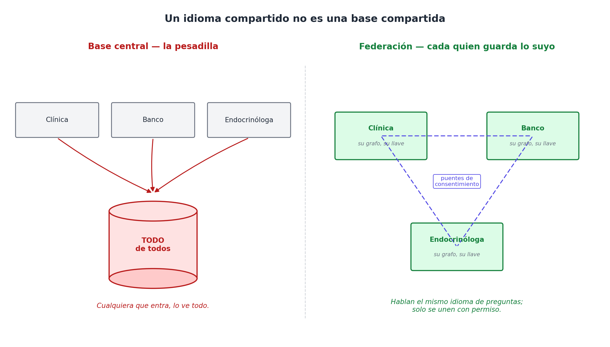
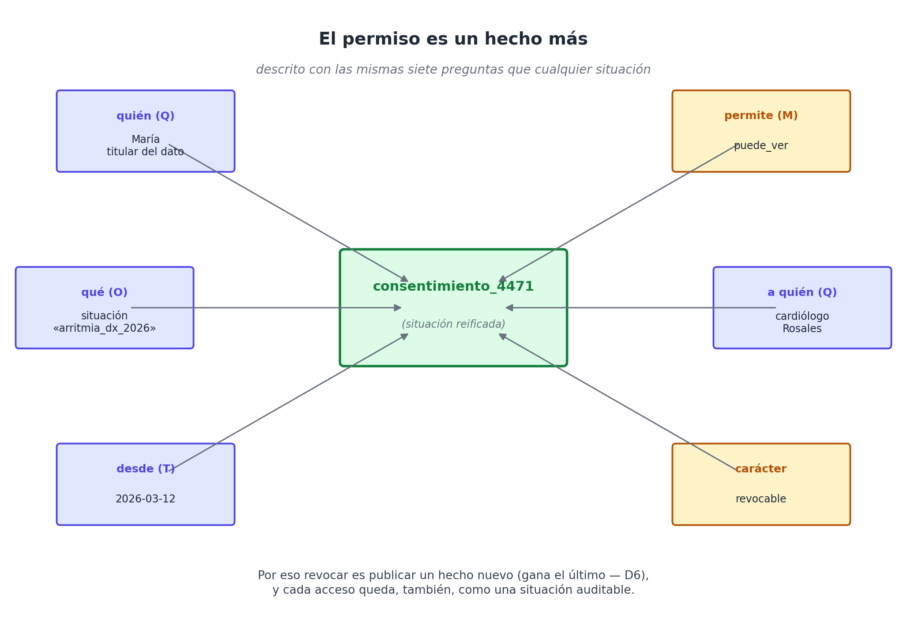
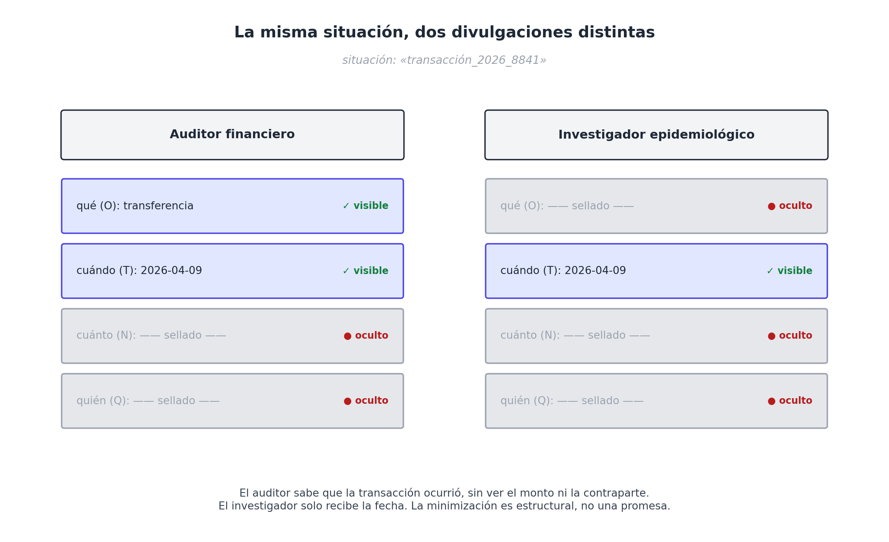
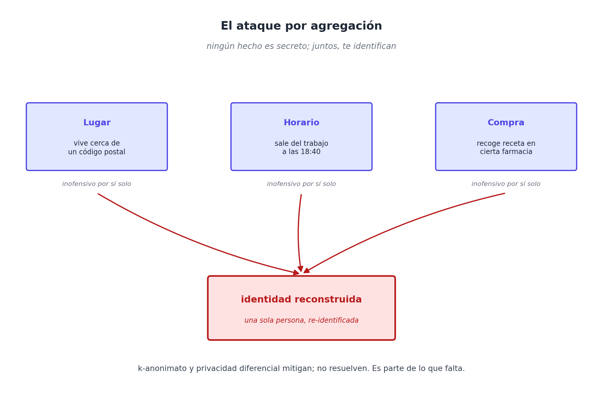

# Capítulo 27 — Seguridad y privacidad en el grafo compartido

## La otra cara de la moneda

Volvamos a la paciente. La de la arritmia, la que a las dos de la mañana fue atendida por un médico que no la conocía y que, gracias a que cuatro sistemas distintos por fin hablaban el mismo idioma, pudo reconstruir su historia en treinta segundos y tomar una buena decisión. Esa noche, la interoperabilidad le salvó la vida.

Seis meses después, la misma mujer pide un seguro de vida para respaldar una hipoteca. La aseguradora corre su evaluación de riesgo. Su sistema —moderno, conectado, que también habla en preguntas— formula una consulta perfectamente legible: *¿qué situaciones de tipo `diagnóstico_médico` tienen a esta persona como paciente?*. Y el grafo, servicial, responde: una arritmia, monitoreada desde hace dos años, con un episodio de descompensación documentado. La prima se dispara. En el peor caso, la cobertura se niega.

Nadie hackeó nada. No hubo una brecha, ni una contraseña filtrada, ni un empleado deshonesto. El sistema funcionó **exactamente como fue diseñado**: hizo una pregunta y obtuvo una respuesta tipada y confiable. El mismo grafo que a las dos de la mañana le salvó la vida, a las diez de la mañana le niega la cobertura.

Esta es la objeción más seria que se le puede hacer al modelo, y conviene no esquivarla: **un grafo compartido con identidad estable es, por defecto, una infraestructura de vigilancia.** Toda la legislación de privacidad del mundo —el RGPD europeo, la HIPAA estadounidense, la Ley 29733 peruana— existe precisamente para impedir lo que WQuestions hace fácil: vincular, sin fricción, datos que vivían separados. Si la fuerza del modelo es que los clientes, los pacientes y los lugares son los mismos a través de los dominios, esa misma fuerza es lo que permite que el banco vea el diagnóstico y la clínica vea la deuda.

El resto de este capítulo argumenta que el problema no solo tiene solución, sino que el modelo —bien entendido— ofrece mejores herramientas para resolverlo que la arquitectura relacional que reemplaza. Pero la primera respuesta no es técnica: es deshacer un malentendido.

## El malentendido que hay que deshacer: un idioma, no una base

La imagen que produce pánico —y con razón— es la de un gran depósito central donde todo el historial de todos cuelga de un identificador único que cualquiera puede consultar. Si eso fuera WQuestions, el modelo sería indefendible.

No lo es. **El grafo compartido es semántico, no físico.** Lo que se comparte entre el banco, la clínica, la endocrinóloga y el cardiólogo no es una base de datos: es el *idioma de las preguntas* —los siete ejes y el lexicon que traduce a ellos—. Cada quien sigue guardando sus propios hechos en su propio almacén, bajo su propio control y su propia llave. La clínica no lee el grafo del banco. Lo que ocurre es que, **cuando hace falta interoperar —y solo con autorización—**, los dos grafos hablan la misma lengua y la fusión que antes era un proyecto de integración de seis meses se vuelve trivial.



Releída así, la escena del médico de guardia cambia de sentido. No fue que el médico «entró al expediente global de la paciente». Fue que cada tenedor —los dos hospitales, la endocrinóloga, el cardiólogo— **publicó a un espacio que la paciente había autorizado** para situaciones de emergencia, y que esos hechos, por hablar el mismo idioma, se ensamblaron solos. La interoperabilidad vive en el borde, en la federación y el consentimiento; no en un cerebro central que todo lo sabe.

Esto resuelve el susto inicial, pero abre la verdadera pregunta de ingeniería: si cada tenedor controla su acceso, ¿con qué se controla? Y aquí es donde el modelo deja de defenderse y empieza a atacar.

## El permiso es un hecho

En una arquitectura relacional, el control de acceso es una capa aparte, escrita en otro lenguaje que el de los datos: tablas de permisos, roles, `GRANT` y `REVOKE`, reglas de aplicación dispersas por el código. Es un sistema paralelo, y los sistemas paralelos se desincronizan.

En WQuestions no hay capa aparte, porque **el permiso es, él mismo, una situación reificada** —un hecho más, descrito con las mismas siete preguntas que cualquier otro—. «Que el cardiólogo Rosales pueda ver el diagnóstico de arritmia de María» no es una entrada en una tabla de ACL: es una afirmación del grafo, con su quién, su qué, su cuándo y su agente.



```
consentimiento_4471
  quién (Q)     → María (paciente, titular del dato)
  permite (M)   → puede_ver
  qué (O)       → situación «arritmia_diagnóstico_2026»
  a quién (Q)   → cardiólogo Rosales
  desde (T)     → 2026-03-12
  carácter      → revocable
```

Tres consecuencias caen de regalo:

**El consentimiento es un hecho con fecha.** No es una casilla marcada en un formulario perdido: es una situación reificada que dice quién consintió qué, para quién y desde cuándo. Y como es un hecho, puede tener su propia procedencia: *quién* recogió el consentimiento, *cómo*, bajo qué versión de los términos.

**Revocar es publicar, no borrar.** Cuando María retira el permiso, no se edita ni se destruye el consentimiento anterior: se asienta un hecho nuevo que lo supersede. Y por la regla de **vigencia temporal (D6) —gana el último hecho—**, a partir de ese instante el acceso deja de valer, mientras queda constancia auditable de que existió y de cuándo se retiró. El sistema no olvida que hubo permiso; recuerda, además, que se revocó.

**La auditoría sale gratis.** Cada acceso es, también, una situación: *«el usuario de la aseguradora consultó la situación arritmia_diagnóstico_2026 el 2028-02-01 a las 10:14»*. El registro de auditoría no es un subsistema de logging que haya que construir y proteger aparte: es más hechos en el mismo grafo, consultables con las mismas siete preguntas. «Quién vio qué y cuándo» pasa de ser una pesadilla forense a una consulta de una línea.

## Redacción por eje

Hay una asimetría de granularidad que juega a favor del modelo. Una base relacional concede acceso por tabla o, con esfuerzo, por fila: o ves el registro de la transacción, o no lo ves. WQuestions concede acceso por **hecho** e incluso por **eje**.

Porque cada situación descompone la realidad en coordenadas tipadas y separadas, se puede revelar unas y sellar otras. Un auditor financiero puede recibir la prueba de que una transacción **ocurrió** —su *qué* y su *cuándo*— sin ver jamás el *cuánto* ni la contraparte. Un investigador epidemiológico puede saber que existió un diagnóstico de cierta clase en cierta fecha y lugar, con el *quién* sellado bajo llave.



Esto no es un parche encima del modelo: es la geometría del hecho atómico haciendo trabajo de privacidad. La minimización de datos —el principio legal de no entregar más de lo necesario para el fin— deja de ser una promesa de buena conducta y se vuelve algo que la estructura del dato permite expresar con precisión quirúrgica.

## Las tensiones que quedan crudas

Sería deshonesto pintar esto como resuelto. Quedan tres tensiones reales, y la última no la resuelve nadie todavía —para ningún modelo de datos enlazable.

**El sistema que nunca olvida frente al derecho al olvido.** La vigencia temporal (D6) supersede, no borra; el RGPD, en cambio, concede el derecho a la *eliminación* efectiva. La salida pasa por distinguir dos cosas que suenan igual: la *vigencia lógica* (un hecho deja de ser verdad) y el *borrado físico* (el contenido se destruye de verdad). La técnica concreta se llama **crypto-shredding**: el contenido de los ejes de valor se guarda cifrado, y «borrar» es destruir la llave —lo que queda es ruido irrecuperable, aunque el nodo-situación persista para integridad referencial y auditoría—. Y aquí el modelo ayuda en vez de estorbar: como cada eje declara explícitamente *dónde* vive cada dato personal, el borrado dirigido es **más** factible que en el blob relacional, donde el mismo dato sensible está embarrado en columnas, índices, logs y respaldos.

**La identidad estable es a la vez el arma y la herramienta.** El poder del modelo viene de que la persona es la misma entre dominios; eso es, exactamente, lo que habilita los ataques de re-identificación. La mitigación se llama **seudónimos pareados**: la persona es una sola entidad lógica, pero cada relación la ve bajo un identificador propio y acotado a ese dominio —como usar un nombre distinto en cada ventanilla, donde solo un resolutor autorizado sabe que son la misma persona—. Vincular dos handles deja de ser gratis y pasa a requerir autorización explícita. El «enchufe» de URIs resolubles que vimos en el Capítulo 4 es justamente el punto donde esa política de resolución puede interponerse.

**El frente genuinamente abierto: inferencia y agregación.** Aun con permisos por hecho y redacción por eje, un modelo que unifica las preguntas hace *más* fácil el ataque por combinación: varios hechos inocuos por separado, cruzados, reconstruyen lo que cada uno por sí solo no revelaba. El lugar donde vives, la hora a la que sales, la farmacia que frecuentas —ninguno es secreto; juntos, te identifican.



Esto **no lo resuelve limpiamente nadie**, y WQuestions, al facilitar el enlace por diseño, tiene la obligación de tomárselo *más* en serio, no menos. El k-anonimato y la privacidad diferencial —añadir ruido calibrado a las respuestas agregadas para que ningún individuo sea distinguible— son mitigaciones serias en la capa de consulta, pero son mitigaciones, no soluciones. Por eso este problema pertenece, con todas las letras, al capítulo siguiente: es parte de lo que falta.

## El veredicto

Recapitulando sin adornos:

- El grafo compartido es un **idioma, no una base central**. La privacidad empieza por la federación: cada tenedor controla lo suyo y solo une bajo consentimiento.
- El permiso, el consentimiento y la auditoría son **situaciones reificadas** —se expresan en el mismo modelo que los datos, no en una capa paralela que se desincroniza—.
- El control fino por eje y el borrado dirigido por crypto-shredding son **más factibles** aquí que en lo relacional, porque el modelo sabe explícitamente dónde vive cada dato.
- Pero la misma vinculabilidad que le da su fuerza convierte a la **inferencia por agregación** en el riesgo central, todavía sin solución cerrada.

La conclusión operativa es incómoda y conviene decirla en voz alta: **una arquitectura de información que no piensa la privacidad desde el día uno no merece ser adoptada.** Un modelo que vuelve trivial preguntar cualquier cosa sobre cualquiera es tan capaz de habilitar la mejor medicina como el peor abuso, y la diferencia entre ambos no está en la potencia del grafo sino en quién puede preguntar qué. Que esa pregunta —quién puede preguntar qué— se responda con el mismo modelo, y no con un sistema aparte pegado con cinta, es la mejor noticia de este capítulo. Que la inferencia siga abierta es la peor. Las dos son verdad, y la siguiente página empieza, justamente, por admitir todo lo que falta.
