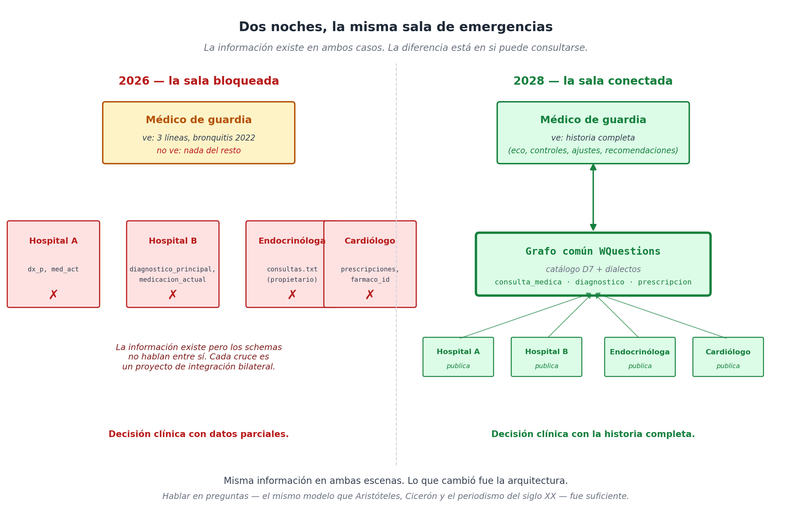

# Conclusión — Por qué importan las preguntas

## La misma sala, otra noche

Son las dos de la mañana. La paciente vuelve — una mujer de cuarenta y cuatro ahora, dos años más vieja que cuando la conocimos en el primer capítulo de este libro. El dolor torácico que tenía aquella vez resultó ser una crisis de ansiedad. Esta vez es otra cosa: una arritmia que la endocrinóloga le venía monitoreando desde hace meses, y que el cardiólogo del otro hospital le había advertido que vigilara. La paciente lo cuenta entre frases entrecortadas, mientras la enfermera le toma presión y oxígeno.

El médico de guardia no es el mismo de hace dos años. Es nuevo. No la conoce. Saca la tablet, busca el nombre, y aparece — esta vez sí — la historia entera. No traída por un convenio entre hospitales, no por una conexión bilateral, no por un esfuerzo heroico de algún integrador de turno: aparece porque ambos hospitales, junto con la endocrinóloga privada, junto con el cardiólogo de la otra ciudad, **hablan en preguntas**. Cuando hace dos años uno escribía `dx_p` y el otro `diagnostico_principal`, hoy los dos reconocen que están afirmando una situación de tipo `diagnostico_medico` con un `paciente`, un `agente`, un `momento` y un `diagnosticado_como`. El vocabulario interno de cada sistema sigue siendo el suyo; lo que comparten es la pregunta que cada hecho responde.

El médico ve la cronología: el primer eco que detectó la endocrinóloga, los controles trimestrales, el ajuste de medicación de noviembre, la consulta de marzo con el cardiólogo, la recomendación específica para casos de descompensación. Toma una decisión informada, en treinta segundos, sin pedir auxilio a un especialista a las dos de la mañana. La paciente queda estable; el equipo registra la nueva situación reificada — *consulta_de_emergencia_2028_xxxxx* — que mañana otros médicos podrán consultar de la misma manera.

Esta escena — banal, casi aburrida cuando funciona — es lo que el libro entero quiso explicar cómo conseguir.

## Lo que las preguntas resolvieron

Lo que las seis partes del libro destilaron, visto en retrospectiva, es una respuesta razonable a una pregunta vieja: **¿hay algo más simple que una ontología y más estructurado que un texto, que pueda servir de común denominador entre sistemas que no se conocen?**.

La respuesta del libro fue: sí, hay siete preguntas. Quién, qué, dónde, cuándo, cuánto, cuál, cómo. Más una octava de clase que organiza las categorías. Esas siete preguntas — anteriores a cualquier ontología, conocidas desde Aristóteles, codificadas por Cicerón, redescubiertas por el periodismo del siglo veinte, formalizadas por la semántica neo-davidsoniana, presentes en la cognición infantil mucho antes que el lenguaje escrito — son lo bastante universales para que cualquier descripción del mundo se mapee a ellas y lo bastante simples para que un humano (o un modelo de lenguaje) las entienda sin manual.

Sobre las preguntas montamos cuatro decisiones de diseño que las vuelven operativas:

- Reificar las situaciones cuando importan (D4).
- Aceptar agencia contextual (D5) — humanos, organizaciones, software, todos pueden ser agentes según el contexto.
- Distinguir cuatro tipos de "por qué" (D7) — causa, motivo, finalidad, justificación — porque el lenguaje natural ya los distingue.
- Preservar la historia con vigencia temporal (D6) — el sistema nunca olvida.

Y sobre eso, una capa de **lexicon** que traduce el lenguaje del usuario al catálogo canónico, sin obligar a nadie a aprender vocabulario interno. El lexicon es, técnicamente, lo mismo que un *function schema* para los modelos de lenguaje de la generación 2026 — y esa coincidencia, que no buscamos al inicio del proyecto, es la que vuelve la propuesta accionable hoy.

## Por qué las preguntas son anteriores a las ontologías

Acá es donde el libro toma su única licencia filosófica, y conviene dejarla explícita. Las ontologías de dominio — CIDOC CRM, Schema.org, Biolink, FHIR, las decenas de iniciativas que enumeramos en el capítulo 3 — son catálogos de **qué cosas hay**. Cada una hizo el trabajo paciente de definir entidades, relaciones, vocabularios consistentes para su dominio. Cada una es valiosa dentro de su perímetro.

Lo que el libro propone es que **antes que las entidades están las preguntas**. Antes que *paciente, doctor, diagnóstico, prescripción*, está la pregunta *¿quién hizo qué a quién?* — y las respuestas tipadas. Un dominio nuevo, al modelarse, no se reduce a otro dominio existente: se mapea a las preguntas, que son siempre las mismas. La ontología específica del dominio sobrevive como **dialecto** del lexicon; el catálogo común sobrevive como infraestructura. Cada ontología sigue siendo valiosa donde ya está; lo que cambia es la posibilidad de hablar entre ellas sin proyectos de integración.

Esa intuición — que las preguntas son lo invariante mientras las ontologías son lo variable — no es original ni del libro ni de su autor. Está en Aristóteles. Está en Cicerón. Está en los primeros manuales de periodismo del siglo veinte. Está en cómo los niños adquieren el lenguaje. Está en la semántica de eventos que la lingüística formal viene refinando hace sesenta años. Lo único que este libro hizo fue **proponer una articulación operativa** de esa intuición vieja, con un catálogo concreto, un prototipo ejecutable, y nueve dominios modelados como prueba de que el catálogo se sostiene fuera de un solo nicho.

## Lo que el libro no terminó

Sería deshonesto cerrar sin admitir lo que falta. El capítulo 27 lo enumeró sin maquillaje: motor de inferencia, bitemporalidad completa, persistencia industrial, tooling, lexicon poblado en varios idiomas, comunidad. La propuesta es completa **conceptualmente**; no está lista para producción. El prototipo en Python que acompaña al libro ejecuta lo que el libro afirma — los ocho dominios pasan sus validaciones, los 21 tests pasan, los 12 ejemplos corren — pero está lejos de ser infraestructura.

Lo que también falta, y conviene decirlo en voz alta, es que ninguna arquitectura sobrevive por su elegancia. Las que sobrevivieron — Unix, TCP/IP, HTTP, SQL — sobrevivieron porque hubo gente que las cuidó durante décadas. RDF, que cumple veinticinco años en 2026, sigue siendo un activo subutilizado precisamente porque la comunidad nunca alcanzó la masa crítica para volverlo invisible. WQuestions, hoy, está en el día uno de ese proceso.

La propuesta tiene valor — los ocho dominios que pasamos por el prototipo lo demostraron — y ahora la tarea es que otros la perfeccionen. Por eso vale la pena que exista escrita: la siguiente generación de modelos de información tiene acá una base operable de la que partir.

## Una última nota sobre el momento

Hay una coincidencia histórica que el libro mencionó solo lateralmente y que conviene decir en limpio acá. Esta propuesta — un modelo de información organizado sobre preguntas-coordenadas, traducido por un lexicon que es a la vez catálogo de funciones — habría sido difícil de adoptar hace cinco años. Faltaba la capa de fluidez lingüística que la vuelve usable. Hoy, con LLMs capaces de hacer *function calling* sobre miles de herramientas y de hablar en cualquier idioma con la naturalidad de un usuario nativo, esa capa **existe**.

Las dos piezas — el grafo persistente con identidad estable, el LLM con fluidez conversacional — son complementarias en un sentido fuerte: lo que una no hace, la otra sí. Y la pieza que las conecta — el lexicon como function schema — resulta ser exactamente lo que se necesita en ambos lados de la frontera.

Esto es lo que justifica el libro hoy, en 2026, y no antes ni después. Antes no había con qué; después puede haber demasiadas propuestas competidoras, cada una con un compromiso de adopción que no querremos pagar. La ventana entre que los LLMs maduraron y que el espacio se consolide en torno a un estándar dominante es pequeña. Si en esa ventana las preguntas-coordenadas aparecen como una opción razonable, el esfuerzo del libro habrá valido.

## Cierre

Empezamos con una sala de emergencias donde la información existía pero no podía consultarse. La cerramos con otra noche en la misma sala, dos años después, donde la información sigue existiendo y ahora se consulta. Entre las dos noches no hubo magia tecnológica: hubo el reconocimiento de algo viejo — que las preguntas que hace dos mil años se le hacían a un acto moral son las mismas que se le hacen hoy a una historia clínica — y la disciplina de construir, encima, las piezas mínimas para que ese reconocimiento sea operativo.

Quien lea este libro y quiera aportar al proyecto encontrará el repositorio en línea, el prototipo ejecutable, los nueve dominios modelados, las decisiones de diseño documentadas. No es mucho — apenas suficiente para entender la propuesta y criticarla. Pero esa es exactamente la idea: el libro como semilla, no como punto final.

Las preguntas seguirán siendo las mismas. Lo que falta es construir entre todos las respuestas.

---

*Este libro existe gracias a la conversación con Claude, modelo de lenguaje de Anthropic, durante mayo de 2026. La conversación entera — sesgos, errores, idas y vueltas — quedó archivada en el repositorio como testimonio de cómo se piensa hoy, en simbiosis con una máquina, una propuesta como ésta. La responsabilidad final del texto es del autor humano.*
