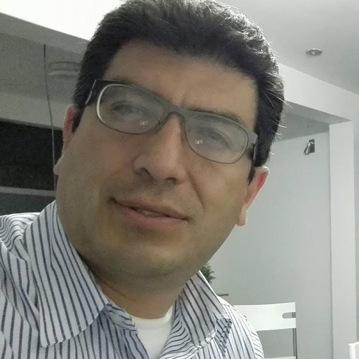

# El autor

**José Abanto Marín** (Celendín, Perú, 1973).

Desarrollador de software con treinta y cinco años de experiencia construyendo sistemas a la medida. Programador desde los tiempos en que las pantallas eran de color verde o ámbar y un vetusto sistema de BASIC hacía el milagro de obedecer las órdenes del programador, pronto pasó a trabajar sobre bases de datos en dBase y FoxPro, lo que despertó en él una pasión por las bases de datos que ya no lo abandonaría. Al conocer Clipper intuyó el potencial tremendo de un compilador y, para no estar recompilando a cada paso, construyó un único core: un sistema al que llamó *xsystem* y al que bautizó «generador de programas», porque en él ya empezaba a separar la lógica llevando las reglas de negocio a la base de datos. Delphi fue el siguiente gran salto, el lenguaje con el que levantó *Ghenesis*, un framework meta-driven que persiste la lógica de negocio en base de datos —formularios, reportes, módulos— para permitir su administración sin tocar el código de la aplicación. Hoy tiene programada una versión web de Ghenesis, un sistema cuya abstracción es máxima: los campos, los reportes, las validaciones e incluso las APIs se consumen sin necesidad de compilar nada. Esa obsesión por separar el qué del cómo, por buscar la capa donde la información deja de depender de la aplicación que la consulta, atraviesa toda su trayectoria profesional y desemboca naturalmente en este libro.

Apasionado de las bases de datos, los modelos de inteligencia artificial y la ciencia en general, encuentra en la física cuántica y en los enigmas del universo una forma de mantener viva la sospecha de que todo lo aparentemente complejo esconde, en algún nivel, una estructura más simple. La filosofía es para él una herramienta de trabajo: una manera de detectar los patrones, las abstracciones y los paradigmas que se asoman en cada problema técnico.

*WQuestions, Las preguntas como coordenadas*, es el primer libro en el que reúne esas tres líneas —la práctica de tres décadas modelando datos, la curiosidad científica y la mirada filosófica— alrededor de una sola tesis arquitectónica.
