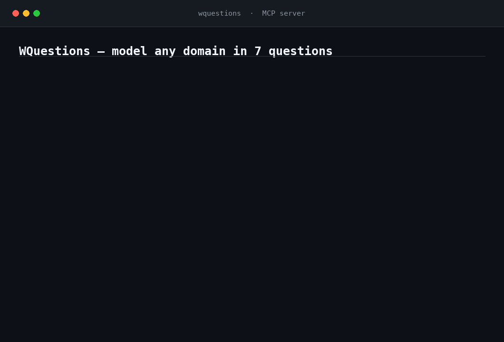

# wquestions-mcp

**Model any domain in 7 questions.**

An MCP server that lets Claude Desktop (or any MCP client) build and query a
knowledge model of *anything* — a spa, a barbershop, a clinic, a bank — using
one fixed set of tools. No per-domain schema to write, ever.

## The problem

Every domain today gets its own bespoke ontology or database schema: a CRM
schema for sales, a clinical model for a clinic, a different one again for a
bank or a taxi dispatcher. None of it transfers between domains, and none of
it was designed for an LLM to reason over — each new domain means new
modeling work before an AI can even start answering questions about it.

WQuestions replaces all of that with a single fixed index: **7 axes** that
any fact, in any domain, answers. Model a domain by asserting facts on those
7 axes; query it the same way no matter what the domain is.

## The 7 axes

| Axis | Question | Holds |
|---|---|---|
| Q | who | agents |
| O | what | objects, and reified situations (facts treated as things) |
| L | where | places |
| T | when | time points and intervals |
| N | how much | magnitudes with a unit |
| K | which / what kind | atemporal categories, types, states |
| M | how | the predicates that connect Q/O/L/T/N/K to each other — structural, not a value axis |



## Quickstart

Add this to your Claude Desktop config (`claude_desktop_config.json`) and
restart Claude Desktop:

```json
{
  "mcpServers": {
    "wquestions": {
      "command": "uvx",
      "args": ["wquestions-mcp"]
    }
  }
}
```

Until `wquestions-mcp` is published to PyPI, run it from source instead:
clone this repo and, from the repo root, install both local packages into a
virtualenv — `pip install -e ./prototipo -e ./mcp-server` (the MCP server
depends on the engine in `prototipo/`, which also isn't on PyPI yet). Then
point `command`/`args` at that venv's `wquestions-mcp` script (e.g.
`command: ".../.venv/bin/wquestions-mcp"`, `args: []`) instead of `uvx`.

Then ask Claude: *"Load the spa example, then show me the model."* See
[`DEMO.md`](DEMO.md) for the full 30-second walkthrough.

## Tools

| Tool | Does |
|---|---|
| `list_axes` | Describe the 7 axes |
| `list_roles` | List canonical roles (who/what/where/... connectors), typed by domain and range |
| `add_entity` | Create an individual on a value axis (Q, O, L, T, N, K); for the N axis pass `value` + `unit` (a K entity id or inline spec) — a magnitude without a unit is rejected |
| `define_verb` | Register a situation type and its roles — optional, `assert_situation` auto-registers unknown verbs |
| `assert_situation` | Assert a fact with several participants: reify a situation and attach its roles |
| `assert_fact` | Assert one triplet directly on an existing entity of any axis — for properties (a person's name) that need no situation |
| `correct` | Correct/update a role on an existing situation by re-asserting it (append-only; `ask` returns the latest, `history=true` shows the trail) |
| `find` | Find entities by name — substring, ignores case and accents. The way in when you know what something is called but not its id |
| `ask` | Query by **projection** (fix roles, ask for others; `fixed` accepts `{desde,hasta}` ranges over T/N) or by **aggregation** (`agrupar_por` + `medir` with count/sum/min/max/avg, `orden`, `limite`). Always returns a `labels` dictionary naming every id once |
| `show_model` | Dump the current universe: every entity and fact |
| `load_example` | Load a prebuilt demo universe (`spa`) to try queries instantly |
| `reset` | Clear the model and start a fresh universe |

## How it works

The LLM client does the natural-language-to-structure step: it reads "Diego
cut Marco's hair at Barber Kings on 2025-06-11" and turns it into
role-labeled arguments (`agente: diego, paciente: marco, lugar_de:
barber_kings`). The server never parses English — it takes those roles,
validates them against the 7-axis model, and runs ingest and query over the
`wq` engine. Same engine, same 10 tools, whether the domain behind them is a
spa or a barbershop.

## Persistence

By default the server persists your universe to an append-only log and reloads
on restart, so a modeled domain survives across sessions — you never rebuild by
hand. Nothing is ever overwritten; corrections are appended and the log is the
source of truth.

- **Default location:** `~/.wquestions/universe.jsonl`.
- **Choose a file:** set `WQUESTIONS_LOG=/path/to/domain.jsonl`. Point each domain
  at its own file (e.g. one per MCP server entry in your client config) — a single
  log holds one live universe at a time (a `reset` starts a fresh domain within it).
- **Turn it off (pure in-memory):** `WQUESTIONS_LOG=off`.

`show_model` reports the active log path and how many events were replayed, so
you can confirm persistence is on.

## Further reading

The 7-axis model — why it's fixed, what each axis actually commits to, and
how it holds up once you push on it — is worked out in full in *WQuestions*,
the book this project comes from (Spanish). Start with
[Chapter 8, El espacio multidimensional](https://joseabantomarin.github.io/WQuestions/08-espacio-multidimensional.html)
for the axis model itself, or the
[table of contents](https://joseabantomarin.github.io/WQuestions/00-introduccion.html).
